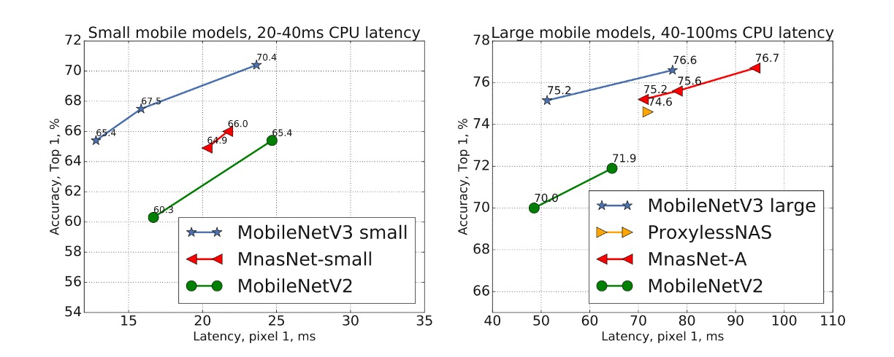

## 客製化搜索架構

[**Searching for MobileNetV3**](https://arxiv.org/abs/1905.02244)

---

前些日子，SENet 幾乎就要提出 MobileNet-V3 了！

可惜在最後時刻點到即止，只留下了論文的一個小段落。

- [**SENet-輕量模型效果展示**](../1709-senet/index.md#輕量模型效果展示)

Google 團隊顯然也想繼續推進 MobileNet 的發展，於是他們開始了一場關於 MobileNet-V3 的探索之旅。

## 定義問題

其實也沒什麼問題。

就是作者們想要找到一個更好的 MobileNet。

於是他們想了兩個方向：

1. **使用網路架構搜尋技術**：也就是 NAS（神經網路架構搜索）。
2. **使用 NetAdapt 演算法**：用來針對手機 CPU 進行調整。

## 解決問題

### MobileNet-V2 模組

<figure style={{"width": "70%"}}>

</figure>

### MobileNet-V3 模組

<figure style={{"width": "70%"}}>

</figure>

對比上下兩張架構圖，你能看出來 MobileNet-V3 的改進嗎？

差別就在擴展層（expansion layer）中，加入 `Squeeze-and-Excitation` 模組。

在約一年前提出的論文 `MnasNet` 中，已經在 `MobileNet-V2` 的基礎上加入了 `Squeeze-and-Excitation` 模組。

- [**[18.07] MnasNet: Platform-Aware Neural Architecture Search for Mobile**](https://arxiv.org/abs/1807.11626)

在 `MobileNet-V3` 中，這個模組‘進一步地改進，移除速度「極慢」的 `Sigmoid` 函數，改成 `Hard-Sigmoid` 函數。

:::tip
很多人都以為 `Squeeze-and-Excitation` 模組是由 `MobileNet-V3` 提出的，不對唷！
:::

### 網路架構搜索

新的模組已經準備好了，接下來的問題就是：怎麼疊呢？

這一個部分沿用了 `MnasNet` 的工作方法，使用基於 RNN 的控制器來搜索網路架構。

接著在網路架構上應用 `NetAdapt` 演算法和其他最佳化。

- [**[18.04] Netadapt: Platform-aware neural network adaptation for mobile applications**](https://arxiv.org/abs/1804.03230)

  

   <figure style={{"width": "70%"}}>
   
   </figure>
   

:::tip
這個部分不是本文的重點，我們只要知道這個部分是用來調整網路架構的就好。
:::

### 網路結尾變更

基於 MobileNetV2 的反向瓶頸結構和變體的模型使用 1x1 卷積作為最後一層，以便擴展到更高維度的特徵空間。也就是上圖中 `Original Last Stage` 內的 1280 維度的部分。

為了擁有豐富的預測特徵，這一層很重要，但這是以額外延遲為代價的。

為了減少延遲並保留特徵，作者將這一層移動到全局平均池化「之後」，也就是上圖中 `Efficient Last Stage` 的樣子。

原本計算時採用 7x7 的解析度，經過調整後，就是在 1x1 的解析度上進行計算，可以節省一定量的計算資源。

### 縮減初始濾波器

作者觀察到在 MobileNetV2 中，初始的 32 濾波器通常都是「鏡像」，也就是說其實一半的濾波器是多餘的。

因此，在這裡作者將初始濾波器從 32 減少到 16，同時加入 `hard-swish` 啟動函數，來保持模型的表現。

### 非線性啟動函數

作者在論文中大量採用了 `hard-swish` 和 `hard-sigmoid` 這兩種啟動函數。

這裡簡單看一下這些啟動函數的差異：

1. **ReLU (Rectified Linear Unit)**

   - **定義**：$ f(x) = \max(0, x) $
   - **特點**：當輸入 $ x $ 為正數時，輸出就是 $ x $；當輸入 $ x $ 為負數時，輸出為 0。
   - **用途**：由於其計算簡單和非飽和性質，ReLU 在許多深度學習模型中被廣泛使用。

2. **Swish**

   - **定義**：$ f(x) = x \cdot \sigma(x) $，其中 $ \sigma(x) $ 是 Sigmoid 函數 $ \sigma(x) = \frac{1}{1 + e^{-x}} $。
   - **特點**：Swish 函數是自我閘化的啟動函數，它結合了線性和非線性特性。
   - **用途**：在某些深度學習任務中，相較於 ReLU 和其他啟動函數，Swish 顯示了更好的性能。

3. **Hard-Swish**

   - **定義**：$ f(x) = x \cdot \text{relu6}(x+3)/6 $，其中 $\text{relu6}(x) = \min(\max(0,x), 6)$。
   - **特點**：Hard-Swish 是 Swish 函數的一種簡化形式，具有更快的計算速度和較低的計算成本。
   - **用途**：常用於需要高效計算的應用場景，如移動設備或邊緣裝置上的神經網路模型。

4. **Sigmoid**

   - **定義**：$ f(x) = \frac{1}{1 + e^{-x}} $
   - **特點**：輸出範圍在 0 到 1 之間，常用於將輸出壓縮到一個限定範圍內。
   - **用途**：由於其良好的概率解釋，經常用於二分類問題的最後輸出層。

5. **Hard-Sigmoid**
   - **定義**：$ f(x) = \max(0, \min(1, \frac{x+1}{2})) $
   - **特點**：這是 Sigmoid 函數的一種簡化版，其計算速度更快，適合於執行效率要求高的場合。
   - **用途**：與 Sigmoid 類似，但更常用於需要高效計算的模型中。

### 網路架構（大）

經過了上面的規畫，最後透過網路架構搜索，得到了一個新的 MobileNet-V3 模型。

下表的讀法，大部分和 `MobileNet-V2` 一樣，新的地方是：

- **SE**：表示是否使用了 `Squeeze-and-Excitation` 模組。
- **NL**：表示是否使用了非線性啟動函數。
- **HS**：表示是否使用了 `hard-swish` 啟動函數。
- **RE**：表示是否使用了 `ReLU` 啟動函數。
- **NBM**：表示沒有使用 `Batch Normalization`。

<figure style={{"width": "70%"}}>

</figure>

### 網路架構（小）

針對小型模型，作者們也展示了搜索的結果。

<figure style={{"width": "70%"}}>

</figure>

## 討論

### ImageNet 實驗結果

<figure style={{"width": "80%"}}>

</figure>

從上圖可以看出，MobileNetV3 優於目前最先進的模型，例如 MnasNet、ProxylessNas 和 MobileNetV2。

### 移動裝置評估

<figure style={{"width": "70%"}}>

</figure>

作者在上表中報告了不同 Pixel 手機上的浮點效能。

上表中 P-1 表示 Pixel 1，P-2 表示 Pixel 2，P-3 表示 Pixel 3，單位是推論速度 ms，在基於單核心的表現。

### 優化紀錄

<figure style={{"width": "70%"}}>

</figure>

上圖展示了作者們在本論文中的優化紀錄。

從 MnasNet 開始，逐步添加 `SE` 和 `h-swish`，最終使用 `Netadapt` 進行網路架構搜索，得到最後的結果。

## 結論

移動設備的市場很大，算力有限，因此需要更「客製化」的模型。

這篇論文展示了如何通過網路架構搜索和 NetAdapt 演算法，在 Pixel 手機上實現了更好的效能。

未來或許能夠拓展到 Pixel、Apple、Samsung 各種不同手機上的統一架構。

不管是對手機使用者，還是對我們這種模型開發者，這都是一個好消息。
