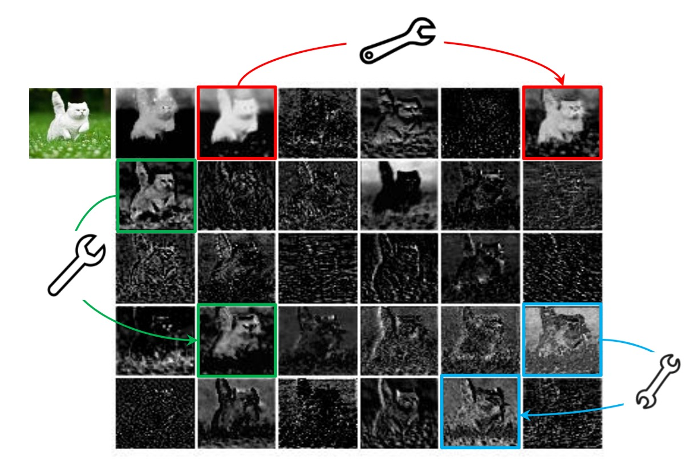
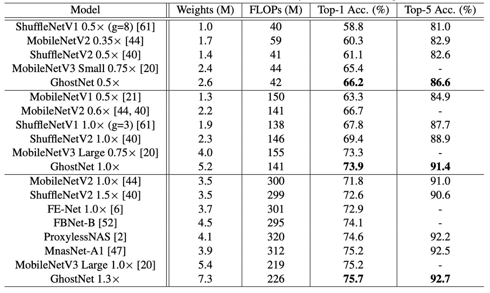

## 特徵圖中的幽靈

[**GhostNet: More Features from Cheap Operations**](https://arxiv.org/abs/1911.11907)

---

在 MobileNet 提出後的一段時間，仍然有許多作者致力於改善輕量級網路的性能。

本篇論文中特別針對「特徵圖冗餘」的問題進行了研究。

## 定義問題

<figure style={{"width": "70%"}}>

</figure>

卷積網路中的特徵圖通常包含大量冗餘信息，這些冗餘信息佔用了一定量的計算資源，並且對於網路的性能有著不利的影響。

上圖是一個簡單的例子，特徵圖中的一些區域是重複的，這些重複的區域對於網路的性能可能沒有太大的幫助。

## 解決問題

一般來說，常用的方式有兩種，其一是模型壓縮，其二是讓模型更緊湊。

### 模型架構

<figure style={{"width": "70%"}}>

</figure>

在 GhostNet 中，作者提出了一種新的模型架構，如上圖所示。

有別於一般的卷積網路，GhostNet 的模組運作流程分成兩步驟：

1. 首先使用卷積操作，將輸入特徵圖壓通道縮，得到一個「基底特徵圖」 A。
2. 接著對基底特徵圖 A 基於每個通道進行線性運算，得到「幽靈特徵圖」 B。

最後把基底特徵圖 A 和幽靈特徵圖 B 進行 Concatenate 操作，將兩者融合，得到最終的特徵圖。

這裡的線性運算比卷積運算簡單許多，因此 GhostNet 的計算量大幅減少。

:::tip
論文中說的每個通道的「Cheap」線性運算，其實就是分組卷積（Grouped Convolution），這種方法可以減少計算量，提高效率。
:::

### 模組配置

<figure style={{"width": "60%"}}>

</figure>

- **Ghost Bottlenecks**

  借助幽靈模組的優勢，作者引入了專為小型 CNN 設計的幽靈瓶頸（G-bneck）。這種設計類似於 ResNet 中的基本殘差塊，結合了多個卷積層和捷徑。

  幽靈瓶頸主要由兩個堆疊的幽靈模組組成。第一個幽靈模組充當擴展層，增加通道數，擴展比定義為輸出通道數與輸入通道數之比。第二個幽靈模組則減少通道數以匹配捷徑路徑，並將捷徑連接到這兩個幽靈模組的輸入和輸出之間。

  批量正規化（BN）和 ReLU 非線性應用於每一層。另外，根據 MobileNetV2 的建議，除了在第二個幽靈模組之後不使用 ReLU。

- **GhostNet**

  基於幽靈瓶頸，作者提出了幽靈網路（GhostNet）。

  這一架構基本上遵循 MobileNetV3 的設計，並將其瓶頸塊替換為幽靈瓶頸。幽靈網路主要由一系列幽靈瓶頸組成，第一層是具有 16 個濾波器的標準卷積層，隨後是一系列通道逐漸增加的幽靈瓶頸。這些幽靈瓶頸根據輸入特徵圖的大小被分為不同階段。

  除了每個階段的最後一個瓶頸，其步幅為 2，其餘所有瓶頸的步幅均為 1。最終，通過全局平均池化和卷積層將特徵圖轉換為 1280 維的特徵向量進行最終分類。

  在一些幽靈瓶頸中，殘差層還應用了擠壓和激勵（SE）模組。與 MobileNetV3 相比，幽靈網路沒有使用硬啟動函數（hard-swish），因為其延遲較大。

- **寬度乘數**：

  儘管幽靈網路的基本架構已能提供低延遲和高精度，但在某些情況下可能需要更小更快的模型或在特定任務中需要更高的精度。

  為了滿足不同需求，可以在每一層的通道數上乘以一個因子 $\alpha$，稱為寬度乘數。這樣可以統一改變整個網路的寬度，並通過大約 $\alpha$ 的平方來控制模型大小和計算成本。

  通常較小的 $\alpha$ 導致較低的延遲和性能，較大的 $\alpha$ 則會提高性能。這種設計靈活性使得幽靈網路能夠適應不同的應用場景和需求。

最終的模型配置如下表：

<figure style={{"width": "60%"}}>

</figure>

## 討論

### ImageNet 上的性能

為了驗證所提出的幽靈網路的優越性，作者在 ImageNet 圖像分類任務上進行了實驗。

這裡遵循了過去文獻使用的訓練設置，除了當批次大小為 1024 且在 8 個 GPU 上訓練時，初始學習率設置為 0.4。所有結果都是在 ImageNet 驗證集上使用單次裁剪的 top-1 性能報告的。對於幽靈網路，他們將主卷積中的內核大小設置為 k = 1，所有幽靈模塊中的參數 s = 2 和 d = 3，這樣設置較為簡單。

作者選擇了幾個現代的小型網路架構作為競爭對手，包括 MobileNet 系列，ShuffleNet 系列，ProxylessNAS，FBNet，MnasNet 等，結果總結在上表中。

這些模型被分為三個計算複雜度級別，通常適用於移動應用，即約 50、約 150 和 200-300 MFLOPs。從結果可以看出，這些小型網路中，通常較大的 FLOPs 會導致更高的準確性，這顯示了這些模型的有效性。幽靈網路在各種計算複雜度級別上始終優於其他競爭對手，因為幽靈網路在利用計算資源生成特徵圖方面更為高效。

實際推理速度。由於所提出的幽靈網路是為移動應用設計的，作者進一步使用 TFLite 工具在基於 ARM 的手機上測量了幽靈網路的實際推理速度。按照文獻中的常見設置，他們在單線程模式下使用批次大小為 1。

從下圖的結果可以看出，幽靈網路在相同延遲下比 MobileNetV3 高約 0.5%的 top-1 準確率，並且幽靈網路需要較少的運行時間即可達到相似的性能。例如，幽靈網路在 75.0% 準確率下僅有 40 毫秒的延遲，而 MobileNetV3 在相似準確率下需要約 45 毫秒來處理一張圖像。

:::tip
在論文中，測試推論速度是基於 ARM 架構的手機，並搭配 TF-Lite 進行測試。實際上作者沒有提到用哪一台手機，就我們自己的經驗，同樣的配置和模型，在不同品牌的手機上會有不同的表現。

因此，我們建議讀者在使用 GhostNet 時，應該先進行自己的實驗，以確保 GhostNet 的推論速度符合自己的需求。
:::

## 結論

為了降低當前深度神經網路的計算成本，本文提出了一種新穎的幽靈模塊，用於構建高效的神經網路架構。這個方法是一個即插即用的模塊，可以將原始模型轉換為緊湊型模型，同時保持相當的性能。

在開發神經網路的過程中，GhostNet 架構可以成為其中一個選擇，特別是在資源有限的情況下，GhostNet 可能會帶來更多的可能性。
