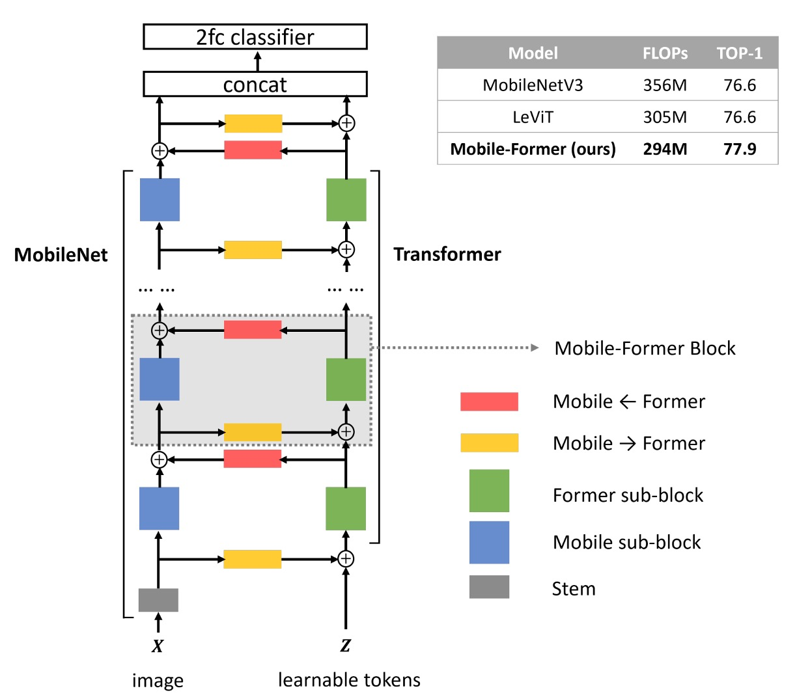
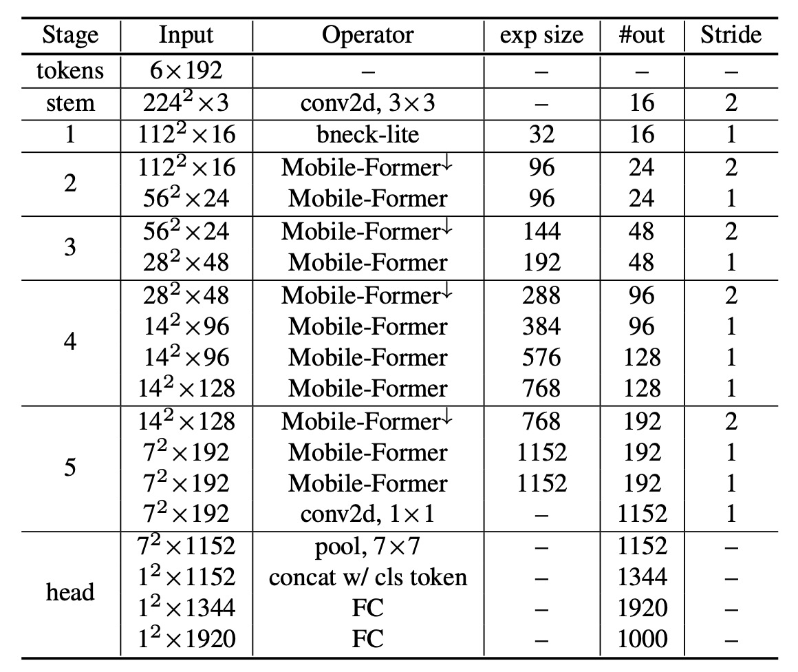
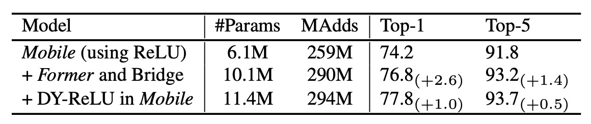

## 雙向連通橋

[**Mobile-Former: Bridging MobileNet and Transformer**](https://arxiv.org/pdf/2108.05895)

---

為了讓 ViT 可以在移動裝置上動起來，研究者們可真是想盡了各種辦法。

## 定義問題

也不是不能跑，但就是慢。

ViT 的架構在手機上的支援度不高，很難享受到硬體加速的好處。

本篇論文的作者想著：

- **要不我們就在 MobileNet 的基礎上加上「一點點」的 Transformer 的架構吧！**

## 解決問題

### 模型架構

作者提出了一個雙向連通橋架構，將 MobileNet 和 Transformer 用並聯的方式連接在一起。

詳細流程如下圖，我們按照步驟來說明：

1. **藍色區塊**：輸入圖片經過 MobileNet 的特徵提取層，得到特徵圖。
2. **黃色區塊**：同一時間，輸入圖片經過 Transformer block，利用跨注意力機制的特徵提取。
   - 在這個步驟中，作者會預先準備一組可學習的 token，數量小於等於 6 個。
   - 將這些 token 視為查詢的輸入，並將特徵圖視為鍵值對。
3. **綠色區塊**：經過 Cross-Att 之後，接著計算 Self-Att。
4. **紅色區塊**：將第一步驟的輸出，對第三步驟的輸出進行跨注意力機制計算。
5. 最後，第四步驟的輸出會成為下一個 MobileNet block 的輸入；同時，第三步驟的輸出會成為下一個 Transformer block 的輸入。

在每個注意力機制中，作者會省略掉一些線性投影的計算，以減少參數量和計算量。例如一般的輸入可能會將 $x$ 轉成 $W_q x$、$W_k x$、$W_v x$ 進行計算，但作者在這裡會改成用 $x$ 本身進行計算。

其他細部設計像是 FFN 使用 2 作為膨脹比（原本為 4）；將 Dynamic ReLU 的輸入改成綠色區塊的輸出（原本是透過平均池化和 MLP 計算）；使用 Post-LN 的方式來進行正規化等，這邊我們就不再贅述。

:::tip
這篇要注意的是：綠色區塊的輸出除了傳到紅色區塊之外，還會傳到藍色區塊，作為 Dynamic ReLU 的輸入。

我們認為這個操作有很大的討論空間，因為這絕對是拖累模型速度的一大關鍵原因。
:::

### 架構參數

如下表，基於原本的 MobileNet-V3 架構，作者將每個 block 的改成 Mobile-Former block。

## 討論

### ImageNet 上的性能

作者在 ImageNet 資料集上進行影像分類實驗。ImageNet 資料集包含 1000 個類別，共有 1,281,167 張訓練影像與 50,000 張驗證影像。

訓練設定影像解析度設為 224×224。所有模型皆從頭開始訓練，使用 AdamW 優化器，訓練 450 個 epoch，並採用餘弦學習率衰減。批次大小為 1024。資料增強技術包含 Mixup、自動增強（AutoAugment）、以及隨機擦除（Random Erasing）。針對不同複雜度的模型，使用了不同組合的初始學習率、權重衰減和 dropout。

上表顯示了 Mobile-Former 與經典高效 CNN 的比較，這些 CNN 包括：MobileNetV3、EfficientNet、ShuffleNetV2 及其延伸版本 WeightNet。比較範圍涵蓋 26M 到 508M FLOP，並分為七組進行比較。

Mobile-Former 在大多數組別中，以更低的計算成本（FLOP）超越了高效 CNN，僅在約 150M FLOP 的組別中，Mobile-Former 的 FLOP 略高於 ShuffleNet/WeightNet，但其 Top-1 準確率顯著更高（75.2% vs. 69.1%/72.4%）。

---

接著作者將 Mobile-Former 與其他視覺 Transformer 模型進行比較，如上表，包括：DeiT、T2T-ViT、PVT、ConViT、CoaT、ViTC、Swin。

所有變體均使用 224×224 的影像解析度，且未使用教師網路進行蒸餾訓練。Mobile-Former 在計算成本僅為其他 Transformer 變體的 30% 時，仍然取得更高的準確率。這是因為 Mobile-Former 使用較少的 token 來建模全局互動，並有效利用 MobileNet 來提取局部特徵。

Mobile-Former（訓練 450 個 epoch 且未進行蒸餾）甚至優於使用教師網路蒸餾且訓練 1000 個 epoch 的 LeViT（準確率 77.9% vs. 76.6%，FLOP 為 294M vs. 305M）。

---

如上圖，作者將 Mobile-Former 與更多的 CNN 模型（如 GhostNet）及視覺 Transformer 變體（如 Swin 和 DeiT）進行比較。

Swin 與 DeiT 的 FLOP 範圍從 100M 到 2G，通過仔細減小網路的寬度與高度實現。Mobile-Former 明顯超越了這些 CNN 和 ViT 變體，展示了將 MobileNet 與 Transformer 結合的平行設計的優勢。儘管視覺 Transformer 在低 FLOP 範圍內明顯不如高效 CNN，但本研究證明透過適當的架構設計，Transformer 也能在低 FLOP 範圍內發揮作用。

### 消融實驗

那麼，Mobile-Former 的哪些部分對性能影響最大呢？

作者進行了消融實驗，將 Mobile-Former 的不同部分進行了消融，並觀察了其對性能的影響。

如上表實驗結果顯示：MobileNet 加入 Former 和橋接（Mobile→Former 與 Mobile←Former）僅增加了 12%的計算成本，但在 Top-1 準確率上比僅使用 Mobile 的基線提高了 2.6%。

此外，在 Mobile 子模塊中使用 Dynamic ReLU 進一步提高了 1.0%的 Top-1 準確率。動態 ReLU 中的參數由第一個全局 token 生成，這證實了 Mobile-Former 的平行設計的有效性。

---

上表展示了使用不同數量的全局 token 在 Former 中的 ImageNet 分類結果。這些 token 的維度為 192。

有趣的是，即便只使用一個全局 token 也能達到良好的表現（77.1%的 Top-1 準確率）。當使用 3 個和 6 個 token 時，準確率分別提高了 0.5%和 0.7%。超過 6 個 token 後，增益停止。這種全局 token 的緊湊性是 Mobile-Former 高效性的關鍵因素。

## 結論

Mobile-Former 透過將 MobileNet 和 Transformer 進行平行設計，實現了高效的視覺模型。

但作者也表示：雖然 Mobile-Former 在處理大型影像時比 MobileNetV3 有更快的推論速度，但當影像尺寸變小時，Mobile-Former 的速度會變慢。如果是在移動裝置上，差異會更加明顯。這個部分值得未來研究者進一步探討。

:::tip
這篇論文中所提到的 MobileNet-V3 的數據比較舊，都是沒有經過現代化的訓練計畫所優化的結果。讀者可以在 MobileNet-V4 的論文中看一下最新的資訊。

- [**[24.04] MobileNet-V4: 時隔五年的傳承**](../2404-mobilenet-v4/index.md)

或許在這個新的基礎上，Mobile-Former 會有不一樣的表現。
:::
