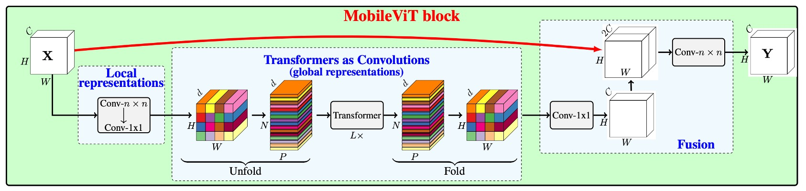

## 變更設計卷積核

[**MobileViT: Light-weight, General-purpose, and Mobile-friendly Vision Transformer**](https://arxiv.org/abs/2110.02178)

---

在 Microsoft 提出了 **Mobile-Former** 不久，也就差不多一個月的時間。

Apple 公司也針對這個問題提出了自己的解決方案：**MobileViT**。

## 定義問題

最根本的問題還是 ViT 在移動裝置上的效能不佳。

和 Mobile-Former 所採用的平行連通橋架構不同，MobileViT 通過將卷積操作中「最核心」的矩陣乘法部分替換為自注意力機制，來提高卷積核的感受野，從而提高模型的效能。

想看懂這篇論文的操作，我們得先回顧一下卷積操作。

## 解決問題

### 卷積回顧

為了加速計算卷積操作，我們可以將其分解為「**unfold**」和「**fold**」操作。這種分解使得卷積可以被視作一個矩陣乘法問題，從而在一些優化場景下更加高效。

- **1. Unfold 操作**

  Unfold，也叫「im2col」操作，主要是將輸入張量（例如一個圖片）展開成一個適合矩陣乘法的形狀。

  舉個例子：假設我們有一個 $3 \times 3$ 的輸入矩陣 $X$，其值如下：

  $$
  X = \left[\begin{matrix}
  1 & 2 & 3 \\
  4 & 5 & 6 \\
  7 & 8 & 9
  \end{matrix}
  \right]
  $$

  我們有一個 $2 \times 2$ 的卷積核 $K$，其值如下：

  $$
  K = \left[\begin{matrix}
  1 & 0 \\
  0 & -1
  \end{matrix} \right]
  $$

  在傳統卷積中，卷積核會在輸入矩陣上滑動，逐一計算卷積值，但這裡我們使用 unfold 將這個過程轉換為矩陣乘法。使用 $2 \times 2$ 的滑動視窗，我們可以從矩陣 $X$ 中展開以下四個 $2\times 2$ 的區域（視窗）：

  $$
  \left[\begin{matrix}
  1 & 2 \\
  4 & 5
  \end{matrix}\right],
   \left[\begin{matrix}
  2 & 3 \\
  5 & 6
  \end{matrix}\right],
  \left[\begin{matrix}
  4 & 5 \\
  7 & 8
  \end{matrix}\right],
  \left[\begin{matrix}
  5 & 6 \\
  8 & 9
  \end{matrix}\right]
  $$

  接下來，我們將這些視窗展開成行向量，形成一個矩陣：

  $$
  X_{\text{unfold}} = \left[\begin{matrix}
  1 & 2 & 4 & 5 \\
  2 & 3 & 5 & 6 \\
  4 & 5 & 7 & 8 \\
  5 & 6 & 8 & 9
  \end{matrix}\right]
  $$

- **2. 矩陣乘法**

  現在，我們可以將展開後的輸入矩陣 $X_{\text{unfold}}$ 與卷積核 $K$ 展開後的行向量（也就是把 $K$ 平鋪成一個一維向量）進行矩陣乘法：

  $$
  K_{\text{flat}} = \left[\begin{matrix} 1 & 0 & 0 & -1 \end{matrix}\right]
  $$

  $$
  Y_{\text{flat}} = X_{\text{unfold}} \times K_{\text{flat}}^T
  $$

  這裡的 $K_{\text{flat}}$ 是 $1 \times 4$ 的向量， $X_{\text{unfold}}$ 是 $4 \times 4$ 的矩陣，兩者相乘後會得到一個 $4 \times 1$ 的輸出向量：

  $$
  Y_{\text{flat}} = \left[\begin{matrix}
  1 \cdot 1 + 2 \cdot 0 + 4 \cdot 0 + 5 \cdot (-1) \\
  2 \cdot 1 + 3 \cdot 0 + 5 \cdot 0 + 6 \cdot (-1) \\
  4 \cdot 1 + 5 \cdot 0 + 7 \cdot 0 + 8 \cdot (-1) \\
  5 \cdot 1 + 6 \cdot 0 + 8 \cdot 0 + 9 \cdot (-1)
  \end{matrix}\right]
  =
  \left[\begin{matrix}
  -4 \\
  -4 \\
  -4 \\
  -4
  \end{matrix}\right]
  $$

- **3. Fold 操作**

  「Fold」操作是將矩陣乘法的結果重組回輸出的形狀。在我們這個例子中，這個過程會把上面得到的向量轉換回一個 2x2 的輸出矩陣：

  $$
  Y = \left[\begin{matrix}
  -4 & -4 \\
  -4 & -4
  \end{matrix}\right]
  $$

通過「**unfold**」和「**fold**」操作，我們可以將卷積問題轉化為矩陣乘法問題，這種方法在一些場景下有助於更快地進行卷積計算。

### 模型架構

看完前一段的卷積介紹之後，我們可以正式地來看一下這篇論文的架構。

本來上面這張圖看起來很複雜，有了前面的鋪陳，現在就變得很簡單了。

卷積在「**unfold**」之後，不要使用卷積核的大小進行矩陣乘法，而是改成用自注意力機制。在原始的卷積運算中，卷積核只會進行局部的資訊交互，而自注意力機制則可以讓每個位置都能看到所有其他位置的資訊，藉此來達成全局的資訊交互。

想當然，這個操作是比較昂貴的，所以不能套用在所有的位置上，作者選了幾個地方進行替換，如下圖：

在卷積網路的後面三個 stage 的位置上，作者將卷積核換成了自注意力機制。這樣做的好處是可以減少參數量，並且提高模型的效率。

### 實驗配置

作者在 ImageNet-1k 資料集上從頭開始訓練 MobileViT 模型。

該資料集包含 128 萬張訓練影像和 5 萬張驗證影像。訓練過程使用 PyTorch，在 8 個 NVIDIA GPU 上進行了 300 個週期，優化器選用 AdamW，損失函數為帶有平滑參數 0.1 的標籤平滑交叉熵損失。有效批量大小為 1,024 張圖像，並使用多尺度採樣器。

學習率在前 3,000 次迭代中從 0.0002 緩慢增至 0.002，之後按照餘弦衰減規則降至 0.0002。L2 權重衰減設為 0.01。資料增強技術包括隨機調整大小的裁剪和水平翻轉。模型效能使用單次裁剪的 top-1 精度來評估，推理時使用模型權重的指數移動平均值。

:::tip
多尺度採樣器是在本篇論文中提出來的一個訓練技巧，根據實驗結果，使用多尺度採樣器可以提升最後約 0.5% 的精度。但這種屬於訓練技巧，不是論文本身的主要貢獻，有興趣的讀者可以參考原文進一步了解相關細節。
:::

## 討論

### 在 ImageNet 上的性能

- **MobileViT 優於輕量級 CNN**：

  - 在不同網路規模上，MobileViT 的效能超越了多種輕量級 CNN 模型，包括 MobileNetv1、MobileNetv2、ShuffleNetv2、ESPNetv2 和 MobileNetv3。
  - 例如，在模型大小約 250 萬個參數時，MobileViT 在 ImageNet-1k 驗證集上的效能：
    - 比 MobileNetv2 高 5%
    - 比 ShuffleNetv2 高 5.4%
    - 比 MobileNetv3 高 7.4%。

- **MobileViT 優於重量級 CNN**：

  - MobileViT 的效能也超越了重量級 CNN 模型，例如 ResNet、DenseNet、ResNet-SE 和 EfficientNet。
  - 例如，MobileViT 在與 EfficientNet 相似數量參數下的準確率高出 2.1%。

---

在上圖中，紅色的 `advance` 表示使用了高級的增強技術，而綠色的 `basic` 則表示只使用了基本的增強技術。所謂高級的增強技術包括 Mixup、CutMix、RandAugment 等技術。

- **與 ViT 變體的比較**：

  - MobileViT 與從頭開始訓練的 ViT 變體進行了比較，這些 ViT 變體包括 DeIT、T2T、PVT、CAIT、DeepViT、CeiT、CrossViT、LocalViT、PiT、ConViT、ViL、BotNet 和 Mobile-former。
  - 與需要高級增強技術的 ViT 變體不同，MobileViT 僅使用基本增強技術，且具備較少的參數仍實現更好效能。
    - 例如，MobileViT 比 DeIT 小 2.5 倍，效能高出 2.6%。

MobileViT 顯示出類似 CNN 的優勢，易於優化且穩健，因此可輕鬆應用於新的任務和資料集。

:::tip
這篇論文中所提到的 MobileNet 系列的數據都比較舊，都是沒有經過現代化的訓練計畫所優化的結果。讀者可以在 MobileNet-V4 的論文中看一下最新的資訊。

- [**[24.04] MobileNet-V4: 時隔五年的傳承**](../2404-mobilenet-v4/index.md)
  :::

## 結論

雖然 MobileViT 在 ImageNet-1k 上的效能優於多種輕量級和重量級 CNN 模型，但在行動裝置上的推理速度仍有待討論。

作者在論文的最後指出基於 ViT 的網路架構和基於 CNNs 的相比，其推論速度在行動裝置上有將近一個數量級的差距。這顯然不是針對優化 FLOPs 或參數數量就能解決的問題。

造成這種差異主要是由於兩個原因：

1. GPU 上的轉換器有專用的 CUDA 內核，這些內核在 ViT 中開箱即用，以提高 GPU 上的可擴展性和效率。
2. CNNs 受益於多種設備級最佳化，包括與卷積層的批量歸一化融合。這些優化改善了延遲和記憶體存取。

因此，在現階段，使用 ViT 相關的模型在行動裝置上進行推理仍有許多挑戰。期待未來有更多的硬體和軟體優化能夠解決這個問題。
