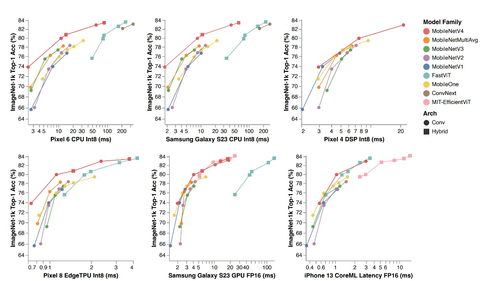
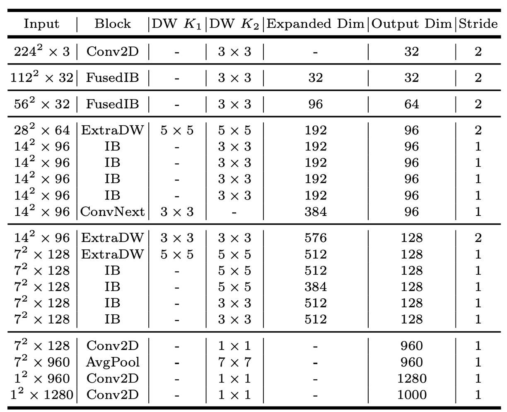

# [24.04] MobileNet-V4

## 時隔五年的傳承

[**MobileNetV4 - Universal Models for the Mobile Ecosystem**](https://arxiv.org/abs/2404.10518)

---

距離上次發表 MobileNetV3 已經五年了。

這段時間內，學術界也取得了許多進展，很多更好的網路架構以及多頭注意力機制的應用場景等。

## 定義問題

有了新的武器，不禁讓人想拿出來試試看，或許能將它們整合到了 MobileNet 中，取得更好的效果。

首先是近年流行的注意力機制，這個主題在過去的研究中，主要分為兩個流派：

### 混合注意力

他們專注於融合 CNN 和 Transformer 的優勢，讓注意力機制能夠更好地應用在輕量化網路上。

這裡的代表作有幾篇：

- [**[21.08] Mobile-Former: Bridging MobileNet and Transformer**](https://arxiv.org/abs/2108.05895)
- [**[21.10] MobileViT: Light-weight, General-purpose, and Mobile-friendly Vision Transformer**](https://arxiv.org/abs/2110.02178)
- [**[23.03] FastViT: A Fast Hybrid Vision Transformer using Structural Reparameterization**](https://arxiv.org/abs/2303.14189)

### 高效注意力

這個流派的研究重點在於提高 MHSA 效率。嘗試把原本的 $O(n^2)$ 複雜度降低到 $O(n)$。

- [**[21.07] CMT: Convolutional Neural Networks Meet Vision Transformers**](https://arxiv.org/abs/2107.06263)
- [**[22.05] EfficientViT: Multi-Scale Linear Attention for High-Resolution Dense Prediction**](https://arxiv.org/abs/2205.14756)
- [**[22.06] Separable Self-attention for Mobile Vision Transformers**](https://arxiv.org/abs/2206.02680)
- [**[22.07] Next-ViT: Next Generation Vision Transformer for Efficient Deployment in Realistic Industrial Scenarios**](https://arxiv.org/abs/2207.05501)
- [**[22.12] Rethinking Vision Transformers for MobileNet Size and Speed**](https://arxiv.org/abs/2212.08059)

### 不同的卷積網路架構

除了注意力機制，還有一些網路架構綜述，例如：

- [**[22.01] ConvNeXt: 讓卷積再次偉大**](../../classic-cnns/2201-convnext/index.md)

這也是可以拿來參考的對象。

## 解決問題

### 網路架構

作者首先擴展 MobileNet-V2 的反向瓶頸（Invert Residual Block，論文中簡稱 IB）。

首先看到圖中的 `Inverted Bottleneck`，這是 MobileNet-V2 的基本結構，這個部分相信你應該很熟。

接著，作者在這個結構前面加入另外一個 `Depthwise Convolution`，然後允許前面和中間這兩個部分可以「自由組合」。

於是就可以排列出四種不同的組合方式：

1. 兩個都選：Extra DW
2. 選第一個 DW：Conv Next 的結構
3. 選中間 DW：原本的 IB
4. 兩個都不選：就是單純的 FFN

這種自由組合的模組，在論文中稱為 `UIB`（Universal Inverted Bottleneck）。

:::info
除了 `UIB` 之外，論文中提到了另一個 `Alternative Fuseed IB`。

這個是用於後續 NAS 的搜索的固定組件，在建置搜尋空間值，其中一條規則是：

- 固定初始層：在第一階段從 `Conv2D` 開始（3x3 kernel, stride=2），第二階段緊接著用 `FusedIB` 以平衡效率和準確性。
  :::

### Mobile MQA

完成了卷積網路的架構設計，接著作者引入一個新型的注意力模組： Multi-Query Attention (MQA)。

這個架構來自於：

- [**[19.11] MQA: 共享 Key-Value**](../../transformers/1911-mqa/index.md)

如果你還記得注意力機制的基本結構，你會知道它由三個部分組成：Query、Key 和 Value。

在多頭注意力機制中，每個頭都有自己的 Query、Key 和 Value。

而這個模組的主要想法是每個頭有不同的 Query ，但全都共用相同的 Key 和 Value。

在過去的實驗中，已經證明了這樣的設計不會降低模型的性能，當 Batchsize 相對特徵維度較小時，但可以大幅降低計算量。

這在移動裝置上幾乎不是問題，通常我們在推論的時候，Batchsize 都設為 1。

:::tip
作者表示：他們是第一個將 MQA 應用在輕量網路上的研究。
:::

有別於文字的注意力機制，這裡的注意力機制是用在圖像上的。

於是作者另外參考了另外一篇論文：

- [**[21.02] PVT: 空間縮減注意力機制**](../../vision-transformers/2102-pvt/index.md)

這篇論文中提出空間縮減注意力模組（Spatial-Reduction Attention）簡稱 SRA。

簡單來說就是在執行注意力機制之前，先將特徵圖進行空間縮減，這樣可以減少計算量。

把上面兩者結合起來，也就是把 SRA 的注意力換成 MQA，再把池化操作換成卷積，就得到了本篇論文所提出的 Mobile MQA。

:::tip
上面列了近十篇值得一讀的好論文，我們有空再整理上來......哎，好忙。
:::

### 跨裝置最優化

本篇論文的核心目標是在不同裝置上實現最優化。

:::tip
之前 MobileNet-V3 的研究中，僅針對 Pixel 系列進行了優化。
:::

在實驗過程中，作者整理了幾個重要的見解：

1. **多路徑效率問題**：
   - 組卷積和類似的多路徑設計，儘管 FLOPs 計數較低，但由於記憶體存取複雜性，效率較低。
2. **硬體支援很重要**：
   - 高級模組如 Squeeze and Excite (SE)、GELU、LayerNorm 在移動裝置上得不到很好的支持
   - LayerNorm 也落後於 BatchNorm
   - SE 在移動裝置加速器上速度很慢。
3. **簡單的力量**：
   - 簡單的模組如 ReLU、Conv2D、DW-Conv2D 和 BatchNorm 等在移動裝置上有很好的支持。

基於以上見解，在後續做 NAS 搜尋架構時，搜索系統會優先考慮廣泛支援的標準模組，並結合上述提到的 `UIB` 和 `MQA` 模組，一起進行搜索。

## 討論

### ImageNet 的實驗結果

:::info
上表中，MobileNet 系列（V1、V2、V3）都有依照現代訓練計畫重新訓練，因此效能會比原始論文中的數值高。
:::

MNv4 模型不僅在效率上卓越，而且展示了在不同硬體平台上的兼容性，使其在行動生態系統中可以無縫部署，無需進行平台特定的調整。

1. **CPU 上的表現**：MNv4 模型的速度是 MobileNetV3 的兩倍，並且顯著快於其他具有相同精度的模型。
2. **EdgeTPU 上的表現**：MNv4 的速度是 MobileNet V3 的兩倍。
3. **GPU 和 Apple ANE 上的表現**：在 S23 GPU 和 iPhone 13 的 CoreML 上，MNv4 也展現了優異的前緣效能。
4. **與競爭模型的比較**：
   - **FastViT**：在 Apple Neural Engine 上排名第二，但在 GPU 上的延遲是 MNv4 的五倍以上。
   - **EfficientViT**：在 GPU 上表現良好，但在 Apple Neural Engine 上延遲較高。
   - **MobileNet V3**：在 CPU 上有不錯的表現，但在其他硬體平台上表現較差。

作者也提到，MNv4 的成功得益於使用了 UIB 區塊、增強的 NAS 配方和精心設計的搜尋空間。

這種模型的通用性為行動模型在各種硬體平台上實現最佳性能設定了新的標準。

### MQA 的效果

實驗證實了 MQA 在混合模型中的優勢。

如上表所示，與 MHSA 相比，MQA 在 EdgeTPU 和三星 S23 GPU 上實現了超過 39% 的加速，而品質損失可以忽略不計 (-0.03%)。

MQA 也將 MAC 和模型參數減少了 25% 以上。

### MNv4-Conv-S

論文中共提出四個模型，其中 MNv4-Conv-S 是最小的模型。

其他模型的架構請直接參閱論文。

## 結論

這是一款針對整個行動生態系統高效運作的通用和高效模型。

MobileNetV4 通過一系列的創新和技術優化，在行動 CPU、GPU、DSP 和專用加速器上達到了帕累托最優性能，這在其他輕量級模型的研究中是非常罕見的。

:::tip
帕累托最優（Pareto Optimality）是一個經濟學和工程學中常見的概念，用來描述一種最優狀態，其中任何一方的狀況無法改善而不使至少一方的狀況惡化。這個概念源自於義大利社會學家維爾弗雷多·帕累托（Vilfredo Pareto）。
:::

＊

在過去的開發經驗中，每當有一個新的輕量模型出現，我們總是得在不同手機上輪番測試...

- 不是要看哪個最好，而是要看哪個手機會出問題。

像是在 2023 年很有聲量的 `FastViT` 架構，離開了 iPhone 之後，效能降低的幅度讓人困惑。

我們感謝 Google 這次幫我們先測試了一輪，讓我們可以直接拿來用。
