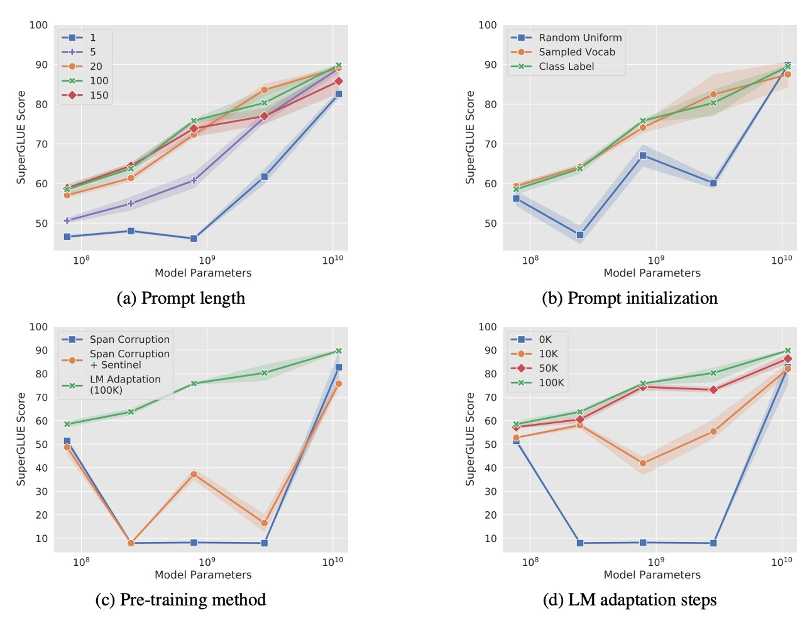
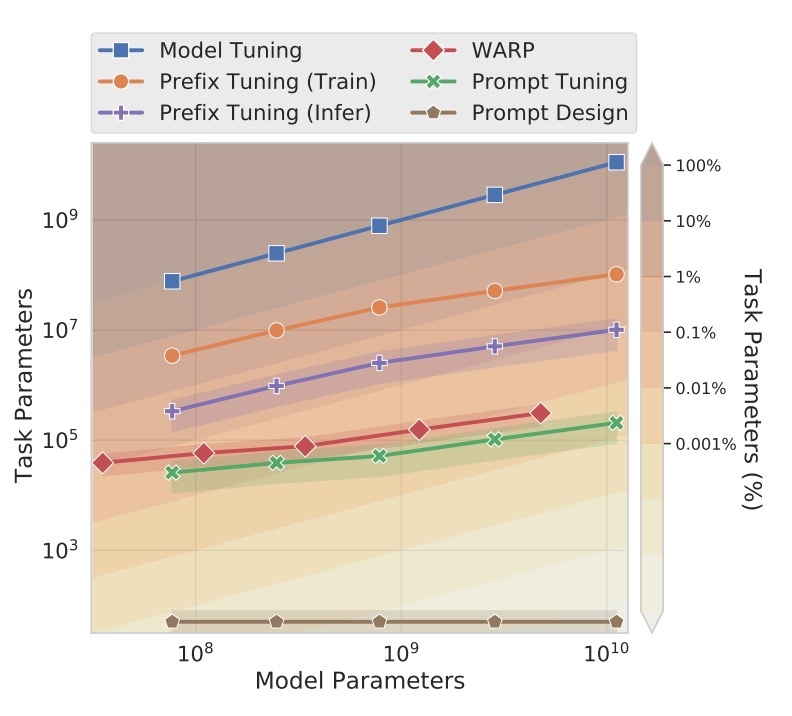

# [21.04] Soft Prompts

## 小弦切切如私語

[**The Power of Scale for Parameter-Efficient Prompt Tuning**](https://arxiv.org/abs/2104.08691)

---

我們剛看完 Prefix-Tuning 不久，現在來看另外一個新的方法：**Prompt Tuning**。

如果你還沒看過 Prefix-Tuning，不妨先去看一下我們之前寫的文章：

- [**[21.01] Prefix-Tuning: 是他？不是他？**](../2101-prefix-tuning/index.md)

## 定義問題

Prefix-Tuning 在設計的時候，需要在模型的輸入最前面加上一個叫做 Prefix 的 Token，來引導模型產生結果。這個 Prefix 必須深入到模型的每一層，這樣才能讓模型在每一層都能受到引導。

那我們能不能把事情簡化一下？只要在輸入層對模型進行引導就好了？

:::tip
這裡說的的「引導」和另外我們常聽到的「Prompt Engineering」不是同一件事情，Prompt Engineering 還是使用自然語言的方式來引導模型，從頭到尾都沒有改變模型的輸入特徵，沒有改參數，也沒有改架構。

而「Prompt Tuning」指的是在模型的輸入層加上一個特殊的 Token，這個 Token 是可以訓練的，這樣就可以讓模型在訓練的時候自己學習到最適合的引導方式。
:::

## 解決問題

### Prompt Tuning

<div align="center">
<figure style={{"width": "80%"}}>

</figure>
</div>

為了更好地理解 Prompt Tuning 的概念，作者從 T5（Raffel et al., 2020）的「**text-to-text**」架構開始。T5 將所有任務視為文本生成問題，無論是翻譯、摘要還是分類，都可以表示為從輸入文本生成輸出文本。

傳統的分類模型使用概率 $Pr(y|X)$，將輸入 $X$ 映射到輸出類別 $y$。這意味著模型直接預測輸入屬於哪個類別。

然而，在 T5 的架構中，我們關注的是**條件生成**問題，目標是計算：

$$
Pr_\theta(Y | X)
$$

其中：

- $Y$ 是代表類別的**文本序列**（例如，"positive" 或 "negative"）。
- $\theta$ 是 Transformer 模型的參數。

這種方法的優點是模型可以直接生成更豐富的文本輸出，而不僅僅是單一的類別標籤。

提示（Prompting）是添加在輸入 $X$ 前的一段文本，用於引導模型生成正確的輸出 $Y$。提示為模型提供了任務的上下文或指令，幫助模型理解應該如何處理輸入。

例如在情感分析任務中，我們可以使用以下提示：

```
"請判斷以下句子的情感傾向："
```

然後將用戶的輸入句子接在提示後面，形成模型的最終輸入。

在 GPT-3 等模型中，提示 $P = \{p_1, p_2, ..., p_n\}$ 是模型詞嵌入表中的一部分，由凍結的參數 $\theta$ 表徵。傳統上的提示人工成本高，效果不穩定，且不可微分。

所以作者提出了 Prompt Tuning（Prompt Tuning）的方法。

Prompt Tuning 引入了可更新的提示詞嵌入參數 $\theta_P$，這些參數不再受限於模型的詞嵌入表，可以通過訓練數據自動學習。

新的條件生成公式為：

$$
Pr_{\theta; \theta_P}(Y | [P; X])
$$

其中：

- $[P; X]$ 表示將提示 $P$ 和輸入 $X$ 進行拼接。
- $\theta$ 是凍結的模型參數。
- $\theta_P$ 是可訓練的提示參數。

在訓練過程中，使用反向傳播算法，只更新提示參數 $\theta_P$，而保持模型主體的參數 $\theta$ 不變。

具體的實現細節大致上可以分為幾個步驟：

1. **輸入嵌入**：將輸入的 $n$ 個 token 嵌入為矩陣 $X_e \in \mathbb{R}^{n \times e}$，其中 $e$ 是嵌入維度。
2. **提示嵌入**：提示詞嵌入為矩陣 $P_e \in \mathbb{R}^{p \times e}$，其中 $p$ 是提示的長度。
3. **拼接操作**：將提示嵌入和輸入嵌入拼接為：
   $$
   [P_e; X_e] \in \mathbb{R}^{(p + n) \times e}
   $$
4. **模型處理**：將拼接後的嵌入輸入到編碼器-解碼器架構中進行計算。

:::tip
假設我們希望模型判斷句子 "I love this movie!" 的情感。

**傳統方法**：

- **手動提示**："請判斷以下句子的情感："
- **模型輸入**："請判斷以下句子的情感：I love this movie!"

**Prompt Tuning 方法**：

1. **初始化提示**：
   - 設定提示長度為 $p=5$，即有 5 個可訓練的提示向量。
   - 這些提示向量可以隨機初始化或從詞嵌入表中選取。
2. **模型輸入**：將提示向量與輸入句子的嵌入拼接，形成模型的輸入。
3. **訓練過程**：
   - 使用大量已標註的情感分析數據。
   - 通過反向傳播，只更新提示參數 $\theta_P$。
   - 模型學習到在看到這些提示時，如何生成正確的情感標籤。
4. **模型輸出**：對於輸入 "I love this movie!"，模型可能生成 "positive"。

:::

## 討論



作者做了一系列的消融研究，來探討 Prompt Tuning 的一些關鍵問題：

### 提示長度要多長？

如上圖 (a)，作者對不同模型規模（Small、Base、Large、XL、XXL）的提示長度進行了實驗，提示長度分別為 \{1, 5, 20, 100, 150\}。

結果顯示，對大多數模型而言，提示長度增加到多於 1 個 token 對性能表現有明顯提升。但對於 T5-XXL 模型，即使只使用單一 token 作為提示，也能達到不錯的表現，表明大模型對提示訊號的需求較低。

超過 20 個 token 後，性能提升趨於平緩，只帶來微小的增益。

### 提示初始化策略的影響？

如上圖 (b)，作者比較了三種不同的初始化策略：

1. **隨機初始化**：從範圍 $[-0.5, 0.5]$ 中均勻隨機取樣。
2. **詞彙嵌入初始化**：從 T5 的 **5,000 個最常見詞彙**中選取詞嵌入進行初始化。
3. **類別標籤初始化**：將下游任務中的類別標籤轉換為詞嵌入，若標籤為多個 token，則對嵌入取平均值。當提示長度超過類別數時，剩餘的 token 使用詞彙嵌入填充。

結果顯示，類別標籤初始化在所有模型規模下表現最佳，特別是對於小模型來說，初始化策略的差異非常明顯。T5-XXL 模型對初始化策略較不敏感，無論使用何種初始化，其性能都相對穩定。

### 預訓練目標的影響？

如上圖 (c)，作者探討了不同的預訓練目標對 Prompt Tuning 的影響：

1. **Span Corruption**：使用預設的 T5 span corruption 預訓練目標。
2. **Span Corruption + Sentinel**：在下游任務的目標輸出中添加哨兵符號，以模擬預訓練時的輸出格式。
3. **LM 調適**：延續 T5 的預訓練，但改為**語言模型（LM）目標**，進行額外的 100,000 步調適。

結果顯示，Span Corruption 預訓練的模型不適合用於凍結模型的 Prompt Tuning，因為模型習慣了讀取和輸出帶有哨兵符號的文本。即使透過 **「Span Corruption + Sentinel」** 模擬預訓練格式，效果仍然有限。

**LM Adaptation** 在所有模型規模上都顯著提升性能。

### LM 調適時長的影響？

如上圖 (d)，作者探討了 LM 調適時長對 Prompt Tuning 的影響。

結果顯示，延長 LM 調適步數會帶來額外的增益，並在 100,000 步左右達到最佳效果。Span Corruption 預訓練轉換為 LM 目標不是一個簡單的過程，需要投入相當的訓練資源（相當於原始 T5 預訓練步數的 10%）。

T5-XXL 在各種非理想配置下仍表現良好，顯示其對模型設定具有高韌性。在 Span Corruption 配置下，模型表現不穩定，小模型甚至超越了 Base、Large 和 XL 模型。這些問題並非隨機波動造成，因為在 3 次重複實驗中觀察到一致的低變異。

與 Span Corruption 預訓練的模型相比，LM 調適後的模型在所有規模下都表現穩定，大幅降低了性能不穩定的風險。

### 和其他方法比較

<div align="center">
<figure style={{"width": "80%"}}>

</figure>
</div>

- **Prefix Tuning**：

  - [**[21.01] Prefix-Tuning: Optimizing Continuous Prompts for Generation**](https://arxiv.org/abs/2101.00190)

  在 Transformer 的每一層前置可學習的前綴 (prefix)，相當於為每層網路固定激活值。這方法適用於 GPT-2 和 BART，而本研究的 Prompt Tuning 專注於 T5。在 BART 上，Prefix Tuning 需要同時在「編碼器和解碼器」加入前綴，而 Prompt Tuning 只需在編碼器加入提示。

  Prompt Tuning 只需在輸入層加上一個單一提示詞，而非在每層加入前綴，因此參數需求更少。而且 Prompt Tuning 允許 Transformer 根據輸入例子更新其中間層的任務表徵，而 Prefix Tuning 需要重參數化來穩定訓練。

---

- **WARP**

  - [**[21.01] WARP: Word-level Adversarial ReProgramming**](https://arxiv.org/abs/2101.00121)

  WARP 將提示參數添加至輸入層，並使用 [MASK] token 和可學習的輸出層，將遮蔽部分映射至類別預測。這種方法只能產生單一輸出，因此受限於分類任務。

  Prompt Tuning 不需要對輸入進行特殊設計或使用任務專屬的輸出層，適用於更廣泛的任務。性能也更接近完整的模型微調。

---

- **P-tuning**

  - [**[21.03] GPT Understands, Too**](https://arxiv.org/abs/2103.10385)

  P-tuning 將可學習的連續提示嵌入於輸入之間，並基於人類設計的模式進行排列。為了達到良好的 SuperGLUE 表現，P-tuning 必須與模型微調結合，即同時調整提示和主模型的參數。

  Pompt Tuning 只需更新提示參數，而主語言模型保持凍結，避免模型微調的成本。

---

- **Soft Words**

  - [**[21.04] Learning How to Ask: Querying LMs with Mixtures of Soft Prompts**](https://arxiv.org/abs/2104.06599)

    Soft Words 學習的提示基於手工設計的提示範本，並為每層添加可學習的 $\Delta_i$ 參數，使得參數需求隨模型深度增加。

    Pompt Tuning 不需要隨層數增加而添加額外參數，因此在參數規模上更具效率。

---

- **Adapters**

  - [**[19.02] Parameter-Efficient Transfer Learning for NLP**](https://arxiv.org/abs/1902.00751)

    Adapters 是插入於凍結模型層之間的小型瓶頸層，用以減少任務專屬參數。在 BERT-Large 上微調 Adapter 層，僅增加 2–4% 的參數，且性能接近完整模型微調。

    Adapters 透過重寫中間層的激活值來修改模型行為，而 Pompt Tuning 則是透過調整輸入表示，保留了模型內部的運算不變。

### 到底提示了什麼？

Prompt Tuning 是透過在連續嵌入空間調整提示向量，來引導語言模型生成預期的輸出。然而，由於這些提示是在連續空間中操作，而非明確的詞彙空間，我們難以直接理解這些提示是如何影響模型的行為。因此，為了深入解析 Prompt Tuning 的運作方式，作者採用了以下方法來分析提示的效果。

作者透過計算每個提示 token 與模型詞彙表中各 token 的**餘弦相似度**，找出最相近的詞彙。這讓我們可以看到每個提示 token 對應的「最近鄰詞彙」，從而揭示提示 token 在語義上的含義。

**研究發現：**

1. **語義緊密的群聚**：
   提示 token 的前五個最近鄰詞彙往往形成語義密切相關的群組，顯示出 Prompt Tuning 已成功學習到「類似詞語」的表徵。

2. **隨機向量的對比**：
   當使用隨機生成的向量代替經過訓練的提示 token，則無法形成相似的語義群聚。這表明 Prompt Tuning 並非隨機效果，而是能有效捕捉語言模型中的語義結構。

在長提示序列的情況下，作者發現多個提示 token 可能共享相同的最近鄰詞彙。

這些現象顯示了兩個潛在問題：

1. **冗餘容量**：提示中可能存在重複或多餘的資訊，無法進一步提升模型效能。
2. **缺乏序列結構**：提示 token 的表徵未能精確反映序列中的位置資訊，導致模型難以準確地定位和解析關鍵訊息。

另一個重要的觀察是，提示 token 的最近鄰詞彙中，經常包含「下游任務的類別標籤」。這暗示 Prompt Tuning 能在模型內部儲存預期的輸出類別，作為生成輸出的參考依據。

儘管學習到的提示序列難以用傳統語言解釋，但 Prompt Tuning 能夠有效構建具有語義意涵的表徵，並在模型內部形成有意義的調整機制。這些發現展示了 Prompt Tuning 不僅能引導模型生成特定輸出，還具備調整模型上下文的潛力。

## 結論

Prompt Tuning 在各類實驗中的表現與傳統模型微調相當，且隨著模型規模的擴大，這種性能差距逐漸縮小。

在零樣本領域遷移任務中，Prompt Tuning 展現出更好的泛化能力，表示凍結語言模型中的通用理解參數並將學習範圍限制於輕量化的提示向量，可以有效避免過度擬合於特定領域。

除了性能上的優勢外，Prompt Tuning 在存儲與服務成本上的吸引力。藉由凍結預訓練模型，能夠更高效地支援多任務處理，同時也促進高效的提示集成。

在未來，將「任務定義的參數與語言建模的通用參數分離」或許是個嶄新的研究方向。
