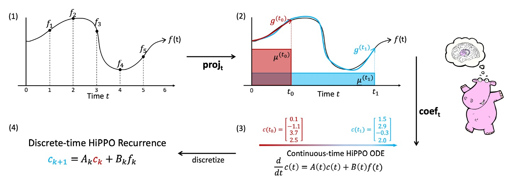

# [20.08] HiPPO

## 河馬的記憶

[**HiPPO: Recurrent Memory with Optimal Polynomial Projections**](https://arxiv.org/abs/2008.07669)

---

我們已經先去讀完了 **S4**，為了更好地理解研究的脈絡，我們再回過頭來看一下這篇論文。

不得不說，這個作者的論文都非常數學，想要翻開來看都必須鼓起勇氣。

:::tip
如果你想知道更多 S4 的內容，可以參考我們的另外一篇文章：

- [**[21.11] S4: 曼巴的序曲**](../2111-s4/index.md)
  :::

## 定義問題

RNN 的梯度消失和爆炸的問題，大家都多少知道一點。

雖然這是架構天生自帶的特性，但總是有一些緩解的辦法，像是加個閘門，例如 LSTM 或 GRU，或是用一些特殊的基底，例如 Fourier Recurrent Unit 或 Legendre Memory Unit (LMU)。

但這樣治標不治本啊！把問題蓋起來，不代表問題就不存在。

作者不認同這些做法，他們認為這些方法都有一些共通的問題：

1. **沒有一個統一的理論框架來解釋記憶機制。**
2. **通常需要事先對輸入序列的長度或時間尺度有先驗資訊。**

我們能不能找到一個方法，既不需要事先知道時間尺度，且有理論基礎，且能夠處理長期依賴的問題呢？

## 解決問題

首先，我們回來考慮一下 RNN 的場景。

### 序列的壓縮表示

以就是給定一個隨時間變化的輸入函數 $f(t)$，我們在每個時間點 $t \geq 0$ 都希望根據過去所有歷史資訊（即從起始時間 0 到時間 $t$ 的整個序列或訊號片段 $f(x)$, $x \le t$）來做出決策、預測或表示。

然而，直接儲存整段歷史 $f_{\le t} := \{ f(x) \mid x \le t \}$ 是不切實際的，因為時間持續前進，資料量會無限制地增加，導致儲存計算上都面臨極大困難。

因此，我們需要一種「**有界維度的壓縮表示**」！

也就是說，我們希望在每個時刻，使用有限個參數（數值）來近似表示整個歷史資訊。

接著，我們必須選擇一個有界維度的函數子空間 $G$，以便在其中尋找最佳近似。

作者選擇一個自然且常用的選項：**多項式空間**。

假設我們取 $G$ 為由多項式所張成的空間：

$$
G = \{ \text{polynomials } p(x) : \deg(p) < N \}.
$$

在這個子空間中，我們可以寫出近似函數 $g$ 為

$$
g(t) = \sum_{n=0}^{N-1} x_n p_n(t),
$$

其中 $p_n(t)$ 是一組基底多項式（例如，$p_n(t)=t^n$ 或更恰當的正交多項式系統），而 $x_n$ 是我們需要維持與更新的係數。由於 $N$ 是固定的，因此我們只需要儲存 $N$ 個係數 $x_n$ 便可表示對過去歷史的壓縮近似。

:::tip
**為何選擇多項式？**

因為多項式是相當通用的基底：

1. 數學上，多項式密度保證對許多函數可任意逼近（當 $N \to \infty$ 時）。
2. 正交多項式有許多良好性質，使得計算最佳近似係數有閉合形式的解。
3. 其他基底系，如傅立葉級數，可以在適當的變換下視為多項式的一類特例。

好東西，不用嗎？
:::

:::tip
**再舉個溫度監測的例子：**

假設 $f(t)$ 是一個感測器在時間 $t$ 測到的溫度，我們想要在任何時間 $t$ 利用過去的溫度歷史來預測未來走勢。直接紀錄所有過去溫度需要無限記憶體；我們可利用多項式近似表示過去溫度變化的整體趨勢。例如，若 $N=3$，我們可能用

$$
g(t) = x_0 + x_1 t + x_2 t^2
$$

來表示最近時間的溫度變化特徵。當時間前進，我們在線更新 $x_0, x_1, x_2$，保留對溫度歷史的「壓縮描述」。

你看，這樣是不是已經可以感受到 HiPPO 框架想要做的事情了？
:::

### 近似的優劣

這就引發下一個核心問題：

- **要用什麼方法來定義「近似」並量化「近似的優劣」？**

逼近得好不好，也就是「近似的優劣」，可以透過「距離的概念」來衡量。

一般來說，我們都知道在數軸上有長度，在平面上有距離，在更高維的空間也有距離。函數空間（把每個函數當作一個點）同樣可以定義「距離」，只是定義距離的方式需要透過積分來達成。

作者在這裡的想法是：

> **如果兩個函數在每個時間點的數值都很接近，那我們就說它們「距離很近」；反之，如果在很多地方不一致，那就「距離很遠」。**

在數學上，我們透過引入「測度」(measure) $\mu$ 和對應的「加權內積」(weighted inner product) 來定義函數之間的距離：

1. **測度 $\mu$**

   這裡我們可以把測度理解成是一種「加權系統」，用來標明時間軸上哪些時間點比較重要。

   如果我們比較在意最近的資料，那就在「最新的時間區間」給比較大的權重，較久以前的時間點給比較小的權重。或是乾脆把所有時間點平均看待也行。

2. **加權內積 $\langle f,g \rangle_\mu$**

   我們透過下式定義兩個函數 $f$ 和 $g$ 之間的「內積」：

   $$
   \langle f,g \rangle_\mu = \int_0^\infty f(x)g(x) \, d\mu(x).
   $$

   直觀來看，如果 $f$ 和 $g$ 在大多數時間裡的值都很相似且為正值，那麼積分會很大，表示它們之間的內積很大；如果它們常常一正一負或差很遠，積分就小甚至接近零，表示內積小。

類似於二維空間中，向量的長度是 $\sqrt{x^2 + y^2}$，在函數空間中，我們用內積來定義函數的「長度」或「範數」：

$$
\| f \|_{L^2(\mu)} = \sqrt{\langle f,f \rangle_\mu} = \sqrt{\int_0^\infty f(x)^2 \, d\mu(x)}.
$$

如果函數 $f$ 的值很大，範數就很大；如果 $f$ 很接近 0，範數就小。

最後我們嘗試用一個較簡單的函數 $g$ 去逼近 $f_{\le t}$（表示從 0 到$t$這段歷史的資料），那麼在這個度量架構下，就可以計算兩者的差異：

$$
\| f_{\le t} - g \|_{L^2(\mu)} = \sqrt{\int_0^\infty [f(x) - g(x)]^2 \, d\mu(x)}.
$$

這個積分基本上會把從 0 到無限大整段時間區間上，$f$ 與 $g$ 的差值 $(f(x)-g(x))$ 拿來平方、加權後積分起來，計算 **$(f(x)-g(x))^2$**：

1. 如果在大多數時間點都很小，那麼積分結果就會很小，表示 $f$ 和 $g$ 很接近。
2. 如果在很多時間點都很大，那麼積分結果就會很大，表示 $f$ 和 $g$ 差異很大。

## HiPPO 框架

到這邊，我們已經將「記憶」問題定義為一個「線上的函數近似問題」，即在任意時間 $t$，利用一個 $N$ 維的子空間（通常由多項式所張成）來逼近輸入函數在區間 $[0,t]$ 所累積的歷史 $f_{\le t}$。

為了達到這個目標，接著就是要解決以下問題：

> **當新資料 $f(t)$ 不斷到來，我們該如何在線更新近似係數，使得該多項式始終接近 $f_{\le t}$？**

### 正交多項式與係數投影

1.  **選擇適合的基底 $\{g_n\}_{n<N}$：**

    為了使近似有良好的數學性質，我們選擇與測度 $\mu^{(t)}$ 對應的正交多項式作為子空間 $G$ 的基底。這組基底有一個關鍵優點：由於正交性，函數的「最佳近似係數」有閉合形式可求，且後續更新有更簡潔的表示。

2.  **求解「最佳近似投影」：**

    若 $g(t) \in G$ 是逼近 $f_{\le t}$ 的最佳多項式，那麼 $g(t)$ 可寫為：

    $$
    g(t, x) = \sum_{n=0}^{N-1} c_n(t) g_n(x)
    $$

    其中 $c_n(t)$ 是在時間 $t$ 下的最佳逼近係數，由定義，$c_n(t)$ 可以透過內積求得：

    $$
    c_n(t) = \langle f_{\le t}, g_n \rangle_{\mu(t)}.
    $$

    因為正交性，求得 $c_n(t)$ 成為一個明確而且可行的動作。

### 轉化為微分方程

現在的關鍵問題是：

> **如何「隨著時間 $t$ 變化」而更新 $c(t) = [c_0(t), c_1(t), \dots, c_{N-1}(t)]^\top$？**

由於 $f_{\le t}$ 與測度 $\mu^{(t)}$ 隨時間改變，我們考慮對 $c_n(t)$ 對 $t$ 做微分。

經過詳細的數學推導，會發現：

:::tip
作者在論文附錄中給出完整推導過程，請原諒我們在這裡略過這個部分。
:::

$$
\frac{d}{dt} c(t) = A(t) c(t) + B(t) f(t),
$$

其中 $A(t)$ 為一個 $N \times N$ 的矩陣，$B(t)$ 為一個 $N \times 1$ 的向量，兩者都由測度與正交多項式的性質決定。

這表示「最佳近似係數隨時間的演化」可以用一個常微分方程（ODE）來描述。

從理論上，只要解這個 ODE，我們就能在線地更新 $c(t)$。

但在實務上，我們沒有辦法在連續時間中精確解出 ODE，但可以透過離散化方法（如歐拉法或其他數值方法）將其轉化為線性遞迴的形式。

因此，每當有新的 $f(t)$ 值出現時，我們可以更新

$$
c_{t} = A c_{t-1} + B f(t),
$$

就像一個 RNN 那樣，每一步只需要花費 $O(N^2)$（或透過特定結構降到更低）就能更新。

### HiPPO 抽象化

在前面章節中，我們知道「記憶表徵」問題可以被視為函數近似問題：

- 在任意時間點 $t$，我們希望以有限維度的方式來表示整個歷史訊號 $f_{\le t}$，並確保這個近似在選定的度量下是最佳的。

作者在此引入了幾個重要的運算元：

1. **投影運算子 $proj_t$：**

   - 輸入：歷史函數片段 $f_{\le t}$，也就是函數 $f$ 在時間區間 $[0, t]$ 上的部分。
   - 輸出：一個多項式 $g^{(t)} \in G$，其中 $G$ 是一個 $N$ 維的多項式子空間。

   這個 $g^{(t)}$ 是在 $L^2(\mu^{(t)})$ 度量下最佳逼近 $f_{\le t}$ 的多項式。

   簡單來說，$projt(f)$ 找出一個「最佳多項式近似」來代表 $f$ 在 $[0, t]$ 的歷史。

2. **係數提取運算子 $coef_t$：**

   - 輸入：多項式 $g^{(t)}$。
   - 輸出：$c(t) \in \mathbb{R}^N$，即該多項式在一組正交多項式基底下的係數向量。

   因為 $g^{(t)}$ 是一個 $N$ 維子空間中的元素，我們可以透過選定的正交基底（由測度 $\mu^{(t)}$ 定義）將 $g^{(t)}$ 唯一地表示為

   $$
   g^{(t)}(x) = \sum_{n=0}^{N-1} c_n(t) \, g_n(x).
   $$

將這兩個運算子合成起來，$hippo = coef_t \circ proj_t$，這個組合可以將原始函數 $f(t)$ 直接映射到其最佳多項式近似的係數 $c(t)$：

$$
(hippo(f))(t) = coef_t(proj_t(f)).
$$

如此一來，我們只需要維持 $c(t) \in \mathbb{R}^N$ 就能動態更新，取得一個有界維度的歷史記憶表示。

定義雖然簡單，但直接計算 $proj_t(f)$ 並不容易。

作者在這裡從理論推導出 $c(t)$ 的更新規則，可以用 ODE 描述：

$$
\frac{d}{dt} c(t) = A(t)c(t) + B(t)f(t),
$$

其中 $A(t)$ 和 $B(t)$ 是由測度 $\mu^{(t)}$ 和基底選擇所決定的矩陣與向量。

:::tip
**為什麼重要？**

透過此 ODE，我們不需在每個時間都重新解一個複雜的投影問題，只要按時間往前積分(或離散化)即可保持 $c(t)$ 為當下歷史的最佳近似係數向量。

進一步地，將此 ODE 離散化後，我們得到一個線性遞迴式：

$$
c_{k+1} = A' c_k + B' f_k,
$$

其中 $A', B'$ 是 $A(t), B(t)$ 的離散化結果。

透過這個離散遞迴，我們可以很有效率地在線上更新記憶表示：

- 每次有新的輸入值 $f_k$ 到來，我們只要根據前一步的 $c_k$ 來計算 $c_{k+1}$。

這種做法使得原本看似複雜的最佳投影問題變得實用。
:::

最後作者在論文中附上了一隻可愛的河馬和一張圖表來說明這個過程：

<figure style={{"width": "90%"}}>

</figure>

簡化近似函數的過程，分為四個步驟：

1. **任意函數 $f$**：左上角顯示的是一條函數曲線 $f(t)$，定義在 $t \ge 0$。這代表了隨時間變動的信號輸入。
2. **對每個時間 $t$，計算最佳投影 $g^{(t)}$**：

   圖中第二個框表示：在任意時間 $t$，我們想找到一個多項式 $g^{(t)}$ 來近似 $f_{\le t}$。

   在圖中，$g^{(t)}$ 被畫成一條近似於 $f(t)$ 的函數曲線，但只考慮到當前的時間範圍 $[0, t]$，並根據所選測度 $\mu^{(t)}$ 定義的內積空間來判斷何者近似最好。

3. **係數表示與動態 (ODE)**：

   第三個框顯示的是：將 $g^{(t)}$ 寫成一組正交多項式基底的線性組合，並得到係數 $c(t)$。

   此時，作者的理論結果說明 $c(t)$ 將遵從一組線性微分方程 (ODE)：

   $$
   \frac{d}{dt}c(t) = A(t)c(t) + B(t)f(t).
   $$

   這就將問題簡化為一個可計算的動態系統。

   我們不需要反覆求最小化誤差問題，而是隨時間更新 $c(t)$。

4. **離散化與線上更新**：

   最終，實際資料是離散的序列 (例如 $f_0, f_1, \dots$)，因此我們將 ODE 離散化，得到下圖最右邊的狀態：

   $$
   c_{k+1} = A' c_k + B' f_k.
   $$

   這是一個簡潔的遞迴關係式，可視為一種特殊的「RNN-like」結構，只需給定上一時間步的狀態 $c_k$ 和當前輸入 $f_k$，就能更新狀態 $c_{k+1}$。

### HiPPO 應用範例

:::tip
看到這裡，我們已經有點累了，但這裡只有一半的進度，再堅持一下吧！
:::

為了讓我們更容易理解 HiPPO 如何在實務中應用，作者舉了兩種常用的「記憶方式」作為範例：**滑動視窗 (Sliding Window)** 與 **指數衰減 (Exponential Decay)**。

- **1. 滑動視窗 (LegT) 測度**

  滑動視窗是一種直觀的記憶方式，比較常見的場景是監控室內監看即時的影像串流。

  我們通常只關心最近幾秒內發生的事情，而較久以前的畫面就不再重要。因此，我們設定一個「視窗長度」 $\theta$，只儲存最近 $\theta$ 秒的影像，並不斷刪除更早的片段。這就像在時間軸上推動一個固定長度的窗戶，只看這個窗戶內的「最新」歷史。

  在數學上，這種「只在 [ $t-\theta, t$ ] 這個區間內給予均勻權重」的想法可以透過測度來表達：

  $$
  \mu^{(t)}(x) = \frac{1}{\theta} I_{[t-\theta,\, t]}(x),
  $$

  $I_{[t-\theta, t]}$ 是指示函數，用來表示只有區間 $[t-\theta, t]$ 內的時間點才被考慮。

  在此測度下的 HiPPO 投影問題，透過理論推導，可轉化成一組線性時不變 ODE：

  $$
  \frac{d}{dt} c(t) = -A c(t) + B f(t),
  $$

  並且此 $A, B$ 有明確的閉合形式，這套公式正是之前提出的 **Legendre Memory Unit (LMU)** 所使用的更新規則。

  LMU 原本是透過直覺構造出來的方法，如今 HiPPO 告訴我們，LMU 是一種滑動視窗型記憶機制的特例，並對其原理給出嚴謹的數學詮釋。

- **2. 指數衰減 (LagT) 測度**

  另一個常見的情境是：我們想同時考慮無窮過去的歷史，但越久遠的資訊越不重要。

  數學上，以指數衰減的方式賦予歷史權重：

  $$
  \mu^{(t)}(x) = e^{-(t-x)} I_{(-\infty,t]}(x),
  $$

  使最近時間點的歷史影響最大，愈往過去影響愈小但不完全消失。

  同樣地，透過 HiPPO，我們能導出在此測度下對應的 ODE 與線性遞迴更新規則：

  $$
  A_{nk} =
  \begin{cases}
  1 & \text{if } n \geq k \\
  0 & \text{if } n < k
  \end{cases}, \quad B_n = 1.
  $$

  這組公式描述了一種「無限長記憶」但「漸進淡化」的記憶機制，對於許多實際應用（例如金融、訊號濾波、訊號加權平均）十分有用。

---

作者透過這兩個例子顯示 HiPPO 架構的通用性，只要改變測度，就能產生不同特性的記憶更新規則。

滾動視窗和指數衰減只是不勝枚舉的兩個典型測度，透過同樣的推導流程，我們可以為其他特殊測度（如 Fourier、Chebyshev）或特定任務需求產生相應的公式。

### HiPPO 離散化

HiPPO 在原始定義中是以連續時間為出發點，透過一組 ODE 來描述記憶狀態 $c(t)$ 隨時間的演化。但是，我們在實務中常面對的是離散序列資料，例如每天的股價、每秒的溫度讀數或每個時間步的影像訊號。

因此，我們需要將連續時間的 ODE 離散化(discretization)，也就是把時間切成一段段的小步長 $\Delta t$，將連續的演化方程轉成離散的更新公式，方便用在實際的序列上。

在連續時間下，我們有

$$
\frac{d}{dt} c(t) = u(t, c(t), f(t)),
$$

其中 $f(t)$ 是輸入函數，$c(t)$ 是狀態向量，$u$ 是描述如何更新狀態的函數。

將時間切成小步長 $\Delta t$，在每個時間點 $t = k \Delta t$ (這裡的 $k$ 是整數) 上更新狀態。

最基本的歐拉前進法 (Forward Euler) 離散化方式是：

$$
c(t+\Delta t) = c(t) + \Delta t \cdot u(t, c(t), f(t)).
$$

如果我們有序列輸入 $(f_0, f_1, f_2, \dots)$，我們可以假設 $f_k = f(k \cdot \Delta t)$，然後用上述公式一步一步地更新 $c_k = c(k \cdot \Delta t)$。

有了這個離散化步驟，我們就能在電腦中用「一個迴圈」來運算：

- 從初始狀態 $c_0$ 開始，
- 每次新資料點 $f_k$ 來了，就更新 $c_{k+1} = c_k + \Delta t \cdot u(k\Delta t, c_k, f_k)$。

這樣就得到一個離散時間遞迴，不用處理連續微分方程了。

如果我們的資料並非等時間間隔（例如某些時間點缺測值，或量測時間不規律），也能利用實際的「時間戳差」作為自適應的 $\Delta t$，使得 HiPPO 能自然地處理不等步長的情形。只要根據兩個連續可用資料點的時間差當作 $\Delta t$ 即可。

### HiPPO 低階投影

HiPPO 的核心是利用高階多項式逼近歷史記憶，$N$ 代表多項式的階數。如果 $N$ 越大，理論上能夠逼近更複雜的歷史模式。

那如果我們只取 $N=1$，也就是說只用一階的多項式來逼近，那會發生什麼事？

以 HiPPO-LagT（指數衰減的例子）為例，如果 $N=1$，那麼對應的 ODE 就非常簡單，$A=B=1$，在離散化後得到：

$$
c_{k+1} = (1-\Delta t)c_k + \Delta t f_k.
$$

這個公式可以解讀成：

- $(1-\Delta t)$ 像是一個「保留舊記憶的比例」
- $\Delta t$ 則是「注入新資訊的比例」

透過適當的調整 $\Delta t$ 或將其視為由資料驅動的數值，這時候我們發現：

- **嘿！這個更新方式竟然就是我們熟悉的 Gated RNN！**

所以根據 HiPPO 的理論，我們可以將 Gated RNN 看作是 HiPPO 框架下的一個特例，只是選擇了最低階的多項式投影。

原來 Gated RNN 也可以從「函數近似」的角度被推導出來，而不僅僅是經驗設計的產物。

## 時間尺度穩健性

在前面的章節中，我們已經知道 HiPPO 透過選擇適當的測度 (measure) 來決定記憶機制的特性。先前探討的測度，如滑動視窗 (LegT) 或指數衰減 (LagT)，都需要某種超參數來表示時間範圍或時間間隔 (例如 LegT 的窗口大小 $\theta$、LagT 在離散化時的 $\Delta t$)。

但實際上，我們往往無法事先確定最佳的時間尺度，或當資料分佈隨時間改變時，固定的時間尺度可能不再適用。

為了解決這個問題，作者在本節引入一種新測度：

- **Scaled Legendre (LegS)**

透過這種測度，希望建立一種對時間尺度具有穩健性、不需特定時間超參數的記憶機制。

### LegS 測度的定義

$$
\mu^{(t)}(x) = \frac{1}{t} I_{[0,t]}(x).
$$

這個測度給予整個歷史區間 $[0,t]$ 均勻權重，不像滑動視窗只注重最近 $\theta$ 的時間區間，也不像指數衰減偏重近期而對久遠的歷史權重迅速遞減。

LegS 等於是將「視窗」隨著時間動態擴展，始終包含從 $0$ 到 $t$ 的所有歷史。

根據作者在論文中的證明，給出了 HiPPO-LegS 在連續與離散時間下的動態方程：

- **連續時間的微分方程為**

  $$
  \frac{d}{dt} c(t) = -\frac{1}{t} A c(t) + \frac{1}{t} B f(t).
  $$

- **離散時間下的遞迴關係為**

  $$
  c_{k+1} = \left(1 - \frac{A}{k}\right) c_k + \frac{1}{k} B f_k.
  $$

其中 $A \in \mathbb{R}^{N \times N}$ 與 $B \in \mathbb{R}^{N \times 1}$，並且 $A$、$B$ 有特定的結構如下：

$$
A_{nk} =
\begin{cases}
\frac{\sqrt{2n+1}}{\sqrt{2k+1}} & \text{if } n > k \\[6pt]
n + 1 & \text{if } n = k \\[6pt]
0 & \text{if } n < k
\end{cases},
\quad
B_n = \sqrt{2n+1}.
$$

透過這些公式，我們得到一種不需要時間尺度超參數的記憶更新規則。

:::tip
簡單來說，這組 $(A, B)$ 的定義描述的是 HiPPO-LegS 中用來更新記憶表示的「規則矩陣」(A) 和「輸入向量」(B)。它們決定了在每個時間步驟中，多項式基底的各階係數 ($c_n(t)$) 是如何根據目前的狀態和新輸入 $f(t)$ 改變。

$A_{nk}$ 的定義分為三種情況：

1. **$n = k$（對角線元素）：**

   $$
   A_{nn} = n + 1.
   $$

   在對角線上，每一個元素 $A_{nn}$ 都是 $n+1$。
   直觀來說，這代表每個「階數為 $n$ 的係數」會以某個線性比例（$n+1$）影響自身的更新。在 $n$ 越大時，對角線元素越大，也就是較高階的多項式係數在更新中受到較強的自身縮放。

2. **$n > k$（對角線以下的元素）：**

   $$
   A_{nk} = \frac{\sqrt{2n+1}}{\sqrt{2k+1}}
   $$

   當 $n$ 大於 $k$ 時，代表這是位於矩陣下方的元素（相對於對角線而言）。
   這些元素顯示出較高階的係數（行索引 $n$）會受到較低階的係數（列索引 $k$）影響，影響的程度由一個跟 $\sqrt{2n+1}$ 和 $\sqrt{2k+1}$ 有關的比例決定。直觀來說，較高階的多項式係數在更新時會「參考」較低階係數的資訊，以一個隨階數變化的權重比例加進來。

3. **$n < k$（對角線以上的元素）：**
   $$
   A_{nk} = 0.
   $$
   對角線以上的元素都是 0。
   這表示矩陣 $A$ 是下三角矩陣，高階的多項式更新不會直接從「更高階數」的係數得到影響。資訊的影響流向是往下（從低階傳到高階），而不是從高階往低階傳。

這種結構確保在多項式逼近中，每一階的係數更新，都依序參考了比它低階的係數資訊，並透過特定的比例關係，使得階數與階數之間的影響是有序、可控的。

---

另外就是 $B$ 向量的結構：

$$
B_n = \sqrt{2n+1}.
$$

$B_n$ 控制輸入 $f(t)$ 對第 $n$ 階多項式係數的影響度。

- 當 $n$ 越大，$\sqrt{2n+1}$ 也越大，代表高階係數在理論上可以對輸入 $f(t)$ 有更強烈的響應。
- 從直觀上看，高階多項式具有更複雜的形狀變化能力，因此給它們相對較大的權重，意味在逼近函數時，高階成分可提供更靈活的調整餘地。
  :::

### 理論特性與優勢

HiPPO 所提出的 **LegS (Scaled Legendre)** 測度展現出多方面的優勢。

其特性在於分配給整個歷史區間 [0, t] 均勻的權重，藉此達成「對時間尺度有穩健性」、「計算效率高」、「梯度傳遞穩定」以及「近似誤差可控」等優點。

- **時間尺度穩健性 (Timescale Robustness)**

  由於 LegS 沒有固定的時間窗口大小或步長參數，它對時間延展或縮放具有天然的適應性。作者在此以數學形式給出：

  > 若對任意 $\alpha > 0$ 定義 $h(t) = f(\alpha t)$，則
  >
  > $$
  > hippo(h)(t) = hippo(f)(\alpha t).
  > $$

  換句話說，若 $\gamma: t \mapsto \alpha t$ 是任意時間縮放函數，則我們有

  $$
  hippo(f \circ \gamma) = hippo(f) \circ \gamma.
  $$

  這表示：當我們將輸入函數的時間軸壓縮或拉伸時，HiPPO-LegS 對應的近似係數也會以相同比例調整，而不需重新設定任何超參數。

  相比之下，其他測度（例如 LegT 或 LagT）需要額外的視窗長度 $\theta$ 或步長 $\Delta t$ 作為超參數，而這些參數在實務中容易受時間尺度改變影響，必須小心調整。

- **計算效率 (Computational Efficiency)**

  將連續 ODE 離散化後，我們會面臨每個時間步皆需執行矩陣-向量乘法的問題。一般情況下，這需要 $O(N^2)$ 的計算。

  然而對於 LegS 而言，透過特定的廣義雙線性轉換離散化方法，可使得每步更新僅需 $O(N)$ 的運算量：

  > 對於 HiPPO-LegS 的離散遞迴更新式
  >
  > $$
  > c_{k+1} = \left(1 - \frac{A}{k}\right)c_k + \frac{1}{k} B f_k,
  > $$
  >
  > 在適當的離散化條件下，每次計算可在 $O(N)$ 時間內完成。

  由於 $A$ 矩陣具有特殊結構，無論 $\Delta t$ 如何選擇，我們都能快速完成運算。在展開長序列計算時，HiPPO-LegS 約比傳統 RNN 快 10 倍。

- **梯度流動 (Gradient Flow)**

  RNN 通常面臨「梯度消失」問題，使得長期依賴難以捕捉。針對 LegS，作者給出梯度關係的分析，顯示其避免了指數級的梯度衰減：

  > 對任意 $t_0 < t_1$，
  >
  > $$
  > \left\|\frac{\partial c(t_1)}{\partial f(t_0)}\right\| = \Theta\left(\frac{1}{t_1}\right).
  > $$

  雖然梯度隨著 $t_1$ 增大而減小，但僅呈現 $1/t_1$ 的程度，遠不如指數衰減那般嚴重。這代表 LegS 在長序列上能更穩定地保留早期資訊的影響。

- **近似誤差上界 (Approximation Error Bounds)**：

  最後，作者討論了 LegS 在函數近似上的理論精度。

  若 $f$ 是 L-Lipschitz，則有

  $$
  \|f_{\le t} - g^{(t)}\| = O\left(\frac{tL}{\sqrt{N}}\right),
  $$

  而若 $f$ 有 k 階有界導數，則

  $$
  \|f_{\le t} - g^{(t)}\| = O\left(\frac{t^k}{N^{k-\frac{1}{2}}}\right).
  $$

  這些結果表示，當增加多項式階數 $N$ 時能穩定降低逼近誤差。輸入函數越平滑，其近似精度提升越顯著。

## 討論

作者在實驗中使用不同的 HiPPO 方法，包括前面介紹的 LegT、LagT、與 LegS。

- **LegT**：需要一個超參數 $\theta$ 代表滑動視窗長度。

  如果資料的時間尺度已知並設定為理想值，LegT 表現會很好；但若 $\theta$ 不合適（過大或過小），性能就會嚴重下降。

- **LagT**：需要設定一個步長 $\Delta t$ 的超參數，表現亦取決於其選擇。
- **LegS**：不需要這類時間尺度參數，理論上對不同行為的時間尺度都更具穩健性。

此外，作者設計了一個對照組 **Rand**，即在更新規則中使用隨機的 $A$ 與 $B$ 矩陣（經過適當正規化），透過比較 Rand 與其他經過嚴謹推導的 HiPPO 動態，來確認「特定動態設計」的重要性，而非純粹隨機矩陣的效果。

同時，也將 HiPPO 結合 MGU（Minimal Gated Unit，一種簡化的 GRU）作為基本架構。此外，有一些為長期依賴設計的 RNN 變種，如 LSTM、GRU、expRNN、LMU 也作為比較對象。

所有方法在實驗中都設定相同的隱藏層單元，即記憶維度 $N$ 與隱藏狀態維度 $d$ 維持一致，確保模型在規模和參數數量上大致相當。

### 長程記憶基準任務

<figure style={{"width": "70%"}}>

</figure>

pMNIST 任務是將 MNIST 手寫數字影像的像素順序打亂，然後逐像素輸入模型。由於像素的空間鄰接性被打亂，模型必須透過長期記憶來記住並整合整張圖的資訊再做分類，這是真正考驗長程依賴能力的任務。

上表顯示了各種 HiPPO 實作與基準模型的準確度。

- HiPPO-LegS 在所有模型中達到最佳的性能，優於其他 HiPPO 版本與基準線模型。
- LegT 在理想的視窗長度 $\theta$ 下性能接近 LegS，但如果 $\theta$ 選擇不恰當，性能就會大幅下滑。
- LagT 也在合適的 $\Delta t$ 下有不錯的表現。

LMU 曾是該任務中 RNN 類模型的 SOTA，但 LegS 超越了 LMU 與其他序列模型，在 pMNIST 上取得 98.3% 的測試準確率，創下「嚴格序列模型」的真正 SOTA。

:::tip
所謂「嚴格序列」是指模型在處理一個長序列資料時，必須一步接一步地讀入輸入值，不能在當前步驟中預先看見未來的訊息。也就是說，當時間步 $t$ 在處理輸入 $f_t$ 時，模型只能使用已出現過的歷史資訊 $f_1, f_2, \dots, f_{t-1}$，不得「偷看」未來時間步（如 $f_{t+1}, f_{t+2}, \dots$）。RNN、LSTM、GRU 這類模型本質上是按照時間軸逐步更新，符合「嚴格序列」的精神。

像 Transformer 透過注意力機制(Attention)在同一時間能夠「同時」看見整個序列的所有元素（或者至少是大量的上下文資訊），而不必像 RNN 那樣一步步往前推進。它並不需要在每個時間步只根據過去的資訊來決定當前狀態，它可以直接存取整個序列的全域訊息。這種特性使得 Transformer 等模型不需要嚴格遵守序列的前後順序處理限制，等於在某種程度上「作弊」：它可以同時參考未來步驟的內容，或在訓練時以並行方式處理序列中的所有元素。
:::

### 時間尺度穩健性

序列模型通常受益於合適的時間尺度先驗，但這些先驗常以額外的超參數呈現，並非自動解決方案，例如：

- LSTM 中的「遺忘偏置 (forget bias)」參數需要額外調整才能對付長期依賴問題。
- HiPPO-LagT 與 HiPPO-LegT 在離散化時需選擇合適的步長 $\Delta t$ 或視窗長度 $\theta$。

在上一節也進行了消融實驗，顯示如果像 LegT 這樣的滑動視窗機制沒有正確設置 $\theta$，性能便會大幅降低。

在論文中，作者使用 Character Trajectories 資料集作為實驗目標。

- [**[18.11] The UEA multivariate time series classification archive**](https://arxiv.org/abs/1811.00075)

此資料集的任務是將由手寫筆劃動作（透過固定取樣率所收集的座標序列）所描繪的字元正確分類。為了模擬「時間尺度轉移」的情境，作者考慮以下兩種標準的時間序列生成過程：

1. **固定取樣率下的變動 (Sampling Rate Change)**：
   將訓練模型時的取樣率與測試時的取樣率不同，使測試序列的時間尺度與訓練時不一樣。由於序列長度可變，模型無法直接從序列長度推測出取樣率的改變。

2. **不規則取樣 (Irregular Sampling) 或缺失資料 (Missing Data)**：
   在此情況下，序列的時間戳並非固定間隔。我們進行一個簡單的變換：對測試階段的時間戳進行縮放。若模型能自然處理多種時間尺度，就能在這種場景下自動適應測試資料的時間膨脹或壓縮。

---

HiPPO 架構將輸入資料視為連續函數，並透過離散化來與離散輸入互動。由於只需根據給定的離散化步長來更新，HiPPO 能輕鬆處理缺失資料或不規則取樣的情境。再結合 LegS 的時間尺度不變特性，作者預期 HiPPO-LegS 在這些設定下能自動適應。

在這個實驗中，作者也將與一些針對不規則取樣和缺失資料設計的模型比較，包括：

- **GRU-D**：對觀測值之間的時間間隔透過衰減機制來建模。
- **Neural ODE 模型**：在觀測點之間用 ODE 模擬狀態演化，可自然處理不規則取樣。

實現結果如下表：

<figure style={{"width": "90%"}}>

</figure>

結果顯示，如果沒有分佈轉移，所有模型的分類準確率皆能達到 95%以上，但一旦測試時間尺度與訓練時不同，除了 HiPPO-LegS 外，其他方法的性能都可能劇烈下滑。

相較之下，HiPPO-LegS 幾乎不受分佈轉移的影響，能在看不見的時間尺度情境下仍保持穩定高品質的預測，展現了其對時間尺度變動的天然適應能力。

### 可擴展性驗證

<figure style={{"width": "90%"}}>

</figure>

我們常見的 LSTM 可以處理的序列長度，大約在 100 到 1000 之間。當序列長度超過這個範圍，LSTM 就會遇到記憶衰減的問題，無法保持長期依賴。

作者為了驗證 HiPPO-LegS 在處理超長序列時的效能，設計了一個極具挑戰性的實驗：對一個長度為 $10^6$ 的白雜訊序列進行函數近似。

上表結果顯示，即便序列長度達數百萬，LMU 與 HiPPO-LegS 都能準確地重建輸入函數。

把結果視覺化，如下圖，可以看到 HiPPO-LegS 幾乎能完整匹配輸入函數的形狀，而 LSTM 完全失敗，無法在如此長的序列中維持穩定記憶。

<figure style={{"width": "90%"}}>

</figure>

除了在理論上擁有 $O(N)$ 計算複雜度的特性，實務實作也證實 HiPPO-LegS 極其高效。

作者以 C++ 並透過 PyTorch 綁定實作了快速更新版本，實測結果顯示在單核 CPU 環境下 HiPPO-LegS 每秒可處理高達 470,000 個時間步的更新，這比 LSTM 與 LMU 快上約 10 倍。

## 結論

HiPPO 框架將記憶表徵視為一個隨時間持續更新的最佳函數近似問題，並透過對時間變化測度的引入來統整並解釋既有的記憶機制。

HiPPO-LegS 作為 HiPPO 框架的一個實例，不僅在理論上朝向「時間尺度穩健性」，更在實務中證明其能有效處理長達數百萬時間步的長程依賴問題，且具有高效的運算性能。

:::tip
我們終於看完這篇論文了！

HiPPO 在後續的研究中被應用在 S4 架構中，又進一步發展出了 Mamba 模型，可以看到這個理論框架在實際應用中的強大威力。

最後，我們還是推薦讀者可以去閱讀原論文，更深入地感受一下 HiPPO 的魅力。
:::
