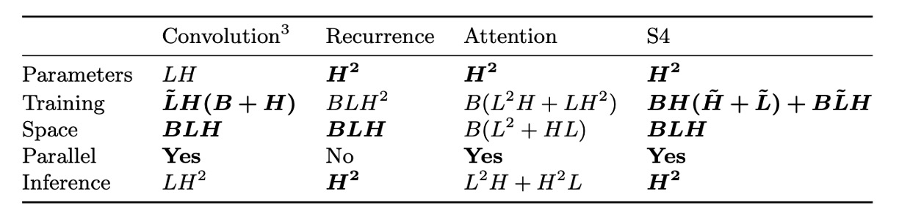
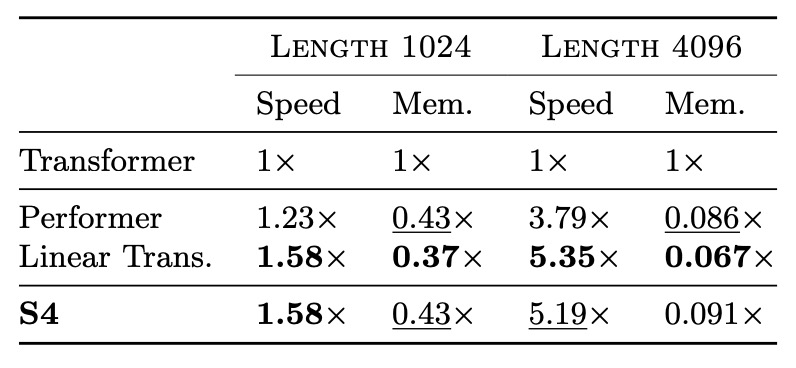
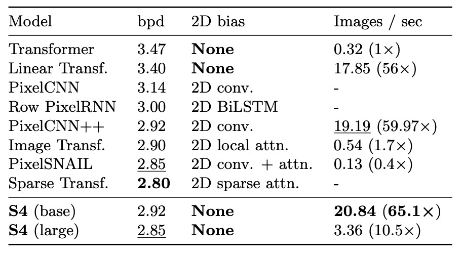
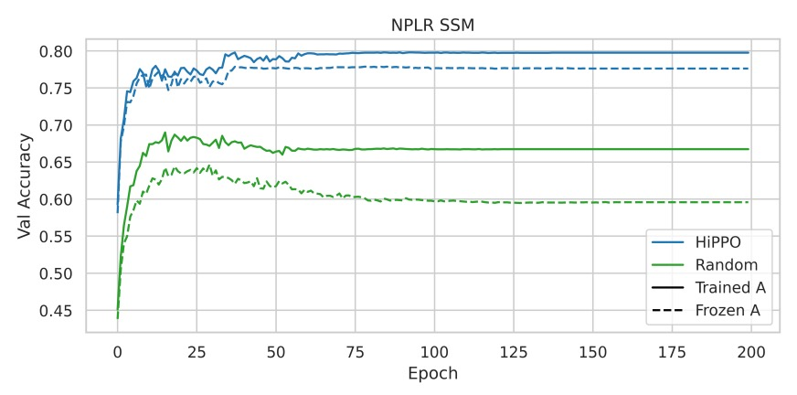
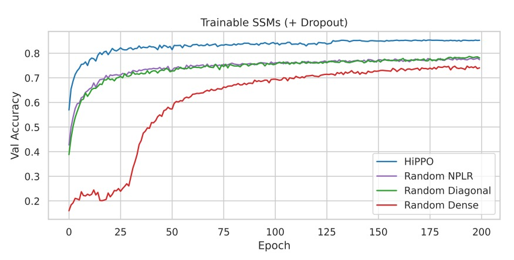

## 曼巴的序曲

[**Efficiently Modeling Long Sequences with Structured State Spaces**](https://arxiv.org/abs/2111.00396)

---

我們想要看個 Mamba，但發現有許多前置任務需要完成，需要補足一些基礎知識。

因此，我們先從 S4 開始。

這篇論文主要為了改進現有的狀態空間模型（State Space Model, SSM）的問題。

說到 SSM，這表示我們又得繼續往前補充 SSM 的相關知識。

:::tip
怎麼看個論文像是在玩解謎遊戲？
:::

## 狀態空間模型

:::info
作者也知道讀者們不熟，因此在論文中提供了一些基礎知識，我們一起來看看。
:::

狀態空間模型（State Space Model，簡稱 SSM）是一種數學工具，用於描述動態系統的行為。它廣泛應用於控制工程、信號處理、經濟學和近年來的深度學習領域。

SSM 的核心思想是通過內部的「狀態」來描述系統的動態行為。它將外部輸入信號映射到系統的內部狀態，進而生成輸出信號。這種框架能夠捕捉系統隨時間的演化，特別適合處理時間序列數據和動態過程。

SSM 通過兩個核心方程描述系統的行為：

1. **狀態方程（State Equation）**：描述系統狀態隨時間的變化。

   $$
   \dot{x}(t) = A x(t) + B u(t)
   $$

   - **狀態轉移矩陣 $A$**：決定了系統的內在動態，如自然衰減或振盪。
   - **輸入矩陣 $B$**：決定了輸入如何影響系統狀態。

2. **輸出方程（Output Equation）**：描述如何從狀態獲得輸出。
   $$
   y(t) = C x(t) + D u(t)
   $$
   - **輸出矩陣 $C$**：決定了哪些狀態對輸出有影響。
   - **直接傳輸矩陣 $D$**：描述輸入對輸出的直接影響（若存在）。

因此，在給定初始狀態 $x(0)$ 和輸入 $u(t)$ 的情況下，可以解出 $x(t)$ 和 $y(t)$，從而描述系統隨時間的演化。

:::tip
看到這裡，我們覺得這跟 RNN 很像，都是處理時序列，而且都有個隱藏狀態。
:::

### HiPPO 理論

在過去的研究中，基礎的 SSM 在實際應用中表現不佳，原因線性一階常微分方程的解呈現指數形式，導致隨著序列長度增加，梯度可能指數性地衰減或增大，影響模型的學習能力。這使得 SSM 難以處理涉及長期記憶的序列任務。

:::tip
也就是梯度消失或梯度爆炸問題。
:::

為了解決問題，LSSL 模型（Linear State Space Layer）引入了 **HiPPO 理論**（High-order Polynomial Projection Operators），該理論專注於連續時間記憶的數學框架。

HiPPO 提出了一類特殊的矩陣 $A \in \mathbb{R}^{N \times N}$，當這些矩陣用於 SSM 的狀態轉移方程時，可以使狀態 $x(t)$ 高效地記憶輸入歷史 $u(t)$ 的信息。

HiPPO 矩陣的數學定義如下：

$$
A_{nk} =
\begin{cases}
-\sqrt{\frac{2n+1}{2k+1}} & \text{if } n > k \\
-(n+1) & \text{if } n = k \\
0 & \text{if } n < k
\end{cases}
$$

- **$n > k$**：定義了不同階數之間的互動。
- **$n = k$**：表示自反性（自身對自己的影響）。
- **$n < k$**：則狀態之間無影響。

這種矩陣結構能捕捉輸入歷史在時間上的重要性，並動態地調整記憶的優先級。在 Sequential MNIST 任務中，使用 HiPPO 替換後的模型的準確率從 **60% 提升至 98%**。這表明 HiPPO 理論能有效地解決長期依賴問題，並提升 SSM 在處理序列數據時的表現。

:::tip
**HiPPO 的直觀理解**

HiPPO 矩陣可以被視為一種將歷史訊號壓縮到固定維度的方式，並且在每個時間步上不斷更新這些壓縮信息。例如：

- 高階訊號會受到更多關注（例如，近期的輸入比過去更重要）。
- 低階訊號會逐漸被淡化，但仍保留有意義的記憶，實現了有效的歷史表示。

**那跟 RNN 有什麼區別？聽起來很像是 RNN 的隱藏層？**

HiPPO 矩陣基於「連續時間的數學框架」來壓縮和更新輸入的歷史訊號。強調對輸入訊號的動態投影和多階結構化記憶，使用正交基來有效表示過去訊號。而 RNN 隱藏狀態基於「離散的非線性更新規則」，通常由神經網路自己完成，使用激活函數（如 $\text{tanh}$ 或 $\text{ReLU}$）來更新隱藏狀態，通過非線性轉換對當前輸入進行編碼。

因此 HiPPO 矩陣「自然地」支持「長期記憶」，尤其是透過正交多項式和特定矩陣設計來保留歷史信息。而 RNN 隱藏狀態則嚴重依賴梯度流，容易受到梯度消失或爆炸的影響，限制了其處理長期依賴的能力。

LSTM 和 GRU 是為了解決此問題而設計的變體，通過門控機制保留長期記憶，但這種方法依然需要手工設計的非線性更新規則，效率仍低於 HiPPO 的數學結構化方式。
:::

### 離散化

SSM 在處理離散輸入序列 $(u_0, u_1, \dots)$ 時，需要將連續時間表示的公式離散化，因為輸入 $u_k$ 通常是來自連續信號 $u(t)$ 的離散采樣：

$$
u_k = u(k\Delta),
$$

其中 $\Delta$ 表示時間步長，連續輸入與離散輸入的關係為 $u_k = u(k\Delta)$，這表示第 $k$ 個樣本是連續訊號在時間 $k\Delta$ 的值。

為了實現這一轉換，常用的方法是**雙線性法（bilinear method）**，它將連續狀態矩陣 $A$ 轉換為離散版本 $\bar{A}$。

離散化後的狀態空間模型表示為：

$$
\begin{aligned}
x_k &= \bar{A} x_{k-1} + \bar{B} u_k, \\
y_k &= \bar{C} x_k,
\end{aligned}
$$

其中：

$$
\begin{aligned}
\bar{A} &= (I - \frac{\Delta}{2} A)^{-1} (I + \frac{\Delta}{2} A) \\
\bar{B} &= (I - \frac{\Delta}{2} A)^{-1} \Delta B \\
\bar{C} &= C
\end{aligned}
$$

- **$\bar{A}$** 是離散狀態矩陣，用於描述隱藏狀態的演變。
- **$\bar{B}$** 是離散輸入矩陣，描述輸入如何影響狀態。
- **$\bar{C}$** 是輸出矩陣，與連續情況相同。

離散化後的公式轉化為序列到序列的映射，將每個時間步的隱藏狀態 $x_k$ 與前一步的狀態 $x_{k-1}$ 相連，類似於遞迴神經網路（RNN）的結構。

$x_k \in \mathbb{R}^N$ 可以看作是 RNN 的隱藏狀態，$\bar{A}$ 為遞迴層的權重矩陣。

:::tip
**這些公式在做什麼？**

這些公式的目的是將一個連續時間的系統轉換成離散時間的版本，裡面的元素代表：

- **$A$**：這個矩陣描述了系統內部狀態如何隨時間變化，就像系統的「自然演變規則」或「內在特性」。你可以理解成沒有外在影響時，系統自己會怎麼改變的規律。
- **$B$**：這個矩陣說明了「外部輸入」如何影響系統的狀態，類似於系統接收外部資訊的「通道」或「方式」。它告訴我們，當有輸入訊號時，系統的狀態會發生怎樣的改變。
- **$C$**：這個矩陣將系統的「內部狀態」轉換為「可觀察的輸出」。可以把它看作系統的「顯示器」，透過它，我們能夠看到或測量系統狀態所產生的輸出結果。
- **$\Delta$**：這是時間間隔，表示我們每隔多長時間對系統進行一次觀察或更新，例如每秒鐘一次。
- **$I$**：這是單位矩陣，相當於在矩陣運算中「不改變」任何東西，主要用於數學計算的便利。

基於上述元素，我們可以拆解公式：

- **$\bar{A}$ 的公式**

  $$
  \bar{A} = \left( I - \frac{\Delta}{2} A \right)^{-1} \left( I + \frac{\Delta}{2} A \right)
  $$

  這個公式的目的是將連續時間的狀態變化規則 $A$ 轉換為離散時間的版本 $\bar{A}$，我們可以這樣理解：

  - **$\left( I + \frac{\Delta}{2} A \right)$**：這部分表示我們根據目前狀態，向前預估了一小步，預測系統會如何改變。

  - **$\left( I - \frac{\Delta}{2} A \right)^{-1}$**：這部分對前面的預估進行修正，校正預測中的誤差，確保結果更準確。

  總之就是 $\bar{A}$ 告訴我們系統狀態如何從前一時刻轉移到下一時刻。

- **$\bar{B}$ 的公式**

  $$
  \bar{B} = \left( I - \frac{\Delta}{2} A \right)^{-1} \Delta B
  $$

  這個公式的目的是將輸入矩陣 $B$ 轉換為離散時間下的版本 $\bar{B}$，以描述輸入如何在每個時間步上對系統狀態產生影響。

  首先，$\Delta B$ 表示在時間間隔 $\Delta$ 內，輸入對系統的直接影響。

  然後，使用 $\left( I - \frac{\Delta}{2} A \right)^{-1}$ 對這個影響進行調整，考慮到系統本身的動態特性，使得輸入的影響在離散時間下更加準確。

- **$\bar{C} = C$**

  輸出矩陣 $C$ 保持不變，因為系統輸出的測量方式在離散化過程中不需要調整。

---

所以我們現學現賣，實際應用一下。

假設你正在開車，汽車的狀態（如速度和位置）會隨時間而改變。

連續時間的公式 $A, B, C$ 描述了汽車在每一刻的動態變化，但我們只能每隔一段時間（$\Delta$）進行觀察和控制。

1. **$\bar{A}$**：描述在離散的時間步長下，汽車的內在變化（如慣性和自然減速）如何從上一時刻的狀態演變到下一時刻。
2. **$\bar{B}$**：描述駕駛者的操作（如踩油門或煞車，作為輸入）如何在每個時間步對汽車的狀態產生影響。
3. **$\bar{C}$**：描述我們透過速度計或里程表等儀表讀取到的汽車速度或位置，這部分在離散化過程中保持不變。

:::

### 卷積表示法

儘管上面的遞迴公式能捕捉序列關係，但每一步的計算需要依賴前一步的結果，導致難以在 GPU 上高效訓練。

所以我們必須將遞迴公式轉換為卷積形式，假設初始狀態 $x_{-1} = 0$，遞迴公式逐步展開：

$$
\begin{aligned}
x_0 &= \bar{B} u_0, \\
x_1 &= \bar{A} \bar{B} u_0 + \bar{B} u_1, \\
x_2 &= \bar{A}^2 \bar{B} u_0 + \bar{A} \bar{B} u_1 + \bar{B} u_2, \\
&\dots
\end{aligned}
$$

輸出 $y_k$ 為：

$$
y_k = \bar{C} x_k,
$$

即：

$$
y_k = \bar{C} \bar{A}^k \bar{B} u_0 + \bar{C} \bar{A}^{k-1} \bar{B} u_1 + \cdots + \bar{C} \bar{B} u_k.
$$

展開後，我們發現這個部分可以被表示為卷積形式：

$$
y = K * u,
$$

其中：

$$
K = (\bar{C} \bar{B}, \bar{C} \bar{A} \bar{B}, \dots, \bar{C} \bar{A}^{L-1} \bar{B}),
$$

$K$ 就是我們熟悉的卷積核，其描述了系統的輸出如何由輸入通過狀態矩陣傳遞來生成。

## 定義問題

:::tip
我們終於可以回到論文本身了，真不容易。
:::

作者在一開始就明確指出，這篇論文的核心目標是解決序列模型在處理「長距離依賴(Long-Range Dependencies, LRDs)」問題時的效能瓶頸，特別是現有模型在長序列處理上的計算與記憶需求過高的挑戰。

目前大多數的序列模型只能有效處理「幾千個時間步長」，但現實世界的時間序列數據往往需要對「數萬個時間步長」進行推理。例如，Path-X 任務中的序列長度為 16384，現有模型在這樣的長距場景（LRA）基準測試上表現非常差，甚至只能達到隨機猜測的水平。

雖然傳統的模型，像是 CTMs、RNNs、CNNs 和 Transformers，都提出了專門設計的變體以應對 LRD，例如正交 RNNs、擴張卷積、以及高效 Transformers 等，但這些方法仍在困難的基準測試（如 LRA 和原始音頻分類）上表現不佳。

除了學術界主流的技術之外，SSM 雖然有理論上的潛力，但長期以來難以應用於深度學習，原因包括：

- 深層 SSM 雖然理論上能處理 LRD，但在實際任務中表現有限。
- 線性狀態空間層（LSSL）雖然能統一 CTM、RNN 和 CNN 的優勢，並展示了解決 LRD 的潛力，但由於其計算和記憶需求過高，而且實際應用中表現出數值不穩定性，尤其是矩陣 $A$ 的高度非正規性，使得傳統算法難以穩定應用。

為了解決上述挑戰，作者提出了一種「結構化狀態空間模型」，稱為 S4。

目標是通過對狀態矩陣 $A$ 的重新參數化與頻率域的生成函數計算，顯著降低計算複雜度與記憶需求，同時在數值上保持穩定性。

## 解決問題

在離散時間狀態空間模型（SSM）中，若直接進行計算涉及矩陣 $A$ 的多次相乘，這是計算的主要瓶頸：

- **時間複雜度**：對於序列長度 $L$，計算公式需要 $O(N^2L)$ 次操作。
- **空間複雜度**：存儲隱藏狀態需要 $O(NL)$ 空間。

在這裡，作者透過對角化將矩陣 $A$ 轉化為更結構化的形式，簡化計算。

:::tip
**對角化**（Diagonalization）是一種將矩陣轉換為簡單形式的數學操作。

它的目的是將一個矩陣 $A$ 表示為以下形式：

$$
A = V \Lambda V^{-1}
$$

其中：

- **$\Lambda$** 是一個對角矩陣，其非零元素位於對角線上，其餘元素為 0。
- **$V$** 是由 $A$ 的特徵向量構成的矩陣。
- **$V^{-1}$** 是 $V$ 的逆矩陣。

對角化的好處在於，對角矩陣的計算（例如乘法、求冪）非常高效，可以簡化許多複雜運算。

假設我們需要計算矩陣 $A$ 的高次冪 $A^{10}$。

- 如果直接計算：需要進行 9 次矩陣乘法。
- 如果 $A$ 已對角化：
  $$
  A^{10} = (V \Lambda V^{-1})^{10} = V \Lambda^{10} V^{-1}.
  $$
  - 由於 $\Lambda$ 是對角矩陣，計算 $\Lambda^{10}$ 僅需對角線元素各自做 10 次冪運算。
  - 最後只需做兩次矩陣乘法（與 $V$ 和 $V^{-1}$）。

對角化可以極大地降低矩陣高次運算的計算成本，尤其在大型矩陣或頻繁運算的情境中，對角化是數值優化的重要工具。
:::

給定狀態空間模型 $(A, B, C)$，共軛變換為 $(V^{-1}AV, V^{-1}B, CV)$。

透過共軛變換，作者將矩陣 $A$ 轉化為對角矩陣，進而簡化了矩陣運算。這樣一來，計算公式中的矩陣 $K$ 可以化為 Vandermonde 矩陣，計算量僅需 $O((N + L) \log^2(N + L))$。

但對於 HiPPO 矩陣，直接對角化存在數值不穩定問題，因為對角化矩陣 $V$ 的元素大小呈指數增長，導致數值計算不可行。

### S4 參數化：正規加低秩

原文為 **Normal Plus Low-Rank**，簡稱 NPLR。

在先前的討論中，作者得出結論：應該僅使用條件良好的矩陣 $V$ 進行共軛變換。理想情況下，矩陣 $A$ 可被單位矩陣（即條件數為 1 的矩陣）對角化。

根據線性代數的譜定理，滿足此條件的矩陣為正規矩陣，即滿足 $AA^* = A^*A$ 的矩陣。 然而，這一類矩陣的範圍有限，特別是 HiPPO 矩陣不屬於此範疇。

儘管 HiPPO 矩陣不是正規矩陣，但可以分解為「正規矩陣」與「低秩矩陣」的和。 直接利用這種分解進行計算並不高效，因為對此分解求矩陣冪次仍然速度較慢且難以優化。

為克服上述問題，作者同時應用了以下三種技術：

- **技術一：透過生成函數求譜**
  - 不直接計算 $K$，而是利用其截斷生成函數 $\sum_{j=0}^{L-1} K_j \zeta^j$，在單位根 $\zeta$ 上進行計算後，透過逆快速傅里葉變換 (Inverse FFT) 得到 $K$。
- **技術二：利用矩陣 resolvent 和 Woodbury 等式**
  - 將生成函數中的矩陣運算轉化為矩陣的逆運算，而非高次冪。
  - 使用 Woodbury 等式將 $(A + P Q^*)^{-1}$ 表達為 $A^{-1}$ 的形式，有效簡化至對角矩陣的計算。
- **技術三：等價於 Cauchy 核的計算**
  - 對角矩陣情況可轉化為計算 Cauchy 核 $\frac{1}{\omega_j - \zeta_k}$，這是一個穩定且接近線性時間的問題，已有有效演算法。
    - [**[13.03] Transformations of Matrix Structures Work Again**](https://arxiv.org/abs/1303.0353)
    - [**[15.06] Fast Approximate Computations with Cauchy Matrices and Polynomials**](https://arxiv.org/abs/1506.02285)

上述技術適用於所有可以分解為正規加低秩 (NPLR) 的矩陣。

到這裡，作者提出了本篇論文的第一個定理：

- **定理 1：HiPPO 矩陣的 NPLR 表示**

  所有 HiPPO 矩陣（如 HiPPO-LegS, LegT, LagT）均具有以下形式的 NPLR 表示：

  $$
  A = V \Lambda V^* - P Q^\top = V (\Lambda - (V^*P) (V^*Q)^*) V^*
  $$

  其中，$V \in \mathbb{C}^{N \times N}$ 是單位矩陣，$\Lambda$ 是對角矩陣，$P, Q \in \mathbb{R}^{N \times r}$ 是低秩矩陣的分解。

### S4 計算複雜度

NPLR 矩陣可以轉化為對角加低秩矩陣形式（DPLR），但需注意其元素由 $\mathbb{R}$ 擴展到 $\mathbb{C}$。

當矩陣 $A$ 表示為 DPLR 形式時，S4 在遞迴與卷積運算上皆達到最佳或近最佳的計算效率。

- **S4 遞迴計算的定理與效率**

  - **定理 2：S4 遞迴公式的運算效率**

    經過證明，給定任意步長 $\Delta$，遞迴公式 (3) 中每一步的計算可在 $O(N)$ 的運算量內完成，其中 $N$ 為狀態維度大小。

- **S4 卷積計算的定理與效率**

  - **定理 3：S4 卷積濾波器的運算效率**

    經過證明，給定任意步長 $\Delta$，SSM 的卷積濾波器 $K$ 的計算可歸約為 4 次 Cauchy 矩陣乘法，僅需 $\tilde{O}(N + L)$ 的運算量與 $O(N + L)$ 的空間。

:::tip
證明的部分請讀者自行翻閱論文，內容實在太多了。
:::

定理 3 是本研究的核心技術貢獻，其演算法體現了 NPLR S4 參數化的設計動機，完整算法流程如下：

<figure style={{"width": "80%"}}>

</figure>

S4 在遞迴運算上達到線性複雜度 $O(N)$，在卷積運算上達到 $\tilde{O}(N + L)$，兼具高效與穩定性，為 SSM 計算奠定了理論與實用基礎。

### S4 層的架構細節

在初始化時，S4 層的狀態空間模型 (SSM) 的矩陣 $A$ 被設置為 HiPPO 矩陣，並根據「定理 1」，該 SSM 與 $(\Lambda - P Q^*, B, C)$ 單位等價。這些參數組成了 S4 層的 $5N$ 個可訓練參數。

深度 SSM 由 $H$ 個獨立的 SSM 複本組成，每個複本都有相同的參數，但透過位置線性層對特徵進行混合。這樣的設計使得 S4 層能夠處理多維特徵，並在每個位置上進行獨立的狀態轉換。透過多層結構，S4 層形成了一個深度非線性網路。

整體架構提供的輸出形狀與其他序列模型（如 Transformers、RNNs、CNNs）一致，為 $(\text{batch size}, \text{sequence length}, \text{hidden dimension})$。

對比其他模型，S4 和卷積神經網路 (CNN) 有著相似的特點，本身是線性變換，但透過多層結構中的非線性轉換，整體深度 SSM 變為非線性。此外，S4 層中跨 $H$ 特徵的廣播處理方式與深度可分離卷積 (Depthwise-Separable Convolution) 相似，但 S4 的卷積核是全局性的。

下表提供了 S4 層與其他序列模型的計算複雜度比較：

<figure style={{"width": "80%"}}>

</figure>

## 討論

### 效率基準測試

<figure style={{"width": "60%"}}>

</figure>

作者為了評估 S4 的訓練速度和資源效率，進行了效率基準測試，首先是與 LSSL 進行比較。

實驗結果如上表，證實了 S4 在實際層大小下，相較於 LSSL，速度和記憶體效率高出數個數量級。

接著，作者將 S4 與 Linear Transformer 和 Performer 等高效 Transformer 模型進行比較，結果如下表所示，在參數量匹配的情況下，S4 的速度和記憶體使用與最優秀的 Transformer 變體相當。

<figure style={{"width": "60%"}}>

</figure>

### 長距離推理之穩定性

<figure style={{"width": "80%"}}>

</figure>

作者進一步探討了 S4 在長距離推理上的穩定性，對比了 S4 和其他模型在 LRA 和原始語音分類等挑戰性任務上的表現。

S4 在 LRA 上的表現遠超過所有基準模型，平均表現為 80.48%，而所有基準模型的平均表現均低於 60%。S4 成功完成 Path-X 任務，展示了其處理長距依賴的能力。

S4 在 SC10 數據集上達到 98.3% 的分類準確率，高於所有基線模型。這驗證了強大的 LRD 模型可以直接從原始數據中提取更多信息，超越手工設計的預處理方法。

### 可視化分析

<figure style={{"width": "85%"}}>

</figure>

作者透過可視化 S4 的學習表示，進一步分析其性能。

上圖展示了經訓練的 S4 模型在 LRA Path-X 任務中的表現。將 SSM 的卷積核 $K \in \mathbb{R}^{16384}$ 重塑為 $128 \times 128$ 的圖像進行可視化。

左側的圖是 Path-X 任務的一個範例，該任務要求模型判斷兩個標記點是否通過一條路徑相連。

頂部(第一層卷積核)來自 S4 模型第一層的卷積核，顯示學習到的局部上下文特徵，這些卷積核專注於圖像中少量行的局部模式，忽略大部分全局信息。

底部 (最後一層卷積核)來自 S4 模型最後一層的卷積核，顯示全局結構化特徵，這些卷積核跨越整個上下文（16384 像素），學習全局資訊並捕捉不同的空間頻率模式。

結果顯示，S4 的卷積核能夠捕捉序列數據的 2D 結構特性，展示了對長距依賴的深入理解。

### 可以作為通用模型嗎？

作者為了探討 S4 是否可以作為通用序列模型，進行了一系列實驗。

**圖像生成：CIFAR 密度估計**

<figure style={{"width": "70%"}}>

</figure>

CIFAR 密度估計是一個流行的自回歸圖像建模基準。將圖像展平為包含 3072 個 RGB 子像素的序列，逐個子像素進行預測。

結果顯示，儘管不具有 2D 結構性偏置，S4 在此任務上能與專門設計的模型競爭。

---

**文本生成：WikiText-103**

<figure style={{"width": "70%"}}>

</figure>

WikiText-103 是語言建模的經典基準，要求模型基於上下文順序預測序列中的詞元。

結果顯示，S4 通過替換 Transformer 中的自注意力層，大幅縮小與 Transformer 的性能差距（僅差 0.8 ppl），並在無注意力模型中創造新的 SOTA（比其他模型優 2 ppl 以上）。

---

**時間序列預測：氣象數據**

將 S4 應用於時間序列預測問題，與專為該任務設計的 Informer 進行比較。

結果顯示，S4 在 5 項預測任務的 40/50 個設置中優於基線，尤其在長序列預測上性能顯著，如預測 30 天的氣象數據時均方誤差降低 37%。

---

從多項實驗中，S4 展現出作為通用序列模型的潛力，能有效處理 LRD 問題並在多種領域和任務中表現出色。其高效生成能力、自適應不同解析度的靈活性，以及在弱結構性偏置下的強大性能，使其成為序列建模研究中的重要候選模型。

### HiPPO 的重要性

S4 的關鍵設計之一是使用 HiPPO 矩陣初始化 SSM。

最後作者透過消融實驗驗證各組件的重要性，嘗試解答以下問題：

1. HiPPO 初始化的重要性如何？
2. 在 HiPPO 基礎上訓練 SSM 是否必要？
3. S4 的效益是否僅來自 NPLR 參數化，而與 HiPPO 無關？

所有實驗基於 Sequential CIFAR-10 任務進行，該任務的結果易於推廣至其他設置。模型限制在最多 100K 可訓練參數，使用簡單的階梯學習率調度器，且不採用正則化。

---

**實驗 1：無約束的 SSM 初始化**

- **對比初始化方法**

  - **隨機 Gaussian 初始化**：以隨機高斯分佈初始化矩陣 $A$。
  - **HiPPO 初始化**：使用 HiPPO 矩陣初始化。
  - **隨機對角矩陣**：將 $A$ 設為隨機對角矩陣，但未使用 S4 的 NPLR 參數化。
  - 對上述初始化方法，分別比較凍結與訓練 $A$ 矩陣的效果。

  實驗結果顯示訓練 SSM 對所有初始化方法均有提升，尤其是隨機初始化模型的性能提升最為顯著。

  不同初始化方法在驗證集上的表現差異明顯。即使所有模型在訓練集上都能達到完美準確率，但驗證集準確率相差超過 **15%**，其中 HiPPO 初始化泛化性能最佳。

---

**實驗 2：NPLR 參數化與 HiPPO 的結合**

<figure style={{"width": "80%"}}>

</figure>

檢驗 HiPPO 初始化是否為 S4 成效的主要來源，而非僅僅來自 NPLR 參數化。

實驗結果如上圖所示，單獨使用 NPLR 參數化但不結合 HiPPO 的 SSM 表現較差，進一步證實了 HiPPO 初始化的重要性。

---

#### **實驗 3：正則化與完整 S4 方法的性能**

<figure style={{"width": "80%"}}>

</figure>

在主消融實驗中加入輕量正則化（Dropout = 0.1），比較 HiPPO 初始化的 S4 與其他初始化方法的性能。

實驗結果顯示即使加入 Dropout，HiPPO 初始化的性能優勢依舊明顯，完整的 S4 方法（HiPPO + NPLR）在測試集上達到 **84.27% 的準確率**，僅使用 100K 可訓練參數。

## 結論

作者在這篇論文中提出了「S4」序列模型，透過對狀態空間模型 (SSM) 的參數化創新，結合連續時間、遞迴和卷積視角，有效且有理地處理長距依賴 (LRD) 問題。

在一系列基準測試中，S4 在多種數據模態和模型能力評估上均表現出色，顯示其作為通用序列建模解決方案的潛力，具有廣泛的應用價值和研究意義。

:::tip
這篇論文對我們來說較為艱澀，我們努力讀完之後仍然不能理解得十分透徹。

對於 S4 的具體實現和技術細節，未來我們需要更深入的研究和實踐。
:::
