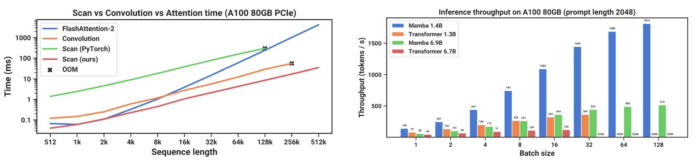

## 誰是繼承人

[**Mamba: Linear-Time Sequence Modeling with Selective State Spaces**](https://arxiv.org/abs/2312.00752)

---

為了讀這篇論文，我們可是費了不少功夫。

首先得先去複習一下作者過去的代表作：

- [**[20.08] HiPPO: 河馬的記憶**](../2008-hippo/index.md)
- [**[21.11] S4: 曼巴的序曲**](../2111-s4/index.md)

然後是了解這篇論文的主要比較對象，也就是 Transformer 的優缺點。

到這裡，我們假設你已經熟讀之前的幾篇論文，而且也已經具備了足夠的背景知識。

接著，讓我們翻開這篇論文吧。

## 定義問題

還記得 S4 做了些什麼事情嗎？

S4 延續了之前 SSM 的研究，通過對狀態矩陣 $A$ 的重新參數化與頻率域的生成函數計算，顯著降低計算複雜度與記憶需求，同時在數值上保持穩定性。

但是，S4 仍然是一個線性時不變系統（linear time invariant, LTI），也就是說，模型動態在整個序列裡都不變（同一組 $A, B, C$ 參數用在所有時間步）。

舉例來說，如果考慮下面這個 Copying 問題，input 一串序列，output 要求複製這串序列「某段資訊」：


如左圖，如果輸入和輸出之間有固定的時間間隔，這樣的問題對於 LTI 模型非常簡單，因為只要學到固定的位移或卷積核就行。

但如果是右圖這種，輸入和輸出之間有隨機的時間間隔，並且需要「內容感知 (content-aware)」的能力，模型必須分辨哪些 token 真正需要被複製、哪些是無關或噪音，這時就需要模型具有「選擇性」的能力。

這個能力在 LLMs 中非常常見，因為 Transformer 的架構採用了自注意力機制，可以依據上下文內容判斷後面產生什麼輸出。但是 LTI 模型缺乏能「動態改變參數」的能力，因此難以應付這樣的問題。

所以作者認為必須想個辦法，讓 SSM 的幾個關鍵參數 (像 $\Delta$、$B$、$C$) 變成「輸入相依」，也就是說，這些參數會隨著時間步而改變，不再是固定一組值。

## 解決問題

### 可選擇機制


首先，先來看一下作者如何將 SSM 的核心演算法改進，讓模型能夠具備「選擇性」。

先看 **Algorithm 1 (S4)**：

```txt
Algorithm 1 SSM (S4)
Input: x : (B, L, D)
Output: y : (B, L, D)
    1: A : (D, N) ← Parameter       ⊲ Represents structured N×N matrix
    2: B : (D, N) ← Parameter
    3: C : (D, N) ← Parameter
    4: Δ : (D) ← τΔ(Parameter)
    5: A, B : (D, N) ← discretize(Δ, A, B)
    6: y ← SSM(A, B, C) (x)         ⊲ Time-invariant: recurrence or convolution
    7: return y
```

- **(步驟 1–3) 參數初始化**

  模型擁有三個核心參數：$A, B, C$。

  其中 $A$ 可被視為一個結構化的 $N \times N$ 矩陣，但實際實作中為了節省參數量，往往會將它對角化或使用其他特殊結構，並以 $(D, N)$ 的方式儲存。

- **(步驟 4) $\Delta$ 的設定**

  $\Delta$ 是一個維度為 $(D)$ 的向量，經過 $\tau_\Delta$（例如 $\mathrm{softplus}$）等單調函數處理後，用於離散化轉換。

- **(步驟 5) 離散化 (discretize)**

  函式 `discretize(Δ, A, B)` 根據 $\Delta$ 來對連續系統參數 $A, B$ 做指數矩陣運算等離散化步驟，得到離散時間下的 $\bar{A}, \bar{B}$。

  由於此時 $\Delta$ 與 $A, B$ 都是時間不變，離散後的 $\bar{A}, \bar{B}$ 亦可保持固定。

- **(步驟 6) SSM 計算**

  因為 (A, B, C) 不會隨著序列位置變化，所以可以用**固定卷積**(global convolution) 或**線性遞迴**(linear recurrence) 計算：

  - 透過卷積模式，就能一次性、並行地處理整段序列，在訓練時非常高效。
  - 在需要自迴歸推理 (autoregressive inference) 時，也可切換回遞迴模式逐步進行。

從上面可以看出來 S4 保留了「線性時間不變 (LTI)」的性質，使得大多數 SSM 都能使用卷積核加速，避免顯式展開整個隱狀態張量，因此在實務中展現極高的效率。

---

接著來看 **Algorithm 2 (S6)** 。

這裡引入「選擇性」概念，讓 $B, C, \Delta$ 都能根據輸入 $x$ 而變動；也因此，它再也不能套用全局卷積或固定遞迴，而要用「掃描」方式進行更新。

```txt
Algorithm 2 SSM + Selection (S6)
Input: x : (B, L, D)
Output: y : (B, L, D)
    1: A : (D, N) ← Parameter         ⊲ Represents structured N×N matrix
    2: B : (B, L, N) ← sB(x)
    3: C : (B, L, N) ← sC(x)
    4: Δ : (B, L, D) ← τΔ(Parameter + sΔ(x))
    5: A, B : (B, L, D, N) ← discretize(Δ, A, B)
    6: y ← SSM(A, B, C) (x)           ⊲ Time-varying: recurrence (scan) only
    7: return y
```

- **(步驟 1) $A$ 的結構**

  與 S4 相同，仍需要一個結構化的 $N \times N$ 矩陣，但其它部分 ($B, C, \Delta$) 將隨時間步或序列位置改變。

- **(步驟 2–3) 輸入相依的 $B, C$**

  在這裡，$B$ 與 $C$ 不再是固定的 $(D, N)$ 形狀，而是對應到 $(B, L, N)$，表示對每個 batch、每個序列位置，都有一組不同參數值。

  - 這些值由函式 $s_B(x)$ 與 $s_C(x)$ 根據輸入特徵動態生成，實作上通常是一個小型線性投影或 MLP。

- **(步驟 4) 輸入相依的 $\Delta$**

  同理，$\Delta$ 也提升到 $(B, L, D)$ 的形狀，先加上內部參數 (Parameter)，再透過 $s_\Delta(x)$ 計算後，再經過 $\tau_\Delta$（如 softplus），得到最終可學習的「時間變化步長」。

- **(步驟 5) 離散化 (discretize)**

  因為每個時間步的 $\Delta$ 都不一樣，所以在離散化過程中也就必須對每個位置分別計算 $\bar{A}_{t}, \bar{B}_{t}$。

  這時 $\bar{A}, \bar{B}$ 會有 $(B, L, D, N)$ 的維度。

- **(步驟 6) 遞迴掃描**

  由於參數是「時間可變」，不再能用一個固定的卷積核替整個序列做運算，只能用「掃描 (scan)」的方式逐步或並行地更新狀態。

### S6 架構

在深度學習中，常見的高效基礎運算包括「**卷積 (convolution)**」與「**注意力 (attention)**」。它們透過 GPU 上成熟的實作庫與平行化策略，能充分發揮硬體計算潛能。

現在作者想要把注意力機制換成「**選擇性 SSM**」，這顯然無法享受到硬體加速的好處，因為 SSM 既不是卷積也不是注意力，而是一種「遞迴」模型。

所以，如果想推廣 SSM，就必須要有一個硬體導向的演算法，讓 SSM 在 GPU 上也能有不錯的效能表現。

為了達到這個目標，作者提出了「選擇性掃描（selective scan）」的硬體導向演算法，核心概念是透過在 GPU 的記憶體階層中巧妙地只展開必要的中間狀態，然後利用平行掃描（parallel scan）與重算（recomputation）技術來減少顯示記憶體（HBM）的讀寫次數。

:::tip
**Selective Scan Structured State Space Sequence Modeling，所以稱為 S6。**
:::

:::info
先了解一下什麼是 GPU SRAM 與 HBM：

1. **SRAM（靜態隨機存取記憶體）**

   SRAM 是速度極快的記憶體，使用於 GPU 內部的快取記憶體（如 L1 和 L2 Cache）。其特性是資料存取延遲低，非常適合頻繁使用的小數據塊。而限制在於它的容量較小，無法應對大型數據集。

2. **HBM（高頻寬記憶體）**

   HBM 是專為高效能計算設計的外部記憶體，具有極高的數據傳輸頻寬。常用於處理需要大量數據的應用，例如深度學習、科學模擬與影像處理。

SRAM 是 GPU 的「快取」，用於加速小型數據塊的頻繁操作；而 HBM 則是 GPU 的「倉庫」，負責處理數據的傳輸與存儲需求。因此，如果我們想要加速運算，就要盡量減少對 HBM 的讀寫，而是優先使用 SRAM 進行計算。
:::

理解了 GPU 架構後，我們再回來看整體架構圖：


在上圖中，作者舉例了一個 5 通道的 SSM 模型，每個通道都有一個 4 維的隱狀態。如果直接展開，這個模型的狀態空間就會是 $(D \times N)$ 維，再乘上 batch size $B$ 與序列長度 $L$，將非常龐大。所以在交換中間狀態的這個步驟，換成選擇性掃描算法，只在必要時才展開。

如上圖所示，首先把參數 ($\Delta, A, B, C$) 從 HBM 載入至更快的 SRAM 。接著在 SRAM 做「離散化 (discretization)」和「遞迴更新 (scan)」。

最終只把結果 $(B, L, D)$ 寫回 HBM。然後把多個原本分開的計算 kernel 合併成一個或少數個 kernel 執行，減少反覆讀寫 HBM 的耗損。

模型在計算反向傳播時，會需要存取前向中的中間狀態。但若每個時間步都存，會消耗大量 GPU RAM。在這裡作者的解決方法是「不要存」！

等到了 backward 的時候，再次從 HBM 載入原本的輸入與參數，重新做一遍前向計算來取得中間狀態。這種「重算 (recomputation)」技術雖增加計算量，但大幅降低記憶體需求，整體看來反而更高效。

如此一來，選擇性 SSM 就能既保有輸入相依的靈活性，又能在實際運行中利用 GPU 的硬體特性達到更高的吞吐量與更低的資源占用，真正提高「遞迴」模型在大規模應用的可行性。

:::tip
概念上跟 FlashAttention 有點像，都是為了避免在注意力機制中過多的中間結果存取，而採用重算的方式來節省記憶體。
:::

### Mamba 架構

<div align="center">
<figure style={{"width": "90%"}}>

</figure>
</div>

傳統的 H3 架構是常見的 SSM 變體，會在每個區塊中同時包含類似「線性注意力」的部分與一個 MLP（多層感知器）交錯堆疊；而這裡，作者選擇將這兩者合併成單一個體，然後在網路中多次重複，以得到一種更純粹且易於擴充的設計（類似 GAU 對注意力做的簡化）。

在實作上，他們先給模型的維度 $D$ 加上一個可控制的擴張倍數 $E$，使得每個區塊主要參數都落在線性投影（投影到輸入與輸出，共三倍數量）上，而真正的 SSM（包含 $\Delta, B, C$ 與 $A$ 的部分）僅佔小比例。

作者在實驗中固定 $E = 2$，並使用兩層這樣的區塊，讓整體參數量可對應到與傳統 Transformer 那種「多頭注意力（MHA）＋ MLP」混合類似的規模（約 $12D^2$）。

此外，作者為了讓「Gated MLP」更接近當今流行的 SwiGLU 變體，選擇用 SiLU（Swish）作為激活函數，並在相似於 RetNet（同樣在類似位置放置正規化層）的想法下，加入了一個可選用的層正規化（LayerNorm），最終構成「Mamba」的完整架構。

### 再談選擇機制

作者在方法論的最後，有額外討論了「選擇機制」在 SSM 中的功能與影響：

1. **各個「選擇性」參數的詮釋**

   - **$\Delta$ 的意義**：$\Delta$ 可視為一個延伸的 RNN 門控：當 $\Delta$ 很大時，模型會「重置狀態並專注在當前輸入」；當 $\Delta$ 很小時，則「忽略當前輸入並保留舊有狀態」。因此從連續時間系統的角度看，「$\Delta \to \infty$」對應「系統好像花了更多時間處理當前輸入」，「$\Delta \to 0$」則幾乎略過了這個時間點。

   - **$A$ 與 $\Delta$ 的關係**：雖然 $A$ 也能設定成「隨輸入變化」，但作者指出最主要的選擇性還是由 $\Delta$ 來主導，因為 $A$ 在離散化時會受 $\Delta$ 的影響（$\bar{A} = \exp(\Delta A)$）。只要 $\Delta$ 能選擇性地增大或縮小，就能對整個動態帶來很大影響。

   - **$B$ 與 $C$ 的意義**：先前就提到「選擇機制的關鍵在於能夠把不要的資訊過濾掉」，而 $B$ 負責「輸入如何寫入隱狀態」，$C$ 負責「隱狀態如何映射到輸出」。把 $B$ 和 $C$ 也改成隨輸入而變，就能更細膩地決定是否要讓 $x_t$ 進入模型。

2. **選擇機制的通用性**

   所謂的「選擇機制」可以應用在很多地方，包括傳統 RNN 或 CNN，也可以對應到不同參數（例如 Algorithm 2 裡的 $A$），甚至可藉由多樣的輸入轉換函式 $ s(x) $ 來實現。這意味著「選擇機制」不侷限於特定模型，而是整個序列模型領域裡的一種廣義概念。

3. **與 RNN 門控（gating）機制的關聯**

   作者特別強調，RNN 常見的門控機制（如 LSTM 的輸入門、遺忘門，GRU 的更新門等），其實可以被視為一種「選擇機制」的特例。

   :::tip
   這個部分我們在 S4 的論文中已經有聊過了。
   :::

4. **選擇機制的三大效果**

   作者進一步將「選擇機制」的影響歸納出三種重要的「力」：

   - **(a) Variable Spacing**：因為能動態篩選或忽略某些輸入，模型便能跳過不相關的「填充」或「雜訊」區塊，讓時序上並不一定要遵循等距紀錄。例如在人類語言中，那些「um、啊」等填充詞可以被忽略，模型更專注於真正關鍵的單字。

   - **(b) Filtering Context**：很多序列模型在遇到超長上下文時，效能不升反降，原因在於它們難以忽略無關緊要的歷史資訊；而有選擇機制的模型隨時可以把無用訊息丟掉或重置，使得隨著上下文愈長，效果可以理想地持續提升。

   - **(c) Boundary Resetting**：在實際任務中可能把多個獨立序列拼接起來一併處理，如果模型沒有選擇機制，就會把這些分段上下文「搞混」；有選擇機制的模型可以在邊界處重置狀態（如 $\Delta_t \to \infty$ 或 $g_t \to 1$），避免前後序列互相干擾。

### 訓練方法與協定

作者使用 **Pile dataset** 進行預訓練，這是業界常用於語言模型的大型語料庫，並且使用了與 GPT-3 相似的訓練配方（例如使用對應規模的深度與寬度）。

:::tip
詳細訓練超參數與設定請參閱論文附錄 E.2。
:::

- **模型比較對象**

  1. **Transformer (GPT3 架構)**：這是最傳統、標準的 Transformer-based GPT3 類語言模型，帶有多頭注意力機制。

  2. **Transformer++**：作者特別提到，這是「目前所知最強的 Transformer 配方」，結合了 PaLM、LLaMa 等模型中的最佳實踐，包括：

     - Rotary embedding
     - SwiGLU MLP
     - RMSNorm (取代 LayerNorm)
     - 不使用線性偏置 (no linear bias)
     - 更高的學習率 (high learning rates)

  3. **其他次量級 (subquadratic) 架構**：一些近期被提出的、希望能比注意力 (attention) 更省計算成本或更具伸縮性的模型，如 RWKV、RetNet 等，也一併進入比較。

- **實驗方法與結果**

  - **Chinchilla 協定**：作者遵循「Chinchilla」評估方法，對從 ≈125M 到 ≈1.3B 參數規模的模型進行測試。這個方法通常會考量「模型參數量」與「訓練 token 數量」之間的平衡，觀察「同等花費」下的最優結果。

    :::tip
    如果你對 Chinchilla 不熟悉，可以參考我們之前讀過的文章：

    - [**[22.03] Chinchilla: 栗鼠之眼**](../../transformers/2203-chinchilla/index.md)
      :::

## 討論

### Scaling Laws


根據實驗結果，上圖顯示當序列長度增加時，**Mamba** 在困惑度 (perplexity) 指標上已經能追上使用強化配方的 Transformer++。

作者特別強調，Mamba 是第一個「不使用注意力」卻能與現有最強 Transformer 相抗衡的線性時間架構。RWKV 和 RetNet 雖然同樣是「次量級」架構，但在長序列上的表現並不如 Mamba 穩定。對長序列（例如 8k tokens）時，Mamba 的優勢尤其明顯。

### 和其他語言模型的比較

<div align="center">
<figure style={{"width": "90%"}}>

</figure>
</div>

作者選用了多個常見的零樣本 (zero-shot) 下游任務，包含一些廣為人知的知識推理、常識問答、完形填空等基準，並與 Pythia、RWKV 等模型進行對比。

:::tip

- **Pythia**：著名的開源模型，與 Mamba 使用相同分詞器 (tokenizer) 與資料集 (Pile)，並且也同樣訓練了 300B tokens。
- **RWKV**：一種 RNN 式的語言模型，在概念上也可被視為某種狀態空間模型 (SSM)，不過它的 context length 設為 1024。
  :::

根據實驗結果顯示，在相同參數量下，**Mamba** 幾乎在所有基準上都優於同等規模的競爭對手。而且 Mamba 的表現甚至能「匹敵」或「超越」參數量是它兩倍大小的其他模型，顯示此架構在同等訓練條件下可能具有更好的「參數效率 (parameter efficiency)」。

整體來看，**Mamba** 不僅在預訓練 perplexity 與 scaling laws 表現上具備與強化 Transformer 不相上下的潛力，更在多個零樣本任務上直接勝過同等參數規模的開源模型，展現出它在語言建模領域裡的強大可競爭性。

### 推論效率比較



作者也針對「**掃描運算 (scan)**」以及整個 **Mamba** 模型在推理階段的吞吐量（throughput）與記憶體使用量，做了詳細的效能對比。

結果如上圖，相較於 FlashAttention-2，在序列長度超過 2K 時，**SSM 掃描更快**。與 PyTorch 中的標準掃描（scan）實作相比，則可達到 **20–40 倍**速度提升

:::tip
這部分可歸功於作者所提的硬體導向優化（kernel fusion、平行掃描、重算等）。
:::

在推理階段，**Mamba** 可以省去類似 Transformer「注意力快取（KV cache）」的需求，允許更大的 batch size，進而大幅提高吞吐量。

以一個規模為 6.9B 參數的 Mamba 模型為例，在推理吞吐量上可以超越體量「5 倍小」的 1.3B Transformer。如果和同尺寸的 Transformer 比較，Mamba 在推理時通常能比同等尺寸的 Transformer 快上 4–5 倍。

### 消融實驗-選擇機制


作者比較了不同結構與其內部的 SSM 實作：若採用先前不具選擇性的（LTI）SSM，等價於全域卷積（global convolution），不論是複數或實數都能達到相近的效果；這也說明了對於語言模型而言：「將複數換成實數並不會明顯犧牲效能，卻可以在硬體效率上更具優勢」。

然而，一旦將 LTI SSM 替換成具選擇性的 SSM（S6），就能顯著提升表現。作者進一步指出，在同樣採用選擇性 SSM 的情況下，Mamba 與 H3 這兩種整體架構表現非常接近。

### 消融實驗-關鍵參數

<div align="center">
<figure style={{"width": "80%"}}>

</figure>
</div>

接著，作者比較不同參數（Δ, B, C）的「是否選擇性」設定，結果顯示最關鍵的是 Δ，也就是與 RNN gating 直接對應的那個參數：當 Δ 成為輸入相依的變量後，模型在長序列或高雜訊序列中更能選擇性地忽略不相關訊息，因此有最大化的收益。

### 消融實驗-其他設定

之後作者探討了對 SSM 做不同初始化（尤其是實數或複數），並指出在語言模型環境下，實數型的對角初始化往往比複數型更理想，甚至隨機初始化也能取得不錯的結果，顯示模型並不那麼仰賴特殊的複數初始化來獲得穩定性或較佳收斂。

最後，作者特別強調當隱狀態維度 N 增大時，選擇性 SSM 的困惑度能有大約 1.0 的明顯改善，代價卻只有大約 1% 的額外參數量，這正好驗證了前面提出的核心論點：

> 只要配合正確的選擇機制與硬體導向演算法，便能在增大狀態維度後同時兼顧效能與效率，讓模型獲得更強的建模能力而不造成嚴重的計算或記憶體負擔。

## 結論

在這篇論文中，作者完全捨棄了注意力機制，並提出了一個「選擇性機制 + 狀態空間模型」的解決方案：Mamba。

實驗結果顯示，Mamba 可以在多種類型的資料（從語音到基因組，再到語言文本）上匹敵甚至超越當今性能強大的 Transformer 模型，同時保有更好的推理速度與記憶體效率。

作者期待 Mamba 可以成為通用序列模型的骨幹，並在未來的基因組、音訊、視覺等超長序列任務中發揮更大的作用。

:::tip
過去所有基於 Transformer 所做的嘗試，都可以在 Mamba 架構中重新做一次，又是一個海量新論文的開始！
:::
