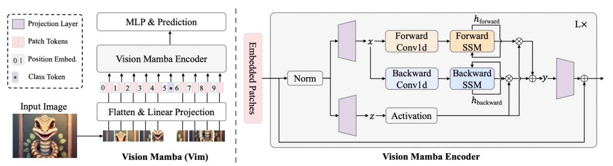
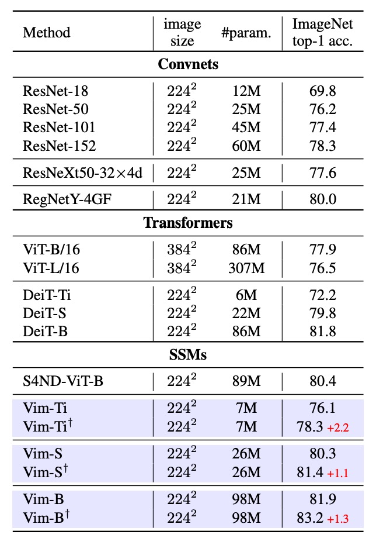
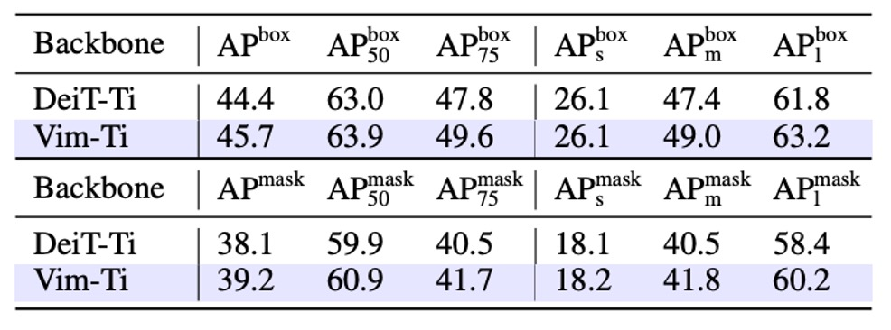
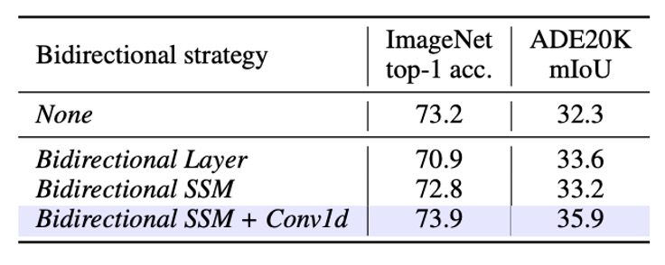
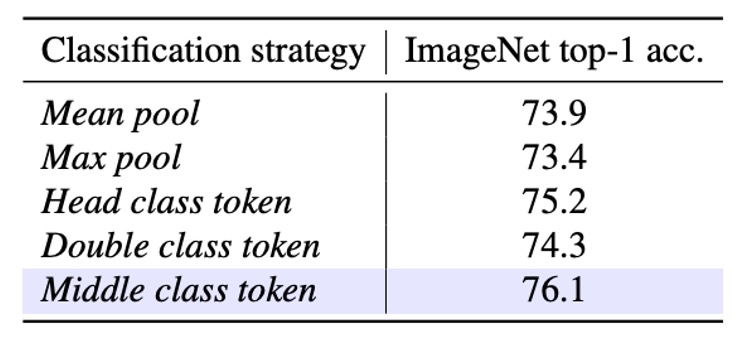

## 曼巴的視線

[**Vision Mamba: Efficient Visual Representation Learning with Bidirectional State Space Model**](https://arxiv.org/abs/2401.09417)

---

還記得當年 Transformer 出現在 NLP 領域後，CV 領域花了三年的時間生出了 ViT。

這次 Mamba 現蹤在 NLP 領域， 有了之前的經驗，CV 領域只花了一個月，就有了 Vim。

只能說這個領域的研究者們真是夙興夜寐，不辭勞苦。

## 定義問題

Mamba 在長序列的 NLP 任務上表現出色，資源消耗相較於 Transformer 低得多。

一時之間，彷彿所有研究者的目光都投向了 Mamba，大家都想知道 Mamba 到底有沒有機會成為下一代的 LLM 基底架構，取代 Transformer 站上領域之巔。

對於 Mamba 到底是不是 Transformer 繼承者？學術界可能還得再吵上幾年，但是 CV 領域可不會等那麼久。這篇論文的作者就直接把 ViT 內的 Transformer 架構抽換成 Mamba，看看會有什麼樣的效果。

:::tip
這裡需要不少前置知識，首先你得了解 Transformer、ViT 的基本概念，以及 Mamba 的基本架構。如果你還沒讀過相關論文，可以挑幾篇我們之前的文章來看一下：

- [**[17.06] Transformer: 新世界的起點**](../../transformers/1706-transformer/index.md)
- [**[20.10] ViT: 新世界拓荒者**](../../vision-transformers/2010-vit/index.md)
- [**[23.12] Mamba: 誰是繼承人**](../2312-mamba/index.md)

如果你都懶得看，那最少最少...也要懂 Mamba 是什麼，不然這篇論文就看不下去了。
:::

## 解決問題

### 模型架構

<figure style={{"width": "90%"}}>

</figure>

我們相信你已經掌握了過去相關研究的必要知識，這裡直接從 Vim 的架構開始看起。

上圖的模型架構其實就是沿用 ViT 的模型設計風格。因為 Mamba 也是個序列模型，所以影像輸入前也是要先轉換成序列資料。這裡的影像打平成序列的方式，和 ViT 一樣，是將影像切成大小為 $P \times P$ 的小塊，然後展開成向量。

若將整張圖切成 $J$ 個 patch，則形成：

$$
x_p \in \mathbb{R}^{J \times (P^2 \cdot C)}.
$$

接著透過一個線性投影矩陣 $W \in \mathbb{R}^{(P^2\cdot C) \times D}$，將每個 patch 投影到維度 $D$。而且延續了 ViT 的作法，同樣是在序列最前面附加一個 **CLS token**，以便在影像分類時聚合整條序列的資訊。

另外對序列 $\{\,t_{\text{cls}},\; x_1 W,\; x_2 W, \dots\}$ 加上可學習的位置編碼 $E_{\text{pos}} \in \mathbb{R}^{(J+1) \times D}$：

$$
T_0 = [\,t_{\text{cls}};\;t_{1}^{p}W;\; \dots;\; t_{J}^{p}W\,] \;+\; E_{\text{pos}}.
$$

最後，重複堆疊 $L$ 個 Vim block，每個 block 都會將前一層輸出的 token 序列 $T^{l-1}$ 映射成 $T^l$，最後取第 $L$ 層輸出的 **class token** 做最終的分類：

$$
T^l = \mathrm{Vim}(T^{l-1}) + T^{l-1},
\quad
\hat{p} = \mathrm{MLP}(\mathrm{Norm}(T_L^0)).
$$

到這裡，其實都和 ViT 一樣，主要的差異在於 Vim block 的設計，我們接著往下看。

### Vision Mamba Block

<figure style={{"width": "90%"}}>

</figure>

Mamba 是嚴格的序列模型，有別於 Transformer 那樣可以一次性看到所有資料，Mamba 架構必須將輸入序列一個一個看過去。這個概念和早些年的 LSTM 一樣，同時也是 Mamba 的一大特色。

但對「需要空間感知」的影像來說，從頭到尾輸入序列顯然不是最好的方式，影像序列不只需要「由左到右」的訊息，往往也需要「由右到左」或更廣域的上下文，所以作者這裡引入雙向序列建模的概念。

輸入影像序列後，模型必須同時進行「正向」和「反向」的 SSM 運算，然後在輸出端合併，概念上和自然語言處理的「雙向 RNN」類似。

我們跟著上面的架構圖，簡單描述一下計算流程：

- **Normalization**：對輸入 $T^{l-1}$ 做正規化，輸出稱為 $\widetilde{T}$。
- **線性投影**：將 $\widetilde{T}$ 投影成 $x, z$，維度大小為 $E$。
- **1-D 捲積**：對 $x$ 分別做「正向」和「反向」的 1-D 卷積，得到 $x'_o$。
- **透過 SSM 參數化**：將 $x'_o$ 映射到 $(A_o, B_o, C_o, \Delta_o)$，再透過離散化得到對應的 $A, B$。
- **正向/反向 SSM**：各自得到 $y_{\text{forward}}, y_{\text{backward}}$。
- **門控整合**：使用 $z$ 來加權 $y_{\text{forward}}$ 與 $y_{\text{backward}}$，最後輸出 $T^l$。

在數學形式上，假設正向方向的序列長度為 $M$，則對於 $t=1,2,\dots,M$：

$$
h_{t+1} = A_t \, h_t + B_t \, x'_t,
\quad
y_t = C_t \, h_t,
$$

而反向方向則從 $t=M$ 向 $t=1$ 遞迴。

最後使用 $z$ 做元素相加或門控結合，如：

$$
T^l = z \odot (y_{\text{forward}} + y_{\text{backward}}).
$$

:::tip
這和注意力機制中的 $Q, K, V$ 有點像，上面數學式中 $x$ 的分支就承擔了 $Q, K$ 的角色，使用 SSM 來取代注意力圖的計算，而 $z$ 則是 $V$ 的角色，用來加權 $y_{\text{forward}}$ 與 $y_{\text{backward}}$ 得到最終的輸出。

對比 Transformer 的自注意力，Vim 中的 SSM 是隨序列長度線性增長；而自注意力則是二次方增長。

下面是作者給出的理論複雜度比較：

$$
\Omega(\text{self-attention}) = 4MD^2 + 2M^2D
$$

$$
\Omega(\text{SSM}) = 3M(2D)N + M(2D)N
$$

可以看到，自注意力對 $M$ 呈現二次方；而 SSM 只跟 $M$ 呈線性關係 (加上 $N=16$ 為固定小常數)。因此當 $M$ 變得很大時（即高解析度影像的 patch 數量），Vim 的優勢十分明顯，更容易擴展到超高解析影像的應用場景。

基本上，你看 Mamba 是怎麼解決計算效率的問題，Vim 就是照搬過來就對了！
:::

### 參數設定

Vim 架構的超參數設計如下：

- **$L$**：堆疊的 Vim blocks 數量。
- **$D$**：輸入 token 的隱藏維度。
- **$E$**：擴張維度，通常設定為 2 倍或 4 倍的 $D$。
- **$N$**：SSM 的狀態維度，默認設定為 16。

與 DeiT-Tiny、DeiT-Small 等架構對標時，對應的超參數設定如下：

- Tiny-size：$D=192, E=384, N=16, L=24$。
- Small-size：$D=384, E=768, N=16, L=24$。
- Patch projection 大小為 16×16，不重疊，直接 flatten 後輸入 Vim blocks。

整體架構不需要額外的卷積分支或注意力機制，就能「純粹」地以序列方式建模影像。

## 討論

### 影像分類的性能

<figure style={{"width": "70%"}}>

</figure>

首先測試了 Vim 在 ImageNet-1K 上的分類效果，訓練配置與 ViT 相同，使用 AdamW 優化器，採用 cosine schedule 學習率策略，並在 8 張 A800 GPU 上執行。為了充分利用 Vim 的長序列優勢，作者在預訓練結束後，再額外做 30 epoch 的 fine-tuning，以提取更細緻的視覺特徵。

實驗結果如上表，以 ResNet50 為代表的 ConvNet、ViT、Transformer 等方法進行比較，Vim 在相同參數量下，能取得更好的 Top-1 accuracy。這表明 Vim 在序列化建模方面的優勢，能帶來更好的分類效果。

接著和 ViT 進行比較，Vim 在相同維度下，能取得更高的準確率，且參數量更少。這說明了 SSM-based 建構所帶來的效率與效果優勢。和 DeiT 進行比較，可以發現在不同規模（Tiny, Small, Base）下，Vim 都能以相近參數數量達到更高或相當的準確率：

- Vim-Tiny 比 DeiT-Tiny 高 3.9 個百分點。
- Vim-Small 比 DeiT-Small 高 0.5 個百分點。
- Vim-Base 則比 DeiT-Base 高 0.1 個百分點。

這表示在 Transformer 領域經過高度優化的 DeiT，也在性能面略遜於 Vim。

最後，作者對 Vim-Tiny、Vim-Small、Vim-Base 做完長序列 fine-tuning 後（標記為 `†`）還能再提升精度。這表示在維持較小參數量的同時，能透過長序列 fine-tuning 得到更佳表現。

### 高解析度下性能比較

<figure style={{"width": "90%"}}>

</figure>

作者比較了 Tiny 規模的 Vim 與 DeiT 在不同影像解析度下的 FPS（推論速度）和 GPU 記憶體使用量，結果顯示如上圖：

- 當影像大小為 512×512 時：Vim 與 DeiT 在 FPS、記憶體使用量上相差不大。
- 當影像大小增至 1248×1248 時：
  - Vim 的推論速度比 DeiT 快 2.8 倍。
  - GPU 記憶體使用量只佔 DeiT 的 13.2%（節省 86.8%）。

主因在於自注意力機制對序列長度 $M$ 呈二次方成長，Vim 的 SSM 模組則基本維持線性，當 $M$ 很大時，速度與記憶體優勢就更加明顯。

### 影像分割的性能

<figure style={{"width": "70%"}}>

</figure>

測完影像分類，然後來看一下影像分割的效果。作者在 ADE20K 資料集進行實驗，並採用 UperNet 作為基礎分割框架，證明了 Vim 與自注意力型骨幹網路的比較優勢。

實驗結果如上表，在不同規模下，Vim 都能比 DeiT 有更好的 mIoU。例如 Vim-Tiny 比 DeiT-Tiny 高出 1.8 mIoU；Vim-Small 比 DeiT-Small 高出 0.9 mIoU。代表了 Vim 在整張影像的語意理解上有更強的表徵能力。

和 ResNet-101 比較，Vim-Small 在 mIoU 上達到與 ResNet-101 相近的分割成效，但參數量卻少了約一半。這顯示透過純序列建模（SSM-based）也能在語意分割上得到高效且精確的結果。

### 物件偵測的性能

<figure style={{"width": "70%"}}>

</figure>

作者在 COCO 2017 資料集上進行物件偵測實驗，並採用 ViTDet 作為基礎框架進行研究。

實驗結果如上表，Vim-Tiny 在 box AP 和 mask AP 上都比 DeiT-Tiny 高出 1.3 個百分點。這表示 Vim 在捕捉較遠距離/大範圍上下文時具備更強的能力。

進一步劃分成不同物件尺度，中型物件（middle-size）的 box AP 和 mask AP 分別高出 1.6 和 1.3；大型物件（large-size）則高出 1.4 和 1.8。這些分數代表 Vim 在捕捉較遠距離上下文時具備更強的能力。

作者透過 COCO 的物件偵測與實例分割實驗，證實了 Vim 架構對高解析度輸入具有良好的可擴展性，也不需要再依賴 2D window 這類空間先驗就能取得優異成效，佐證了 Vim 在高解析度影像下的表示能力與計算效率。

### 消融實驗 - 雙向設計

作者測試了 5 種「雙向」策略，以理解對於 ImageNet 分類與 ADE20K 分割的影響。分割部分則使用 **Segmenter** 之頭部，並特別只用兩層來檢驗骨幹輸出的遷移能力。

1. **None**：直接採用原本 Mamba 的單向 block，只做 forward 方向。對於影像序列，這種做法在分類上或許還不錯，但可能犧牲對「空間位置」或「後文資訊」的捕捉，影響下游分割。
2. **Bidirectional Sequence**：在訓練期間，隨機對可視序列做方向上的翻轉。本質上像是一種 data augmentation，而非在模型結構上擁有雙向處理能力。
3. **Bidirectional Block**：每兩個 block 作為一個配對：第一個 block 負責 forward，第二個 block 負責 backward。換句話說，模型堆疊時，奇數層是正向，偶數層是反向，但沒有在同一層裡同時做正反向。
4. **Bidirectional SSM**：在每個 block 裡，除原本的 forward SSM 外，再加一個 backward SSM，使得每個 block 同時對序列進行前、後方向的計算。
5. **Bidirectional SSM + Conv1d**：在 Bidirectional SSM 基礎上，進一步加了一個 **backward Conv1d** 模組，讓反向 SSM 前先進行一個 1D 卷積操作。

實驗結果如下表：

<figure style={{"width": "70%"}}>

</figure>

- **None (Unidirectional Mamba)**

  - **分類**：Top-1 accuracy 表現不錯。
  - **語意分割**：因為缺乏雙向空間資訊，下游分割表現相對較差。

- **Bidirectional Block**

  - **分類**：Top-1 accuracy 降低了 7 個百分點，顯示將 forward/backward 拆成兩個 block 順序堆疊，對於分類學習並不理想。
  - **語意分割**：相較於 Unidirectional，mIoU 提升 1.3，顯示即使這種「分段式」的雙向策略也有助於擴增全域脈絡資訊。

- **Bidirectional SSM + Conv1d (完整雙向策略)**

  - 這個配置同時在 **ImageNet** 的分類以及 **ADE20K** 的分割任務上達到最好的平衡：
    - 分類：73.9 Top-1 accuracy（對比 Bidirectional SSM 只有 73.2）。
    - 分割：35.9 mIoU（比 32.3 mIoU 提升更多）。
  - 可看出同層中同時整合 forward/backward 以及在 backward SSM 前再加 1D 卷積，能同時維持分類能力並顯著改善密集預測。
  - 最終這個配置成為 **Vim block** 的設計方式。

### 消融實驗 - 分類策略

作者想檢驗在 **SSM-based** 的骨幹下，使用不同的「分類策略」是否會影響最終 ImageNet 效果？於是作者提出 5 種策略進行比較：

1. **Mean pool**：最後一層輸出 (tokens) 全部做平均池化，再進行分類。沒有使用 class token。
2. **Max pool**：對所有序列 token 進行最大池化。同樣沒有 class token，每個 token 都有「局部的」分類頭，最後再用 max pool 決定最終預測。
3. **Head class token**：效仿 DeiT，在序列最前面增加一個 class token，並且最終只用此 token 做分類。
4. **Double class token**：在序列「首」與「尾」各放一個 class token，並將它們結合來進行分類。代表想同時擷取「開始」與「結尾」兩端資訊。
5. **Middle class token**：在序列「中間」插入一個 class token，最終只用此中間 token 來做分類。作者認為這種設計可充分利用 SSM 的遞迴特性，以及 ImageNet 通常主要物體在畫面中央的經驗先驗。

實驗結果如下表：

<figure style={{"width": "70%"}}>

</figure>

結果顯示，**Middle class token** 提供了最好的 Top-1 accuracy，達到 **76.1**。

這顯示在 SSM-based 模型中，將 class token 放在序列中段，能更好地利用模型的前後向資訊流動，並且符合 ImageNet 影像常見的物體分布特性。

:::tip
多數情況下主要物體位於畫面中央。
:::

## 結論

在本研究中，作者提出了 Vision Mamba (Vim)，目的是將最新且高效率的 Mamba 拓展為通用的視覺骨幹網路。

Vim 不依賴自注意力，透過雙向 SSM 亦能取得足夠的全域上下文，而且在面對更長序列或更高解析度影像時依舊保持合理的計算與記憶體消耗，並在多個標準視覺任務上表現優異。

看完這篇論文後，最讓人印象深刻的應該就是這個「雙向序列建模」的概念。

試想：既然圖像為一個 2-D 的資料結構，怎麼可能只用「由左到右」或「由右到左」的方式來看了？我們能不能直的看？能不能斜著看？

我們還能天馬行空的各種看：

<figure style={{"width": "90%"}}>

</figure>

除此之外，還有 MAE 和 CLIP 的概念也可以套用在這裡。MAE 透過「掩碼影像建模」的方式，或是 CLIP 風格的多模態預訓練，也許能讓 Vim 有更好的表現。

想必在這之後，又有一卡車的論文等著我們去看呢！
