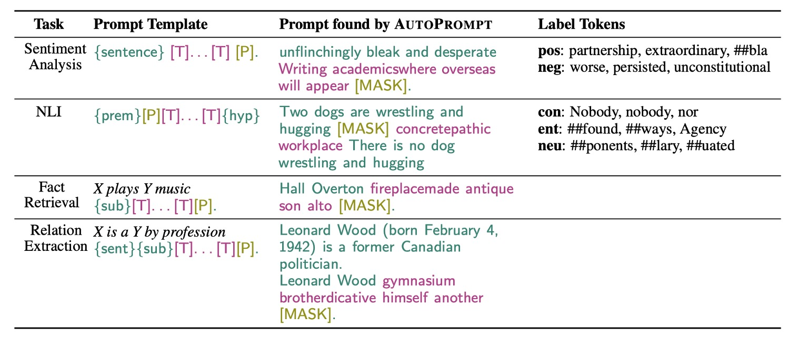
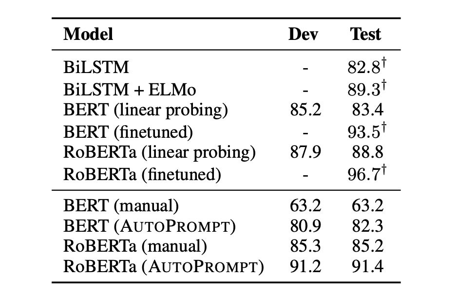

## 模型語

[**AutoPrompt: Eliciting Knowledge from Language Models with Automatically Generated Prompts**](https://arxiv.org/abs/2010.15980)

---

語言模型愈做愈大，使得大部分的人都沒有能力來訓練或微調時，另外一個方向的研究應運而生：提示工程（Prompt engineering）。

這個概念是指如何設計一個好的提示（prompt），讓大型語言模型能夠回答特定問題。

但是寫提示很麻煩啊！

## 定義問題

### 手動編寫提示既費時又麻煩

每次為一個新任務編寫提示，就像在玩一場需要反復試驗的拼圖遊戲，需要花大量時間。

編寫這些提示也不簡單，你得非常了解模型和任務，才能寫出有效的提示，這對大部分人來說並不直觀。

### 模型對輸入的敏感度超高

模型對提示的要求很高，一點點的變化可能會讓模型的表現大打折扣。

寫提示時稍有不慎，就可能讓結果一團糟。

### 專業知識不足

手動寫提示不僅累，而且需要非常專業的知識。如果不具備專業知識，可能問不到核心概念，模型也只能回答一些表面問題。

### 換個模型換個腦袋

經歷過前面幾個挑戰後，你花了幾個月，終於完成了可以完全壓榨出模型潛力的提示工程。

但是這時候，模型升級了！

於是你又得重新開始。

## 解決問題

### 模型架構設計

為了解決上述的問題，本文提出了一種新的方法：AutoPrompt。

概念上非常簡單：既然我不知道怎樣的提示對模型有效，那就讓模型自己生成提示。

整個架構在上圖中非常清晰地展示了出來：

1. **Original Input**：這是原始的輸入 $X$。

2. **\[MASK\]**：這是原始的輸出 $Y$。

這裡使用的是情感分析的任務，所以 $Y$ 是一個情感標籤，正向或負向。

中間 \[T\] 的部分，就是 AutoPrompt 的重點：自動生成提示的範圍。

意思就是，模型收到原本的輸入和輸出後，必須自己把提示找出來，以提高最後模型的表現。

### 基於梯度的提示搜索

作者針對不同的任務設計了不同的提示生成策略，以提高模型的表現。

在這部分，AutoPrompt 利用一種基於梯度的搜索策略來自動生成提示。

上面提到的自動提示的部分，是以 \[MASK\] 進行初始化，並迭代更新，找到 top-k 的 Token 候選集。

因此，這個方法不會動到目標語言模型，只是透過語言模型給的回饋，用梯度更新來找到最佳的提示詞。

## 討論

### 情感分析實驗

研究結果顯示：

1. 通過 AutoPrompt 生成的提示證明 BERT 和 RoBERTa 對情緒分析有著深刻的認知
2. 無需任何微調，BERT 的表現與受監督的 BiLSTM 相當
3. RoBERTa 的準確率與經過微調的 BERT 和 ELMo 模型相當。

此外，作者也觀察到自動構建的提示比手動提示更有效，且這些提示使用人類直覺難以構建：

- 自動提示比起手動提示可以提昇 20% 的準確率。
- 對於 RoBERTa 來說，最佳模板是 **“\{句子\} atmosphere alot dialogue Clone totally \[P\]。”**。

### 事實檢索

作者也在事實檢索任務上進行了實驗，這項研究利用 LAMA 和 LPAQA 數據集，探討預訓練 MLM（如 BERT 和 RoBERTa）是否能準確辨識與理解真實世界的事實。在這個任務中，作者使用模板 "\{sub\}\[T\]...\[T\]\[P\]" 來映射三元組，其中觸發標記是關於關係的特定 Token，正確對象作為標籤標記。

- **數據收集與處理**

  - 從 T-REx 數據集和 Wikidata 收集最多 1000 個事實以訓練 AutoPrompt。
  - 確保訓練數據和測試數據之間無重疊，並進行 80-20 的訓練與開發集分割。

- **性能評估**

  - 使用標準排名指標如平均倒數排名(MRR)、精度為 1(P@1)和精度為 10(P@10)來評估模型。
  - AutoPrompt 在事實檢索上顯示出比以往方法更有效的表現，尤其是在使用 7 個觸發標記的情況下。

- **BERT 與 RoBERTa 的比較**：

  - 直接了 BERT 和 RoBERTa 在相同測試條件下的表現。發現 BERT 在某些情況下略勝一籌，特別是在提示生成方面，RoBERTa 生成的提示含有較多不相關的單詞。

這項研究證明了利用 AutoPrompt 的方法可以更有效地從 MLM 中提取事實知識。

令人驚訝的是 RoBERTa 的表現並不比 BERT 更好，值得在未來的工作中進一步研究這一點。

:::tip
在使用提示方法評估語言模型時，模型的相對性能較低並不必然意味著模型對於相關知識的理解程度較低。模型的性能應該在更廣泛的評估上下文中來理解，並不僅僅依靠單一的測試結果。

提示方法是一種衡量語言模型如何處理特定事實檢索任務的工具。然而，這種方法可能不完全捕捉模型的所有能力。例如，如果提示不夠理想或與模型訓練時所用的數據分布不匹配，可能會導致模型表現不佳。此外，某些模型可能在特定類型的問題上表現出色，而在其他類型的問題上表現平平，這不代表模型沒有學到相關的知識或能力。

語言模型通常訓練於大規模的數據集，涵蓋廣泛的語言結構和信息。因此，一個模型可能在沒有直接表現出來的情況下，實際上掌握了大量的隱含知識。當評估任務不充分地對應於模型的訓練經驗時，評估方法或特定的試驗設計可能無法激發或顯示模型的這些隱含知識。
:::

## 結論

如同前面作者所提到的：

- 對於 RoBERTa 來說，最佳模板是 **“\{句子\} atmosphere alot dialogue Clone totally \[P\]。”**。

雖然語言模型是使用人類的語言知識訓練的，但或許模型已經從訓練數據中總結出了更多「只屬於」模型可以理解的「模型語」。

這種「模型語」的形成是由於深層神經網路能夠從數據中抽象出複雜的語言特徵，這些特徵包含了語言的深層語義和語境模式。

因此，當模型使用這些看似無序的詞組來表達其內部狀態時，這實際上是模型在用它自己的方式來處理和編碼信息。

這件事情其實非常有趣，他可以衍生出非常多的思考：

1. 人類語言是否過於低效？

2. 模型語和人類語之間的差異是否需要消除？又真的能消除嗎？

3. 我們常詬病模型不夠透明，但是這種「模型語」的存在是否讓模型更加難以解釋？

4. 不同模型之間的「模型語」是否有相似性？畢竟他們都是從人類語言中學習的？

且讓我們繼續翻看後續的研究，看看這些問題是否有更多的答案。
