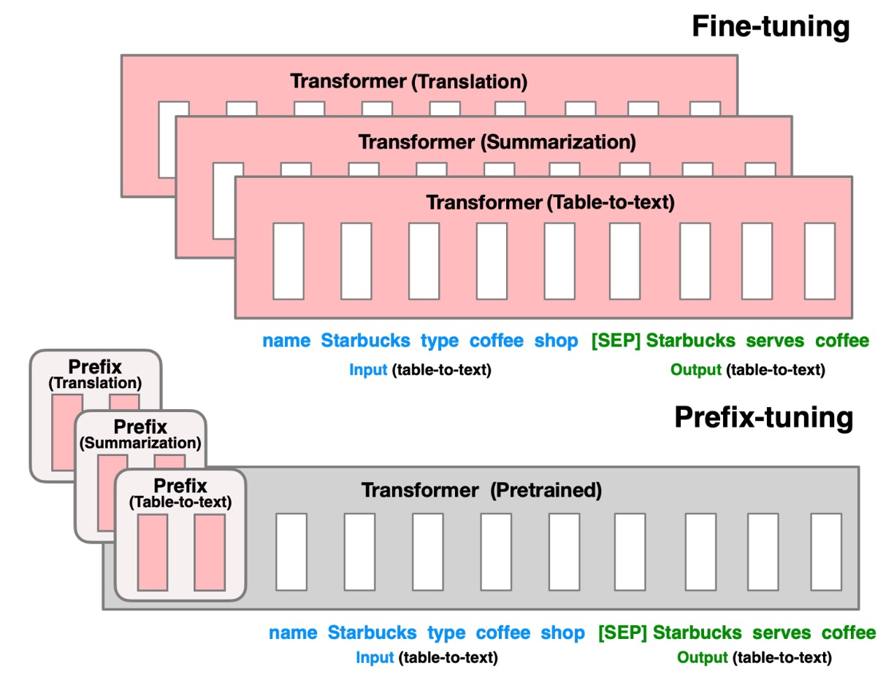
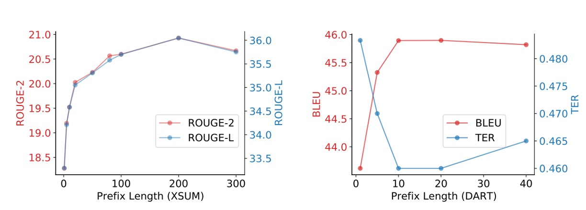

## 是他？不是他？

[**Prefix-Tuning: Optimizing Continuous Prompts for Generation**](https://arxiv.org/abs/2101.00190)

---

要使用別人 Train 好的語言模型，大概就是幾個常見的方式：

1. **Fine-tuning**：直接將模型的參數調整到新的任務上。

   但是不是一般人可以做的，因為需要大量的資料和計算資源。

2. **Prompt-based**：透過設計好的 Prompt 來引導模型產生想要的結果。

   假設我們要做的任務是摘要，我們就會設計一個 Prompt 來引導模型產生摘要，不同的模型可能會需要不同的 Prompt，例如：

   1. GPT-3：`Summarize with 3 sentences about the following article:`
   2. T5：`summarize the following article:`
   3. BART：`Document summarization:`
   4. ...

   缺點是換個模型就換個腦袋，需要不斷地測試。

---

除此之外，還有嗎？

當然！研究者最不缺的就是創意。

前陣子出了一篇 AutoPrompt，透過自動化的方式找出最適合的 Prompt，同時結合了 Fine-tuning 和 Prompt-based 的優點。

- [**[20.10] AutoPrompt: 模型語**](../2010-autoprompt/index.md)

透過一組可以學習的參數，讓模型根據自己的特性來自己找出最適合的 Prompt。

## 定義問題

<figure style={{"width": "70%"}}>

</figure>

剛也提到了，目前的問題在於原本的模型規模太大，一般人無法 Fine-tuning，而 Prompt-based 又需要不斷地測試。

既然這樣，作者提出了一個新的方法：**Prefix-Tuning**。概念很簡單，如上圖，就是透過一個叫做 Prefix 的 Token，安插在模型輸入的最前面，來引導模型產生結果。

等等，這不就是 AutoPrompt 在做的事情嗎？

說得沒錯！

差別在於 AutoPrompt 的方法是從「已經訓練」好的 Token 中組合出合適的 Prompt，而 Prefix-Tuning 則是「直接在特徵空間」訓練出最適合的 Token。

作者認為 AutoPrompt 的方法所產出的 Prompt 的連續性有問題，因為它是從已經訓練好的 Token 中組合出來的，而 Prefix-Tuning 則是直接在特徵空間訓練出來的，所以會更加合用！

## 解決問題

### 模型架構

上圖是 Prefix-Tuning 的模型架構示意圖，在這個架構中，整個模型包含以下幾個部分：

1. **可訓練的前綴參數 $P_\theta$**：這是一組新加入的參數，位於輸入序列的最前面，其長度和維度可自行設定。這些參數將在訓練過程中進行優化，以引導模型生成符合特定任務需求的輸出。

2. **固定的預訓練語言模型 $\text{LM}_\phi$**：這部分是已經預訓練好的大型語言模型，如 GPT-2、GPT-3 等。作者在 Prefix-Tuning 過程中保持其參數 $\phi$ 不變，避免了大規模模型微調的資源消耗。

3. **輸入序列 $x$**：這是任務的輸入，例如需要摘要的文章或需要描述的表格數據。

4. **輸出序列 $y$**：這是模型需要生成的輸出，例如文章的摘要或表格的文字描述。

### 實作細節

在實作上，Prefix-Tuning 主要幾個步驟：

1. **初始化前綴參數**：首先為前綴創建一組可訓練的參數矩陣 $P_\theta$，其尺寸為 $|P_{\text{idx}}| \times \text{dim}(h_i)$，其中 $|P_{\text{idx}}|$ 是前綴的長度，$\text{dim}(h_i)$ 是模型隱藏層的維度。

2. **重新參數化 (Reparametrization)**：

   直接優化高維度的 $P_\theta$ 可能導致優化不穩定，因此作者採用重新參數化的策略：

   - **低維表示 $P'_\theta$**：建立一個較小的矩陣 $P'_\theta$，其尺寸為 $|P_{\text{idx}}| \times d'$，其中 $d' < \text{dim}(h_i)$。
   - **多層感知機 (MLP)**：使用一個多層感知機 $\text{MLP}_\theta$ 將 $P'_\theta$ 映射到高維度的 $P_\theta$：
     $$
     P_\theta[i, :] = \text{MLP}_\theta \left( P'_\theta[i, :] \right)
     $$
   - **優化過程**：在訓練時，只需要優化 $P'_\theta$ 的參數以及 MLP 的權重 $\theta$，而預訓練語言模型的參數 $\phi$ 保持不變。

3. **模型前向傳播**：

   - **前綴部分**：對於前綴的每個位置 $i \in P_{\text{idx}}$，其激活值直接取自 $P_\theta[i, :]$：
     $$
     h_i = P_\theta[i, :]
     $$
   - **輸入序列部分**：對於輸入序列 $x$ 和輸出序列 $y$，其激活值按照預訓練模型的計算方式，並受前綴激活的影響：
     $$
     h_i = \text{LM}_\phi(z_i, h_{<i})
     $$
     其中 $z_i$ 是輸入序列的第 $i$ 個 Token，$h_{<i}$ 包含了前綴和輸入序列中第 $i$ 個位置之前的所有激活值。

模型的訓練目標是最大化輸出序列 $y$ 的對數似然函數：

$$
\max_\theta \log p_\phi(y | x, P_\theta) = \sum_{i \in Y_{\text{idx}}} \log p_\phi(z_i | h_{<i})
$$

這裡只優化前綴參數 $\theta$，而語言模型的參數 $\phi$ 是固定的。

在訓練完成後，由於我們已經獲得了優化後的高維前綴矩陣 $P_\theta$。由於推論時不再需要進行重新參數化，因此我們可以丟棄 MLP 模型，只保留 $P_\theta$。在推論時，我們只要將 $P_\theta$ 與新的輸入序列 $x$ 拼接，然後通過預訓練語言模型生成輸出 $y$。

### 資料集設置

1. **Table-to-Text 生成任務**：

   - 使用三個資料集，依據複雜度和規模排序：
     1. **E2E (Novikova et al., 2017)**：
        - 1 個領域（餐廳評論），約 50K 筆資料，包含 8 種欄位。
        - 每筆資料對應多個測試參考，平均輸出長度為 22.9。
        - 評估指標：BLEU、NIST、METEOR、ROUGE-L、CIDEr。
     2. **WebNLG (Gardent et al., 2017)**：
        - 22K 筆資料，輸入為 (subject, property, object) 的三元組。
        - 涵蓋 14 個領域，測試集分為「已見」與「未見」類別，以檢測模型的泛化能力。
        - 平均輸出長度為 22.5。
        - 評估指標：BLEU、METEOR、TER。
     3. **DART (Radev et al., 2020)**：
        - 開放領域資料集，包含 82K 筆資料，輸入格式類似 WebNLG。
        - 來自 WikiSQL、WikiTableQuestions、E2E 和 WebNLG 的資料。
        - 平均輸出長度為 21.6。
        - 評估指標：BLEU、METEOR、TER、MoverScore、BERTScore、BLEURT。

2. **摘要生成任務**：
   - **XSUM (Narayan et al., 2018)**：
     - 225K 筆新聞摘要資料，文章平均長度為 431 字，摘要平均長度為 23.3 字。
     - 評估指標：ROUGE-1、ROUGE-2、ROUGE-L。

## 討論

### 表格轉文字生成性能

Prefix-Tuning 僅使用 0.1% 的任務特定參數，但表現超越其他輕量化方法：

- **Adapter-Tuning (ADAPTER)**：使用同樣 0.1% 參數，但 Prefix-Tuning 平均在 **BLEU** 分數上提升 **4.1 分**。
- **FT-TOP2**：僅微調前兩層模型參數。

Prefix-Tuning 的表現接近甚至優於完整微調模型 (Fine-tuning)。相較於 Adapter-Tuning（3.0% 參數），Prefix-Tuning 的性能也不遜色。

Prefix-Tuning 在三個資料集（E2E、WebNLG、DART）中的表現一致，證明其方法的普適性。在 **DART** 資料集上的出色表現顯示，Prefix-Tuning 能夠適應不同領域的表格資料和多元關係，證明其具有良好的泛化能力。

GPT-2 Medium 和 GPT-2 Large 上的實驗顯示，Prefix-Tuning 可隨模型規模增長而保持性能，暗示其適用於更大型的模型（如 GPT-3）。

### 摘要生成性能

<figure style={{"width": "70%"}}>

</figure>

使用 **2% 參數** 時，Prefix-Tuning 的 **ROUGE-L** 分數為 **36.05**，略低於完整微調模型的 **37.25**。當參數進一步縮減至 **0.1%** 時，Prefix-Tuning 的 **ROUGE-L** 分數降至 **35.05**，顯示出使用更少參數的情況下，性能有所下降。

Prefix-Tuning 在摘要生成任務上的表現低於完整微調，可能是由於以下幾個因素：

1. **數據量差異**：XSUM 資料集的樣本數量為表格轉文字資料集的 **4 倍**，需要處理更多樣本。
2. **輸入長度**：XSUM 的文章平均長度為表格輸入的 **17 倍**，需處理更長的輸入序列。
3. **任務複雜性**：摘要生成比表格轉文字更為複雜，因為需要模型具備閱讀理解能力，以及從文章中辨識關鍵內容。

Prefix-Tuning 在摘要生成任務中的表現雖然不及完整微調，但仍然展示了其在資源受限場景中的潛力。不同任務對模型的挑戰不同，在處理長文章和複雜內容時，Prefix-Tuning 的優勢相對較小。然而，它依然在大幅減少參數的情況下，取得了接近微調的性能。

### 小樣本配置

Prefix-Tuning 在小樣本場景中優於 Fine-tuning，平均提升 **2.9 BLEU** 分數，且使用的參數大幅減少。隨著數據集的規模增加，Prefix-Tuning 和 Fine-tuning 的性能差距逐漸縮小。

從完整資料集中（E2E 用於表格轉文字，XSUM 用於摘要生成）抽樣，建立不同規模的小數據集，規模分別為 **{50, 100, 200, 500}** 筆資料。每個規模進行 **5 次不同的抽樣**，並對 **2 種隨機種子**進行平均，因此每個規模的結果來自 **10 個模型**的平均表現。

在小數據場景中，兩種方法都會出現內容生成不足 (undergeneration)的情況，即缺漏部分表格內容。Prefix-Tuning 的生成結果更為忠實於輸入表格，即便在 100 或 200 筆資料的場景中，其描述依然符合真實資料。Fine-tuning 在 100 或 200 筆資料的設定下，可能誤報顧客評分為「低」，而實際的評分為「平均」。相反，Prefix-Tuning 生成的描述則能準確反映表格內容。

Prefix-Tuning 在小樣本場景中具有明顯的適應優勢，使用更少參數的同時提供更好的結果。此方法能更忠實地反映輸入內容，特別是在數據量較少的情況下，表現比 Fine-tuning 更穩定和可靠。

### 外推能力

<figure style={{"width": "70%"}}>

</figure>

作者進一步探討 Prefix-Tuning 在**未見主題**上的外推能力，即模型在訓練和測試時處理不同主題的表現。

- **外推設置**

  - **表格轉文字 (Table-to-Text)**：使用 **WebNLG** 資料集，根據表格主題進行分組：

    - **SEEN**：訓練和驗證集中出現的 9 個類別。
    - **UNSEEN**：僅在測試集中出現的 5 個類別。

    測試目標在 SEEN 類別上進行訓練，並測試模型在 UNSEEN 類別上的表現。

  - **摘要生成 (Summarization)**：設置兩種外推場景：

    - **新聞到體育**：在新聞文章上進行訓練，並在體育文章上進行測試。
    - **新聞內部分類**：在「世界、英國、商業」新聞上訓練，並在其他新聞類別（如健康、科技）上進行測試。

Prefix-Tuning 在所有評估指標上都優於 Fine-Tuning，無論是表格轉文字還是摘要生成任務，顯示其在跨主題場景中的強大外推能力。

Adapter-Tuning 在外推場景中的表現與 Prefix-Tuning 相當，這顯示出保留語言模型參數（不對模型進行完整微調）有助於提升外推性能。

### 前綴要多長？

經過實驗較長的前綴長度對性能有正面影響，但超過一定閾值後性能會略有下降。

- 在摘要生成任務中，前綴長度增加到 **200** 時性能達到最佳。
- 在表格轉文字任務中，前綴長度增加到 **10** 時性能達到最佳。

前綴的長度對推論速度影響不大，因為 GPU 可將注意力計算並行化處理。

### 初始化策略

<figure style={{"width": "80%"}}>

</figure>

在小數據場景中，初始化策略對性能有很大影響：

- **隨機初始化**導致性能較低且變異性高。
- **使用真實詞彙的激活初始化**顯著提升性能。

使用與任務相關的詞（如「summarization」和「table-to-text」）初始化的性能略優於任務無關的詞（如「elephant」和「divide」）。然而，即便是使用無關詞的初始化，其性能也優於隨機初始化。

### 適用場景

Prefix-Tuning 特別適合需要針對大量任務獨立訓練的場景，如多用戶個性化模型。為了保護用戶隱私，每個用戶的數據需分離，且每位用戶需要獨立的模型。在此情境下，每位用戶視為一個獨立的任務。

Prefix-Tuning 可以藉由增刪前綴來靈活添加或刪除用戶，避免用戶數據的交叉污染。

反觀 Adapter-Tuning 就辦不到這種功能，因為每個用戶的適配器需嵌入 Transformer 層之間，難以共享計算。

### 為何在未見主題上表現優異？

這個問題作者有用了一個小章節來論述。

首先，預訓練語言模型是在大規模通用語料上訓練的，因此保留這些參數（不進行大幅調整）有助於保持模型的泛化能力，使模型能應對未見主題。Prefix-Tuning 和 Adapter-Tuning 都凍結了預訓練參數，僅調整小部分參數，避免對模型的原始能力造成干擾。

完整微調 (Fine-tuning) 可能導致模型過度擬合於訓練數據，特別是在特定領域或小數據集的場景中。輕量化微調（如 Prefix-Tuning 和 Adapter-Tuning）只針對部分參數進行優化，降低了過度擬合的風險，因此更能適應未見主題。

雖然輕量化微調保留了預訓練參數，但這也意味著它無法充分針對新任務優化模型。在某些高度複雜的場景中（如需要深入理解和推理的任務），微調可能必不可少，而輕量化微調的表現可能會受到限制。

雖然 Prefix-Tuning 在外推場景上有良好表現，但這種結果可能依賴於特定的數據或任務。例如，在過於複雜或不規則的數據上，輕量化微調可能無法提供穩定的泛化性能。此外，部分未見主題的測試集可能與預訓練語料有潛在的重疊，這可能導致結果偏向樂觀。

最後，作者認為這仍然是個開放問題，需要進一步研究。

:::tip
雖然作者試著解釋了為什麼 Prefix-Tuning 在未見主題上表現優異，但他其實也不確定真正的原因是什麼。
:::

## 結論

Prefix-Tuning 是一種輕量化微調方法，通過添加一組可訓練的前綴參數，引導模型生成符合特定任務需求的輸出。

這種方法在表格轉文字和摘要生成任務上取得了令人印象深刻的性能，即使只使用少量參數。Prefix-Tuning 在小樣本和未見主題場景中表現優異，具有良好的泛化能力。

:::tip
如果你也常在看語言模型，可以發現這個方法最大的缺點在於：

- **需要占用預測序列的一部分 Token 來放置前綴**。

特別是在實驗中提到需要 200 個 Token 來放置前綴才能達到最佳效果，常見的語言模型輸入大多只有 512 Token，就這樣用到一半了，怎麼看都是有點浪費的。
:::
