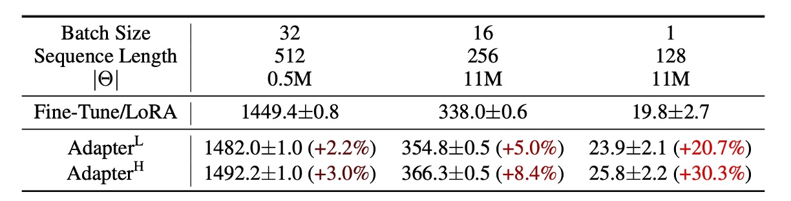
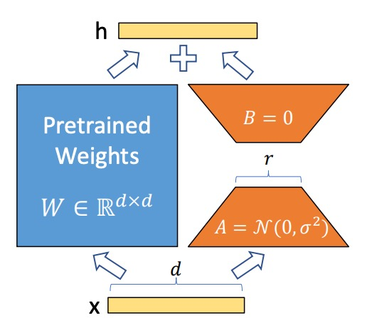
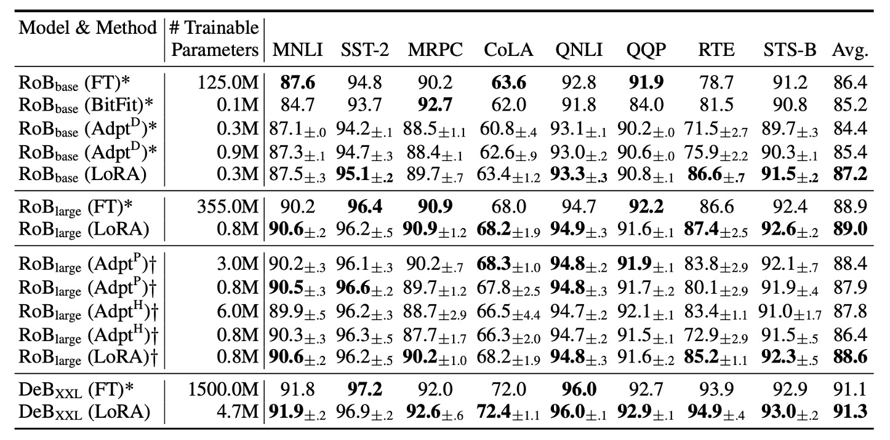
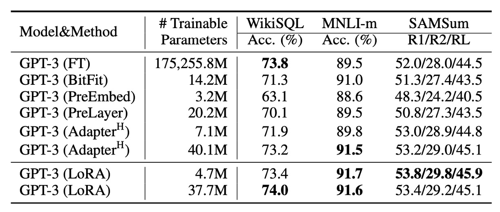

## 萬分之一的 LLM

[**LoRA: Low-Rank Adaptation of Large Language Models**](https://arxiv.org/abs/2106.09685)

---

我們必須承認大部分的人都 Train 不了 LLM。

世界這麼大，但能夠迭代 LLM 的公司也就這麼幾家，屈指可數。

研究者們迫切地希望能夠利用這些巨大的模型來解決各種問題，所以如何有效地微調這些模型就成為了一個重要的問題。

## 定義問題

如果你今天想要對全模型進行微調，具體的步驟應該會像是這樣：

1. 模型首先使用預訓練權重 $\Phi_0$ 初始化。
2. 透過梯度優化更新為 $\Phi_0 + \Delta \Phi$，以最大化條件語言模型目標：

   $$
   \max_\Phi \sum_{(x,y) \in Z} \sum_{t=1}^{|y|} \log P_\Phi(y_t | x, y_{<t})
   $$

每個下游任務都需學習不同的參數 $\Delta \Phi$，且其維度 $|\Delta \Phi|$ 等於原始模型參數的大小 $|\Phi_0|$。對於大型模型，像是 GPT-3 這種的，$|\Phi_0|$ 大約有 175 億參數，儲存和部署多個微調後的模型非常困難。

在過去的研究中，主流的解題思路是 Adapter，剛好之前我們也有讀過：

- [**[19.02] Adapter: 參數節省九成六**](../1902-adapter/index.md)

但相關研究遠不止這些，這裡簡單列個幾篇，有空再來看看：

- [**[20.04] Exploring Versatile Generative Language Model Via Parameter-Efficient Transfer Learning**](https://arxiv.org/abs/2004.03829)
- [**[20.05] AdapterFusion: Non-Destructive Task Composition for Transfer Learning**](https://arxiv.org/abs/2005.00247)
- [**[21.04] The Power of Scale for Parameter-Efficient Prompt Tuning**](https://arxiv.org/abs/2104.08691)

只是這些方法在大規模且延遲敏感的生產場景中仍存在一定限制，因為我們還是需要增加參數量，而且有可能還會干擾原本基於平行運算部署的模型，如下表，在 GPT-2 上加入 Adapter 可以觀察到明顯的延遲增加：

<figure style={{"width": "80%"}}>

</figure>

雖然可以透過層剪枝或多任務訓練來減少延遲，但無法完全消除 Adapter 的額外計算開銷。Adapter 設計本質上通過限制瓶頸維度，讓其參數量少於原始模型的 1%。

理論上計算量（FLOPs）應該不大？

但還是不行。

因為大型神經網路高度依賴硬體平行運算以保持低延遲，但 Adapter 必須順序處理，這在線上推論（batch size 通常為 1）的場景中會導致延遲顯著增加。

那不然我們改 Prefix-Tuning 呢？

- [**[21.01] Prefix-Tuning: Optimizing Continuous Prompts for Generation**](https://arxiv.org/abs/2101.00190)

Prefix-Tuning 等技術代表了另一種調適策略，但 prefix tuning 在優化過程中表現出非單調的參數效能變化，導致優化困難。而且為了進行調適，必須保留部分序列長度給 prefix，這減少了可用於處理下游任務的序列長度。

感覺更糟了。

作者為了解決上述的這個問題，提出了參數低秩分解的方法，將任務特定的參數增量 $\Delta \Phi$ 以較小的參數集合 $\Theta$ 編碼，且

$$
|\Theta| \ll |\Phi_0|
$$

目標轉換為優化較小的參數集合 $\Theta$：

$$
\max_\Theta \sum_{(x,y) \in Z} \sum_{t=1}^{|y|} \log P_{\Phi_0 + \Delta \Phi(\Theta)}(y_t | x, y_{<t})
$$

:::tip
我們保留原始論文上的數學描述，大概的意思就是找到一組參數，量級大概是原始模型的萬分之一，來代表原始模型的參數，並且在這組參數上進行微調。

但是這種參數也不是隨便就能找到，這篇論文就是要教你怎麼找。
:::

## 解決問題

在開始看方法論之前，我們得先複習一下高中的數學。

### 秩、全秩、低秩

在數學中，**矩陣 (Matrix)** 是一個由數字排列而成的表格。例如：

$$
\mathbf{A} = \begin{bmatrix}
1 & 2 & 3 \\
4 & 5 & 6 \\
7 & 8 & 9
\end{bmatrix}
$$

矩陣在數據處理和計算中扮演了非常重要的角色，而**秩 (Rank)** 是衡量矩陣的關鍵指標之一。

1. **秩 (Rank) 是什麼？**

   秩 (Rank) 表示一個矩陣中行向量或列向量的獨立性。

   向量的獨立性指的是：某個行（或列）不能用其他行（或列）的線性組合來表示。如果有某些行或列是彼此的組合，那麼這些行或列就不獨立。 換句話說，矩陣的秩告訴我們這個矩陣中有多少個「有用的獨立資訊」。

   如果矩陣 $A$ 是 $m \times n$ 的矩陣（即有 $m$ 行和 $n$ 列），那麼它的秩 (Rank) 是矩陣中最大獨立的行數或列數。最大秩不會超過矩陣的行數 $m$ 或列數 $n$，即

   $$
   \text{rank}(A) \leq \min(m, n)
   $$

---

2. **全秩 (Full-rank) 矩陣**

   全秩矩陣是指：矩陣的秩等於行數或列數中的最小值，也就是 $\text{rank}(A) = \min(m, n)$。

   這表示矩陣中的所有行或列向量都是獨立的，**沒有冗餘資訊**，像是這樣：

   $$
   \mathbf{I} = \begin{bmatrix}
   1 & 0 \\
   0 & 1
   \end{bmatrix}
   $$

   這是一個 $2 \times 2$ 的矩陣，兩行向量都是獨立的。因此，它的秩為 2（等於 $\min(2, 2)$），所以這是一個全秩矩陣。每一行或列提供新的資訊，不能用其他行或列的組合來表示。

---

3. **低秩 (Low-rank) 矩陣**

   低秩矩陣的秩小於其行數或列數，這表示矩陣中的部分行或列向量可以用其他行或列的組合表示，有一些冗餘資訊。這種矩陣雖然可能尺寸較大，但其中的「有用資訊」卻相對較少。

   例如，考慮以下矩陣：

   $$
   \mathbf{B} = \begin{bmatrix}
   1 & 2 \\
   2 & 4
   \end{bmatrix}
   $$

   在這個矩陣中，第二行等於第一行的 2 倍。因此，兩行向量並不獨立。這個矩陣的秩是 1（只有一個獨立向量），而非 2。因此，這是一個**低秩矩陣**。由於秩較低，可以用更小的矩陣來近似或描述這個矩陣。

### 為什麼低秩矩陣有用？

在很多應用中，我們面對的矩陣通常非常大，但其中可能有許多冗餘資訊。這時候，我們可以用**低秩矩陣**來近似原始矩陣，達到以下目標：

1. **減少運算成本**：低秩矩陣的計算量遠小於高秩矩陣，可以加快演算法的速度。
2. **降低儲存需求**：低秩矩陣所需的記憶體更少，適合處理大型資料集。
3. **資料降維**：將高維度資料投影到較低的維度，仍然保留主要資訊。像是 PCA。
4. **提升模型效能**：低秩矩陣可以避免模型過擬合，提高模型的泛化能力。

大家最熟悉的例子就是奇異值分解 (SVD)：它將一個矩陣拆解為幾個較小的矩陣，其中只保留最重要的資訊成分。這在圖像壓縮、推薦系統等領域非常有用。

### 低秩分解：LoRA

<figure style={{"width": "60%"}}>

</figure>

神經網路中的密集層 (Dense Layer) 使用矩陣乘法，其中的權重矩陣通常是全秩的。過去的研究指出，預訓練語言模型具有低「內在維度 (Intrinsic Dimension)」，即使被隨機投射到較小的子空間，也能維持學習效率。

- [**[20.12] Intrinsic Dimensionality Explains the Effectiveness of Language Model Fine-Tuning**](https://arxiv.org/abs/2012.13255)

因此，這裡作者假設在模型調適的過程中，權重的更新也具有「低內在秩」 (Low Intrinsic Rank)。即對於一個預訓練權重矩陣 $W_0 \in \mathbb{R}^{d \times k}$，作者將其更新表達為低秩分解：

$$
W_0 + \Delta W = W_0 + BA
$$

其中 $B \in \mathbb{R}^{d \times r}$，$A \in \mathbb{R}^{r \times k}$，且秩 $r \ll \min(d, k)$。

在訓練過程中，**預訓練權重矩陣 $W_0$ 被凍結**，不會更新梯度；而 $A$ 和 $B$ 則為**可訓練的參數**。這些矩陣會與輸入向量 $x$ 相乘，並將結果逐元素相加，公式如下：

$$
h = W_0 x + \Delta W x = W_0 x + BA x
$$

$A$ 使用**高斯隨機分佈**初始化，而 $B$ 初始為零，因此訓練開始時 $\Delta W = BA$ 為零

為了穩定性，將 $\Delta W x$ 縮放為 $\frac{\alpha}{r} \cdot \Delta W x$，其中 $\alpha$ 是與 $r$ 有關的常數。在使用 Adam 優化器時，調整 $\alpha$ 類似於調整學習率，因此可以簡化超參數調整的步驟，直接將 $\alpha$ 設為初始的 $r$ 值。

當 LoRA 的秩 $r$ 等於預訓練權重矩陣的秩時，LoRA 的表現與**全模型微調**接近。隨著可訓練參數增加，LoRA 的訓練效果逐漸接近原始模型。

### LoRA on Transformer

LoRA 可應用於任何神經網路的權重矩陣。在 Transformer 架構中，主要針對**自注意力模塊**中的權重矩陣：

- 四個權重矩陣：$W_q$、$W_k$、$W_v$、$W_o$
- 每個矩陣的維度為 $d_{model} \times d_{model}$（即使其輸出常被切分成多個注意力頭）。

在本文中，作者僅針對**注意力權重**進行調適，並將 MLP 模組凍結以降低參數量。

這麼做帶來了幾個好處：

- **減少記憶體與存儲需求**：在大型 Transformer 模型（如 GPT-3 175B）上：
  - VRAM 使用量從 **1.2TB** 降至 **350GB**（若 $r \ll d_{model}$）。
  - 若 $r = 4$，且僅調整查詢和數值投影矩陣，檢查點大小從 350GB 減少至 35MB（約 **10,000 倍縮減**）。
- **減少 GPU 使用與避免 I/O 瓶頸**：儲存需求降低後，可用更少的 GPU 訓練。
- **快速切換任務**：僅需交換 LoRA 權重即可切換任務，無需重新加載整個模型。
- **加速訓練**：相比全模型微調，LoRA 在 GPT-3 175B 上訓練速度提升約 **25%**，因為大多數參數無需計算梯度。

但也不是完全沒有缺點，若將 $A$ 和 $B$ 吸收到 $W$ 中以消除推論延遲，**不同任務的批次輸入**將變得困難。在某些延遲不敏感的場景中，可選擇不合併權重，並動態挑選對應的 LoRA 模組來處理不同的批次輸入。

:::tip
這裡其實就是重參數化的概念，意思是另外一組參數會外掛在原本模型外，必要時刻可以直接融合進原本的模型，但會造成一些不良的影響。

所以在推論速度不是問題的情況下，可以選擇不合併權重，這樣就可以動態挑選對應的 LoRA 模組來處理不同的批次輸入。
:::

## 討論

### 實驗基準

作者在 RoBERTa、DeBERTa、GPT-2 和 GPT-3 上進行了實驗，以下定了幾個基準：

1. **微調 (Fine-Tuning, FT)**

   - **全模型微調**：從預訓練權重與偏置初始化，並更新所有參數的梯度。
   - **部分層微調 (FTTop2)**：僅更新 GPT-2 的最後兩層參數 (Li & Liang, 2021)。
   - **偏置微調 (BitFit)**：僅訓練偏置向量，其餘參數保持凍結 (Zaken et al., 2021)。

---

2. **提示嵌入調整 (Prefix-Embedding Tuning, PreEmbed)**

   在輸入 token 之間插入特殊 token，這些 token 具有可訓練的詞嵌入。

   - **策略**：
     - **前綴 (Prefix)**：在提示詞前加入特殊 token。
     - **中綴 (Infix)**：在提示詞後加入特殊 token。
   - **參數數量**：
     $$
     |\Theta| = d_{model} \times (l_p + l_i)
     $$
     其中 $l_p$ 和 $l_i$ 分別是前綴與中綴的 token 數。

---

3. **提示層調整 (Prefix-Layer Tuning, PreLayer)**

   不僅調整詞嵌入，而是為每一層 Transformer 層學習對應的激活值。

   - **參數數量**：
     $$
     |\Theta| = L \times d_{model} \times (l_p + l_i)
     $$
     其中 $L$ 為 Transformer 的層數。

---

4. **適配層微調 (Adapter Tuning)**

   - **AdapterH**：原始設計 (Houlsby et al., 2019)，將適配層插入於自注意力模塊與殘差連接之間。
   - **AdapterL**：僅在 MLP 模塊後與 LayerNorm 後應用 (Lin et al., 2020)。
   - **AdapterP**：與 AdapterL 類似 (Pfeiffer et al., 2021)。
   - **AdapterD**：移除部分適配層以提升效率 (Rücklé et al., 2020)。
   - **參數數量**：
     $$
     |\Theta| = \hat{L}_{Adpt} \times (2 \times d_{model} \times r + r + d_{model}) + 2 \times \hat{L}_{LN} \times d_{model}
     $$
     其中 $\hat{L}_{Adpt}$ 為適配層數量，$\hat{L}_{LN}$ 為可訓練的 LayerNorm 數量。

---

5. **LoRA 調適 (LoRA Tuning)**

   在原始權重矩陣旁加入**低秩分解矩陣**進行更新，並與原始權重矩陣平行運算。大部分實驗中，僅對**查詢矩陣 $W_q$** 與**數值矩陣 $W_v$** 應用 LoRA。

   - **參數數量**：

     $$
     |\Theta| = 2 \times \hat{L}_{LoRA} \times d_{model} \times r
     $$

     其中 $\hat{L}_{LoRA}$ 為應用 LoRA 的權重矩陣數量，$r$ 為秩。

### 和其他微調方法的比較

作者從 HuggingFace 中取得 **RoBERTa Base (125M)** 和 **RoBERTa Large (355M)** 進行測試。

:::tip
**什麼是 RoBERTa？**

RoBERTa 是基於 BERT 的模型，通過對 BERT 的訓練過程進行了一系列的優化，提高了模型的性能。我們之前有讀過：

- [**[19.07] RoBERTa: 訓練 BERT 的說明書**](../../transformers/1907-roberta/index.md)
  :::

為了與 Adapter 基準進行公平比較，做了以下兩項調整：

1. **相同的批次大小與序列長度**：所有任務使用相同的批次大小，序列長度設為 128，以符合適配層的基準設置。
2. **模型初始化方式**：針對 MRPC、RTE 和 STS-B 任務，是從預訓練模型初始化，而非像微調基準一樣從已適應 MNLI 的模型開始。

實驗結果如上表，LoRA 在 RoBERTa Base 和 RoBERTa Large 上的表現接近全模型微調，並且在大多數任務上優於 Adapter 和其他高效調適方法。

**DeBERTa** 是 BERT 的一個更近期的變體，訓練規模更大，在 GLUE 和 SuperGLUE 等基準上表現極具競爭力。作者在 DeBERTa 上進行了 LoRA 的實驗，結果如上表最底層所示。LoRA 大多數表現都超越全模型微調。

### 微調 GPT-3

<figure style={{"width": "80%"}}>

</figure>

最後，終於來到微調 GPT-3 的部分了！

實驗結果如上表，LoRA 全面超越了 Adapter 和其他高效調適方法。

除此之外，也不是所有方法在增加可訓練參數時都能單調提升效能，如下圖所示：

Prefix-embedding tuning 使用超過 256 個特殊 token 時，效能明顯下降。Prefix-layer tuning 使用超過 32 個特殊 token 時，亦出現效能衰退。這種現象可能是由於特殊 token 數量過多，導致輸入分佈偏離預訓練資料的分佈。

### 在 Transformer 中應該對哪些權重矩陣應用 LoRA？

在有限的參數預算下，應該調適哪些類型的權重矩陣，才能在下游任務中獲得最佳性能？

作者基於 GPT-3 175B 進行相關實驗，在 GPT-3 175B 上設定為 **1800 萬參數**（約 **35MB**，若以 FP16 儲存）。對於所有 96 層，若調適一種類型的注意力權重，則秩 $r = 8$；若調適兩種類型，則 $r = 4$。

結果如上表：

- **僅調適 $\Delta W_q$ 或 $\Delta W_k$**：性能顯著下降。
- **同時調適 $W_q$ 和 $W_v$**：取得最佳結果。

即使秩 $r = 4$，$\Delta W$ 也能捕捉足夠的信息。意思就是調適更多種類的權重矩陣，並使用較小的秩，比僅調適單一類型的權重且使用較大的秩更為有效。

### LoRA 的最佳秩 $r$ 是多少？

LoRA 在非常小的秩 $r$ 下已能取得優異表現，特別是調適 $\{W_q, W_v\}$ 時。

增加 $r$ 並未涵蓋更多有意義的子空間，這表明**低秩的適應矩陣已足夠**。

### 子空間相似性分析

作者想知道在不同 $r$ 值之間的子空間相似性，以及不同隨機種子之間的子空間相似性。這裡採用的方法是對這些矩陣進行奇異值分解（SVD），得到右奇異矩陣：

$$
U_{A_{r=8}} \quad \text{和} \quad U_{A_{r=64}}
$$

作者的目標是想知道：$U_{A_{r=8}}$ 的前 $i$ 個奇異向量形成的子空間，有多少包含在 $U_{A_{r=64}}$ 的前 $j$ 個奇異向量形成的子空間中？

計算相似度的方式是基於 Grassmann 距離的**歸一化子空間相似度**：

$$
\phi(A_{r=8}, A_{r=64}, i, j) = \frac{\left\| U_{A_{r=8}}^{i^\top} U_{A_{r=64}}^{j} \right\|_F^2}{\min(i, j)} \in [0, 1]
$$

其中 $U_{A_{r=8}}^{i}$ 表示 $U_{A_{r=8}}$ 的前 $i$ 個奇異向量的列。

結果如下圖：

頂層奇異向量的方向在 $A_{r=8}$ 和 $A_{r=64}$ 之間高度重疊，而其他方向則重疊較少。整體看來，$A_{r=8}$ 和 $A_{r=64}$ 的 $\Delta W_v$（或 $\Delta W_q$）共享一個維度的子空間，且相似度 $\phi > 0.5$。

這說明了為何在下游任務中，秩 $r = 1$ 也能取得不錯的效果，因為最有用的信息集中在頂層奇異向量中。

---

最後彙整一下作者在論文中提出的幾個觀點：

1. **低秩適應矩陣已足夠**：即使秩 $r$ 非常小，LoRA 仍能在下游任務中取得與全模型微調相當的性能。
2. **適應更多權重矩陣比提高秩更有效**：在有限的參數預算下，**優先調適更多類型的權重矩陣**（如同時調適 $W_q$ 和 $W_v$），即使使用較小的秩，也能提升性能。

## 結論

與其他微調的方法相比之下，LoRA 給得實在太多了！

它顯著地（10000 倍！）減少了可訓練參數數量，並且保留了模型的完整表現：

- **我們終於也可以一起來微調 LLM 了！**

在 2021 年的這個時刻，全民微調 LLM 已經不再是一個夢想，而是一個可以實現的目標。這表示我們可以讓大模型的效能深入到更多應用中，並且在更多場景下發揮其優勢。

未來十年可能都會非常熱鬧，我們可以期待更多有趣的研究成果！
