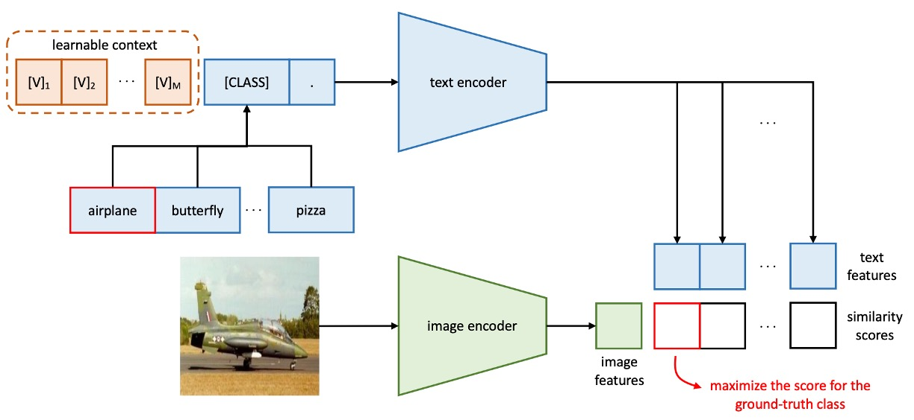

## 搖曳的呢喃

[**Learning to Prompt for Vision-Language Models**](https://arxiv.org/abs/2109.01134)

---

稍早我們也看過 Soft Prompts 這篇論文了，現在就來看看後續的相關應用。

:::tip
如果你還沒看過的話，可以參考我們之前寫的文章：

- [**[21.04] Soft Prompts: 小弦切切如私語**](../2104-soft-prompts/index.md)
  :::

這種外掛式的調模型的方式，目標對象通常都是 LLM 或是 VLM。

而這篇論文的作者所定的目標是 VLM，確切來說，是我們耳熟能詳的 CLIP。

:::tip
沒聽過 CLIP？那先去看看這篇：

- [**[21.03] CLIP: 打碎次元的屏障**](../../multimodality/2103-clip/index.md)
  :::

CLIP 在 2021 年 3 月的時候發表，隔了一個月就有人提出了 Soft Prompts 的概念。

於是作者決定把 Soft Prompts 的概念拿去用在 CLIP，就有了這篇論文。

## 定義問題

<figure style={{"width": "90%"}}>

</figure>

這裡所定義的問題跟 Soft Prompts 一樣，人工設計的提示存在很多缺陷，針對不同的模型、不同的任務，會出現截然不同的結果。

如上圖，以 CLIP 為例子。如果我們用 `a photo of [CLASS]` 這樣的提示，可以得到 80% 左右的準確率，但是多加一個 `a` 改成 `a photo of a [CLASS]`，準確率居然會上升到 86%！

而且這不是特例，上圖四個不同的圖片都是這樣。

這是什麼情況？只是差幾個無關緊要的字，居然能夠出現這麼大的差距？

:::tip
等到你好不容易掌握了這個模型的特性，然後市場上又出現了新的模型，只好再重新來過。
:::

## 複習 CLIP

我們猜你不會想去看 CLIP 的論文，所以簡單複習一下 CLIP 的架構。

<figure style={{"width": "70%"}}>

</figure>

CLIP 包含兩個編碼器：

- **影像編碼器**：將高維的影像資料嵌入到低維度的特徵空間中。影像編碼器的架構可以採用 CNN 或 ViT。
- **文本編碼器**：基於 Transformer，將自然語言轉換為文本表示。

輸入的文本資料，處理方式為 BPE（Byte Pair Encoding）表示法，並轉換為 512 維的詞嵌入向量。其中，詞彙表大小為 49,152。在訓練過程中，句子會加入特殊符號 `[SOS]` 和 `[EOS]`，並限制最大長度為 77。最後，取 `[EOS]` 位置的特徵進行 LayerNorm，並經由線性投影層處理。

CLIP 的學習目標是對齊影像與文本的嵌入空間。概念是給定一組影像-文本配對的批次資料，模型最大化配對樣本之間的餘弦相似度，同時最小化未配對樣本之間的餘弦相似度。

CLIP 的訓練資料規模非常龐大，為了讓模型能夠學習更多樣化的視覺概念，CLIP 團隊收集了包含 4 億組影像-文本配對的大規模訓練資料。

複習完畢，現在你也是 CLIP 大師了。

## 解決問題

### 模型架構

<figure style={{"width": "90%"}}>

</figure>

上圖就是文本上下文優化（Context Optimization, CoOp）的架構，透過將上下文詞彙建模為可從資料中學習的連續向量，避免了手動調整提示詞的過程。

其中作者又分成兩個不同的訓練方式：

- **統一上下文**

  原文為 Unified Context，簡稱 UC。

  在提示詞的設計設計上，對於所有的類別，使用相同的上下文詞向量組成統一的提示詞，其提示詞的結構如下：

  $$
  t = [V]_1 [V]_2 \dots [V]_M  \text{[CLASS]},
  $$

  其中，$[V]_m$（$m \in \{1, \dots, M\}$）是一個與詞嵌入維度相同的向量，例如 CLIP 的特徵維度為 512，$M$ 為超參數，表示上下文詞元的數量。

  推理過程如下：

  - 將提示詞 $t$ 傳遞至文本編碼器 $g(\cdot)$，獲得對應的分類權重向量（仍取自 [EOS] 標記的位置）。
  - 預測概率計算公式如下：

  $$
  p(y = i|x) = \frac{\exp(\cos(g(t_i), f)/\tau)}{\sum_{j=1}^K \exp(\cos(g(t_j), f)/\tau)},
  $$

  其中，$t_i$ 表示用於第 $i$ 類的提示詞，包含該類別名稱的詞嵌入向量。

  :::tip
  除了將類別詞元 `[CLASS]` 放在提示詞的結尾，也可以將其放置在中間，像是這樣：

  $$
  t = [V]_1 \dots [V]_{\frac{M}{2}} \text{[CLASS]} [V]_{\frac{M}{2}+1} \dots [V]_M.
  $$

  :::

- **類別專屬上下文**

  原文為 Class-Specific Context，簡稱 CSC。

  在提示詞的設計上，對於每個類別，使用獨立的上下文詞向量。

  提示詞的結構如下：

  $$
  t_i = [V]_i^1 [V]_i^2 \dots [V]_i^M \text{[CLASS]},
  $$

  其中，$[V]_i^m$（$m \in \{1, \dots, M\}$）是一個與詞嵌入維度相同的向量，$M$ 為超參數，表示上下文詞元的數量。

  推理過程如下：

  - 將提示詞 $t_i$ 傳遞至文本編碼器 $g(\cdot)$，獲得對應的分類權重向量（仍取自 [EOS] 標記的位置）。
  - 預測概率計算公式如下：

  $$
  p(y = i|x) = \frac{\exp(\cos(g(t_i), f)/\tau)}{\sum_{j=1}^K \exp(\cos(g(t_j), f)/\tau)},
  $$

  其中，$t_i$ 表示用於第 $i$ 類的提示詞，包含該類別名稱的詞嵌入向量。

:::tip
簡單來說，要不就是全部的類別都共用一組可學習的上下文詞向量，要不就是每個類別都有自己的一組。

直覺上來看，每個類別都有一組屬於自己的上下文詞向量，應該會有更好的效果。

真的是這樣嗎？我們繼續看一下實驗結果。
:::

## 討論

### 在多個資料集上的效果

<figure style={{"width": "90%"}}>

<figurecaption>實線表示 CoOp 對 CLIP 的改進，星星表示零樣本 CLIP 虛線表示線性探針替代方案。 $M$ 表示上下文長度 「end」或「mid」表示將類別標記放在末尾或中間 CSC 表示特定於類別的上下文。</figurecaption>
</figure>

---

從上圖可見，CLIP+CoOp 在僅需兩個樣本（2-shot）的情況下，即可顯著超越零樣本 CLIP。當樣本數增加到 16-shot 時，平均性能增益約為 15%。

在 EuroSAT 和 DTD 這兩個專門任務上，性能提升分別超過 45% 和 20%。在細粒度數據集（Flowers102、StanfordCars、FGVCAircraft）以及場景和行動辨識數據集（SUN397、UCF101）上，性能增益也普遍超過 10%。

對於挑戰性較高的 ImageNet 數據集（包含 1,000 類別），也提升 4.77%。

### UC 和 CSC 的比較

剛提到了統一上下文（Unified Context）與類別專屬上下文（CSC），哪個效果更好呢？

這裡還是根據上圖來看，比較有 CSC 和沒有 CSC 的情況下，UC 的效果。

平均而言，UC 在多數場景下表現更佳。但在細粒度數據集（StanfordCars、Flowers102、FGVCAircraft）及專門任務（DTD、EuroSAT）中，CSC 表現更為突出，特別是在 16-shot 時。

所以並不是說有哪個方法一定比較好，而是根據任務需求選擇適合的版本可以進一步提升性能。

### 泛化能力轉移

<figure style={{"width": "80%"}}>

</figure>

由於 CLIP 已經具備很強的 Zero-shot 能力，所以作者擔心 CoOp 基於特定的數據集進行微調，會不會影響到 CLIP 的泛化能力？

上表的 `source` 指的是使用 `ImageNet` 進行微調，`target` 則是用來測試泛化能力的數據集。

實驗結果顯示 CoOp 增強了 CLIP 對分佈轉移的穩健性，表示提示詞的設計和學習具有跨域適應能力。

### 需要多長的提示詞？

<figure style={{"width": "60%"}}>

</figure>

作者在 11 個數據集上進行實驗，將上下文長度設置為 4、8 和 16。

實驗發現增加上下文詞元數量通常會提升性能，特別是在上下文長度較長（如 16）時，將類別詞元放置於中間（mid）的效果更明顯。但沒有固定的最佳上下文長度，需在性能與分佈轉移穩健性之間尋求平衡。

### 初始化方法

<figure style={{"width": "40%"}}>

</figure>

作者比較了隨機初始化和手工初始化的效果。手工初始化使用 "a photo of a" 的嵌入向量。

結果顯示良好的初始化對性能影響不大，雖然進一步調整初始化詞元可能有所幫助，但隨機初始化在實踐中已足夠高效。

### 提示詞的解釋性

<figure style={{"width": "90%"}}>

</figure>

由於上下文向量是在連續空間中優化，難以直接解釋。

這裡作者採用間接方式，基於歐幾里得距離在詞彙表中搜尋與學習向量最近的詞彙。

以下展示在部分數據集上的搜尋結果：

- Food101："enjoyed" 與任務相關。
- OxfordPets："fluffy"、"paw" 有一定相關性。
- DTD："pretty" 反映材質描述。

實驗結果顯示，基於最近詞解釋學習提示詞的準確性有限，因為向量的語義未必與最近詞完全相關，學習向量可能超越了現有詞彙的語義空間，可能表示了更高維度的語義信息。

### 結論

本研究的實驗結果顯示，CoOp 在多個數據集上表現出色，特別是在領域泛化方面，顯著優於手工設計的提示詞，展現了其在數據高效學習中的潛力與優勢。

作為首次針對使用提示詞學習適配大規模視覺模型進行的全面研究，這項工作具有重要的開創性意義，不僅為提示詞學習提供了實證支持，也為未來的研究奠定了基礎。

:::tip
需要注意的是，後續研究發現 CoOp 在某些情況下對噪聲標籤較為敏感，且學習到的上下文難以推廣至同一數據集中未見過的類別，顯示出其在訓練期間可能過度擬合於基類的限制性特徵。

我們有空再來看看後續的研究是如何克服現有的這些挑戰的。
:::
