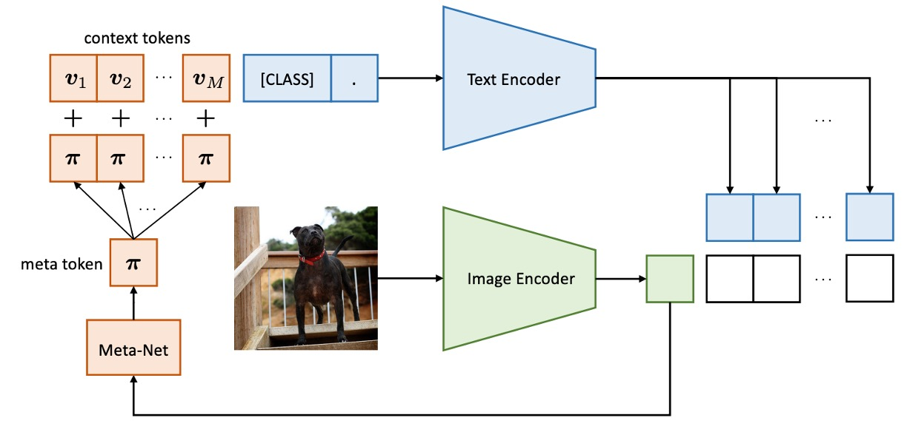
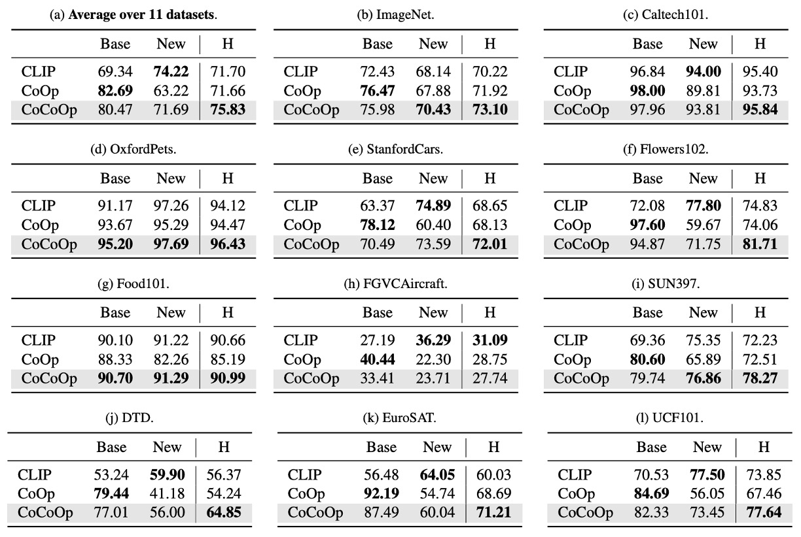

# [22.03] CoCoOp

## 先看過影像再說

[**Conditional Prompt Learning for Vision-Language Models**](https://arxiv.org/abs/2203.05557)

---

作者發表了 CoOp 後，發現了點問題。

用來引導 VLM 的 token 和輸入影像是獨立的，也就是說，這些 token 在完成訓練之後就不會再去考慮影像的資訊。

:::tip
如果你還沒讀過 CoOp 的話，可以參考我們之前寫的文章：

- [**[21.09] CoOp: 搖曳的呢喃**](../2109-coop/index.md)
  :::

## 定義問題

由於視覺語言模型通常包含數億到數十億參數，全模型微調在資源需求上不切實際，且可能破壞模型的預訓練表示空間。於是在這之前，作者先提出了 CoOp，透過 Prompt learning 的方式，引導模型泛化到新任務上。

但是 CoOp 在學習上下文時，會過度擬合於特定訓練類別，導致在未見類別中準確率顯著下降。這樣的靜態設計缺乏泛化能力，難以處理更廣泛的場景。

一個直觀的想法是：我們可以讓模型在預測時，可以根據輸入的影像資訊，來調整 token 的內容。

## 解決問題

這一篇論文架構和上一代的 CoOp 幾乎一樣，我們就挑一些重要的部分來看。

### 模型架構

<figure style={{"width": "80%"}}>

</figure>

CoCoOp 和 CoOp 的差別在於多了一個分支，把影像的特徵導向到 token 的生成過程中。

在此之前，影像和文字的分支是獨立運作的，而這個架構則是讓影像的資訊可以影響到文字的生成。

:::tip
第一代的 CoOp 架構長這樣：

<figure style={{"width": "80%"}}>

</figure>

:::

CoCoOp 的方法是引入一個輕量級神經網路（Meta-Net），結合可學習上下文向量生成輸入條件上下文。Meta-Net 為兩層瓶頸結構（Linear-ReLU-Linear），隱藏層將輸入維度壓縮至 16 倍，輸入為影像編碼器的輸出特徵。

條件上下文向量公式如下：

$$
v_m(x) = v_m + \pi, \quad \pi = h_\theta(x)
$$

提示格式更新為 $t_i(x) = \{v_1(x), v_2(x), ..., v_M(x), c_i\}$，預測機率公式更新為：

$$
p(y|x) = \frac{\exp(\text{sim}(x, g(t_y(x)))/\tau)}{\sum_{i=1}^{K} \exp(\text{sim}(x, g(t_i(x)))/\tau)}
$$

在訓練過程中，上下文向量 $\{v_m\}_{m=1}^M$ 與 Meta-Net 參數 $\theta$ 同時進行優化，基礎模型（CLIP）保持凍結。

:::tip
我們又輕鬆愉快地看完一篇論文！
:::

## 討論

這裡主要看一下 CoCoOp 和 CoOp 的差異。

### 對於未見類別的泛化能力

作者同樣在 11 個不同的資料集上進行實驗，在表格中，`Base` 表示基礎類別，`New` 表示未見類別。`CoOp` 是第一代的模型，`CoCoOp` 是這一篇的模型。

從上表中我們可以觀察到，雖然 CoOp 在基類別中的表現優於 CLIP，但在新類別的準確率顯著下降，平均準確率從基類別的 82.69% 下滑至新類別的 63.22%，產生近 20% 的差距。這可能是因為 CoOp 過度優化基類別，導致新類別表現不佳，這凸顯了提升學習型提示泛化能力的必要性。

CoCoOp 在新類別中的準確率提升至 71.69%，顯著縮小與手工提示間的差距。在 11 個數據集中，有 5 個數據集的準確率提升超過 10%，例如 ImageNet 準確率從 67.88% 提升至 70.43%，甚至超越 CLIP 的 68.14%。

相較於 CoOp，CoCoOp 的基類別準確率在部分數據集中略有下降，但 9 個下降案例中有 6 個數據集的降幅低於 3%，且新類別的顯著提升足以彌補基類別的損失。例如 StanfordCars 在基類別準確率下降 7.63% 的情況下，新類別準確率提升 13.19%，整體平均提升 5.56%。

### 增加參數量誰不會？

<figure style={{"width": "70%"}}>

</figure>

CoCoOp 引入 Meta-Net，增加了參數量，專業的你立刻就會問：

- **這個提升是否僅來自於增加的參數量？**

為此作者設計了一個實驗，移除 CoCoOp 的 Meta-Net，將 CoOp 的上下文數量增加至與 CoCoOp 參數量相近的最大值。

根據上表結果顯示，比較 `CoOp (ctx=60)` 和 `CoOp (ctx=4) + Meta-Net` 在接近參數量的情況下，`CoOp (ctx=60)` 並沒有提升對於新類別的泛化能力，反而還降低了 2.54%，這再次證明了作者對於 CoOp 過度擬合的基礎類別的觀點。

因此 CoCoOp 的改進來自條件上下文設計，而非單純的參數增長。

## 結論

CoCoOp 基於條件提示的設計，解決靜態提示的泛化問題，並且在多種場景中表現卓越，像是跨數據集的提示遷移、域泛化場景等。

作者在最後提到，CoCoOp 的訓練效率顯著低於 CoOp，而且在 11 個數據集中，有 7 個數據集的未見類別性能仍低於 CLIP，顯示學習型提示與手工提示的性能差距尚未完全彌合，問題遠遠還沒到結束的時候。

:::tip
在 CLIP 的影像分支和文字分支的中間，加入更多華麗的 Prompt learning 的工程，可說是這幾年的熱門研究方向之一，有時間我們再來彙整一下。
:::
