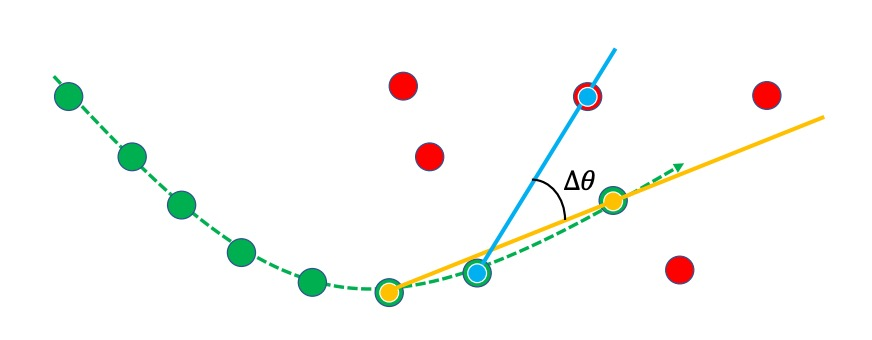
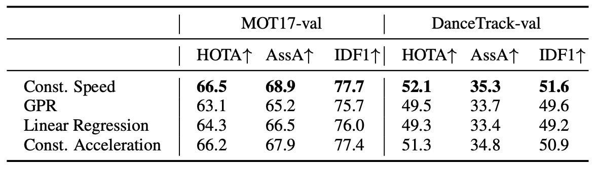
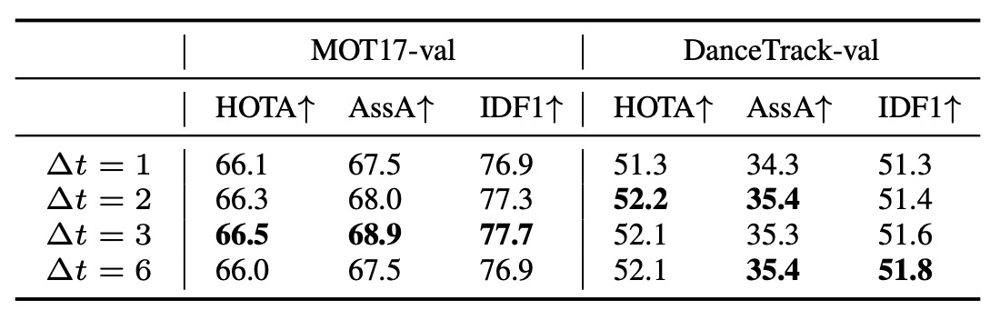

## 掙脫卡曼的囚籠

[**Observation-Centric SORT: Rethinking SORT for Robust Multi-Object Tracking**](https://arxiv.org/abs/2203.14360)

---

之前物件追蹤的部分我們學得比較少，這次我們從 CVPR 的論文來切入這個領域。

這篇筆記我們會寫得比較詳細一點，先把之前不熟悉的指標和方法補起來。

## 定義問題

在多目標追蹤（Multi-Object Tracking, MOT）這個領域裡，任務看似簡單：

- **在每一幀影像中找到所有物體，並讓它們在時間軸上保持一致的 ID。**

然而，這個「讓它是同一個」的問題，往往比「找到它」更困難。

---

現代 MOT 幾乎都建立在 **Tracking-by-Detection** 的框架之上：

也就是：先偵測，再追蹤。

我們通常會先有一個「偵測模型（Detection）」，然後用一個「追蹤模型（Tracking）」來串聯這些偵測結果，形成軌跡（Trajectory）。

其中最具代表性的系統，就是 **SORT（Simple Online and Real-time Tracking）**。

它以 **Kalman Filter** 為基礎，假設物體在短時間內的速度近似恆定，並以線性運動模型預測未來位置。

這個假設讓 SORT 既簡潔又高效，成為「即時追蹤」的象徵：它能在毫秒內完成預測，卻仍維持穩定的結果。然而，這個優雅的假設，其前提也同樣無比地脆弱：

> **物體的運動必須是線性的。**

任何一個用過的人都知道這個假設到底有多不真實。

我們可以發現被偵測的人會停下腳步、車會轉彎、鏡頭會抖動，而遮蔽（occlusion）幾乎無所不在。當物體被遮擋、再出現時，Kalman Filter 的預測早已偏離真實軌跡。

預測誤差在時間中累積，最終導致追蹤「斷線」與 ID「重置」。

當軌跡不再連貫，MOT 的任務也就宣告失敗。

你可能會考慮引入更高的「幀率（frame rate）」來緩解這個問題。

但是實際的情況卻更加吊詭：**「高幀率」並沒有緩解問題，反而加劇了它。**

理論上，幀率越高，線性假設越合理；但實際上，兩幀之間的位移微小到與雜訊同級，Kalman Filter 估出的速度因而劇烈抖動，噪聲被不斷放大、疊加，最終將整條軌跡推離真實位置。

同時，另一個更根本的矛盾也逐漸浮現：

> **現代的偵測器往往比追蹤器的「估計模型」更準確。**

在 SORT 的架構裡，觀測只是用來輔助更新估計的資訊；真正決定軌跡延伸的，仍是「模型預測」本身。意思就是，哪怕 Detection 模型已經明確地告訴你「物體」已經到某個位置了，但 Tracking 模型仍然會依照自己的估計，將軌跡延伸到另一個位置。

這簡直是本末倒置！

因此，本篇論文的作者從這個矛盾出發，重新思考「觀測」與「估計」的關係，試圖讓軌跡的延伸重新回到觀測本身的核心地位。

這到底會不會是一個好主意呢？

## 重新審視 SORT 的侷限

在談 OC-SORT 之前，我們得先回到它的起點：卡曼濾波（Kalman Filter）。

這個經典演算法是所有線性追蹤模型的核心，SORT 正是建立在它之上。

Kalman Filter（KF）是一種**線性狀態估計器**。

它假設目標的運動符合離散時間的線性動態系統，並在每一個時間步中交替進行兩個階段：分別是「**預測（predict）**」與「**更新（update）**」。以先驗（predict）預測狀態，再用後驗（update）修正偏差。在沒有觀測的情況下，它依然能繼續「預測未來」，這也是它在追蹤問題中如此受歡迎的原因。

SORT 將 Kalman Filter 應用於視覺追蹤。

它定義的狀態向量為：

$$
\mathbf{x} = [u, v, s, r, \dot{u}, \dot{v}, \dot{s}]^\top
$$

其中：

- $(u, v)$：物體中心在影像中的座標
- $s$：bounding box 的面積
- $r$：bounding box 的長寬比（假設為常數）
- $(\dot{u}, \dot{v}, \dot{s})$：對應的速度項

偵測器提供觀測向量：

$$
\mathbf{z} = [u, v, w, h, c]^\top
$$

即中心點、寬高與置信度。

SORT 假設物體在短時間內遵循線性運動模型：

$$
u_{t+1} = u_t + \dot{u}_t \Delta t, \quad
v_{t+1} = v_t + \dot{v}_t \Delta t
$$

在固定幀率下（$\Delta t = 1$），每個 frame 間的位移可以被視為線性近似。

高幀率時，這個假設通常足夠好，因為物體在連續幀之間的移動量很小，即使舞者旋轉、拳擊手揮拳，也能在局部時間內被「近似為線性」。

然而，當物體被遮擋（occlusion）時，偵測器無法提供觀測值，Kalman Filter 只能進行「虛擬更新」：

$$
\hat{\mathbf{x}}_{t|t} = \hat{\mathbf{x}}_{t|t-1}, \quad
\mathbf{P}_{t|t} = \mathbf{P}_{t|t-1}
$$

這意味著系統會「盲信」自己的預測，即使它沒有任何新的觀測依據。

這種依賴估計而非觀測的設計，正是 SORT 的根本侷限。

SORT 的侷限還遠不止這樣，以下是三個主要的問題：

1.  **對狀態雜訊過於敏感**

    假設物體中心位置的估計服從高斯分布：

    $$
    u \sim \mathcal{N}(\mu_u, \sigma_u^2), \quad v \sim \mathcal{N}(\mu_v, \sigma_v^2)
    $$

    那麼根據線性運動模型：

    $$
    \dot{u} = \frac{u_{t+\Delta t} - u_t}{\Delta t}, \quad
    \dot{v} = \frac{v_{t+\Delta t} - v_t}{\Delta t}
    $$

    可得速度的噪聲分布：

    $$
    \delta \dot{u} \sim \mathcal{N}\left(0, \frac{2\sigma_u^2}{(\Delta t)^2}\right), \quad
    \delta \dot{v} \sim \mathcal{N}\left(0, \frac{2\sigma_v^2}{(\Delta t)^2}\right)
    $$

    也就是說，**幀率越高（$\Delta t$ 越小），速度估計的雜訊越大。**

    對 MOT17 資料集而言，每幀平均位移僅約 1–2 像素，這意味著只要位置誤差有 1 像素，估出的速度就可能完全錯亂。雖然單幀的偏差看似微小，但在連續時間中，它會被重複放大與累積。

---

2.  **誤差的時間放大效應**

    當遮蔽發生時，Kalman Filter 無法獲得新的觀測。它只能依靠過去的估計持續外推。

    假設在 $T$ 幀內無觀測，則：

    $$
    u_{t+T} = u_t + T \dot{u}_t, \quad v_{t+T} = v_t + T \dot{v}_t
    $$

    這時位置誤差會成平方級增長：

    $$
    \delta u_{t+T} \sim \mathcal{N}(0, 2T^2\sigma_u^2), \quad
    \delta v_{t+T} \sim \mathcal{N}(0, 2T^2\sigma_v^2)
    $$

    假設位置方差僅 1 pixel，連續 10 幀遮蔽就足以讓軌跡偏移超過整個行人身高（數百像素）。

    當場景擁擠時，這樣的錯位幾乎等於追蹤失效。

---

3. **估計導向的設計缺陷**

   前述兩個問題，其根源都來自 SORT 的哲學：它是**估計為中心**而設計的算法。

   它允許在沒有觀測時持續更新；它信任模型預測多於真實偵測；它假設過去的估計誤差不會災難性地累積。然而在現代環境中，這些假設都不再合理。

   現代偵測器的觀測噪聲，往往遠小於 Kalman Filter 的預測噪聲。

   也就是說，「觀測」比「估計」更可靠。

   當 SORT 遇上非線性運動與遮蔽，它的估計反而成為最大的誤差來源。

## 解決問題

<figure style={{ "width": "90%"}}>

</figure>

作者提出的核心思想很簡單：

> 既然 **觀測比估計更可靠**，那麼就讓追蹤以「觀測為中心（observation-centric）」來構築，而不是以「估計」為核心。也因此，這個方法就被命名為 **OC-SORT（Observation-Centric SORT）**。

這裡有兩個關鍵設計：

1. **Observation-centric Re-Update (ORU)**：用觀測來修正遮蔽期間累積的誤差。
2. **Observation-Centric Momentum (OCM)**：在關聯階段引入「方向一致性」，但這次不再依賴估計，而是依賴真實的觀測。

整體流程如上圖所示。

- 紅色框是偵測器輸出的觀測結果
- 橘色框是活躍的追蹤軌跡
- 藍色框是失去追蹤的目標。
- 虛線框代表 Kalman Filter 的預測。

當目標 #1 在 $t+1$ 幀因為遮蔽而消失，SORT 會讓它漂移；但在 $t+2$ 幀重新出現時，OC-SORT 會觸發 ORU，把這段遮蔽期間「倒帶」重算，避免累積誤差。

---

### Observation-Centric Re-Update (ORU)

在傳統 SORT 中，即使一個目標在 $t+2$ 幀被重新找回，Kalman Filter 的參數也早已嚴重漂移。

這表示著它很快會再次丟失。

ORU 的解法是：當一個目標重新被偵測到（re-activation）時，不是直接接上原本漂移的狀態，而是使用「虛擬軌跡（virtual trajectory）」來回溯修正。

數學上，假設最後一次被看見的觀測是 $z_{t_1}$，而在 $t_2$ 再次出現時有觀測 $z_{t_2}$，那麼在遮蔽區間 $t_1 < t < t_2$，我們生成一條插值軌跡：

$$
{\mathbf{z}}_t = Traj_{\text{virtual}}(\mathbf{z}_{t_1}, \mathbf{z}_{t_2}, t), \quad t_1 < t < t_2
$$

接著，Kalman Filter 會在這些虛擬觀測上重新執行「預測-更新」迴圈：

$$
\begin{cases}
\mathbf{K}_t = \mathbf{P}_{t|t-1}\mathbf{H}_t^\top(\mathbf{H}_t\mathbf{P}_{t|t-1}\mathbf{H}_t^\top + \mathbf{R}_t)^{-1} \\
\hat{\mathbf{x}}_{t|t} = \hat{\mathbf{x}}_{t|t-1} + \mathbf{K}_t (\mathbf{z}_t - \mathbf{H}_t \hat{\mathbf{x}}_{t|t-1}) \\
\mathbf{P}_{t|t} = (\mathbf{I} - \mathbf{K}_t \mathbf{H}_t) \mathbf{P}_{t|t-1}
\end{cases}
$$

這樣做的效果如下圖所示：

<figure style={{ "width": "90%"}}>

</figure>

當舞龍表演的演員在第二幀被遮擋，到第三幀重新出現時，若不使用 ORU，Kalman Filter 的估計中心（白色星號）會偏移嚴重，導致錯失關聯；而 ORU 用虛擬觀測修正後，新的估計中心（黃色星號）能與偵測框重新對齊，追蹤得以延續。

---

### Observation-Centric Momentum (OCM)

除了修正累積誤差，作者還希望在關聯階段更穩健。

在理想情況下，物體運動方向應當具有一致性：一個人往左跑，不應突然被配對成往右的偵測框。

問題是，如果依賴 Kalman Filter 的估計來算方向，會受到嚴重噪聲影響。因此，OCM 提出一個觀測導向的設計：用真實偵測的觀測點計算方向，再將方向一致性引入關聯成本矩陣。

數學上，關聯成本被定義為：

$$
C(\hat{\mathbf{X}}, \mathbf{Z}) = C_{\text{IoU}}(\hat{\mathbf{X}}, \mathbf{Z}) + \lambda C_v(\mathcal{Z}, \mathbf{Z})
$$

- $C_{\text{IoU}}$：IoU-based 成本
- $C_v$：方向一致性成本
- $\lambda$：權重超參數

其中 $C_v$ 衡量兩個角度差異：

1. $\theta_{\text{track}}$：由既有軌跡上兩個觀測點形成的方向
2. $\theta_{\text{intention}}$：由軌跡最後一個觀測點到新偵測框的方向

方向差異為：

$$
\Delta \theta = |\theta_{\text{track}} - \theta_{\text{intention}}|
$$

角度 $\theta$ 的計算公式為：

$$
\theta = \arctan \frac{v_1 - v_2}{u_1 - u_2}
$$

詳細的概念示意，如下圖所示：

<figure style={{ "width": "60%"}}>

</figure>

綠線是既有軌跡，紅點是新的偵測，藍色連線是 $\theta_{\text{track}}$，黃色連線是 $\theta_{\text{intention}}$。

若兩者方向一致（$\Delta\theta$ 小），則關聯成本較低，更可能配對成功。

---

### Observation-Centric Recovery (OCR)

除了 ORU 與 OCM，作者還提出一個經驗上的小技巧：**OCR**。

當一個追蹤在正常關聯階段沒有找到匹配，OCR 會嘗試用最後一次的觀測再與新的偵測進行「第二次關聯」。

這在處理**短暫遮蔽**或**靜止物體**時特別有效。

## 討論

為了全面驗證 OC-SORT 的穩健性，作者在多個多目標追蹤資料集上進行評估：

- **MOT17**

  - **任務**：針對城市場景中的行人進行追蹤。
  - **資料特徵**：

    - 包含 **7 段影片**，同一段影片提供來自不同檢測器的標註（DPM、Faster R-CNN、SDP），因此常用於比較不同偵測輸入下的追蹤表現。
    - 幀率通常在 **30 FPS** 左右，時間間隔較短，因此物體運動大多近似線性。
    - 場景雖然有遮蔽，但複雜程度屬於中等。

  - **挑戰性**：

    - 行人之間會互相靠近或交錯，但大部分情況下，Kalman Filter 的線性假設仍相當合理。
    - 適合用來測試「基本 MOT 系統」的追蹤效能。

  ***

  :::info
  參考文獻：[**Mot16: A benchmark for multi-object tracking**](https://arxiv.org/abs/1603.00831)
  :::

  ***

- **MOT20**

  - **任務**：同樣是行人追蹤，但場景更加極端。
  - **資料特徵**：

    - 收錄於 **2020 年**，專為挑戰「高密度人群 (crowded scenes)」而設計。
    - 行人數量極高，每張影像可能同時標註超過 **100 個行人**。
    - 遮蔽 (occlusion) 與重疊 (overlap) 非常嚴重。

  - **挑戰性**：

    - 即使幀率仍偏高，行人之間的互相遮擋會讓「單純的線性運動模型」失效。
    - SORT、DeepSORT 這類基於 Kalman Filter 的方法，往往在這裡出現大量 ID switch。
    - 更適合作為「遮蔽下的極限壓力測試」。

    ***

  :::info
  參考文獻：[**Mot20: A benchmark for multi object tracking in crowded scenes**](https://arxiv.org/abs/2003.09003)
  :::

  ***

- **KITTI**

  - **任務**：行人與汽車追蹤
  - **特徵**：

    - 採用車載視角，主要場景是街道與交通環境
    - **幀率僅 10 FPS**，時間間隔大 → 線性假設容易失效
    - 因此，非線性運動更明顯（例如行人突然橫穿馬路、車輛轉彎或加速）

  - **挑戰性**：

    - 預測需要涵蓋更長的時間間隔
    - 傳統 Kalman Filter 在這種低幀率環境中更容易累積誤差

  ***

  :::info
  參考文獻：[**Vision meets robotics: The kitti dataset**](https://www.cvlibs.net/publications/Geiger2013IJRR.pdf)
  :::

  ***

- **DanceTrack**

  - **任務**：舞蹈場景中的人類追蹤
  - **特徵**：

    - 偵測本身容易，bounding box 定位準確
    - **運動高度非線性**：旋轉、交叉、換位頻繁
    - 行人之間外觀高度相似（穿著一致），單靠外觀難以區分
    - 遮蔽嚴重，身份交錯頻繁發生

  - **挑戰性**：

    - 強調「關聯正確性」而非單純的檢測
    - 特別考驗追蹤器是否能在非線性運動與高頻遮蔽下保持 ID 穩定

  ***

  :::info
  參考文獻：[**DanceTrack: Multi-Object Tracking in Uniform Appearance and Diverse Motion**](https://arxiv.org/abs/2111.14690)
  :::

  :::tip
  本文特別強調這個資料集，因為它正好符合「非線性運動 + 遮蔽」的挑戰場景
  :::

  ***

- **CroHD**

  - **任務**：人群中的頭部追蹤
  - **特徵**：

    - 極度擁擠的人群場景
    - 標註對象不是整個行人，而是「頭部」，更強調在高密度場景下的分辨能力

  - **挑戰性**：

    - 遮蔽與重疊程度極高
    - 適合用來測試追蹤器在「超擁擠場景」中的極限表現

  - **在本篇論文中，該資料集結果僅放於附錄，作為額外驗證**：

  ***

  :::info
  參考文獻：[**Tracking Pedestrian Heads in Dense Crowd**](https://arxiv.org/abs/2103.13516)
  :::

  ***

從這些資料集的設計可以看到，作者刻意選擇了不同場景：MOT 與 KITTI 偏線性，DanceTrack 則幾乎是「非線性運動的極端測試場」。

為了公平比較，OC-SORT 並沒有重新訓練偵測器，而是直接採用既有 baseline 的公開檢測結果：

- MOT17 / MOT20 / DanceTrack → 使用 **ByteTrack** 提供的 **YOLOX** 偵測器權重
- KITTI → 使用 **PermaTrack** 官方釋出的偵測結果

這樣能確保差異來自追蹤方法，而不是檢測品質。

在 ORU 與 OCM 的細節上，作者做了明確設定：

- **ORU 虛擬軌跡生成**

  遮蔽期間採用**恆定速度假設**，即：

  $$
  {z}_t = z_{t_1} + \frac{t - t_1}{t_2 - t_1}(z_{t_2} - z_{t_1}), \quad t_1 < t < t_2
  $$

  （公式的具體形式，實際上就是線性插值）

- **OCM 運動方向估計**

  - 使用相隔 **三幀（Δt = 3）** 的觀測點計算方向
  - 測量方式：兩條方向角的**絕對差值（弧度制）**
  - 權重 $\lambda$ 設為 **0.2**

- **其他設定**

  - 檢測門檻：MOT20 → 0.4，其餘資料集 → 0.6
  - 關聯 IoU 門檻：0.3

---

追蹤的評估指標並不只有傳統的 MOTA。

本文更強調能反映「關聯品質」的指標：

- **HOTA**

  - 主指標，兼顧「檢測準確度」與「關聯準確度」

- **AssA**

  - 專門評估 **association performance**（即「是否能持續跟對同一個目標」）

- **IDF1**

  - 衡量 ID 一致性的指標，也屬於關聯類

其他指標如 MOTA 也有報告，但作者指出：

由於 MOTA 與檢測表現高度相關，只有在「所有方法使用相同檢測結果」時才公平比較。因此，本文將這種情境稱為 **public tracking**，並在論文附錄 C 詳細列出。

### MOT17 結果

<figure style={{ "width": "90%"}}>

</figure>

在 **MOT17** 上，OC-SORT 與現有最先進方法保持相當水準。

由於 MOT17 的場景多為 **線性或近線性的行人運動**，原本 SORT 的設計在這裡已經相對穩定，因此 OC-SORT 的優勢並不特別顯著。但即便如此，OC-SORT 在 **關聯準確度（AssA, IDF1）** 上仍展現出持續改善。

需要注意的是：為了公平比較，作者直接採用了 ByteTrack 的 YOLOX 偵測結果。OC-SORT 沒有像 ByteTrack 那樣動態調整 detection threshold，也沒有引入額外的低置信度檢測來提升 MOTA。儘管如此，OC-SORT 依然能在 HOTA 與 IDF1 等衡量「關聯正確性」的指標上保持優勢。

這證明了即使在「線性運動 + 遮蔽不嚴重」的場景中，觀測導向的設計仍能提供更穩定的軌跡延續。

### MOT20 結果

<figure style={{ "width": "90%"}}>

</figure>

相比 MOT17，**MOT20 更加擁擠，遮蔽頻繁**，正好是 SORT 的弱點。

在這個挑戰性場景中，OC-SORT 展現了明顯優勢：

- 在 **HOTA 指標上達到 62.1**，刷新了當時的 SOTA。
- 在行人嚴重互相遮擋時，傳統 SORT 會因為誤差累積導致大量 ID switch；而 OC-SORT 的 ORU 機制能有效「修補遮蔽期間的錯誤」，維持 ID 的連續性。

雖然 OC-SORT 仍保持簡單設計（未使用 ByteTrack 那樣的 adaptive threshold 或多檢測融合），但它在極端人群場景下依然穩定超越其他方法，說明「觀測導向」的設計特別適合高遮蔽環境。

### DanceTrack 結果

<figure style={{ "width": "80%"}}>

</figure>

**DanceTrack 是 OC-SORT 的核心驗證資料集**。

在這個資料集中：

- 偵測容易，但運動高度非線性（旋轉、交叉、換位頻繁）。
- 參與者外觀高度相似，靠外觀無法有效區分。
- 遮蔽與 ID 交錯幾乎是常態。

結果顯示 OC-SORT **大幅度超越基準方法**，在 HOTA 與 IDF1 上均創下新高。當舞者彼此交錯時，傳統 SORT 容易 ID 斷裂或重置，而 OC-SORT 依靠 ORU 與 OCM 保持了穩定的軌跡。

這證明了**在「非線性運動 + 遮蔽」場景下，OC-SORT 的觀測導向設計確實有效**。

### KITTI 結果

<figure style={{ "width": "90%"}}>

</figure>

**KITTI** 的挑戰來自於低幀率（10 FPS）：

對行人追蹤來說，OC-SORT 在這裡達到了新的 SOTA，明顯超越 PermaTrack，同時速度提升近 **10 倍**。這代表在「低幀率 + 行人運動」的環境中，OC-SORT 的 ORU 能有效補足遮蔽期間的誤差，維持連續性。

然而，對於 **汽車追蹤**，結果顯示出 OC-SORT 的一個限制：

- 由於汽車速度較快，在低幀率下，連續兩幀的 bounding box IoU 幾乎為零。

OC-SORT 的預設版本仍依賴 IoU 做關聯，導致車輛追蹤表現不理想。這並非 OC-SORT 設計的內在缺陷，而是 IoU 關聯方法在高速運動下的普遍問題。

解法可能可以考慮融合其他關聯線索，或引入外觀相似度（如 DeepSORT 使用的 ReID 特徵）。

### 模組貢獻分析

作者首先在 **MOT17** 與 **DanceTrack** 的驗證集上，分別關閉／開啟各模組進行測試，結果如下表：

<figure style={{ "width": "70%"}}>

</figure>

整體趨勢十分明確：

- **ORU 的貢獻最為顯著。**

  在兩個資料集上皆帶來明顯的 HOTA 與 IDF1 提升。這代表當追蹤軌跡在遮蔽後重新出現時，利用虛擬觀測修正過往誤差確實能顯著提升穩定性。

- **OCM 的效果具場景依賴性。**

  - 在 **DanceTrack** 上（非線性運動 + 遮蔽頻繁），OCM 顯著提升關聯表現。
  - 在 **MOT17** 上則相對有限，因為大部分行人運動軌跡近似線性，方向一致性並非主要問題。

結果顯示 ORU 提供「遮蔽期間的修復能力」，而 OCM 提供「非線性運動的穩定關聯」，兩者組合讓 OC-SORT 在各種動態場景下都能保持穩健。

### ORU 的虛擬軌跡生成方式

<figure style={{ "width": "70%"}}>

</figure>

在 ORU 中，OC-SORT 必須為「被遮蔽的一段時間」生成虛擬觀測點。

作者測試了多種軌跡生成假設，包括：

- **Constant Speed（恆定速度）** ← 論文採用
- Constant Acceleration（恆定加速度）
- Linear Regression（線性回歸）
- Gaussian Process Regression（GPR, 使用 RBF kernel）
- Near Constant Acceleration Model（NCAM）

實驗結果如上表，局部假設（Local Hypotheses）表現遠優於全域回歸（Global Regression）。

原因在於 ORU 是在「線上追蹤」過程中即時運行的，在遮蔽期間可用的歷史資料點往往非常有限（可能僅幾幀）。因此，嘗試用線性回歸或 GPR 這類全域方法去擬合軌跡，反而容易過擬合或不穩定。

最終，**Constant Speed 模型以最簡單的假設取得最佳穩定性與即時性**。

### OCM 的 Δt 選擇

<figure style={{ "width": "70%"}}>

</figure>

OCM 的關鍵在於計算運動方向（momentum consistency），而這需要兩個不同時間點的觀測。

問題是：時間間隔 Δt 應該多大？

- Δt 太小 → 雜訊大（速度估計極度敏感）
- Δt 太大 → 線性假設失效（物體已經改變方向）

為了找到平衡，作者在比較了不同 Δt 的結果。

結果如上表：

- 從 Δt = 1 增加到 Δt = 3 時，性能明顯提升。
- 但當 Δt 過大（例如 Δt = 5）時，性能開始下降。

這印證了理論分析： **在有限時間間隔內取觀測，可同時抑制速度噪聲又維持線性近似。**

最終實驗中，作者固定使用 **Δt = 3** 作為 OCM 的預設值。

## 結論

OC-SORT 從 SORT 的核心假設出發，指出傳統 Kalman Filter 在遮蔽與非線性運動下會因缺乏觀測而產生誤差累積。為此，它以「觀測為中心」重新設計追蹤流程：透過 **ORU** 修正遮蔽期間的偏移，並以 **OCM** 強化運動方向的一致性。這使 OC-SORT 在保持簡潔與即時性的同時，大幅提升於嚴重遮蔽與複雜運動場景下的穩定性。

對應用而言，本論文帶來的啟發在於：

> **當偵測器已足夠可靠時，追蹤的核心不在於更複雜的預測模型，而在於如何更有效地運用觀測。**

最後，雖然 OC-SORT 在多個資料集上展現出色表現，仍受限於低幀率或高速運動場景中 IoU 匹配的不穩定性。然而，作為一個模組化、即時且穩健的基線系統，OC-SORT 重新定義了「輕量追蹤器」的可能邊界。
