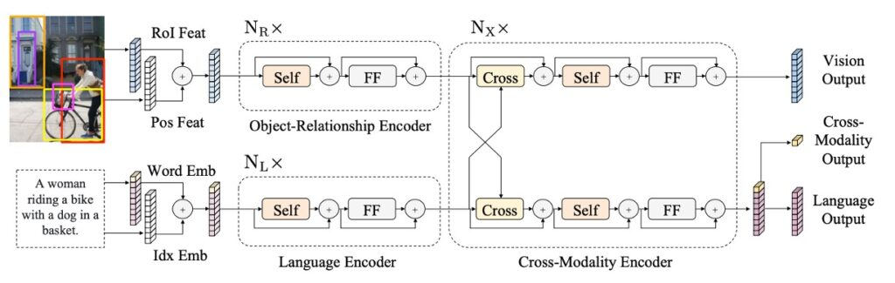

## 多來點預訓練

[**LXMERT: Learning Cross-Modality Encoder Representations from Transformers**](https://arxiv.org/abs/1908.07490)

---

這段時間的研究者們紛紛把目光投向多模態的研究。

許多研究，像是 ViLBERT、VL-BERT、VisualBERT 都是同一個月所發表的論文。

LXMERT 透過採用更多的注意力機制、更全面的預訓練策略，從而提供一個當時相對完整的視覺和語言解決方案。

## 定義問題

這段時期的論文要解決的問題都有一樣的大方向。

其問題的核心在於：

- **如何設計和訓練一個能夠有效地理解和表示視覺和語言信息，並能夠在各種跨模態任務上都有出色表現的模型？**

這件事，如 ViLBERT 和 VisualBERT 都有在做了，但作者認為他們做的並不好。

因為他們：不夠泛化。

## 解決問題

### 模型架構

這裡的設計靈感來自 Transformer 結構，它的結構整合了自注意力和交叉注意力層，使得模型可以同時處理圖像和相應的語句輸入。這種設計不僅允許模型獨立地編碼視覺和語言信息，而且還讓這兩種信息可以相互作用，共同產生一個跨模態的編碼。

首先是語言的部分，輸入的句子通過 WordPiece 分詞器進行分詞，然後再進行編碼，使得每個單詞及其在句子中的索引都得到相應的向量表示。

圖像的部分是先接收 Faster R-CNN 的輸出，並且對每個物件進行編碼，這不僅包括了物件的區域特徵，還加入了空間位置的信息，增強了模型的空間感知能力。

如上圖，最後 LXMERT 提供了三個不同層面的輸出：語言、視覺和跨模態輸出。其中，語言和視覺的輸出直接來自於跨模態編碼器的特徵序列。而跨模態輸出則利用一個特殊的 `[CLS]` 標記，這是模型最終綜合語言和視覺信息的結果，可以用於多種下游任務。

### 預訓練策略

為了使模型能夠更深入地理解視覺和語言之間的聯繫，LXMERT 在一個大型聚合資料集上進行了預訓練。

預訓練任務分為以下幾個部分：

- **語言任務 – 屏蔽跨模態語言模型**

  此任務的目的是幫助模型理解和生成句子中被隨機屏蔽的部分。

  模型會隨機地屏蔽句子中的 15% 單詞。與 BERT 不同的是，LXMERT 會結合視覺信息來預測這些被屏蔽的單詞。

  例如：當句子中的「蘋果」被屏蔽，但圖像顯示一個蘋果，LXMERT 會使用圖像提示來補全該單詞。

- **視覺任務 – 屏蔽物件預測**

  此任務目的是強化模型對圖像中物件的理解。

  圖像中的物件特徵會被隨機屏蔽，模型需要預測這些被屏蔽的物件的屬性或身份。它可以使用圖像的其他部分或與圖像相關的語言上下文作為線索。

- **跨模態任務**

  - **跨模態匹配**

    此任務旨在強化模型的能力，使其能夠理解圖像和句子之間的關聯。這裡模型會接收一個圖像和一句描述該圖像的句子，然後必須決定句子是否正確地描述了圖像。這與 BERT 的「下一句預測」任務相似，但更偏重於視覺和語言的匹配。

  - **圖像問答**

    此任務的目的是使模型能夠回答與圖像內容相關的問題。模型會接收一個圖像和一個關於該圖像的問題，然後必須生成或選擇一個正確的答案。這需要模型具有良好的視覺和語言理解，並能夠跨模態地結合兩者。

預訓練資料來自五個主要的視覺和語言資料集，這些資料集的圖像源於 MS COCO 和 Visual Genome。整體資料集包括了 18 萬張圖像，帶有 918 萬個相對應的圖像和句子配對。

模型參數從頭開始，不採用預訓練的 BERT 參數。訓練時同時使用多個預訓練任務，其損失被組合在一起進行訓練。整體預訓練過程在 4 Titan Xp 上運行了 10 天。

## 討論

### 和其他模型的比較

:::tip
在開始討論前，我有個感到困擾的地方，就是本文作者在比較對象的位置上就只寫一個「State-of-the-Art」，這樣使得我必須再仔細尋找這個 SOTA 到底確切在指誰……

好吧，算了，我們繼續吧。
:::

根據上表的數據，LXMERT 在多種測試上都展現了優異的性能。

1. **VQA (Visual Question Answering)**

   先前的最先進結果是由 Kim 等人於 2018 年提出的 [**BAN+Counter**](https://arxiv.org/abs/1805.07932)，它在 VQA 上比其他近期的方法（如 MFH、Pythia、DFAF 和 Cycle-Consistency）表現更好。

   然而，LXMERT 在整體準確性上提高了 2.1%，並在 「Binary」 和 「Other」 的問題子類別上取得了 2.4% 的改進。即使 LXMERT 並未像 BAN+Counter 那樣明確地使用計數模組，它在計數相關問題（如「Number」）上的結果仍然相同或更好。

2. **GQA**

   GQA 的最先進結果是基於 BAN 的，此結果在公共排行榜上由 Kim 等人於 2018 年提出。

   LXMERT 在 GQA 上的準確性相對於先前的 SOTA 方法提高了 3.2%，這個提高幅度超過了在 VQA 上的提高。這可能是因為 GQA 更加依賴於視覺推理。事實上，通過 LXMERT 的新型編碼器和跨模態預訓練，它在開放域問題上實現了 4.6% 的改進。

3. **NLVR2**

   通過 LXMERT 的新型預訓練策略，其在 NLVR2 的未發布測試集上的準確性顯著提高了 22%，達到 76.2%。此外，LXMERT 還在一致性評估指標上實現了顯著的進步，達到 42.1%，這是之前的 3.5 倍。

### 預訓練的重要性

1. **BERT 與 LXMERT 的比較**

   將 BERT 應用於視覺語言任務效果不好，例如 NLVR2 僅使用 BERT 模型的表現會有 22% 的性能下降。NLVR2 作為一個結合語言和視覺的複雜任務，需要模型理解圖像內容並與自然語言說明相匹配。

   LXMERT 提供了一種特殊的預訓練策略，其中不僅考慮了語言信息，還考慮了視覺信息。通過此方法，它能夠更好地捕捉視覺和語言之間的複雜關聯。

2. **影像 QA 預訓練的重要性**

   透過影像 QA 預訓練，模型不僅學習語言結構，還學習了如何從圖像中解釋和回答問題。這使得模型在 NLVR2 這樣的任務上表現得更好。

   在實驗中，使用 QA 預訓練策略的模型在 NLVR2 上提高了 2.1% 的性能。

3. **預訓練與資料增強**

   為了擴充訓練數據，資料增強在很多視覺語言任務中被廣泛採用。這種方法增加了訓練數據的多樣性，有助於模型泛化到真實世界的場景。

   與其單純增加資料量，LXMERT 採用了在多個 QA 資料集上進行預訓練的策略，這比單一資料集的資料增強更有效。

## 結論

通過將這種預訓練策略與各種預訓練任務結合，LXMERT 成功地在一系列的視覺語言任務上取得了不錯的成果。

它不僅在 VQA 和 GQA 這兩個主要的影像 QA 資料集上設下了新的標準，而且在 NLVR2 上也展現出了令人印象深刻的通用性。
