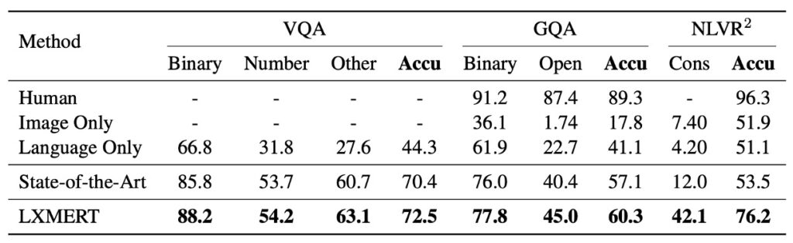

# [19.08] LXMERT

## 多來點預訓練

[**LXMERT: Learning Cross-Modality Encoder Representations from Transformers**](https://arxiv.org/abs/1908.07490)

---

隨著科技的進步，過去數年中我們見證了許多在視覺與語言結合的努力。 這一領域之所以吸引研究者不懈的探索，是因為它涉及到人類兩大主要的感知方式：視覺和語言，而這兩者在日常生活中經常是密不可分的。

回溯這條發展之路，模型如 ViLBERT、VL-BERT、VisualBERT 等都是當時的里程碑，每一個都在嘗試融合這兩種強大的資訊來源：圖像和文字。 然而，就像所有初步的研究一樣，它們都有自己的限制和特點。

LXMERT 也誕生在這一系列探索的高峰時期，但它所做的不僅僅是重複前人的成果。 相反，它選擇走一條不同的路。 透過採用更多的注意力機制、更全面的預訓練策略，LXMERT 試圖針對前人模型的某些不足進行改進，從而提供一個當時相對完整的視覺和語言解決方案。

那麼，LXMERT 在當時究竟做了哪些嘗試呢？ 它與其他研究相比，有哪些特點和貢獻？

讓我們藉此回顧，再次探訪當時的研究現場，順便也體會一下整個領域如何逐步演進。

## 定義問題

雖然作者在論文中講了一大長篇對於過去文獻的回顧和研究：

1. **Transformer 的跨模態應用**

   雖然 Transformer 已在機器翻譯中取得了成功，但它如何適應單模態和跨模態編碼器仍然是一個問題。

2. **物件特徵的編碼方式**

   [**BUTD（Anderson et al., 2018）**](https://arxiv.org/abs/1707.07998)提出使用物件的 RoI 特徵來編碼影像，但如何更好地結合物件位置和物件之間的關係，以更好地表達影像的語義？

3. **大規模預訓練模型的適用性**

   像 ELMo、GPT 和 BERT 這些模型確實展示了語言預訓練的潛力，但如何利用這些模型來訓練更具挑戰性的跨模態任務？

4. **跨模態預訓練方向的最新發展**

   近期的研究，如 ViLBERT 和 VisualBERT，嘗試了類似的跨模態預訓練。 然而，如何讓一個模型在各種任務上都有卓越的表現？ 以及，哪些額外的預訓練任務能夠真正提升模型的效能？

但說這麼多，其問題的核心在於：**如何設計和訓練一個能夠有效地理解和表示視覺和語言信息，並能夠在各種跨模態任務上都有出色表現的模型？**

這件事，如 ViLBERT 和 VisualBERT 都有在做了，但作者認為他們做的並不好，因為他們：不夠泛化。

## 解決問題

### LXMERT 模型設計

- **架構總覽**

  LXMERT 的設計靈感源於 Transformer 結構，它的結構整合了自注意力和交叉注意力層，使得模型可以同時處理圖像和相應的語句輸入。這種設計不僅允許模型獨立地編碼視覺和語言信息，而且還讓這兩種信息可以相互作用，共同產生一個跨模態的編碼。

- **輸入編碼**

  對於圖像和句子的輸入，LXMERT 首先將其轉換為對應的編碼表示。句子通過 WordPiece 分詞器進行分詞，然後再進行編碼，使得每個單詞及其在句子中的索引都得到相應的向量表示。對於圖像部分，模型選擇了一種物件級的編碼方法，這不僅包括了物件的區域特徵，還加入了空間位置的信息，增強了模型的空間感知能力。

- **編碼器設計**

  LXMERT 的核心部分是其編碼器，它包括語言編碼器、物件關係編碼器和交叉模態編碼器。在這三部分中，模型綜合運用了自注意力和交叉注意力技術，確保了模型可以深入捕捉各自模態的信息，同時還能夠在不同模態之間建立強大的關聯性。

- **輸出表示**

  最終，LXMERT 提供了三個不同層面的輸出：語言、視覺和跨模態輸出。其中，語言和視覺的輸出直接來自於跨模態編碼器的特徵序列。而跨模態輸出則利用一個特殊的 [CLS] 標記，這是模型最終綜合語言和視覺信息的結果，可以用於多種下游任務。

### 預訓練策略

為了使模型能夠更深入地理解視覺和語言之間的聯繫，LXMERT 在一個大型聚合資料集上進行了預訓練：

1. **預訓練任務**

   - **語言任務 – 屏蔽跨模態語言模型**
     - 說明：此任務的目的是幫助模型理解和生成句子中被隨機屏蔽的部分。
     - 方法：模型會隨機地屏蔽句子中的 15% 單詞。與 BERT 不同的是，LXMERT 會結合視覺信息來預測這些被屏蔽的單詞。例如：當句子中的「蘋果」被屏蔽，但圖像顯示一個蘋果，LXMERT 會使用圖像提示來補全該單詞。
   - **視覺任務 – 屏蔽物件預測**
     - 說明：此任務旨在強化模型對圖像中物件的理解。
     - 方法：圖像中的物件特徵會被隨機屏蔽，模型需要預測這些被屏蔽的物件的屬性或身份。它可以使用圖像的其他部分或與圖像相關的語言上下文作為線索。
   - **跨模態任務**
     - **跨模態匹配**
       - 說明：此任務旨在強化模型的能力，使其能夠理解圖像和句子之間的關聯。
       - 方法：模型會接收一個圖像和一句描述該圖像的句子，然後必須決定句子是否正確地描述了圖像。這與 BERT 的「下一句預測」任務相似，但更偏重於視覺和語言的匹配。
     - **圖像問答**
       - 說明：此任務的目的是使模型能夠回答與圖像內容相關的問題。
       - 方法：模型會接收一個圖像和一個關於該圖像的問題，然後必須生成或選擇一個正確的答案。這需要模型具有良好的視覺和語言理解，並能夠跨模態地結合兩者。

2. **預訓練資料**

   - 數據來自五個主要的視覺和語言資料集，這些資料集的圖像源於 MS COCO 和 Visual Genome。
   - 整體資料集包括了 18 萬張圖像，帶有 918 萬個相對應的圖像和句子配對。

3. **預訓練程序**

   - 使用 WordPiece tokenizer 進行句子的分詞。
   - 使用 Faster R-CNN 作為特徵提取器，並固定其參數。
   - 模型參數從頭開始，不採用預訓練的 BERT 參數。
   - 使用多個預訓練任務，其損失被組合在一起進行訓練。
   - 整體預訓練過程在 4 Titan Xp 上運行了 10 天。

4. **微調**

   - 在特定任務上進行微調。
   - 對模型進行必要的調整以適應特定任務。
   - 使用較小的學習率，並在預訓練的參數基礎上微調模型。

## 討論

### LXMERT 和其他模型的比較

:::tip
在開始討論前，我有個感到困擾的地方，就是本文作者在比較對象的位置上就只寫一個「State-of-the-Art」，這樣使得我必須再仔細尋找這個 SoTA 到底確切在指誰……

好吧，算了，我們繼續吧。
:::

根據上表的數據，LXMERT 在多種測試上都展現了優異的性能。

1. **VQA (Visual Question Answering)**

   - 先前的最先進結果是由 Kim 等人於 2018 年提出的 [**BAN+Counter**](https://arxiv.org/abs/1805.07932)，它在 VQA 上比其他近期的方法（如 MFH、Pythia、DFAF 和 Cycle-Consistency）表現更好。
   - 然而，LXMERT 在整體準確性上提高了 2.1%，並在 「Binary」 和 「Other」 的問題子類別上取得了 2.4% 的改進。即使 LXMERT 並未像 BAN+Counter 那樣明確地使用計數模組，它在計數相關問題（如「Number」）上的結果仍然相同或更好。

2. **GQA**

   - GQA 的最先進結果是基於 BAN 的，此結果在公共排行榜上由 Kim 等人於 2018 年提出。
   - LXMERT 在 GQA 上的準確性相對於先前的 SOTA 方法提高了 3.2%，這個提高幅度超過了在 VQA 上的提高。這可能是因為 GQA 更加依賴於視覺推理。事實上，通過 LXMERT 的新型編碼器和跨模態預訓練，它在開放域問題上實現了 4.6% 的改進。

3. **NLVR2**

   - NLVR2 是一個具有挑戰性的視覺推理數據集，其中某些已有的方法（如 Hu 等人於 2017 年的方法和 Perez 等人於 2018 年的方法）在此上表現不佳。當前的 SOTA 方法是 Suhr 等人於 2019 年提出的 [**MaxEnt**](https://arxiv.org/abs/1811.00491)。
   - 許多既有方法的失敗（以及 LXMERT 在沒有預訓練的情況下）指示在沒有大規模預訓練的情況下，視覺和語言之間的連接可能無法在複雜的視覺和語言任務中端到端學習。
   - 通過 LXMERT 的新型預訓練策略，其在 NLVR2 的未發布測試集上的準確性顯著提高了 22%，達到 76.2%。此外，LXMERT 還在一致性評估指標上實現了顯著的進步，達到 42.1%，這是之前的 3.5 倍。

### 預訓練如何影響模型表現？

1. **BERT 與 LXMERT 的比較**

   - 視覺語言挑戰：當將 BERT 應用於視覺語言任務時，例如：NLVR2，只靠語言預訓練的力量是不足夠的。NLVR2 作為一個結合語言和視覺的複雜任務，需要模型理解圖像內容並與自然語言說明相匹配。這就是為什麼僅使用 BERT 模型的表現會有 22% 的性能下降。
   - LXMERT 的優勢：LXMERT 提供了一種特殊的預訓練策略，其中不僅考慮了語言信息，還考慮了視覺信息。通過此方法，它能夠更好地捕捉視覺和語言之間的複雜關聯。

2. **影像 QA 預訓練的重要性**

   - 預訓練的優勢：透過影像 QA 預訓練，模型不僅學習語言結構，還學習了如何從圖像中解釋和回答問題。這使得模型在 NLVR2 這樣的任務上表現得更好，即使該任務的資料在預訓練階段從未被看到過。
   - 表現的提升：在實驗中，使用 QA 預訓練策略的模型在 NLVR2 上提高了 2.1% 的性能。

3. **預訓練與資料增強**

   - 資料增強的常見策略：為了擴充訓練數據，資料增強在很多視覺語言任務中被廣泛採用。這種方法增加了訓練數據的多樣性，有助於模型泛化到真實世界的場景。
   - LXMERT 的獨特策略：與其單純增加資料量，LXMERT 採用了在多個 QA 資料集上進行預訓練的策略，這比單一資料集的資料增強更有效。

4. **視覺預訓練任務的影響**

   - 視覺預訓練的必要性：僅依賴語言的預訓練對於視覺語言任務可能是不足夠的。這就是為什麼模型需要特定的視覺預訓練任務，以更好地捕捉視覺信息。
   - 結果的提升：當結合兩個視覺預訓練任務，如 RoI-feature 回歸和 detected-label 分類，模型的表現得到了進一步的提升。

### 模型的哪個設計最有用呢？

從 LXMERT 的消融實驗中，可以找出以下幾點結論：

- **預訓練的重要性**

  與未經 LXMERT 預訓練的 BERT 相比，LXMERT 在視覺語言任務上的性能有顯著提升。這證明了預訓練策略在模型性能上的顯著影響。

- **跨模態學習**

  通過消融實驗，本文發現添加更多的跨模態層可以進一步改善性能，但超過一定的層數後增益會減少。這強調了跨模態學習在模型中的重要性，同時也顯示了其對模型性能的限制。

- **資料策略的影響**

  通過比較預訓練和資料增強策略，LXMERT 的預訓練策略在視覺語言任務上的性能超過了單純的資料增強策略。

除此之外，模型架構的設計的部分，作者沒有多提，顯然這不是作者想關注的重點。

## 結論

在這項研究中，作者深入探索了視覺和語言之間的密切交互，僅僅是將視覺和語言元素單獨處理，而是透過其獨特的 Transfermer 編碼器和跨模態編碼器，確保兩者在整個學習過程中都是密不可分的。

這種緊密的交互提供了額外的力量，特別是當模型進行大規模的預訓練時。通過將這種預訓練策略與各種預訓練任務結合，LXMERT 成功地在一系列的視覺語言任務上取得了不錯的成果。它不僅在 VQA 和 GQA 這兩個主要的影像 QA 資料集上設下了新的標準，而且在 NLVR2 上也展現出了令人印象深刻的通用性。

LXMERT 的出現不僅推動了視覺語言研究的前沿，也為未來跨模態學習提供了一個堅實的基礎。
