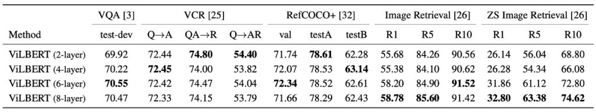

## 序幕中的交織

[**ViLBERT: Pretraining Task-Agnostic Visiolinguistic Representations for Vision-and-Language Tasks**](https://arxiv.org/abs/1908.02265)

---

學術界的每一年都會發生很多事情，而 2019 年特別多，事情遠遠還沒到結束的時候。

## 定義問題

目前的方法多半是「分開訓練視覺和語言模型」，然後再試圖結合它們。

這樣的方式往往導致不理想的結果，因為當視覺和語言資料有限或有偏差時，模型的泛化能力較差。儘管模型可以辨識圖片中的物體或理解語言，但如何讓這兩者關聯起來仍是一大問題。

作者希望提出一個不同於傳統的學習方式，讓機器同時學習圖片和語言，並且讓它們之間的關聯更為緊密。

## 解決問題

### 模型架構

<figure style={{"width": "85%"}}>

</figure>

受當 BERT 的啟發，作者希望開發一個可以從配對資料中學習語言和視覺內容聯合表示的類似模型。

在原本的 BERT 架構中，只會輸入語言資料，那我們是不是可以把一部分的輸入改成圖片呢？這樣模型就可以同時學習圖片和語言之間的關聯。

如上圖，作者提出了一個雙流架構，其中一流專為視覺設計，另一流專為語言設計。這兩個流透過跨注意力機制進行互動，允許兩種模態的網路深度可變且能在不同深度實現跨模態連接。

這裡的圖像輸入來源是從預訓練的物件偵測器中提取的邊界框和視覺特徵，然後將其與視覺位置編碼結合。

### 預訓練任務

<figure style={{"width": "70%"}}>

</figure>

如上圖，作者提出了兩種主要的預訓練任務：分別為 MLM 多模態建模和多模態對齊預測。

- MLM 多模態建模任務的目的是讓模型能夠重建被掩蓋的輸入。
- 多模態對齊預測則要求模型判定圖像和文字是否對齊，即文字是否描述圖像。

作者使用概念字幕資料集（Conceptual Captions）進行訓練，該資料集是由 330 萬個圖像字幕對組成，這些對子是從網路圖像中自動擷取的。儘管這個資料集包含了某些噪音和不完整的字幕，它仍然提供了非常多樣化的視覺內容。

詳細的實驗配置如下：

- 語言模型使用 BERT-BASE 模型初始化，這個模型在 BookCorpus 和英語維基百科上事先訓練過。
- 視覺特徵是使用預先訓練的 Faster R-CNN 。
- Transformer 和共同注意力 Transformer 區塊在視覺流中都有 1024 個神經元和 8 個注意力頭。
- 整個模型在 8 個 TitanX GPU 上進行了 10 個 epoch 的訓練。

## 討論

### ViLBERT 效果如何？

參考上表，ViLBERT 模型在多種視覺語言任務上展現了出色的效能：

不僅在預訓練的情境下（與單流模型及 ViLBERT 的比較）表現出色，而且在非預訓練的情境（與單流†及 ViLBERT†比較）也有優越的效能。特別是在 VQA 和 RefCOCO+ 上，ViLBERT 都獲得了最為顯著的效益。

通過在預訓練任務上使用 ViLBERT 模型，其效能在不同任務上提高了 2%至 13%（比較 ViLBERT 與 ViLBERT† ）。這表明，不僅 ViLBERT 模型可以受益於預訓練，單流模型也可以通過這些預訓練任務得到改善。

使用 ViLBERT 的微調策略在所有四個已確立的任務上都超越了最先進的特定任務模型。特別是在 VCR、RefCOCO+ 和影像擷取上，ViLBERT 設定了新的技術水準，其效益提高了 7-10 個百分點。另外，對這些任務的擴展相對簡單，只需為每個任務添加一個分類器就行了。

### 模型深度對效能的影響？

如上表，作者探討視覺模型的深度對 ViLBERT 效能的影響。

- **VQA 和影像檢索**：這兩種任務都從更深的 ViLBERT 模型中獲益，效能隨著層深度的增加而單調增加。特別是當層深度為 6 時，效能達到了峰值。
- **零樣本影像檢索**：對於這項任務，隨著模型的深度增加，效益也顯著地提高，這顯示在這項任務上，深層模型可能更為適合。
- **VCR 和 RefCOCO+**：與上述任務相反，這兩種任務似乎更傾向於使用淺層的模型，這可能表明不同的任務可能需要不同的模型深度以達到最佳效能。

:::tip
不過就現在動輒 96 層（對，GPT3 就是在講你！）的模型架構的角度來看，不管是 2 層還是 8 層，都是小模型的尺度而已。
:::

### 預訓練資料集的影響？

概念字幕資料集中隨機抽取 25% 和 50% 的子集進行預訓練時，隨著使用資料的增多，模型的準確度也單調地增加。

這一發現確認了在深度學習領域中一個常見的觀念：有更多的訓練資料可以提供更好的性能，因為模型有更多的機會學習並從大量的樣本中提取特徵和模式。

此外，這也表明 ViLBERT 模型在進行預訓練時有潛力受益於更大的資料集，這可能是未來研究和應用中的一個方向，以進一步優化和提高模型的效能。

## 結論

在早期的多模態研究中，雙流架構的設計是一個重要的突破，它提供了一個更為細緻的視角，觀察和學習圖像和文字之間的細微關聯。

ViLBERT 的提出，可說是這個領域的一個里程碑，它試圖深入結合圖像內容與文字，將二者緊密地結合在一起，並在多個視覺語言任務上取得了出色的效能。
