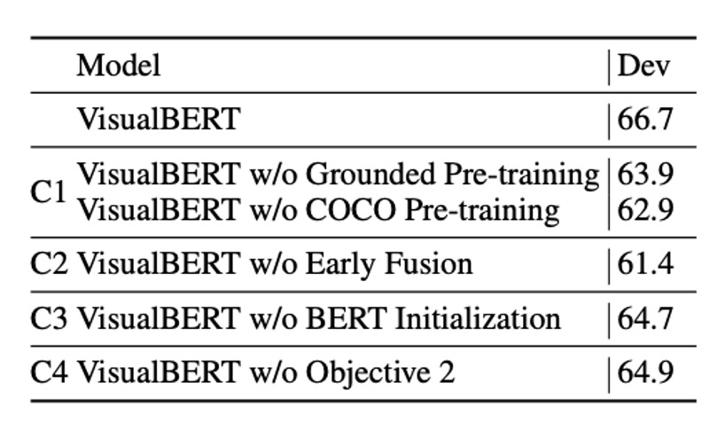

## 序幕上的凝視

[**VisualBERT: A Simple and Performant Baseline for Vision and Language**](https://arxiv.org/abs/1908.03557)

---

早在 2015 年左右，就有很多跨模態模型嘗試，其中大多都是基於 LSTM 的架構。

時序來到 2017 年，Transformer 在 NLP 領域內大殺四方，隨後注意力機制在多模態領域內也開始大放異彩，語言與視覺的結合再次成為研究的焦點。

這麼熱鬧的事情，怎麼能錯過呢？

作者受此啟發，希望能透過注意力機制捕捉影像中的隱式關係，並認為預先訓練能有效學習這些關係。

## 定義問題

根據前人的研究，作者總結出幾個現階段的問題：

- **統一視覺與語言的模型架構**：目前的許多模型都是針對特定的視覺語言任務而設計的，而缺乏一個可以通用於各種任務的模型。
- **預訓練的重要性**：BERT 已經告訴我們預訓練很重要，但在多模態領域中，預訓練的重要性還沒有被充分探討。
- **理解圖像語義的挑戰**：圖像和文字還不能很好的進行關聯。

## 解決問題

### 模型架構

<figure style={{"width": "80%"}}>

</figure>

VisualBERT 的核心理念是重用 Transformer 中的自注意力機制，自動對齊輸入文字的元素與圖像中的區域。

這裡是基於 BERT 模型，並增加一組稱為 $F$ 的視覺嵌入，用於表示圖像。每個 $f \in F$ 對應於圖像中的一個邊界區域，該區域由物體偵測器（Object Detector）導出。

每個視覺嵌入 $f$ 由三個嵌入相加而成：

1. **區域特徵嵌入** ($f_o$)：代表該邊界區域的視覺特徵，由卷積神經網路計算。
2. **段嵌入** ($f_s$)：標示該嵌入為圖像嵌入（不同於文字嵌入）。
3. **位置嵌入** ($f_p$)：當輸入中提供了文字與邊界區域的對齊信息時，該嵌入表示對齊位置，並設定為對應對齊文字的位置嵌入之和。

將視覺嵌入與原始文字嵌入一起傳入多層 Transformer，讓模型在兩組輸入之間自動發現有用的對齊關係，並生成新的聯合表示特徵。

:::tip
這篇是比較早期的論文，因此在跨模態的處理稍嫌生澀，但仍然是個很好的開始。
:::

### 預訓練機制

VisualBERT 的訓練目標是學會處理語言與視覺兩種輸入，因此使用了 COCO 資料集。COCO 包含多組配對數據，每張圖片配有 5 個獨立的標註說明。

訓練分為三個主要階段：

首先是與任務無關的預訓練，模型在 COCO 資料集上進行預訓練，目標是完成兩個與視覺相關的語言模型任務：

1. **遮蔽語言建模**：在文字輸入中隨機遮蔽一些文字，要求模型預測被遮蔽的詞，但對應圖片區域的向量不遮蔽。
2. **句子-圖像配對預測**：對於 COCO 資料集中的每張圖片，有多個相對應的標註說明。模型接收由兩個標註組成的文字片段，其中一個標註描述圖片，另一個有 50% 機率是相對應的另一個標註，另 50% 機率為隨機選取的標註，模型需區分這兩種情況。

接著是針對特定任務的預訓練，模型在特定任務的數據集上進行預訓練，目標是使模型更好地適應目標領域。在進行下游任務的微調之前，利用該任務的數據集和「遮蔽語言建模與圖像」目標進行額外訓練。

最後是微調，將模型與特定任務的輸入、輸出及目標結合，透過訓練最大化模型在該任務上的表現。

## 討論

### VQA 上的表現

<figure style={{"width": "85%"}}>

</figure>

VQA 的任務是給定一張圖片和一個問題，模型需正確回答該問題。這裡使用的是 VQA 2.0 資料集，包含來自 COCO 的 100 多萬個關於圖片的問題。

模型被訓練來預測最常見的 3,129 個答案。圖像特徵來自於基於 ResNeXt 的 Faster R-CNN，此模型已在 Visual Genome 預訓練。

實驗結果如上表所示，涵蓋了三類方法：

1. 使用相同的視覺特徵和邊界框數量的基線方法。
2. 本研究的模型。
3. 不可比較的方法，包括使用 Visual Genome 的額外問答對、多重偵測器以及模型的集成。

VisualBERT 在可比較的設定下，表現優於現有方法。

:::tip
還有許多其他資料集和任務，例如：VCR 和 $\text{NLVR}^2$ 等，這裡就不一一列舉了。
:::

### 消融實驗

<figure style={{"width": "60%"}}>

</figure>

作者在 NLVR2 數據集上進行消融實驗，測試了 VisualBERT 的兩種消融模型及四種額外變體。為了簡化計算，所有模型僅使用每張圖像的 36 個特徵（包括完整模型）。

實驗分析了以下四個 VisualBERT 主要組件的貢獻：

1. **C1: 任務無關的預訓練 (Task-agnostic Pre-training)**：

   - 為了研究任務無關預訓練的作用，設計了兩個變體：
     - 不進行任何預訓練的模型 (VisualBERT w/o COCO Pre-training)。
     - 僅用 COCO 中的文字（無圖像）進行預訓練的模型 (VisualBERT w/o Grounded Pre-training)。
   - 結果顯示，這兩個變體的性能均較差，說明在視覺-語言配對數據上進行預訓練十分重要。

2. **C2: 早期融合 (Early Fusion)**：

   - 包含不進行早期融合的變體 (VisualBERT w/o Early Fusion)，以驗證圖像與文字特徵間早期交互的重要性。實驗結果再度確認多層次的視覺和語言交互對性能有顯著貢獻。

3. **C3: BERT 初始化 (BERT Initialization)**：

   - 所有模型均基於預訓練的 BERT 模型進行初始化。為了理解 BERT 初始化的貢獻，設計了一個隨機初始化參數的變體，並按完整模型的方式進行訓練。結果顯示，僅使用語言預訓練的 BERT 權重對性能確有幫助，但性能下降幅度低於預期，說明模型可能在 COCO 預訓練中學到了許多有用的語言-視覺關聯知識。

4. **C4: 句子-圖像配對預測目標 (Sentence-Image Prediction Objective)**：
   - 引入了不包含句子-圖像配對預測目標的變體 (VisualBERT w/o Objective 2)，以研究該目標在任務無關預訓練中的影響。結果顯示該目標對性能有正面影響，但作用相對其他組件較小。

實驗結果證實，最重要的設計選擇是**任務無關的預訓練 (C1)** 和**視覺與語言的早期融合 (C2)**。在預訓練階段，包含 COCO 資料以及同時使用圖片與標註說明是最重要的部分。

## 結論

VisualBERT 不僅證明了模型的效能，而且透過其內建的注意力機制，提供了一個可解釋和直觀的方式來理解資訊。

但有一件事情，不論如何都無法迴避：

- 當人們嘗試結合物件偵測的模型時，模型的架構立刻變得非常複雜且難以使用。
- 過度複雜的設計會抑制模型在實際應用中的潛力，並增加了部署的困難。

因此，將此架構進行優化和簡化絕對應該被視為後續的重要研究方向。
