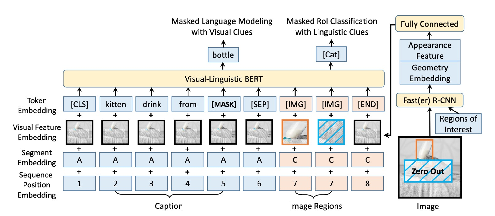

## 序幕下的觀影者

[**VL-BERT: Pre-training of Generic Visual-Linguistic Representations**](https://arxiv.org/abs/1908.08530)

---

我們之前提到了 VisualBERT，它算是 One-Tower Encoder 的架構，但是在訓練的過程中他們沒有對影像進行監督，他們只監督了文字的部分。

另外，也提到了 ViLBERT，它算是 Two-Tower Encoder 的架構，文字和影像之間各自擁有一個 Encoder 可以使用，而是透過跨注意力機制來交換彼此的訊息，但是略為複雜。

- **欸，等等！什麼 One-Tower，Two-Tower？**

這個名詞定義我們之前沒有特別提到，主要因為對事情沒什麼幫助，徒增煩惱而已。現在我們有了比較不同架構的需求了，正好可以拿出來說一說。

當我們討論視覺和語言多模態學習的模型時，常常會遇到 One-Tower 和 Two-Tower 兩種主要的架構（其實不止，我們之後遇上了再聊）。

這兩種架構主要描述了如何整合和交互不同模態的資訊。

1. **Single-Tower Architecture (One-Tower)**

   在這種架構中，一個單一的 Transformer 編碼器操作於視覺和文字輸入表示的連接上。

   優勢在於視覺和文字的 token 都被嵌入到單一的輸入中，這使得模態之間的交互無約束且自由。此外，它相對於 Two-Tower 架構需要較少的參數。

   常見模型包括 ViLT、VL-BERT、UNITER、OSCAR 等。其中，很多模型如 VisualBERT 和 VL-BERT 基於 BERT 模型進行變化。

2. **Two-Tower Architecture (Dual-Tower)**

   這種架構不直接對視覺和文字輸入進行連接，而是在分開的 Transformer 堆疊中對每種模態進行編碼。然後，這些模態之間的交互是通過一個跨注意力機制實現的。

   優勢在於這種架構允許模態之間的交互更加明確和有序。這種結構通常更容易理解，因為每個模態都有自己的編碼器。

   常見模型像是 ViLBERT、LXMERT 和 BridgeTower 都是此類型的代表。

## 定義問題

當我們面對這兩種不同的架構時，難免會感到迷惘。

一方面，One-Tower Encoder 的架構提供了較為直觀的訓練方法，但可能無法充分挖掘影像與文字之間的關聯；另一方面，Two-Tower Encoder 雖然有能力深入挖掘這兩者之間的關系，但過程相對複雜，且需要更多的計算資源。

而這篇論文作者嘗試整合這兩種架構的優點，創建一種真正具有通用性的視覺語言表示。這種表示不僅能夠應對單一的視覺語言任務，而且在多種視覺語言任務上都表現出色。

## 解決問題

### 模型架構

<figure style={{"width": "80%"}}>

</figure>

同樣是來自 BERT 的啟示，VL-BERT 模型的基礎是原始的 BERT 架構，該架構是基於多層雙向 Transformer 編碼器，這種設計允許模型捕獲所有輸入元素之間的依賴性。

為了要同時可以接受視覺和語言的輸入，模型的輸入始於特殊的 `[CLS]` 標記，接著是語言元素，然後是視覺元素，並以 `[END]` 標記結束。為了清晰區分語言和視覺信息，這裡使用 `[SEP]` 標記被插入在語言元素和視覺元素之間。

VL-BERT 的每個輸入元素的編碼特徵是由四種編碼類型合成的：Token 編碼、視覺特徵編碼、片段編碼和序列位置編碼。其中，視覺特徵編碼特別被引入用於捕捉視覺線索，而其他三種編碼模式是基於原始 BERT 的設計。

視覺特徵編碼包含了視覺外觀特徵，這是通過 Faster R-CNN 從 RoIs 中提取出來的，以及描述元素在圖像中的位置的視覺幾何特徵。

### 預訓練機制

<figure style={{"width": "80%"}}>

</figure>

在本文中，作者通過設計特定的預訓練任務，有效地預訓練了 VL-BERT，使其能夠捕獲視覺和語言間的關係。

- **任務#1**：使用視覺線索的掩碼語言建模：這是基於 BERT 中的掩碼語言建模(MLM)的修改。例如：假設有一句描述「小狗正在[MASK]裡玩耍」，並且相應的圖片中有一個小狗在水池中玩耍，模型需要根據未被屏蔽的部分和視覺資訊預測出被屏蔽的詞是「水池」。
- **任務#2**：使用語言線索的掩碼 RoI 分類：例如：一張圖片展示了一只鳥在天空中飛翔，但鳥的部分被屏蔽了。模型的任務是根據圖片的其他部分和可能的描述，如「鳥在晴朗的[MASK]中飛翔」，來預測被屏蔽的 RoI 是什麼，這裡應該是「天空」。

## 討論

### 和其他模型的比較

使用的資料集是 VQA v2.0，基於 COCO 影像集建構。資料集包括訓練集、驗證集和測試集，分別有 83k、41k 和 81k 的影像，以及 444k、214k 和 448k 的問題。

預訓練的 VL-BERT 在 VQA 任務上表現提升了 1.6%。與 BUTD（專為此任務設計的一個流行模型）相比，VL-BERT 的精確度比 BUTD 高出超過 5%。與其他同期作品相比，VL-BERT 也有較佳的表現，僅次於 LXMERT，但 LXMERT 在更大的資料集上進行了預訓練。

本實驗確認了預訓練的重要性，特別是在視覺問答任務上。儘管 VL-BERT 的訓練資料集不如 LXMERT 那麼豐富，但它仍然展現了與當前最佳模型相當的性能。

### 模型懂自然語言嗎？

為了回答這個問題，作者選用了 RefCOCO+ 資料集。

RefCOCO+ 是一個參考式物件檢索（referential object retrieval）的資料集。它的主要目的是進行視覺基礎的參照理解，也就是給予一個圖像和一段描述（通常是自然語言描述），系統需要定位或辨識該描述所參照的特定物件在圖像中的位置。

實驗結果顯示，使用預訓練的 VL-BERT 可以顯著提高指代表達理解的效能，這證明了預訓練策略在此任務上的有效性。

當與其他著名的模型如 MAttNet 進行比較時，VL-BERT 表現出了其簡潔和強大的效能。儘管 VL-BERT 的架構更簡單，沒有特定於任務的模組，但其效果與 ViLBERT 這樣的當前最先進的模型相當。

### 消融實驗

作者做了大量的實驗，來測試不同的設計選擇對模型性能的影響。

1. **預訓練的重要性**

   比較「無預訓練」和 VL-BERT-BASE 的設定時，顯而易見的是，預訓練對所有三個下游任務的效能都有明顯的提升。這證明了預訓練在模型的設計中佔有中心位置。

2. **任務特定的效益**

   不同的預訓練任務對不同的下游任務有不同的影響。例如：帶有語言線索的 MASK RoI 分類任務對 RefCOCO+ 的效果特別好，但在其他任務上可能不是最佳的。

3. **句子-圖像關係的影響**

   雖然句子-圖像關係預測被認為是有益的，但它對所有三個下游任務的效能都產生了負面影響。這指出了一個重要的設計考慮因素，即不是所有的預訓練任務都對所有的下游任務有益。

4. **純文字語料庫的加入**

   進一步增加純文字語料庫對所有下游任務都有正面效果，尤其是在涉及複雜句子的 VCR 任務上。這強調了語言信息對於視覺語言模型的重要性。

5. **端到端的訓練**

   通過對整個網路進行端到端的微調，包括產生視覺特徵的 Fast R-CNN 部分，能夠進一步提高所有下游任務的效能。這強調了整合和協調視覺和語言部分的重要性。

根據實驗結果，作者認為 VL-BERT 模型的最重要的設計是其預訓練策略，這不僅提高了其在特定任務上的效能，而且還使其在多種下游任務上都具有出色的泛化能力。同時，模型的設計還考慮到了不同預訓練任務對下游效能的不同影響，並透過端到端的訓練來進一步優化其表現。

## 結論

VL-BERT 最大的賣點是它採用了基於 Transformer 的架構，避免了特定任務的臨時模組，達到了簡單且高效的效果。其在大型概念字幕資料集和純文字語料庫的預訓練，進一步鞏固了其在視覺與語言線索對齊的能力。

作者透過對於更多預訓練任務的探索，為後續的研究者提供了後續的研究方向。
