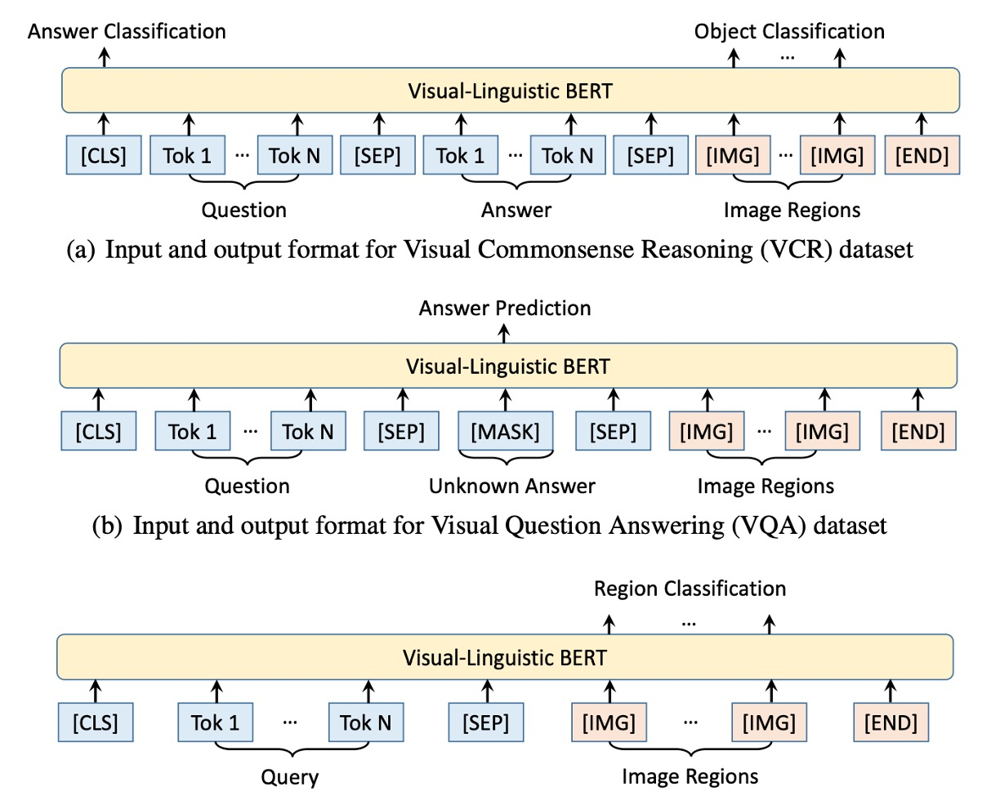

# [19.08] VL-BERT

## 序幕下的觀影者

[**VL-BERT: Pre-training of Generic Visual-Linguistic Representations**](https://arxiv.org/abs/1908.08530)

---

我們之前提到了 VisualBERT，它算是 One-Tower Encoder 的架構，但是在訓練的過程中他們沒有對影像進行監督，他們只監督了文字的部分。

我也提到了 ViLBERT，它算是 Two-Tower Encoder 的架構，文字和影像之間各自擁有一個 Encoder 可以使用，而是透過跨注意力機制來交換彼此的訊息，但架不住麻煩呀！

- **欸，等等！什麼 One-Tower，Two-Tower？**

這個名詞定義我們之前沒有特別提到，主要因為對事情沒什麼幫助，徒增煩惱而已。現在我們有了比較不同架構的需求了，正好可以拿出來說一說。

當我們討論視覺和語言多模態學習的模型時，常常會遇到 One-Tower 和 Two-Tower 兩種主要的架構（其實不止，我們之後遇上了再聊）。

這兩種架構主要描述了如何整合和交互不同模態的資訊。

1. **Single-Tower Architecture (One-Tower)**

   - 概念: 在這種架構中，一個單一的 Transformer 編碼器操作於視覺和文字輸入表示的連接上。
   - 優勢: 由於視覺和文字的 token 都被嵌入到單一的輸入中，這使得模態之間的交互無約束且自由。此外，它相對於 Two-Tower 架構需要較少的參數。
   - 常見模型: 包括 ViLT、VL-BERT、UNITER、OSCAR 等。其中，很多模型如 VisualBERT 和 VL-BERT 基於 BERT 模型進行變化。
   - 特性: 許多這些模型利用了 BERT 的預訓練權重。但有一些，例如：ViLT，則使用 ViT 的預訓練權重。

2. **Two-Tower Architecture (Dual-Tower)**

   - 概念: 這種架構不直接對視覺和文字輸入進行連接，而是在分開的 Transformer 堆疊中對每種模態進行編碼。然後，這些模態之間的交互是通過一個跨注意力機制實現的。
   - 優勢: 這種架構允許模態之間的交互更加明確和有序。這種結構通常更容易理解，因為每個模態都有自己的編碼器。
   - 常見模型: ViLBERT、LXMERT 和 BridgeTower 都是此類型的代表。
   - 特性: 這些模型之間可能存在細微差異。例如：ViLBERT 的文字模塊使用了 BERT-base 的權重，而 LXMERT 的所有參數都是從頭開始訓練的。

因此，當我們面對這兩種不同的架構時，難免會感到迷惘。一方面，One-Tower Encoder 的架構提供了較為直觀的訓練方法，但可能無法充分挖掘影像與文字之間的關聯；另一方面，Two-Tower Encoder 雖然有能力深入挖掘這兩者之間的關系，但過程相對複雜，且需要更多的計算資源。

在本文中，VL-BERT 的作者嘗試整合 VisualBERT 和 ViLBERT 的優點，它融合了視覺與語言的領域，目的是為了創建一種真正具有通用性的視覺語言表示。這種表示不僅僅能夠應對單一的視覺語言任務，而且在多種視覺語言任務上都表現出色。

這得益於其預訓練的策略，它不僅在視覺語言語料庫上進行預訓練，增強了其在視覺語言上的表現能力，同時還在純文字語料庫上進行預訓練，提高了其對長句和複雜句子的泛化能力。

## 定義問題

在視覺語言任務領域，現有的研究尚未完全發掘和利用視覺和語言資訊的聯合能力：

### 預訓練的局限性

過去的工作如 VideoBERT 對視覺語言任務進行了初步的預訓練，但其聚類方法導致了大量視覺內容的丟失，並對視覺網路參數的更新造成了阻礙。

### 網絡架構的多樣性

不同的研究選擇了各種網絡架構。例如：ViLBERT 和 LXMERT 選擇了一個雙模態的方法，將視覺和語言資訊分開處理後再結合，而其他如 VL-BERT 則選擇了一個統一的架構，使兩種資訊可以早期和自由地交互。

### 注意力模式的限制

某些方法如 ViLBERT 中的跨模態 Transformer 對注意力模式進行了限制，這可能限制了模型的能力。

### 預訓練差異

雖然多篇作品都嘗試為視覺語言任務導出可預訓練的通用表示，但這些方法在預訓練策略上存在明顯的差異。例如：VL-BERT 與其他同時發表的工作在預訓練方法上有三個顯著的差異，包括不使用句子-影像關係預測任務，針對視覺語言和純文字資料集進行聯合預訓練，以及在預訓練過程中更新 Fast R-CNN 的參數。

本文的作者希望能解決上述問題，尋求一種能夠更有效地結合和對齊視覺和語言資訊的方法，並試圖在預訓練策略上取得更好的效果。

## 解決問題

### VL-BERT 模型設計

作者在設計 VL-BERT 模型時，受到了原始 BERT 模型的啟示，並對其進行了特定的修改，以便它能夠同時處理視覺和語言資訊。

以下是主要設計步驟和策略：

1. 架構基礎：

   - VL-BERT 模型的基礎是原始的 BERT 架構，該架構是基於多層雙向 Transformer 編碼器。
   - 這種設計允許模型捕獲所有輸入元素之間的依賴性。

2. 多模態輸入：

   - 與原始的 BERT 模型不同，只處理文本，VL-BERT 被設計為能夠同時接受視覺和語言輸入。
   - 視覺輸入是從圖像中的興趣區域（RoIs）得到的，這些 RoIs 可能是物件偵測器提取出的邊界框，或者是從特定任務中獲取的標注。

3. 輸入格式化：

   - 雖然不同的視覺語言任務可能具有不同的輸入格式，但由於 Transformer 的無序特性，VL-BERT 能夠給予每個輸入元素一個通用表示。
   - 模型的輸入始於特殊的 [CLS] 標記，接著是語言元素，然後是視覺元素，並以 [END] 標記結束。
   - 為了清晰區分語言和視覺信息，特殊的 [SEP] 標記被插入在語言元素和視覺元素之間。

4. 特徵編碼策略：

   - VL-BERT 的每個輸入元素的編碼特徵是由四種編碼類型合成的：Token 編碼、視覺特徵編碼、片段編碼和序列位置編碼。
   - 其中，視覺特徵編碼特別被引入用於捕捉視覺線索，而其他三種編碼模式是基於原始 BERT 的設計。
   - 視覺特徵編碼包含了視覺外觀特徵，這是通過 Faster R-CNN 從 RoIs 中提取出來的，以及描述元素在圖像中的位置的視覺幾何特徵。

5. 其他編碼策略：
   - Token Embedding：採用 WordPiece 編碼策略，並有一個特殊的 [IMG] 標記來指示視覺元素，從而使其與語言元素區分開來。
   - Segment Embedding：用於區分來自不同來源的輸入元素，例如：句子和圖像。
   - Positional Embedding：表示每個輸入元素在整體輸入序列中的位置。由於視覺元素之間沒有固定的、自然的順序，因此它們的位置編碼是相同的。

### 預訓練機制

在本文中，作者通過設計特定的預訓練任務，有效地預訓練了 VL-BERT，使其能夠捕獲視覺和語言間的關係。

1. **資料來源**

   使用大規模資料集來預訓練模型，其中主要資料來源是概念字幕資料集，這是一個包含了約 330 萬張帶有描述的圖像的資料集。例如：一張圖片可能顯示了一只貓在樹下玩耍，其對應的描述可能是「一只橘色的貓在綠樹下追著蝴蝶」。此外，為了增強模型的語言理解能力，特別是長句和複雜句子的理解，也使用了 BooksCorpus 和英語維基百科這兩個純文字語料庫進行預訓練。

2. **任務#1**

   使用視覺線索的掩碼語言建模：這是基於 BERT 中的掩碼語言建模(MLM)的修改。例如：假設有一句描述「小狗正在[MASK]裡玩耍」，並且相應的圖片中有一個小狗在水池中玩耍，模型需要根據未被屏蔽的部分和視覺資訊預測出被屏蔽的詞是「水池」。

3. **任務#2**

   使用語言線索的掩碼 RoI 分類：例如：一張圖片展示了一只鳥在天空中飛翔，但鳥的部分被屏蔽了。模型的任務是根據圖片的其他部分和可能的描述，如「鳥在晴朗的[MASK]中飛翔」，來預測被屏蔽的 RoI 是什麼，這裡應該是「天空」。

4. **微調策略**
   - 輸入：對於一個視覺問答任務，輸入可能是一張圖片和一個問題，例如：圖片中有一隻貓在沙發上睡覺，問題是「動物在哪裡睡覺？」，VL-BERT 的任務就是回答「沙發」。
   - 輸出：根據模型的輸入，輸出會是相對應的答案或者預測。在上面的例子中，[CLS]元素的最終輸出特徵可能會被用來預測「沙發」這個答案。
   - 作者首先利用大規模的概念字幕資料集和其他純文字語料庫，採用特定的預訓練任務，訓練了 VL-BERT 模型。在預訓練完成後，作者再根據具體的下游任務進行微調，以達到最佳的效果。

## 討論

### VL-BERT 和其他模型的比較

- **VCR**

  

  1. 效能提升：預訓練的 VL-BERT 在整體 VCR 任務（Q→AR）上的性能提升了 1.0%，顯示出預訓練模型在視覺語言理解任務上的潛在優勢。
  2. 與 R2C 的比較：
     - 儘管 VL-BERT 與 R2C 使用了相同的輸入、輸出和實驗協議，VL-BERT 的效果仍然明顯優於 R2C。這證明了 VL-BERT 簡單的跨模態架構的強大功能。
     - 在原始的 R2C 方法中，設計了三個針對特定任務的模組：「Grounding」、「Contextualization」和「Reasoning」。然而，使用 VL-BERT，作者選擇不使用這些 ad-hoc 的特定任務模組，而是簡單地採用 VL-BERT 的通用表示，並進行端對端的聯合訓練。
  3. 與其他現有方法的比較：與同時期的其他作品，如 ViLBERT、VisualBERT 和 B2T2 等相比，VL-BERT 達到了最先進的性能。這再次凸顯出 VL-BERT 在視覺語言推理任務上的有效性和優越性。

- **VQA**

  

  使用的資料集是 VQA v2.0，基於 COCO 影像集建構。資料集包括訓練集、驗證集和測試集，分別有 83k、41k 和 81k 的影像，以及 444k、214k 和 448k 的問題。

  1. 實驗協議：

     - 為每個問題，模型需要從包含 3,129 個答案的共享集中選擇答案。
     - 使用 BUTD 的實驗協議，該協議可能詳細描述了評估的方法和標準。

  2. 模型設定：

     - 輸入格式為「問題、答案、影像」，其中答案部分填充有[MASK]元素。
     - 使用預訓練的 Faster R-CNN 偵測器從 Visual Genome 生成輸入 RoI。
     - 使用多類分類器基於[MASK]元素的輸出特徵進行答案預測。

  3. 實驗結果：

     - 預訓練的 VL-BERT 在 VQA 任務上表現提升了 1.6%。
     - 與 BUTD（專為此任務設計的一個流行模型）相比，VL-BERT 的精確度比 BUTD 高出超過 5%。
     - 與其他同期作品相比，VL-BERT 也有較佳的表現，僅次於 LXMERT，但 LXMERT 在更大的資料集上進行了預訓練。

  4. 預訓練的重要性：
     - 本實驗確認了預訓練的重要性，特別是在視覺問答任務上。
     - 儘管 VL-BERT 的訓練資料集不如 LXMERT 那麼豐富，但它仍然展現了與當前最佳模型相當的性能。

### 模型到底懂不懂自然語言？

為了回答這個問題，作者選用了 RefCOCO+ 資料集。

RefCOCO+ 是一個參考式物件檢索（referential object retrieval）的資料集。它的主要目的是進行視覺基礎的參照理解，也就是給予一個圖像和一段描述（通常是自然語言描述），系統需要定位或識別該描述所參照的特定物件在圖像中的位置。

這種任務是語言和視覺融合領域的重要研究課題，因為它要求模型不僅要理解語言描述的含義，還要能夠對應到視覺內容。例如：給定一張包含多個人的照片，描述可能是“穿著紅色襯衫的男人”，模型的任務是在圖像中精確地標記出該男人的位置。

RefCOCO+ 與其他的參考式資料集（如 RefCOCO 和 RefCOCOg）有所不同，因為它特別規定描述中不能使用物件的位置資訊（例如：「左邊的狗」或「桌子上的蘋果」）。這使得任務更具挑戰性，因為模型不能依賴這些明確的空間位置提示來找到目標物件。

1. **實驗設定**

   研究者根據指定的格式設定了模型的輸入，其中包括查詢（自然語言描述）和圖像。在訓練過程中，模型試圖正確分類每個 RoI，並在推理過程中選擇最高分的 RoI 作為描述的對象。

2. **預訓練的 VL-BERT 效果**

   實驗結果顯示，使用預訓練的 VL-BERT 可以顯著提高指代表達理解的效能。這證明了預訓練策略在此任務上的有效性。

3. **與其他模型的比較**

   當與其他著名的模型如 MAttNet 進行比較時，VL-BERT 表現出了其簡潔和強大的效能。儘管 VL-BERT 的架構更簡單，沒有特定於任務的模組，但其效果與 ViLBERT 這樣的當前最先進的模型相當。

### 模型的哪個設計最有用呢？

VL-BERT 模型中的一個核心和獨特的設計是其預訓練策略，這在不同的下游任務上都顯示了其效能和優勢。

以下是一些關鍵的觀察和結論：

1. **預訓練的重要性**

   比較「無預訓練」和 VL-BERT-BASE 的設定時，顯而易見的是，預訓練對所有三個下游任務的效能都有明顯的提升。這證明了預訓練在模型的設計中佔有中心位置。

2. **任務特定的效益**

   不同的預訓練任務對不同的下游任務有不同的影響。例如：帶有語言線索的 MASK RoI 分類任務對 RefCOCO+ 的效果特別好，但在其他任務上可能不是最佳的。

3. **句子-圖像關係的影響**

   雖然句子-圖像關係預測被認為是有益的，但它對所有三個下游任務的效能都產生了負面影響。這指出了一個重要的設計考慮因素，即不是所有的預訓練任務都對所有的下游任務有益。

4. **純文字語料庫的加入**

   進一步增加純文字語料庫對所有下游任務都有正面效果，尤其是在涉及複雜句子的 VCR 任務上。這強調了語言信息對於視覺語言模型的重要性。

5. **端到端的訓練**

   通過對整個網路進行端到端的微調，包括產生視覺特徵的 Fast R-CNN 部分，能夠進一步提高所有下游任務的效能。這強調了整合和協調視覺和語言部分的重要性。

根據實驗結果，作者認為 VL-BERT 模型的最重要的設計是其預訓練策略，這不僅提高了其在特定任務上的效能，而且還使其在多種下游任務上都具有出色的泛化能力。同時，模型的設計還考慮到了不同預訓練任務對下游效能的不同影響，並透過端到端的訓練來進一步優化其表現。

## 結論

回顧數年前的研究，VL-BERT 無疑在視覺語言模型的領域中引起了相當的關注。

這一模型提出了一種符合當時技術發展趨勢的通用表示法，專為視覺語言任務量身定做。其最大的賣點是它採用了基於 Transformer 的架構，避免了特定任務的臨時模組，達到了簡單且高效的效果。其在大型概念字幕資料集和純文字語料庫的預訓練，進一步鞏固了其在視覺與語言線索對齊的能力。

然而，時至今日，當我們回首這一經典之作，它難免會在適應新的、更為複雜的下游任務上顯得有些力不從心。當年主流的預訓練策略，儘管成果斐然，但在應對現今日新月異的真實場景時，確實展現出某些固有的局限性。

:::tip
附帶一提，現在的主流是「更大更大的模型」和「更大更大的數據」…（？？？）
:::

儘管如此，VL-BERT 的作者們當時所展現的遠見和對更多預訓練任務的探索，無疑為後續的研究者提供了珍貴的啟示和方向。
