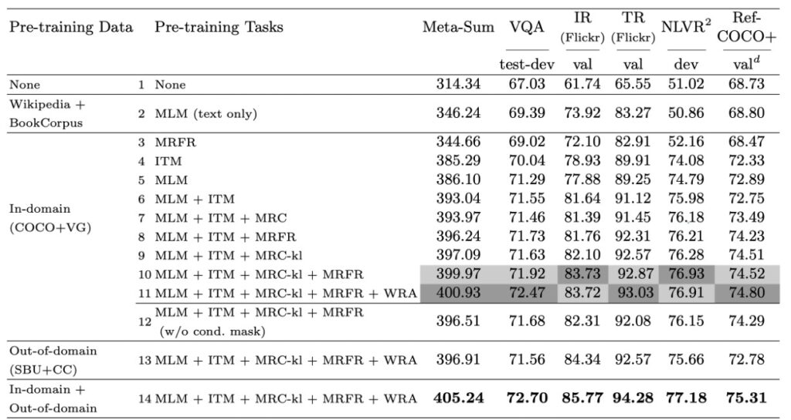
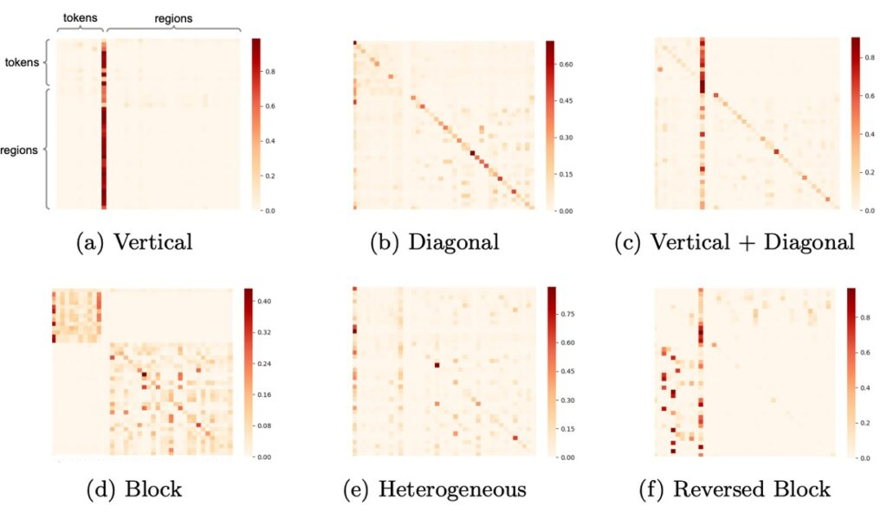

# [19.09] UNITER

## 團結者之歌

[**UNITER: UNiversal Image-TExt Representation Learning**](https://arxiv.org/abs/1909.11740)

---

我們看過之前的論文，從一開始的「單流模型」到後來的「雙塔模型」，「雙流模型」等。

總之，要不就是把跨模態資訊合在一起算，要不就是分開算。

如果你分開算，之後的人們就想合在一起，然後超越你；
如果你一起算，之後的人們就想要分開算，然後超越你。

本來我們只是想輕輕鬆鬆地看點論文，卻還硬是看出了點人生的道理。

我們先回到 UNITER。

在視覺與語言（V+L）的研究領域中，聯合多模型編碼已被廣泛使用以解決圖像和文本之間的語義差距。然而，這些多模型編碼的方法和表示通常都是為特定的任務量身定制的。這意味著，當設計一種專門用於特定 V+L 任務的方法時，該方法可能難以適應其他相關任務。這種現象在多模態研究中十分常見，使得整體研究社群在找尋通用解決方案上遭遇了挑戰。

先前的研究，如 MCB、BAN、DFAF、SCAN 和 MAttNet 等，都在其特定的領域中提出了先進的方法。但是，由於這些模型的架構多種多樣，且學到的表示具有高度的任務特定性，它們在廣泛的 V+L 任務中的應用受到了限制。

## 定義問題

作者認為當前的研究雖然在特定任務上取得了成功，但在多模態的通用表示學習、有效的屏蔽策略以及優化的對齊技巧上還存在許多問題和挑戰：

1. 特定任務的多模型編碼：現有的視覺和語言多模型編碼方法通常是針對特定任務設計的。這種特定性限制了模型在其他 V+L 任務中的泛化能力。

2. 模型架構和表示的多樣性：先前的研究如 MCB、BAN 等在特定領域中有其獨特的架構和表示方法。由於這些架構和表示的多樣性，使得它們難以適應廣泛的 V+L 任務。

3. NLP 成功策略的直接應用：儘管 Transformer 和 BERT 在 NLP 領域中取得了巨大的成功，但直接將這些策略應用於 V+L 領域可能不是最佳的解決方案。需要特定的策略和預訓練任務以確保在 V+L 任務中的成功。

4. 屏蔽策略的局限性：現有的多模態預訓練方法在屏蔽策略上存在挑戰。不同的屏蔽策略可能會影響模型學習到的表示，並進一步影響其在下游任務上的性能。

5. 語義對齊技巧的挑戰：確保圖像和文字之間的語義對齊是多模態研究的核心挑戰。雖然先前的研究提出了一些方法，但在細微對齊上仍然存在難點。

作者在這裡，引出了一個核心的疑問：

- **我們是否可以為所有 V+L 任務學習一個真正通用的圖像和文字表示？**

## 解決問題

### UNITER 模型設計

UNITER 模型作為一個專為視覺和語言任務設計的解決方案，其主要目標是有效地彌合圖像和文本之間的語義差距。以下是對模型的主要設計元件和理念的深入探討。

1. **模型架構**

   - UNITER 的基本結構由圖像編碼器、文字編碼器和多層的 Transformer 組成。這確保了模型能夠分別從圖像和文字中提取複雜的特徵，然後透過 Transformer 進行深入的交互和整合。

2. **編碼策略**

   - 對於圖像，UNITER 利用 Faster R-CNN 提取視覺特徵，並透過 7 維向量對每個區域的位置特徵進行編碼。這兩個特徵透過全連接層合併，確保位置和視覺信息都被納入考慮。
   - 對於文字，UNITER 遵循了 BERT 的策略，使用 WordPieces 進行分詞，然後對每個 token 進行編碼。這確保了詞義和語境信息的有效編碼。

3. **自注意力策略**

   - UNITER 的 Transformer 利用自注意力機制進行上下文編碼的學習，允許模型在不同的模態之間建立深入的關聯。通過明確編碼標記和區域的位置，模型能夠捕獲更細緻的上下文信息。

4. **預訓練任務**

   - UNITER 的一大亮點是其多樣化的預訓練任務，包括基於圖像的掩碼語言建模、基於文字的屏蔽區域建模、圖像文字匹配和單字區域對齊。這些任務旨在從多個角度增強模型的跨模態學習能力。

5. **條件屏蔽策略**

   - 不同於其他預訓練方法，UNITER 在屏蔽策略上選擇僅屏蔽一種模態，同時保持另一種不受污染。這個策略的目的是防止在學習過程中發生潛在的模態錯位，確保模型能夠更精確地對應圖像和文字。

6. **字區域對齊策略**

   - 通過引入基於最佳傳輸的字區域對齊預訓練任務，UNITER 試圖明確地鼓勵單字和圖像區域之間的細緻對齊。這一策略確保了模型能夠有效地優化跨模態的語義對齊。

### 預訓練策略

UNITER 模型的預訓練策略是其成功的核心，設計為解決跨模態學習的獨特挑戰。這些策略旨在優化模型的能力，使其能夠深入地理解和整合圖像和文字之間的相互關聯。

我們逐一來看看這些預訓練策略：

- **掩碼語言模型 (MLM)**

  掩碼語言模型(MLM)是預訓練深度學習模型中的一種策略，專為加強模型的語言理解和跨模態學習能力而設計。MLM 的工作原理是隨機選擇和屏蔽某些輸入文本中的單詞（通常是 15% 的單詞），並嘗試使用上下文以及任何相關的輔助資訊（如圖像）來預測被屏蔽的單詞。

  想像一下這樣一個情境：我們有一句話「小狗正在[MASK]裡玩耍」，並伴隨著一張顯示小狗在綠色草地上快樂玩耍的圖片。在這種情境下，模型需要利用圖像中的視覺資訊，即小狗在草地上的情境，來正確地預測那個[MASK]位置上的詞，即「草地」。

  這種方法不僅僅是在文字中做填空的遊戲。其背後的思路是強迫模型不僅要理解文本中的語境，還要瞭解圖像中的視覺內容和它與文本的關聯。當模型被訓練來優化這種預測任務時，它同時也學習了如何對文字和圖像進行更深入、更細緻的理解。

- **影像文字匹配 (ITM)**

  影像文字匹配（ITM）是一種策略，它主要用於評估模型如何對文字描述與圖像進行匹配。這項任務不僅僅是關於找到匹配的項目，還涉及到評估文本與圖像之間的深層語義關聯。

  為了執行此任務，模型在輸入中使用一個特殊的標記，名為 [CLS]。這個標記的目的是促使模型產生一個代表圖像和文本融合的表示形式。這種融合表示為模型提供了一個單一的視角，從中可以判斷圖像和文本是否匹配。

  舉例來說，假設我們有一個描述「夕陽下的海灘」的文本，以及一張顯示海灘上夕陽的照片。當這些被輸入到模型中時，模型將通過 [CLS] 標記的幫助，生成一個融合表示。接著，這個表示會被送入一個全連接層（FC 層）和 sigmoid 函數，產生一個 0 到 1 之間的分數。這個分數將告訴我們這段文字與這張圖像有多匹配。

  當然，在訓練過程中，除了正確匹配的圖像和文本對，還有所謂的「負對」，即不匹配的圖像和文本組合。例如：「夕陽下的海灘」的描述可能被配對到一張關於山脈的圖片。這種負對是通過從其他樣本中隨機選擇圖像或文本並與原始樣本配對來創建的。

  模型的目標是儘量減少其對正確配對和負對的預測錯誤。這通常是通過使用二元交叉熵損失來完成的，這是一種常見的損失函數，用於評估模型的二分類預測效果。

- **字區域對齊 (WRA)**

  字區域對齊（WRA）是一種先進的策略，它採用最佳傳輸方法（Optimal Transport，縮寫為 OT）來優化文本（例如：單詞或語句）與圖像區域之間的關聯。這種策略的主要目的是為了確保模型可以準確地將文本描述與其對應的圖像部分相匹配。

  舉例來說，當給出一句描述「紅色的蘋果」以及一張包含多種顏色蘋果的圖片時，WRA 的目標是使模型能夠將「紅色的蘋果」這個描述精確地對齊到圖像中的紅色蘋果部分，而不是綠色或黃色的蘋果。

  為了實現這一目標，OT 提供了一種強大的數學框架，它具有以下特點：

  - **自歸一化**：這意味著所有的轉移值總和為 1，這確保了資料之間的對齊是正規化的。
  - **稀疏性**：OT 為對齊提供了一個稀疏的解決方案，這意味著它主要考慮了最相關的匹配，使對齊更加精確和可解釋。
  - **效率**：儘管傳統的最佳傳輸方法可能需要複雜的計算，但有策略可以有效地解決大型問題，這對於大型模型預訓練特別有用。

  OT 的工作方式是評估兩個分佈之間的距離，並優化一個「運輸計劃」來描述如何從一個分佈轉移到另一個分佈。在本論文的情境中，這兩個分佈分別是文本和圖像。一旦獲得了這個運輸計劃，它就可以作為一個損失函數來更新模型參數，從而改善文本和圖像之間的對齊。

- **屏蔽區域建模 (MRM)**

  屏蔽區域建模 (MRM) 在 UNITER 模型中是一項關鍵策略，它特別針對影像區域的視覺特徵。和 MLM 一樣，這項策略以 15%的機率隨機選取並屏蔽圖像區域的特徵。舉例來說，如果我們有一張多只鳥在天空中飛翔的圖片，MRM 可能會隨機選擇並屏蔽其中幾只鳥的特徵。然後，模型的主要任務是利用剩下的視覺資訊和相關的文本內容來重建或推測這些被屏蔽的鳥的特徵。這不僅強化了模型對圖像區域的理解，還增強了模型在不完整資訊下的推理能力。

  這項策略有三種主要的變體：

  - **屏蔽區域特徵回歸 (MRFR)**

    這是最直觀的策略。它的主要目的是重建被屏蔽的視覺特徵。例如：當一些鳥的特徵被屏蔽時，MRFR 會嘗試使用其他鳥的特徵以及相關的文本描述來直接重建被屏蔽的鳥的特徵。

  - **屏蔽區域分類 (MRC)**

    這個策略比較抽象，它嘗試預測被屏蔽的區域可能的類別或特性。例如：當一些鳥的特徵被屏蔽時，MRC 會試著預測這些被屏蔽的鳥可能是哪個品種或種類，基於它在畫面中的其他資訊和相關的文本內容。

  - **使用 KL 散度的屏蔽區域分類 (MRC-kl)**

    這是一個進階版的 MRC，與 MRC 不同的是，它不完全依賴於硬標籤或最有可能的答案，而是考慮到多種可能的答案。它使用一個物件偵測器的原始輸出作為一種軟標籤，這些軟標籤給出了每種物件種類的可能性，而模型則嘗試匹配這些分佈。

### 預訓練資料集

在這篇論文中，作者精心設計了一套預訓練資料集，主要源於四大知名的 V+L 資料集：

- COCO
- Visual Genome (VG)
- Conceptual Captions (CC)
- SBU Captions。

這四者的組合是為了確保模型在預訓練階段能夠接觸到豐富而多樣的資料，進而提高其在後續任務上的效能。但這些資料集不僅僅被一視同仁地使用。考慮到不同資料集可能對預訓練有不同的影響，作者將其進行了一些分類。首先，將 COCO 的圖像字幕資料和 VG 的密集字幕資料組合在一起。這部分的資料被標注為「域內」數據，因為很多 V+L 任務的基礎資料集都是建立在它們上面的。

在使用這些「域內」數據時，作者採取了一些特定策略來確保資料的公正性和獨特性。例如：考慮到 COCO 和 Flickr30K 的圖像都是從 Flickr 爬取的，存在圖像重疊的可能性，因此排除了這些重疊的圖像。在這個過程中，作者最終獲得了 560 萬對圖像和文字的組合供訓練使用，以及 131K 對供內部驗證使用。

除了這些「域內」資料，作者還使用了兩個額外的資料集，即 Conceptual Captions 和 SBU Captions，作為「域外」資料來進行預訓練。

## 討論

### 預訓練上的任務表現

在深入探討作者所提出的多模態預訓練策略的效果時，他們選擇了四個代表性的 V+L 基準作為評估標準，分別是 VQA、NLVR2、Flickr30K 和 RefCOCO+。此外，他們還引入了一個全局指標 Meta-Sum，即所有基準的所有分數總和，以提供一個綜合的評估視角。

1. **基線設定**

   作者首先確立了兩個基線。第一個基線（L1）完全沒有涉及預訓練，而第二個基線（L2）使用了只在文字上預訓練的 MLM 的權重。結果表明，僅文字上的預訓練已經使 Meta-Sum 分數相比 L1 有了顯著的提升。

2. **單一預訓練任務的效果**

   接著，他們探討了單一預訓練任務的效果。具體地，當模型只對 ITM (L4) 或 MLM (L5) 進行預訓練時，相對於基線 L1 和 L2，所有任務都有了明顯的性能提升。

3. **預訓練任務組合**

   作者進一步發現，當結合不同的預訓練任務，例如：MLM 和 ITM (L6)，效果比單獨使用其中任何一種都要好。當 MLM、ITM 和 MRM 一起訓練時，模型在所有基準測試上都有穩定的效能增益。

4. **細粒度對齊**

   加入 WRA 預訓練任務後（如 L11），性能在特定任務，尤其是 VQA 和 RefCOCO+上有了顯著提高。這強烈表明，預訓練期間學習的文字和區域間的細粒度對齊對於涉及區域級識別或推理的下游任務非常有益。

5. **條件掩蔽策略**

   透過比較不同的掩蔽策略，作者發現條件掩蔽策略使模型能夠有效地學習更好的聯合圖像文字表示。

6. **預訓練資料集的影響**

   最後，作者還探討了不同預訓練資料集的效果。結果顯示，即使在域外數據上預訓練，只要資料與下游任務相似，模型的性能仍然可以得到提高。而當在域內和域外資料上一起預訓練時，模型性能得到了進一步的提升。

作者透過這一系列的實驗深入地分析了不同預訓練設定的效果，提供了寶貴的見解，幫助我們更好地理解多模態預訓練的深層機制。

### 下游任務的表現

作者在多個下游任務中詳細測試了 UNITER 模型的表現，以下是該模型在各項測試中的主要發現：

1. **整體性能**

   UNITER 模型在所有下游任務中均取得了優越的成果，其中 UNITER-large 模型在所有基準測試中均達到了最新技術水平。該模型的表現在某些任務上甚至超越了目前的最佳技術。

2. **與特定任務模型的比較**

   相對於一些特定的任務模型，如 MCAN、MaxEnt、B2T2 等，基於 UNITER 的模型在大多數任務中都表現出色。例如：在 VCR 任務中，UNITER 模型比當前最佳技術提高了約 2.8%。

3. **與其他預訓練模型的比較**

   與其他多模態預訓練模型如 ViLBERT、LXMERT 等相比，UNITER 在多數任務上都有較好的表現。特別是它在 VQA 上優於其他所有僅針對影像文字對進行預訓練的模型，效果提升超過 1.5%。

4. **雙流與單流模型**

   雖然先前的研究如 ViLBERT 和 LXMERT 觀察到雙流模型優於單流模型，但作者發現單流 UNITER 模型在預訓練設定下也能達到最新技術水平，而且模型參數更少。

5. **兩階段預訓練方法**

   對於 VCR 這種任務，作者提出了一種兩階段預訓練方法，首先在標準資料集上進行預訓練，然後再對下游 VCR 資料集進行預訓練。這種策略證明了其在新的下游任務中的有效性。

6. **NLVR2 的適應性**

   對於如 NLVR2 這樣的特殊任務，作者嘗試了不同的設定以確保模型的適應性。他們發現雙向注意力機制可以補充影像之間的交互作用，從而產生更好的效果。

這些結果再次強調了 UNITER 模型在多模態任務上的強大能力。通過結合最先進的預訓練策略，它成功地在多個下游任務中實現了卓越的性能，展示了其在視覺和語言融合領域的領先地位。

### 模型學到了什麼？

在 UNITER 模型中，作者通過注意力機制的視覺化對模型的學習行為進行了深入的分析。

這種視覺化揭示了模型是如何理解和聯繫不同模態的資訊，以下是主要的觀察結果：

- **垂直模式**

  這種模式當模型主要關注於特定的標記，如[CLS]或[SEP]時出現。這意味著模型正在該位置搜尋整體的上下文或摘要信息。若經常出現此模式，可能表明模型過度依賴這些特殊標記，這有可能是因為模型的過度參數化或訓練數據的不足。

- **對角線模式**

  當模型的注意力集中在標記或區域及其附近時，此模式會出現。這表示模型正在解析當前語境中的局部信息，這是一種預期的正常模式。

- **垂直+對角線模式**

  這是前兩種模式的融合，意味著模型既在解讀整體信息，同時也在注意局部語境。

- **Block 模式**

  在此模式下，模型的注意力主要集中於其自身模態，如文字或視覺，而不是跨模態。這可能表示模型在該時刻主要在內部進行某些模態特定的推理。

- **異質模式**

  這種模式展示了模型的注意力分布是多樣化的，表示模型根據當前的輸入情況從不同的角度去理解信息。

- **Reversed Block 模式**

  在此模式中，模型的注意力是跨模態的，它正在鑑別文本與圖像之間的關聯。此模式的存在顯示模型正在將視覺和語言信息緊密地結合起來。

## 結論

回顧這篇文章，我們可以看到，幾年前的研究者們對於視覺和語言融合的探索持續著深厚的興趣。在這篇研究中，UNITER 作為一種大規模的預訓練模型被提出，目的是要建立一個強大且通用的圖像-文字表示。透過一系列的消融研究，研究者明確地評估了他們所提出的四種預訓練任務。

利用域內和域外的資料集進行訓練，UNITER 在當時展現了相對卓越的性能，特別是在多項視覺和語言的任務上。該研究所提供的洞察也指出了一些值得探索的方向，特別是在影像和句子之間的互動，以及更高效的預訓練策略。

這篇文章為我們提供了一個回顧和反思的機會，讓我們更好地理解視覺和語言結合領域的歷史進程和發展。
