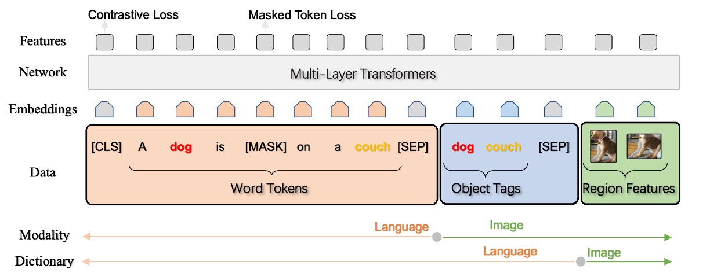

## 奧斯卡的錨點

[**Oscar: Object-Semantics Aligned Pre-training for Vision-Language Tasks**](https://arxiv.org/abs/2004.06165)

---

在視覺語言(V+L)的領域中，模糊性的問題一直是一個難以逾越的障礙，尤其當多個物件的影像區域重疊時，從中提取精確無誤的視覺區域特徵就顯得尤為棘手。以一個簡單的例子來說，當一個影像中同時出現一隻貓和一隻狗，彼此交疊纏繞時，其對應的區域特徵便可能變得模糊不清，因此在語義對齊上面臨了相當的挑戰。如何在這個混合交織的區域找到一個清晰而有意義的表示，以及如何將其與語言準確對齊，就是 Oscar 所要探討的問題。

Oscar 的運作機制簡單來說：假設有一個影像，其中包含一個蘋果和一個香蕉，而且兩者部分重疊。在常規的情況下，如果直接從這個重疊的視覺區域提取特徵，得到的資訊將是兩者的某種「混合體」，這在後續的語義對齊上將遇到困難。

Oscar 在這裡引入一個巧妙的策略，它不單單只看重疊的視覺區域，而是利用物體標籤，這裡的標籤指的就是「蘋果」和「香蕉」，作為協助語義對齊的錨點。

在這個架構下，每個訓練樣本被定義為一個三元組，包括一個單字序列、一組物件標籤和一組圖像區域特徵。藉由此策略，即便在物件的視覺區域特徵出現模糊時，作者仍能利用物件標籤進行有效的語義對齊，這為後續的 V+L 任務提供了一個相對穩固的基礎。

## 定義問題

作者在文中明確提出了有關於視覺-語言預訓練（V+L pre-training，或 VLP）模型的兩大核心問題：

1. **模糊性 (Ambiguity)**

   - 問題：當兩個或多個物件的影像區域重疊時，提取出來的視覺區域特徵可能變得模糊，不容易區分。
   - 例子：在圖 2(a) 中，「dog」 和 「couch」 這兩個物體的視覺區域重疊嚴重，因此它們的視覺區域特徵可能難以區分。
   - 導致的問題：在處理複雜的圖像-文字對應任務時，模型可能難以建立精確的跨模態對齊。

2. **缺乏定位 (Lack of Grounding)**
   - 問題描述：VLP 是一種弱監督學習問題，當中沒有明確標示出圖像中的區域或物件與文字中的單字或短語的對應關係。
   - 背景分析：即使物件像「dog」 和 「couch」這樣的元素在圖像和相對應的文本中都出現，由於沒有明確的對齊標註，模型可能無法確切學到物件和文本單元之間的語意對應關係。

## 解決問題

### Oscar 模型設計

1. **三元組輸入表示 (w, q, v)**

   Oscar 模型將每個圖像-文字配對表現為三元組（w, q, v）。

   - **w (單字編碼序列)**

     這是從文字輸入中得到的單字編碼序列，也就是每個單字或片語被轉換成的向量表示形式。

   - **q (物件標籤的單字編碼序列)**

     這是圖像中辨識物件標籤的單字編碼序列。這些標籤通常與圖像中的物件相關並由圖像辨識模型（可能基於 Faster R-CNN）生成。

   - **v (區域向量集合)**

     這是圖像中辨識區域的特徵向量集合，這些特徵向量可能包括該區域的視覺語義及位置信息。

   :::tip
   到這邊，先暫停一下。

   在繼續看下去前，請先記得 w、q、v 這三個輸入表示概念。因為這篇論文後面到處都是 wqv 的排列組合的研究探討。
   :::

2. **物件標籤作為對齊錨點**

   Oscar 利用物件標籤 q 作為一個錨點，簡化圖像和文字之間的對齊學習。由於圖像中的重要物件通常也在相對應的文字描述中被提及，使用 q 可以強化模型對於圖像和文字之間關聯性的理解和學習。在學習過程中，模型會將影像物件（可能在視覺空間中被模糊地表示）對齊到語言空間中清晰且獨特的實體表示，進一步強化模型在視覺和語言模態之間的對齊學習。

3. **語義空間的共享與注意力機制**

   利用 BERT 模型，模型可以相對容易地辨識出文本中的 q 和 w 之間的對齊。在此基礎上，模型可以把更多的注意力分配給那些與文字語義相關聯的圖像區域。當透過與 q 語義相關的單字進行查詢時，模型將分配較高的注意力權重給這些特定的圖像區域。

4. **v 和 q 的生成**

   給定一個包含 K 個物件區域的圖像，Oscar 模型使用 Faster R-CNN 從每個區域提取視覺語義成為 (v’, z)，其中 v’ 是 P 維向量（區域特徵），z 是區域位置的 R 維向量。

   - v 是通過將 v’ 和 z 連接起來形成的位置敏感區域特徵向量，並通過線性投影進一步轉換，以確保其與詞編碼有相同的向量維度。
   - 同時，物件標籤的字編碼序列 q 也是通過使用相同的 Faster R-CNN 從圖像中得到的。

### 預訓練目標

Oscar 模型的輸入可以從兩個不同的視角來看：在這裡，x 是用來區分文本和圖像表示的模態視角；而 x’ 是字典視角，用來區分兩個不同的語意空間，在其中表達輸入。

1. **字典視角：遮蔽 Token 損失(Masked Token Loss)**

   使用不同的字典來確定表示不同子序列的語意空間。簡單來說，物體標籤和單詞 Token 共享相同的語言語義空間，而圖像區域的特徵則處於視覺語義空間。在預訓練的過程中，作者利用「遮蔽 Token 損失」（Masked Token Loss，簡稱 MTL）方法。

   在每個訓練迭代中，會隨機遮蔽序列中約 15% 的輸入 Token（即，將其替換為特殊的 [MASK] Token）。訓練過程的目標是，根據周圍的 Token 和所有圖像特徵，預測這些被遮蔽的 Token。

   這個過程與 BERT 使用的遮蔽語言模型十分相似，因為它要從其周邊環境中恢復被遮蔽的單詞或標籤。與此同時，還需利用額外的圖像信息，來幫助學到的單詞編碼在視覺上下文中找到定位。

   :::tip
   假設一句話：「這是一隻可愛的狗」，和一張狗的圖片。

   在預訓練時，可能會遮蔽掉「狗」這個詞，所以句子變成：「這是一隻可愛的 [MASK]」。
   :::

   模型的工作就是利用其它未被遮蔽的文字和狗的圖片作為脈絡，預測這個 [MASK] 的真實內容，也就是「狗」。在這個過程中，圖像資訊協助模型更精確地預測遮蔽的單詞，因為視覺信息提供了額外的語境資訊。

2. **模態視角：對比損失(Contrastive Loss)**

   為了表達每個輸入的三元組，作者分組處理[ h’, [q, v] ] 來代表圖像模態，而將 ( w ) 視作語言模態。

   這裡有一個有趣的實驗過程：作者採用 50% 的機率，使用從資料集中隨機抽取的不同標籤序列來替換 ( q )，以此創建一組「污染」的圖像表示。然後，由於在特殊標記 [CLS] 上的編碼器輸出是（( h’, w )）的融合視覺-語言表示，作者在其頂部使用一個全連接層作為一個二進制分類器來預測這對是否包含原始圖像表示（即 ( y = 1 )）或任何「污染」的表示（即 ( y = 0 )）。

   :::tip
   如果你看不懂上面的敘述，或許你可以將這個過程想像成一個遊戲：

   你的朋友給你一張圖片和一些文字描述。

   但有一個陷阱：文字描述可能不正確（例如：一張顯示紅蘋果的圖片，卻被描述成：「一個藍色的書包」）。你的任務是分辨這些描述是否真實。在 Oscar 的情境下，模型也進行相似的遊戲，使用數學和機器學習的技巧來分辨給定的文字描述是否真的匹配圖片。
   :::

   在整個跨模態的預訓練過程中，作者使用物體標籤作為圖像的代理，以調整 BERT 詞編碼空間。我們希望模型學到的文字表示能與相對應的圖像（或從圖像中檢測到的對象標籤）相似，並與「污染」的表示形成對比。

## 討論

### 參數效率比較

作者首先討論了 Oscar 在視覺+語言（V+L）任務上的性能和效率，比較了 Oscar 和三種不同的現有 SoTA 模型類型的性能和參數效率。Oscar 顯示出相對於其他大型模型，在多數任務上擁有較高的參數效率和優異的性能。

### 模型性能比較

1. **Oscar 模型的總體性能**

   - Oscar 在多數 V+L（視覺+語言）任務上顯示出強大的性能。
   - 在 7 個任務上，Oscar 超越了所有現有的 VLP（視覺語言預訓練）方法。
   - 在這 7 個任務中，6 項任務上達到了新的最佳狀態（SoTA）。

2. **與其他模型的比較**

   - 對比神經狀態機（NSM），Oscar 在 GQA 任務上可能略顯不足，但可以通過結合 NSM 的結構先驗來強化。
   - 相較於多任務模型 12-in-1，OscarB 在多數任務上展現更好的表現，只在 NLVR2 的 Test-P 上的結果較差。

3. **方法和訓練策略**

   - 在字幕任務上，利用自我批判序列訓練（SCST）來進一步微調 Oscar，展現了改善序列級學習的能力。
   - 表 2 (e)部分可能展示了 Oscar 在 BLEU@4 和 CIDEr 指標上相對於其他方法的提升情況（提升 2 點以上和 10 點以上）。

4. **泛化能力的展示**
   - NoCaps 的實驗部分要求模型只使用 COCO 字幕訓練集，Oscar 遵循了這一規定，展現出其在限定訓練數據下的強大表現和泛化能力。
   - 表 2 (f)部分或展現了 Oscar 變體與先前 SoTA 方法 UpDown 的比較，並強調了 Oscar 在不同情境（近域或域外）下的優勢。

Oscar 通過使用物件標籤作為錨點，大大簡化了圖像和文字之間的語義對齊學習，這是其高效率和強大性能的一個關鍵因素。在某些任務或場景下，Oscar 的方法和模型結構還可以結合其他已有的強力技術或先驗知識來進一步提升性能。

雖然 Oscar 在多數任務上展現出強大的性能，但它在某些特定任務或指標上可能存在優化的空間或者局限，比如在 NLVR2 的 Test-P 上的表現。

### 定性研究

本研究使用 t-SNE 技術在 2D 地圖上視覺化 COCO 測試集中的圖像和文本配對的學習語義特徵空間，通過分析，作者提出以下幾個要點：

1. **類內一致性**

   - 使用物件標籤可顯著縮短相同物件在視覺和文本表示之間的距離。
   - 在 Oscar 模型中，某一物件（例如「人」或「斑馬」）的視覺和文本表示比在基線方法中更為相近。

2. **類間差異性**

   - 當添加標籤後，語意相關的物件類別彼此更加接近，雖然它們仍然是可區分的。
   - 基線方法中的類別（例如動物、家具和交通工具）出現某些混合，而添加標籤的方法可以更精確地分辨這些類別（例如「人」、「斑馬」、「羊」、「鳥」、「椅子」、「沙發」、「長凳」、「公車」、「火車」、「卡車」、「摩托車」和「汽車」）。

3. **物件標籤的重要性**
   - 物件標籤在對齊學習中擔任了一個極為重要的角色，作為連結和正則化跨模態特徵學習的錨點。

### 消融研究

根據上圖，可以觀察到幾個重點：

- 使用物件標籤微調的學習曲線在所有任務上比沒有使用標籤的 VLP 方法更快、更好地收斂。
- 在 VQA（視覺問答）和影像檢索任務上，利用標籤進行訓練只需基線方法一半的訓練時間即可達到其最終性能。

這些發現表明，Oscar 利用物件標籤在這些視覺任務上展現出了更出色且更高效的性能，且能在較短的訓練時間內達到或超過無標籤方法的效能。

- 使用物件標籤確實提升了模型的性能。這是通過比較完全注意力和部分注意力（w-v）的模型而得出的結論，顯示添加物件標籤對模型是有益的。
- 區域特徵在影像表示時提供了比物件標籤更多的資訊，這在 w-v（物件區域與文字之間的關係）和 v-q（物件標籤與問題之間的關係）的比較中得到呈現。

Oscar 模型通過利用物件標籤顯著提高了多個下游任務的性能，並且使用物件標籤進行訓練可以在更短的訓練時間內達到或超過無標籤基線的最終性能。物件標籤和區域特徵在模型注意力機制的交互中起到了重要的作用，而在預訓練階段使用不同的物件標籤集也顯示出對模型性能的影響。

## 結論

其實，這也是一個引入知識圖譜的手法。

因為標籤也是人類給的，當我們給了模型標籤，雖然說是給了一個明確的指引，但這個指引真的對嗎？這個指引真的足夠嗎？會不會反而限制了模型的發揮？

Oscar 模型利用物件標籤作為錨點，在一定程度上會依賴於物件標籤的準確度和品質。若物件標籤生成的不夠精確或多樣，模型可能會學習到錯誤的或過於狹隘的特徵，進而影響預訓練的效果和下游任務的表現。畢竟，人類的語言有無限的可能，但標籤內容卻是有限的。使用有限的概念來進行無限的拓展，本身就是一件非常困難的挑戰。

但不管怎麼說，Oscar 也豐富了多模態預訓練模型的研究領域，更展現了一條有效整合視覺與語言的新途徑。通過精心設計的預訓練策略和實驗驗證，該研究未盡的可能將促使後續的研究者們在這一基礎上探索更多創新的思路和應用，持續推動視覺與語言整合技術的發展前景。
