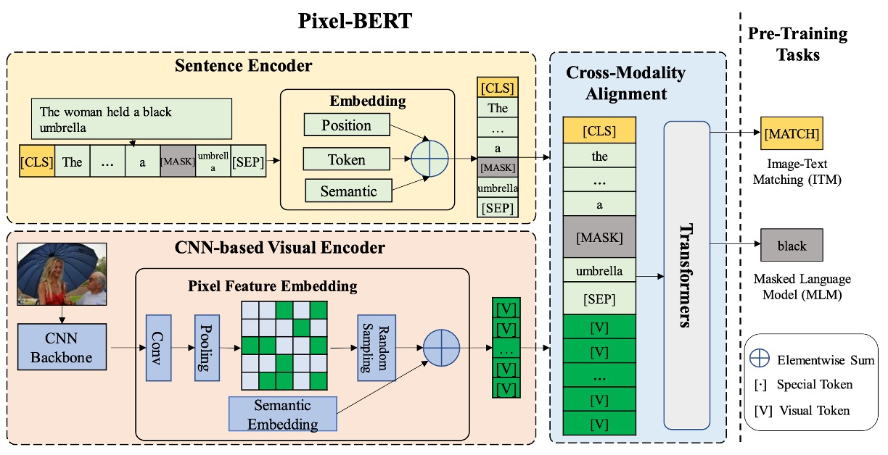
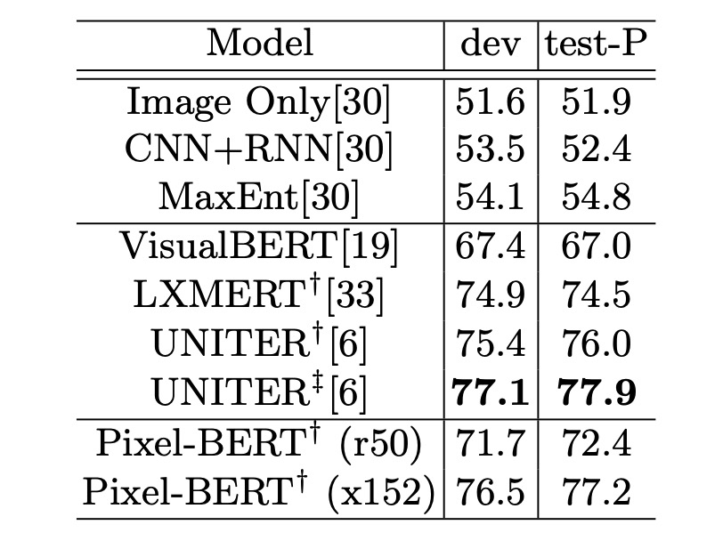
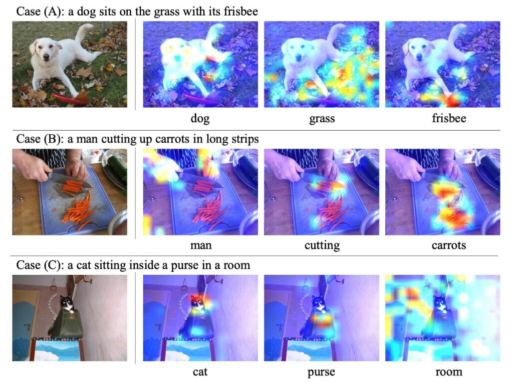

## 像素之語

[**Pixel-BERT: Aligning Image Pixels with Text by Deep Multi-Modal Transformers**](https://arxiv.org/abs/2004.00849)

---

在這之前，當我們談論視覺和語言模型的結合時，大部分的研究者都會採用一套約定俗成的標準作業流程：

1. 首先利用物件偵測模型如 Faster R-CNN 來從影像中提取區域特徵。
2. 然後結合語言模型進行跨模態學習。
3. 最後開始探討跨模態學習的設計方式。

那……

是誰規定要在外掛一個「物件偵測模型」在影像編碼流程的最前面？

可能，也沒有人規定，只是不知不覺間大家就這麼做了。

如果你也曾經做過研究人員，那就會知道：要提出一篇研究論文的一個比較容易的方式，就是依循著前人的腳步，然後進行改良，嘗試提升個 1%~3% 的表現，就可以是一篇優秀的論文。

這種情況會持續到有一個突破性的方法被提出來或是評估資料集的效能飽和之後，才會進入下一輪的改朝換代。

或許在未來幾年後的新一代的研究者們就會提出疑問：為什麼「以前」的那些人們那麼愛用 Transformer 呢？

這篇論文的作者則認為，物件偵測模型的設計，可能從一開始就錯了。

物件偵測模型通常是針對特定的視覺任務設計的，這可能會引入與語言理解不相符的偏見，尤其是當物體偵測模型的視覺表徵能力受到特定任務類別的限制時。

而 Pixel-BERT 提供了一種全新的視角。它不再依賴於預先訓練的物件偵測模型，而是直接從圖像的像素學習視覺編碼。這意味著模型能夠直接捕獲「像素級」的視覺信息，包括形狀、紋理和空間關係，這些信息在物件偵測模型中可能會丟失。再加上語言編碼的部分，該模型能夠有效地捕獲視覺和語言之間的微妙交互，並學習更豐富、更細緻的跨模態表徵。

## 定義問題

作者在這篇論文中觀察和定義了以下問題：

1. **跨模態語意差距**

   當前跨模態學習（特別是視覺與語言間）面臨著視覺和語言之間語意差距的挑戰。

2. **視覺特徵的局限性**

   先前的方法傾向於使用基於區域的視覺特徵，如從物件檢測模型中提取的特徵。但這些基於區域的特徵提取器主要是為了特定的視覺任務而設計的，導致與語言理解之間存在資訊差距。例如：物體的形狀、重疊物體之間的空間關係、物體的狀態等重要視覺信息可能會遺失。

3. **現有視覺特徵的局限性**

   目前使用的基於區域的視覺特徵在視覺語義的表示上有所局限。例如：物件偵測模型可能無法捕捉到場景和情感等更廣泛的視覺語義信息。

## 解決問題

### Pixel-BERT 模型設計

在早期的視覺和語言結合模型中，使用物件檢測模型，如：Faster R-CNN，從圖像中提取區域特徵是一種常見的做法。這意味著模型會搜尋圖片中的特定物件或主體，然後對每個物件的位置畫一個邊界框。這些邊界框內的像素值將被用作特徵，進一步用於模型學習。

但這種方法有其限制：

- 資訊損失：邊界框可能會包括一些無關的背景或忽略部分重要的物件部位，從而導致資訊損失。
- 特定任務的侷限性：這些物件檢測模型是為特定的視覺任務設計的，並可能不適合其他跨模態任務。

### 像素特徵編碼

為了克服上述限制，Pixel-BERT 採取了一種不同的策略。它不再依賴於物件的邊界框，而是直接從像素本身學習視覺編碼。

1. 像素學習：使用 CNN，像 ResNet，直接從整個影像學習。這意味著模型將考慮圖片中的每個像素，而不僅僅是被邊界框包圍的部分。
2. 提取特徵：
   - Image 輸入: 輸入圖像首先進入模型。
   - CNN Backbone: 這是一個預訓練的神經網路，用於從輸入影像中提取視覺特徵。
   - Convolution (Conv): 透過卷積層對特徵進行進一步的處理。
   - Pooling: 這個步驟將特徵圖下取樣，通常減少其空間尺寸。
   - Random Sample: 從這些特徵中隨機選取一些特徵點，維持計算效率和隨機性。
3. 語義編碼：每一個像素特徵都被增加一個語義編碼向量 sv。這是一種特殊的向量，用於區分視覺編碼與語言編碼的差異。由於所有的像素特徵都共享這個相同的 sv，所以這可以被視為是加到 CNN 主幹上的一個偏差項。（上圖的 Semantic Embedding 的部分。）

### 句子特徵編碼

模型遵循 BERT 的方法來編碼句子的語言信息。

1. **句子切分**

   首先，給定一個句子作為輸入，該句子會被拆分成單字序列。這通常是自然語言處理中的一個標準步驟，將句子拆分成其構成的詞彙元素。

2. **單字標記**

   使用 WordPiece 模型（一種常用於 BERT 的分詞方法）對每個單字進行標記。這種分詞方法可以將一個詞分解成更小的可辨識的片段或子詞，這尤其對於處理那些不常見或語料庫中未出現的詞特別有用。

3. **編碼矩陣轉換**

   接著，每個標記（或稱子詞）都會被編碼到一個向量中。這是通過一個編碼矩陣完成的，該矩陣將每個唯一的標記或子詞映射到一個固定維度的向量空間中。

4. **位置編碼**

   除了詞彙編碼外，位置信息也是非常重要的，特別是對於像 Transformer 這樣的模型。因此，像 BERT 這樣，Pixel-BERT 也添加了位置編碼來編碼序列中的每個標記的位置信息。

5. **組合編碼特徵**

   在這一步中，詞彙編碼和位置編碼進行組合。文章中用到了 LayerNorm(wi + pi + sw) 這個公式。其中，wi 是詞彙編碼，pi 是位置編碼，而 sw 是語義編碼向量。但文章提到，在實作中，這個 sw 項是被省略的。

6. **最終語言表示:**

   組合後的編碼特徵 [w^1,w^2,...,w^n] 成為句子的最終語言表示，並可供後續的模型部分使用。

### 跨模態學習

模型使用 Transformer 來學習跨模態的注意力，特別是影像像素和語言標記之間的關系。所有的編碼特徵都被組合在一起形成一個長的輸入序列，並加入特殊標記如 [CLS] 和 [SEP] 來辨識其結構。這種設計使得模型能夠端到端地學習，並能夠有效地打破視覺和語言之間的差距。

### 預訓練方法

作者為了學習與視覺和語言相關任務的通用視覺和句子表示，採用了自監督方法在大型聚合資料集上進行預訓練。

- **掩碼語言模型 (MLM)**

  在進行遮罩語言建模的過程中，模型的輸入標記中約有 15% 會被隨機選擇並遮罩。遮罩的意義是將特定標記的原始值隱藏，使模型不能直接看到它。此後，模型的工作就是嘗試恢復這些遮罩標記的真實值，它必須依賴於其他非遮罩的語言標記以及所提供的視覺標記來做出恢復的預測。

  傳統的 BERT 模型是單模態的，意思是它只在語言標記中進行遮罩預測。但是 Pixel-BERT 由於其跨模態性質，不僅僅依賴於語言模態，還可以利用視覺標記來進行預測。這使得 Pixel-BERT 在處理那些單純從語言上下文中可能難以解釋或有歧義的情境時，有更強的預測能力。例如：當語言中的某些遮罩標記與圖像中的某些物體或場景直接相關時，視覺標記可以提供關鍵的語境資訊，幫助模型做出正確的預測。

- **影像文字匹配 (ITM)**

  影像文字匹配（ITM）是一種複雜的策略，主要設計用於評估模型在理解圖像和相對應的文本描述之間的深層語義關聯的能力。這不只是尋找直接的匹配，更重要的是確認它們之間的細微連接。

  在 Pixel-BERT 模型中，這項任務使用了 [CLS] 標記，作為圖像和文本融合的代表點。透過這標記，模型得以生成一個融合的表示，反映出文本和圖像的綜合意義。例如：當模型接收到描述「春天的櫻花樹下」的文本和一張展示櫻花盛開的公園的圖片時，透過 [CLS] 標記，模型會生成一個高度相關的融合表示。這表示會進一步經過全連接層和 sigmoid 函數的轉換，最終產生一個接近 1 的分數，表示圖片和文本高度匹配。

  然而，為了提高模型的辨識能力，訓練過程中還將引入「負對」，也就是圖像和文本不相關的配對。例如：可能會將描述「春天的櫻花樹下」的文本與一張展示沙漠風景的圖片配對。這樣的設計是為了讓模型學習到何時圖片和文本是不匹配的。透過這種正對和負對的訓練組合，模型將更精準地評估實際應用中的圖像和文本匹配度。

- **像素隨機取樣 (Pixel Random Sampling)**

  這是 Pixel-BERT 中採用的一個獨特策略，主要的目的是提高模型在學習特徵時的穩健性，確保模型不會過度依賴於每一個像素，從而減少過擬合的風險。

  在模型的訓練過程中，每次當像素特徵被提取後，而不是直接使用所有的像素特徵，作者會進行隨機取樣，選取一部分的像素作為模型的輸入。這意味著在每次的迭代中，模型都會看到略有不同的圖像輸入。

  這樣做可能有幾個優點：

  - 增強穩健性：通過隨機取樣的方式，模型將學會從部分資料中抽取出關鍵的視覺信息，即使某些像素丟失或被遮蔽，仍能保持良好的性能。
  - 提高效率：減少了輸入到模型中的像素數量，這意味著模型需要處理的數據量減少，從而可以降低計算成本並加速整體的訓練過程。
  - 防止過擬合：通過經常改變模型的輸入，模型不太可能記住特定的輸入模式，從而增加了其泛化能力。

  需要注意的是：這種像素隨機取樣的方法主要應用於模型的預訓練階段。這是因為在微調階段，目標是讓模型能夠對特定的任務進行優化，這時需要使用完整的圖像資料來確保最佳的性能。因此，像素隨機取樣在微調時不再使用，以確保模型的輸入在訓練和測試階段是一致的，並最大限度地利用所有可用的像素資訊。

## 討論

### VQA 的表現

- 使用 ResNet-50 作為視覺主幹的 Pixel-BERT 在 VQA 的測試分割上獲得了 71.35 的分數。這比使用 ResNet-101 或 ResNeXt 的 ViLBERT 和 VisualBERT 的結果還要好。
- 當使用 ResNeXt-152 作為主幹時，Pixel-BERT 在測試上達到了 74.45 的分數，而在測試-標準分割上達到了 74.55，這些分數都優於其他先進的方法。
- Pixel-BERT 的結果超越了使用 24 層 Transformer 的 UNITER (Large)模型，在 VQA 的 test-std split 上獲得了 73.40 的分數。

Pixel-BERT 的顯著進步證明了直接在圖像像素級別上學習視覺和語言的注意力是非常有利的。這不僅有助於強化視覺編碼器的表示，還能增強隨後的視覺和語言編碼學習。

### NLVR2 的表現

在真實視覺推理自然語言 (NLVR2) 任務中，目的是預測語言描述是否與提供的圖像對相關。Pixel-BERT 將兩個圖像語言對作為輸入，從 [CLS] 標記中獲得兩個編碼向量。這兩個向量串聯在一起，然後通過交叉熵損失學習「真」或「假」的分類器。

Pixel-BERT 在 NLVR2 的開發分割上達到了 76.5 的準確率，在 test-P 分割上達到了 77.2 的準確率。從結果中可以看出，Pixel-BERT 組合兩個圖像語言對的方法在效果上優於其他模型，如 LXMERT 和 UNITER 的 「Pair」設定。

Pixel-BERT 的效果證明了它不僅在 VQA 任務上表現出色，而且在需要評估兩個圖像與語言描述相關性的 NLVR2 任務上也表現得很好。這些結果也顯示了 Pixel-BERT 可以靈活地適應和處理不同的輸入格式。

### Image-Text Retrieval

- Pixel-BERT 主要與 Unicoder-VL 和 UNITER 進行比較，它們都使用了 12 層的 Transformer 作為語言模組。
- 在圖像到文字的檢索上，Pixel-BERT 在 MS-COCO 1K 測試集上，recall@1 提高了 0.6，而在 MS-COCO 5K 測試集上提高了 0.3。
- 在文字到圖像的檢索上，與 Unicoder-VL 和 UNITER 相比，Pixel-BERT 在 MS-COCO 1K 測試集上至少提高了 1.9，而在 MS-COCO 5K 測試集上至少提高了 1.7。

Pixel-BERT 在圖像文本檢索任務中展現了卓越的表現。其特別的設計策略使它能有效地學習跨語言和圖像像素的注意力，特別是在文字到圖像的檢索方面，與其他當前的先進模型相比，其性能有顯著的提升。這些結果證明了 Pixel-BERT 在視覺語言任務上的效能和潛力。

### 模型的關鍵設計是什麼？

作者分析 Pixel-BERT 的有效性和卓越表現部分歸因於其幾個關鍵設計：

1. **預訓練任務的選擇**

   通過消融實驗，可以明確地看到 MLM 和 ITM 在預訓練中的重要性。這些任務都為下游任務提供了顯著的性能提升，其中 NLVR2 任務尤其依賴於 MLM。

2. **組合不同的預訓練任務**

   當 MLM 和 ITM 被組合在一起時，它們的共同效果對模型的性能有顯著的正面影響，證明了使用多種預訓練任務可以進一步提高下游任務的效果。

3. **隨機像素取樣**

   這是 Pixel-BERT 的一個獨特設計，它的目的是增強模型的穩健性並避免過度擬合。從消融實驗中可以看到，該策略在 VQA、檢索任務和 NLVR2 上都產生了正面的貢獻。

4. **視覺主幹的選擇**

   模型的性能也取決於所選擇的視覺主幹。當使用更強大的 ResNext-152 作為視覺主幹時，模型的性能獲得了顯著提升，顯示了 Pixel-BERT 模型與強大的視覺主幹的組合能力。

## 結論

最後，作者提供了模型可視化的結果，如上圖所示，Pixel-BERT 的可視化注意力圖不僅顯示了模型的理解能力，更驗證了其能夠精確捕捉到文字與影像之間的語義關聯。模型的注意力機制透過可視化展現出深入的跨模態學習效果。這不僅證明了 Pixel-BERT 的效能，還指出其在視覺和語言編碼中的可靠性。

在最近的研究發展中，預訓練模型在視覺和語言領域已經取得了引人注目的效果。為了解決基於區域的視覺表示所帶來的限制，作者引入了一種基於 CNN 的視覺編碼器，並巧妙地與多模態 Transformer 結合，創建出 Pixel-BERT 模型。

Pixel-BERT 不僅深入探討了像素和文字之間的關聯，更展現了其在視覺語言編碼方面的精確性和深度。其學習策略，如隨機像素取樣，進一步加強了模型的穩健性。在主流資料集如 Visual Genome 和 MSCOCO 上，這款模型已經展示出了令人印象深刻的預訓練成果。更為值得期待的是，作者還計劃在更多的資料集上進行預訓練，並尋求結合自監督的視覺內容任務以進一步提升模型的效能。

:::tip
如果暫且撇開作者自己下的結論，我認為把「物件檢測模型」這個部分抽換掉，還能和 SOTA 作品，UNITER，的表現持平，甚至還能有所超越。這就是最大的貢獻了！

它意味著我們不再需要去串接一個肥滋滋的，還可能需要額外預訓練的 Faster R-CNN （或其他架構），這個部分對工程師來說，絕對是一件值得大書特書，特別愉悅的事情呀！
:::
