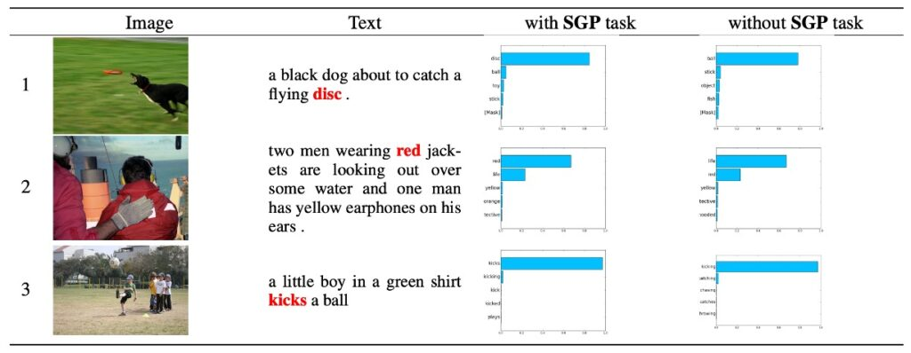

# [20.06] ERNIE-ViL

## 知識的雙面刃

[**ERNIE-ViL: Knowledge Enhanced Vision-Language Representations Through Scene Graph**](https://arxiv.org/abs/2006.16934)

---

在 BERT 之後的許多故事，你大概也都略有耳聞，能多少說出幾個差異，例如：

ERNIE 模型在預訓練時融合了豐富的先驗知識，像是實體知識圖，從而獲得更好的語義理解。另外，ERNIE 採用了片段級的 masking。除了常見的 Masked Language Model (MLM) 任務，ERNIE 還加入了其他的預訓練任務，進一步提高模型的表示能力等。

既然 ERNIE 都優化了 BERT，那研究者們肯定是要把這份優化理念，同理類推到其他領域，也是個意料之內的操作了。

## 定義問題

作者著重於視覺語言預訓練模型的問題，特別是當前模型在詳細語義對齊方面的不足。

目前的模型往往無法區分常見詞和描述詳細語義的詞，如對象、屬性對象、物件之間的關係等。這使得這些模型在處理真實場景時，難以有效地表示和捕捉到細微語義。

作者定義並試圖解決的幾個要點：

1. **當前視覺語言預訓練模型的不足**

   現有模型常基於隨機屏蔽和預測子詞的方法，而沒有有效地區分常見詞和描述詳細語義的詞，如對象、屬性對象、物件之間的關係等。

2. **詳細語義對齊的重要性**

   當前的方法往往忽略了跨視覺和語言建構詳細語義對齊的重要性。這意味著模型在處理真實場景時，可能無法充分捕捉和表示細微的語義差異。

3. **視覺語言預訓練的資料來源問題**

   與文字預訓練模型不同，視覺語言模型需要高品質對齊的圖像文字資料，這些資料通常難以獲得。

## 解決問題

### ERNIE-ViL 模型設計

### 雙流跨模態網路

雙流跨模態 Transformer 結構確保了這兩種模態的資訊能夠有效地組合在一起，提供一個全面的、統一的視覺語言表示。

1. **雙流結構**

   「雙流」意味著有兩個獨立的數據流或途徑。在 ERNIE-ViL 的情境中，這兩個流分別為文本（或語言）和圖像。這兩種模態都有其自己的 Transformer 結構，這意味著模型可以分別專注於每種模態的特定特徵，而不是混合它們在一起。

2. **處理文本和圖像資料**

   因為視覺和語言資料的性質有很大的差異（例如：文本是序列化的，而圖像是二維的），所以分別處理它們使得模型可以專注於每種模態的獨特性質，然後使用專門設計的方法來解析和學習這些資料。

3. **跨模態 Transformer 區塊**

   這些區塊的目的是促進視覺和語言數據之間的互動和對齊。一旦文本和圖像都被它們各自的 Transformer 結構處理，跨模態的區塊就會開始工作，將這兩種模態的資訊融合在一起。這是通過注意力機制和其他特定的策略來完成的，目的是找到文本和圖像之間的相關性和語境。

整個雙流結構的主要目的。當你有一個圖像和一個相關的句子或描述，理想的情況是你的模型能夠理解它們之間的關聯性。例如：如果文本說「紅色的球」，模型應該能夠辨識圖像中的紅色球體。

### 場景圖預測任務

場景圖（Scene Graph）本身不是一個可訓練的模型，而是一種資料結構或表示法。它是用來描述圖像中物件的存在、物件之間的關係以及物件的特定屬性的。

場景圖是一種視覺表示法，描述了圖像中物件的存在、物件之間的關係以及物件的特定屬性。舉例來說，對於一張有「紅蘋果在桌子上」的圖片，場景圖將會包含：「蘋果」這個物件、「桌子」這個物件、蘋果的屬性「紅色」、以及蘋果和桌子之間的關係「在…上」。

三大預測任務：

1. **物件預測**：這部分的目的是預測或辨識文本中提到的特定物件。例如：在句子「紅蘋果在桌子上」中，它應該能夠辨識「蘋果」和「桌子」為主要的物件。
2. **屬性預測**：這部分著重於物件的特定特徵或描述。在上述例子中，物件「蘋果」的屬性是「紅色」。這部分的目的是辨識和預測這些屬性。
3. **關係預測**：這部分的目標是辨識物件之間的關係。在我們的例子中，蘋果和桌子之間的關係是「在…上」。

藉由這三個預測任務，ERNIE-ViL 被訓練去深入地對視覺（圖像）和語言（文本描述）之間的語義進行建模。這意味著模型不僅僅辨識圖像中的物件和其描述，還能夠理解物件之間的關係以及它們的特定屬性，從而提供更豐富、更深入的視覺語言表示。

### 語義對齊

ERNIE-ViL 的核心目標之一是確保視覺（即圖像）和語言（即文本）之間存在深入的語義對齊。語義對齊可以理解為模型對圖像中的物件和它在句子中的語義描述之間的深入理解。

例如：當圖像中有一只貓在汽車上，模型不僅要辨識出圖像中的「貓」和「汽車」，還要理解「在…之上」這一關係。這樣的語義理解確保模型能夠在描述和圖像之間建立正確的連接。

物件、屬性和關係的預測任務在此過程中起到了關鍵作用。這些任務要求模型不僅要辨識圖像中的物件和其屬性，還要理解物件之間的關係，這有助於建立更強大的跨模態理解。

### 編碼方法

編碼是機器學習中的一種技術，目的是將高維的輸入數據轉化為低維的形式，這有助於模型更好地理解和處理數據。ERNIE-ViL 使用了一些先進的編碼技術來處理其輸入的文本和圖像數據：

1. **句子編碼**

   - 使用 WordPiece 方法進行句子分解。這是一種將詞語分解成更小的子單位或片段的方法。例如：「playing」可以分解為「play」和「ing」。
   - 生成的每個子詞的編碼是基於多種信息源的組合，包括：原始的詞編碼（基於詞的語義）、分段編碼（區分不同的句子或段落）以及序列位置編碼（確定詞在句子中的位置）。

2. **圖像編碼**
   - 使用預訓練的物件偵測器來辨識圖像中的主要物件和特征。例如：它可以辨識圖像中的「貓」或「汽車」。
   - 對於每個辨識出的物件或區域，模型還會編碼其在圖像中的位置資訊。這有助於模型了解物件之間的相對位置和關係，例如：「貓」在「汽車」的上方。

### 預訓練任務

在深度學習的領域中，預訓練任務是一種常見的策略，旨在利用大量未標記的數據提前訓練模型，使其在後續的特定任務上具有更好的泛化能力。ERNIE-ViL 針對視覺語言模型提出了一系列預訓練任務，包括物件預測、屬性預測、關係預測以及掩碼語言建模，以下我們進一步探討每一個預訓練任務的特點及其意義：

1. **物件預測**

   物件作為視覺場景的核心元素，對於理解該場景的重要性極高。想像一張只有蘋果和桌子的圖片，若蘋果被遮罩，整張圖片的主要元素將被隱藏，這會對模型的理解造成困難。在物件預測的預訓練任務中，部分物件會被這樣遮罩，要求模型基於其他可見的視覺和文本信息進行預測。這迫使模型學習在圖像和文本之間建立連接，並提高對場景的整體認知。

2. **屬性預測**

   物件除了基本的概念外，還有許多相關的屬性，如顏色、大小和形狀。例如：「紅色的蘋果」中的「紅色」就是蘋果的一個屬性。屬性預測任務要求模型預測被遮罩的物件的這些屬性，從而使模型能夠更精確地描述和理解圖像中的物件，而不只是基本的分類。

3. **關係預測**

   物件之間的關係提供了更多的場景信息。例如：在「蘋果在桌子上」中，「在…之上」描述了蘋果和桌子之間的相對位置關係。在關係預測任務中，模型將學習如何從圖像中辨識這些關係，並將其正確地映射到語言描述中，從而提供對視覺場景的深入理解。

4. **掩碼語言建模 (MLM)**

   MLM 是一種文本預訓練任務。例如：從「蘋果是紅色的」這句話中，遮住「紅色」，然後要求模型填補這個遺失的部分。ERNIE-ViL 通過這種策略學習文本的句法和語義信息，使其在後續的任務中具有更強大的語言處理能力。

5. **掩碼區域預測和圖像文字匹配**

   這些任務專注於圖像部分，就是我們之前提到過的 ITM (Image-Text Matching) 和 MRM (Masked Region Modeling)。例如：一張圖片中可能包含一個「紅色的蘋果」和「木製的桌子」。模型可能會遮住蘋果的部分，然後試圖根據桌子和相關的文字描述來預測遮住的部分。這種預訓練任務不僅增強了模型對單一模態的理解，還加強了跨模態間的聯系，幫助模型在真實場景中更好地整合視覺和語言信息。

## 討論

ERNIE-ViL 的實驗結果在多種視覺語言任務上展現了其卓越的性能，特別是當它和其他先進的跨模態預訓練模型進行比較時。以下幾點為作者對此模型的主要觀察和討論：

### 域外訓練資料的優勢

根據表 1 的數據，ERNIE-ViL 模型在多個視覺語言任務上展現出卓越的性能，特別是當它在域外的大型資料集 CC 和 SBU 上進行預訓練時。

以下是一些主要的亮點：

1. 比較其他在相同域外資料集上預訓練的方法，ERNIE-ViL 在 5 個主要方面上均取得了最佳性能。
2. 在視覺推理部分，ERNIE-ViL-large 相比 VLBERT-large 在 VCR 任務上有了 6.60% 的提升，而在 VQA 任務上提高了 1.74%。
3. 對於視覺基礎任務，ERNIE-ViL-large 在 RefCOCO+ 的 testA 和 testB 部分相比 VLBERT-large 分別提高了 2.40%。
4. 在跨模態檢索的部分，ERNIE-ViLbase 在影像檢索和文字檢索任務中分別取得了 2.94% 和 0.50% 的提升，超越了 Unicoder-VL-base。
5. 當使用域外和域內的所有資料集進行預訓練時，ERNIE-ViL-large 依然在多個任務上超越了其他先進模型，如 UNITER、OSCAR 和 VILLA。

### 場景圖預測的重要性

場景圖預測（Scene Graph Prediction, SGP）任務在模型的表現中起到了重要的作用。從實驗中可以觀察到：

1. **場景圖預測的引入**
   - ERNIE-ViL 在引入 SGP 任務後，整體表現得到了顯著的提升。這個結果突顯了 SGP 在預訓練階段的價值。
2. **對特定任務的改進**
   - 在基礎引用表達式上，尤其是需要深入的語義對齊的部分，SGP 使模型在 RefCOCO+ 上的準確率提高了 0.69%。
   - 對於圖像檢索任務，模型在 Flickr30K 數據集上的 R@1 提高了 2.22%。
3. **ERNIE 2.0 的影響**
   - 從 ERNIE 2.0 開始的文字初始化進一步提高了模型的表現。特別是在視覺推理任務，如 VCR，其效果尤為明顯。這可能是因為 ERNIE 2.0 在預訓練過程中學到了更多的常識知識。

ERNIE-ViL 在加入 SGP 任務後，其性能有顯著的提升，尤其是在需要詳細語義對齊的任務上，如基礎引用表達和跨模態檢索。這突顯了場景圖的建模對於理解圖像和文本之間的關聯的重要性。

### 完形填空測驗

使用視覺模態為條件的語言完形填空測驗來評估 SGP 任務的效果。此測驗需要模型根據文字和圖像的上下文推斷被隱藏的詳細語意標記。

1. **數據集構建**
   - 從 Flickr30K 資料集中隨機選取了 15,000 個圖像文字對。分別選擇了 5,000 個物件、屬性和關係標記作為隱藏目標。
2. **評估指標**
   - 使用前一準確率（ACC@1）和前五準確率（ACC@5）作為評估標準。
3. **比較結果（根據表 3）**
   - 使用 SGP 預訓練的模型相比不使用 SGP 的模型在 ACC@1 上顯示出了顯著改進：物件改進了 1.20%，關係改進了 3.08%，屬性改進了 1.84%。
   - 兩個模型的文字參數都是基於 BERT 初始化的。
4. **觀察結果**
   - 有些情況下，不使用 SGP 任務預訓練的模型無法正確預測，因其沒有學習詳細語義對齊且在預訓練時無法區分常用詞和詳細語義詞。在其他情境下，儘管模型能夠進行預測，但其置信度低於使用 SGP 任務預訓練的模型。

作者從完形填空測驗表明，引入 SGP 任務可以使 ERNIE-ViL 模型更有效地學習跨模式的詳細語義對齊。

## 結論

ERNIE 架構在多模態學習的過程中，雖然能有效提取知識，但其計算量和存儲需求都相對較大。這意味著需要更多的計算資源，這在部分設備或情境中可能會受到限制。其次，儘管 ERNIE 有能力利用事先學習的知識，但它的泛化能力在一些特定的、較為罕見的跨模態場景中可能仍有待加強。

延伸至 ERNIE-ViL，該模型雖然成功地引入了場景圖預測任務以優化跨模態詳細語義對齊，但同時也帶來了新的挑戰。舉例來說，如果場景圖中的物件如「樹」和「人」之間的關係被錯誤地標記為「坐在」而非「站在」，這種誤解可能會導致模型在下游任務上的失效。

:::tip
場景圖的準確性和完整性都會直接影響模型的性能！
:::

這增加了在實際應用中的不確定性。再者，考慮一個照片中呈現的是一個模糊的背影，或是多重重疊的物件，模型可能難以確定那是「人」還是「影子」或其他物體。在這些情況下，模型在遇到複雜或模糊的場景時，可能會面臨解讀困難，這也限制了其在某些特定場合，例如當需要精確物件辨識或場景解讀時的適用性。

使用場景圖，其實背後隱含的意涵就是：「人類理解知識的方式」比「模型理解知識的方式」還要好，所以讓模型來學習人類理解世界的方式。

但，這樣好嗎？

我們也建議你也可以試著想想，這樣好在哪裡？不好在哪裡？想清楚之後，你就會更清楚地認識到本篇文章中使用的「知識增強」技法會遇到的機遇與困難。

儘管如此，ERNIE-ViL 在跨模態預訓練的領域仍展現出令人矚目的優勢。它不僅優化了詳細語義的對齊，而且還提供了新的方向，譬如：我們能進一步整合從影像中提取的場景圖，以及利用圖神經網路（GNN）來整合更多的結構化知識。這不僅是技術進步的象徵，也為未來的研究者提供了新的研究方向和思考空間。
