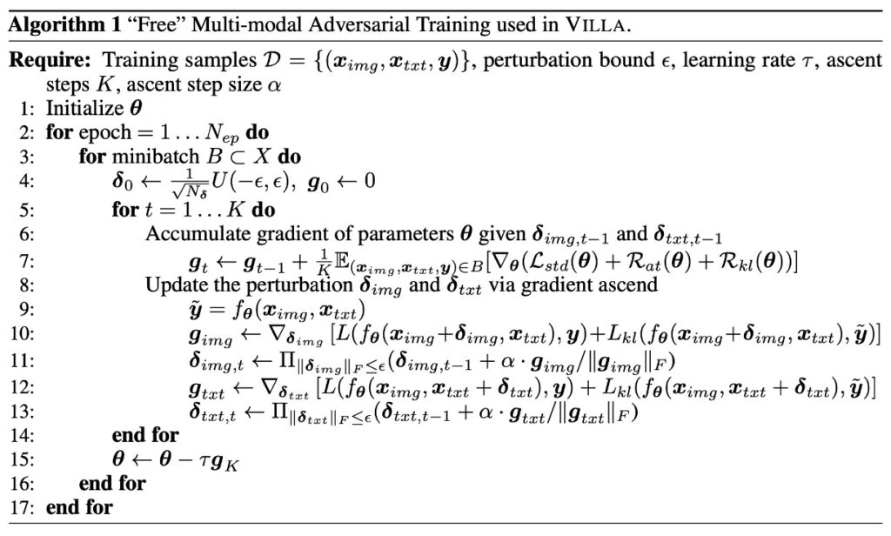
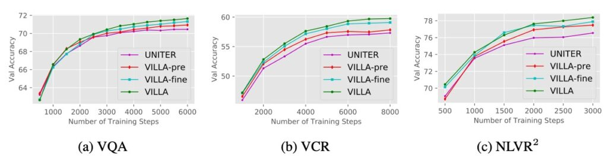

# [20.06] VILLA

## 別墅裡的魅影

[**Large-Scale Adversarial Training for Vision-and-Language Representation Learning**](https://arxiv.org/abs/2006.06195)

---

這次我們來看一篇有趣的論文。

作者在這邊論文中引入了對抗性訓練的概念，但這個概念很容易跟降噪（Denoising）搞混。

所以我們可以先聊聊，對抗性訓練和降噪有什麼不同：

1. **降噪 (Denoising)**

   目的是清除圖片或數據中的雜訊，恢復原始的、未被雜訊干擾的數據。

   假設你有一張受到雜訊影響的圖片，降噪的過程會試圖去除這些雜訊，使圖片更接近原始、乾淨的狀態。

2. **對抗性訓練 (Adversarial Training)**

   目的是使模型在面對「對抗性攻擊」時仍然能夠正確地進行預測。

   假設你有一個模型，它在面對一些特意製造出來的、可能引導模型做出錯誤預測的數據時，對抗性訓練的目的是讓模型學會應對這些情況，提高其泛化性。

降噪主要關心的是如何恢復原始的、乾淨的數據，而對抗性訓練的目的是增強模型的泛化性，使其能夠抵抗敵意的、試圖欺騙模型的輸入。另外降噪通常涉及到的是已知的雜訊模式，並試圖去除它。而對抗性訓練是故意創造新的、可能導致模型錯誤的「敵意」輸入。

在訓練模型時，我們不僅讓它看標準的、熟悉的圖像和文本，還要給它一些「假想的對手」，就是那些「被特意修改過，旨在迷惑模型」的輸入內容。這些「假想的對手」就像那些訓練中的突如其來的挑戰，迫使模型學會應對各種不同的情況。

## 定義問題

之前沒人嘗試過在 VLM 預訓練模型中引入對抗性訓練，這就是個顯而易見的問題！

作者想要探討該如何有效的將對抗性訓練的概念應用於多模態的任務上，並且效果要好。

除了要提升模型的穩健性之外，還要保持甚至增強其對乾淨資料的泛化能力。這是一個很有挑戰性的問題，因為對抗性訓練通常伴隨著高昂的運算成本和時間消耗。

## 解決問題

這邊會比較艱澀一點，但我們還是可以一起來讀讀看。

作者分為三個部分來構建整個模型。

### VILLA 模型設計

這個階段的主要目的是學習能夠在不同的下游任務中適用的通用的圖像和文字表示。

1. **資料集**

   使用資料集 （論文中，給定 Dp 來表示預訓練的資料集)）進行預訓練，該資料集由影像文字對（X_img，X_txt）組成。

2. **特徵表示**

   - 影像（X_img）首先通過一個自下而上的特徵提取器 (g_bu(·)) 轉換為特徵向量 。
   - 文字（X_txt）則通過一個可學習的詞編碼函數 (g_emb(·)) 轉換為特徵向量。

3. **多模態融合**

   為了融合影像和文字的特徵，使用了多層的 Transformer 結構，這種結構在自然語言處理和其他多模態任務中非常流行。其中，[CLS] 標記在這裡有特別的意義，其編碼被用作多模態任務的聯合表示。

### 預訓練任務

其中，MLM 和 ITM 在之前看的論文中有講過很多次了，這邊簡單帶過，並詳細講講 MRM 的策略。

- **掩碼語言模型 (MLM)**

  在進行遮罩語言建模的過程中，模型的輸入標記中約有 15% 會被隨機選擇並遮罩。遮罩的意義是將特定標記的原始值隱藏，使模型不能直接看到它。此後，模型的工作就是嘗試恢復這些遮罩標記的真實值，它必須依賴於其他非遮罩的語言標記以及所提供的視覺標記來做出恢復的預測。

- **影像文字匹配 (ITM)**

  影像文字匹配（ITM）是一種複雜的策略，主要設計用於評估模型在理解圖像和相對應的文本描述之間的深層語義關聯的能力。

- **掩蔽區域建模 (MRM)**

  MRM 的主要目的是讓模型學習如何根據完整的圖像信息推斷出被掩蔽的部分。這樣的能力可以幫助模型在後續的任務中更好地理解和辨識圖像的各個部分，並與語言特徵有效地結合。這種方法與自然語言處理中的「掩碼語言建模」（Masked Language Modeling, MLM）相似，但它是應用於圖像區域而非文字標記。

  在影像資料 X_img​ 中，選擇一些特定的區域（可以是隨機選擇，或按某種策略選擇）並將其特徵設置為零或使用其他方式進行掩蔽。這些被掩蔽的區域可以視為模型需要「填充」的部分。

  給定其他未被掩蔽的多模態資訊（如影像的其他部分和相關的文本描述），模型的任務是預測被掩蔽區域的正確內容。這種預測可以通過交叉熵損失、KL 散度損失或對照學習等方式來量化。

  :::tip
  這感覺就像是，如果你有一本幼兒著色本。在其中一頁，畫面上有一個半完整的蘋果圖案，其中一部分被擦去了或被遮蓋了。假設這個蘋果的右側 1/4 被遮住了。現在，儘管你只看到了這個蘋果的 3/4，但由於你之前已經看過很多完整的蘋果，你仍然能夠猜測那部分被遮住的蘋果看起來應該是怎樣的。
  :::

### 兩階段的對抗性訓練

這裡的兩階段指的就是預訓練和微調。

這部分的論述是探討預訓練和微調兩個階段如何進行對抗性訓練，以及它們之間的關係。

1. **預訓練和微調的連接**

   預訓練和微調是大多數深度學習流程中的兩個主要階段。預訓練階段是為了獲得模型的基本理解和基本的特徵提取能力。而微調階段則是對特定任務進行專業化訓練。這兩個階段有著密不可分的關係，因為預訓練為微調階段提供了必要的基礎。

2. **跨模態聯合理解的重要性**

   模型在不同的任務上，如 MLM 或 VQA，都需要進行跨模態的理解，意即同時理解圖像和文本的內容。舉例來說，如果在圖片中看到了一隻狗，模型需要能夠將這個視覺資訊和文本「狗」相互聯結。

3. **對抗性訓練的假設**

   - 第一個假設是進行對抗性預訓練能夠增強模型的泛化能力，這將對微調階段十分有利。泛化能力是指模型在未見過的數據上的表現。
   - 第二個假設是在微調階段，當有了特定任務的訓練數據，可以再次使用對抗性訓練方法，進一步提高模型的性能。

4. **共享的數學公式**

   預訓練和微調這兩個階段在數學上是相似的，所以它們都可以使用相同的對抗性訓練方法。

這裡要強調的是：兩個階段都可以進行對抗性訓練，以提高模型的泛化能力和對抗攻擊的韌性。

對抗性訓練在預訓練階段有助於增強模型的基本泛化能力，而在微調階段則可以根據特定任務進一步提高模型的性能。

### 微擾動（Perturbations）

這段主要探討了如何在影像和文字的編碼空間（embedding space）中加入對抗性擾動來進行對抗性訓練。

1. **影像模態的擾動**

   在最先進的 V+L 模型中，模型通常將預訓練的目標偵測器得到的影像特徵作為輸入。與傳統的在像素空間添加擾動的方法不同，這裡的方法選擇直接在這些特徵的編碼空間中添加對抗性擾動。例如：考慮一張狗的圖片，這裡不是直接對圖片的像素進行小的調整，而是對該圖片在模型中的特徵表示進行微小擾動。這種方法的主要優勢是它可以更精細地操作編碼，使得擾動更加嚴格。

2. **文字模態的擾動**

   與影像像素的連續值不同，文字的標記是離散的，因此更難以操控。傳統上，製作保留原始語義的對抗性範例在文字模態中是困難的。然而，本文的方法選擇在單詞的編碼空間中加入擾動，而不是直接在單詞上。這樣可以避免直接改變原始的文本內容，但仍能影響模型的預測。

   例如：考慮句子 「The dog barks.」，作者不是替換或修改其中的字，而是對「dog」 這個詞的編碼表示進行微小調整，使其在模型中對應到與 「dog」 相似但略有不同的表示。

3. **位置編碼**

   在預訓練的 V+L 模型中，位置編碼被用來編碼影像區域和子詞標記的位置。在這裡的對抗性訓練方法中，僅修改圖像和單詞編碼，而保持其他特徵不變。

4. **同時擾動的考量**

   作者建議一次只對一種模態（即影像或文字）加入擾動。這是基於圖像和文字的獨特特性和差異。在添加擾動後，目標是讓模型的預測不會改變，即保持原始語義。

### 多模態「自由」對抗訓練

這一節主要闡述了 VILLA 模型中使用的多模態「自由」對抗訓練方法，其中涉及了多個數學公式與技術詳情，別怕，我們詳細地來看一下：

- **訓練目標**

  在 VILLA 模型中，「對抗訓練」是一項核心技術，其目的是使模型在面對輕微的輸入擾動時仍能保持穩定的預測性能。這種訓練方式可以被理解為一種強化手段，使模型不容易受到外部噪音或微小變動的影響，從而提高其在各種情境下的泛化能力。這意味著模型不僅能夠在訓練數據上表現出色，還能夠對新的、未見過的數據產生可靠的預測。

  為了達到這一目標，訓練過程中要考慮三個主要的損失項：

  1. **標準的交叉熵損失（L-std）**

     這是大多數分類問題中使用的基本損失函數，它衡量模型的預測與真實標籤之間的差距。越小的交叉熵損失意味著模型的預測越接近真實情況。

  2. **標籤保存的對抗訓練損失（R-at）**

     這一項確保當輸入數據遭受輕微擾動時，模型的預測仍然保持與原始輸入相同的標籤。換句話說，即使圖像或文本有輕微的變化，模型也應該產生相同的預測結果。

  3. **細粒度的對抗正則化項（R-kl）**

     這是一個更為複雜的損失項，它不僅要求模型在擾動輸入時保持相同的標籤，還要求模型的預測信心或概率分佈也應該與未受擾動的輸入保持接近。這確保了模型不僅在標籤級別上保持泛化性，還在預測的細節上也保持泛化性。

- **多模態的對抗擾動**

  VILLA 模型在進行訓練時，不僅考慮原始的影像和文字編碼，還針對這些編碼加入了對抗性的擾動。這些擾動可以被理解為故意導入的微小變化，目的是測試和增強模型的泛化性，確保模型在遭遇未知的、微小的噪聲或變動時仍能正確工作。

  然而，這些對抗性擾動不是隨意添加的。它們有明確的「範數限制」，意思是這些擾動的強度或大小受到了一定的控制，以確保它們不會造成模型完全無法辨識的重大變動。

  接著，模型的訓練涉及到兩個主要的優化步驟：外部的最小化和內部的最大化。外部的最小化主要是指在整體的訓練過程中，希望模型的預測錯誤（即損失）盡可能小，這一步可以通過常見的梯度下降方法如 SGD (Stochastic Gradient Descent) 來達成。而內部的最大化則是在尋找對抗性擾動時，希望這些擾動可以使模型的損失最大化，這樣找到的擾動就是最有可能干擾模型的。這一步的優化是通過一種稱為 PGD (Projected Gradient Descent) 的方法完成。

  考慮到影像模態，每進行一次迭代更新擾動時，PGD 會先計算當前擾動對損失的影響，即計算損失對擾動的梯度。接著，它會在這一梯度的方向上進行一個小步驟，以嘗試找到一個可以最大化損失的新擾動。這個過程會反覆進行，直到達到預定的迭代次數或擾動大小的限制。

  想像你正在訓練一個機器學習模型，它的任務是分辨照片中的物體是「狗」還是「貓」。原始的影像編碼就是從照片中提取的特徵或資訊。

  1. **對抗性擾動的加入**

     假設在訓練的過程中，有人故意微調了一些照片的像素，使其中的貓看起來更像狗，或者使狗看起來更像貓。這些微調就是所謂的「對抗性擾動」。

  2. **範數限制**

     但是，這些微調不是隨意的。它們有一個限制，確保變動不會太大。例如：擾動的大小不會使貓的整張臉完全變形，只是微調到足以混淆模型的程度。

  3. **優化**

     在每次訓練迭代中，模型都試圖找出這些微調是如何進行的，然後學習如何儘量忽略它們，專注於真正區分狗和貓的特徵。使用 SGD，模型會根據這些微調的影響，調整自己的參數，使得在這些被微調的圖片上的錯誤率減少。而使用 PGD，模型會在每次迭代中，嘗試找出最可能使自己出錯的那些微調，然後針對這些最壞情況進行學習和調整。

- **對抗正則化的進一步增強**

  對抗正則化是機器學習中的一種技巧，旨在提高模型的泛化性，使其在面對對抗性擾動時仍能夠進行正確的預測。在某些情境中，對抗性擾動可能會使模型的預測產生很大的偏差，而這種正則化的方法則試圖限制這種偏差。

  這種增強型的對抗正則化不只是簡單地要求模型在面對擾動時仍能正確分類，更進一步要求模型的預測機率分佈在擾動前後要保持相似。這就意味著，模型不僅要確定某個物體是「貓」或「狗」，還要確保其對此判斷的信心或機率在擾動前後都不會有太大的變化。

  :::tip
  Kullback-Leibler 散度是一種衡量兩個機率分佈之間差異的工具。在這個情境下，它被用來比較模型在擾動前後的預測機率分佈的相似性。如果兩個分佈很相似，則其 Kullback-Leibler 散度將接近 0；反之，如果兩者相差很大，則其值將會增加。
  :::

  :::tip
  舉個例子：

  考慮一個模型，在未受擾動的情況下，預測某照片中的動物為「貓」的機率為 90%。但當這張照片受到對抗性擾動後，模型的預測機率降至 60%。這表示擾動影響了模型的確定性，使其對於「貓」的預測不再那麼自信。這種信心的變化，即這兩個機率分佈之間的差異，會被 Kullback-Leibler 散度捕捉到。正則化項將嘗試最小化這個差異，鼓勵模型在受到擾動時仍能保持相似的預測信心。
  :::

### 自由的對抗訓練策略

對抗訓練 (Adversarial Training, 簡稱 AT) 是一種強化模型泛化性的方法，通常使用擾動數據進行訓練以提高模型對對抗攻擊的抵抗能力。在這裡，作者提到了一種稱為 “Free” 的對抗訓練策略。（原文是 free，我也不確定要翻譯成免費或是自由，意義上感覺都可以呢？）

- **K-step PGD 的計算成本**

  PGD (Projected Gradient Descent) 是進行對抗訓練時常用的方法。當使用 K-step PGD 時，需要通過模型進行 K 次的前向和反向傳播，這是非常耗時的。此外，只有在 K 步之後的最後一步中產生的擾動被用於模型訓練，這意味著先前的所有步驟都只是為了產生這最後一次的擾動。

- **解決方法：FreeLB**

  為了克服上述的計算問題並有效地執行大規模的訓練，作者採用了一種名為 FreeLB 的方法。FreeLB 的方法不只進行多次的 PGD 迭代以製作對抗性編碼，而且在每次迭代中都累積了「自由」參數的梯度 ∇θL。這意味著，不是在每次迭代後都更新模型參數，而是在多次迭代後一次性使用累積的梯度進行更新。

  這種策略的優點是它可以模擬一個更大的「虛擬」小批量 (mini-batch)。換句話說，它有效地模擬了一個 K 倍大小的小批量，使得每次更新更為豐富和多樣。

不免俗的，再來舉個例子：

想像你正在組裝一台自行車，每一步都有特定的組件需要安裝。

- **傳統的 K-step PGD 方法**

  這就好像你組裝自行車的每一步都去檢查它是否能夠正常運作。例如：在安裝踏板之後，你騎了一小段，然後又裝上車鍊再騎一段，再次檢查，這樣每加一個部分都去測試。雖然這可以確保每一部分都被正確安裝，但它非常耗時。

  然而，你發現最後只有你組裝完所有部分後的那次騎行測試是最重要的，因為它告訴你整台自行車是否完全組裝正確。

- **FreeLB 策略**

  現在，想象另一種組裝策略。

  你仍然分步組裝自行車，但不是在每一步都去騎它測試。相反，你每組裝一部分都記下可能會遇到的問題或考慮的事項（這相當於累積梯度）。當所有部分都裝好之後，你再一次性地根據累積的所有問題和考慮事項去做一個全面的測試和調整。

  這種方法允許你更高效地組裝，因為你不再浪費時間在每一步都測試，而是集中精力於最後的全面調整。

當然，所有比喻都有其局限性，不可能完美地映射到目標概念，就加減看看，感覺一下就好。

## 討論

這篇的重點其實都圍繞到對抗性訓練的設計上了。

不過我們還是要看一下，這樣的設計好嗎？又好多少？

### 實驗配置

為了驗證 VILLA 的功能與效果，作者進行了一系列的實驗應用。這些應用主要集中在 V+L 的預訓練模型上，並進行了多種下游任務的綜合評估。這些任務包括視覺問答 (VQA)、視覺常識推理 (VCR)、引用表達 (RE) 壓縮、視覺蘊涵、圖像文字檢索以及 NLVR2。

主要的驗證過程分為兩個階段：首先，作者將 VILLA 納入目前領先的 UNITER 模型，進行下游任務評估和消融分析。其次，為了展示 VILLA 的廣泛適用性，作者選擇了另一 V+L 模型，名為 LXMERT，進行更全面的測試。

如果這兩個模型還沒有看過，可以參考以下:

- **[LXMERT](../1908-lxmert/index.md)、[UNITER](../1909-uniter/index.md)**
- **主要模型配置：UNITER 和 LXMERT**

  - **UNITER**

    - UNITER-base：這是一種單流模型，包含 12 個層，每層有 768 個隱藏單元和 12 個注意力頭。
    - UNITER-large：更大的版本，包含 24 層，每層有 1024 個隱藏單元和 16 個注意力頭。
    - 與 BERT 結構相同，但其輸入結合了兩種模態（視覺和語言）的混合序列。

  - **LXMERT**
    - LXMERT 是一種雙流模型，先透過獨立的自我注意力在每個模態上進行多層處理（文字有 9 層，圖像有 5 層），然後融合兩個流的輸出，進一步進行 5 層的處理，其中包括交叉注意力和自注意力。

- **設置細節**
  - 對於 UNITER 的實驗，作者選用了四個主要的大型資料集進行預訓練，分別是 COCO、Visual Genome (VG)、Conceptual Captions 以及 SBU Captions。
  - VILLA 也適用於 MLM 和 ITM 的預訓練任務，作者為 UNITER-base 和 UNITER-large 提供了不同的訓練步驟，確保公平比較且考慮到訓練時間。

### VILLA 在 UNITER 的效果及分析

1. **VILLA 對比其他預訓練 V+L 模型**

   - VILLA 在所有測試基準上都達到了最新技術水準。
   - VILLA-base 模型效果提升：

2. **在 VQA：比 UNITER-base 提高 +0.76**

   - 在 VCR 的 Q→AR：比 UNITER-base 提高 +2.4
   - 在 NLVR2：比 UNITER-base 提高 +1.45
   - 在 SNLI-VE：優於 UNITER-base
   - 在 Flickr30k 圖像/文字擷取：比 UNITER-base 提高 +2.22/+0.70（R@1）
   - 在三個 RE 資料集的平均值提升了 +0.99。

3. **VILLA-large 模型效果提升**
   - 在整體性能上呈現相似的提升趨勢。
   - 在 VCR 的 Q→AR 指標：絕對提高了 +2.9 點，這項任務特別注重對圖像中隱式編碼的複雜社會動態的理解。
   - 在 VQA 基準：從 74.02 提高到 74.87。
   - 通過集成策略，VILLA-large 的性能再次提升，達到 75.85。

### 深入分析 VILLA

1. **預訓練 vs. 微調**

   

   以 UNITER-base 模型來研究對抗性訓練在預訓練和微調階段的效果。

   - UNITER (reimp.)：透過標準訓練重新實現的 UNITER-base 模型。
   - VILLA-pre vs. VILLA-fine：分別只在預訓練或微調階段應用對抗性訓練的模型。
   - 效果：VILLA-pre 和 VILLA-fine 在六個評估任務中平均帶來 +0.51 和 +0.82 的效能增益。兩者合併可得到 +1.15 的增益。

   

   從上圖來看，訓練曲線顯示隨著訓練步驟的增加，加強對抗性的模型與原始 UNITER 之間的差距不斷擴大。

2. **影像 vs. 文字模式（表 3a）**

   

   當談到對抗性範例時，指經過專門設計的輸入，這些輸入對人類來說看起來與原始輸入沒有太大區別，但它們可以導致模型產生錯誤的預測。在這裡，透過添加對抗性擾動，專注於影像和文字這兩種模態。

   - 實驗與結果
     - 獨立的影像擾動：單獨對圖像特徵加擾動可以顯著提高模型的效能。這與傳統的認知可能有些相反，因為在影像領域，對抗性訓練常常會對乾淨影像的模型準確性產生負面影響。
     - 直覺與實際結果：起初，可能會認為在影像和文字的兩種模式中同時添加擾動會帶來更多的好處，因為它可以增加對抗性範例的多樣性。但事實上，僅在一種模態上加入擾動已經帶來了顯著的效能提升。

   VCR（視覺常識推理）任務相對更具挑戰性，需要模型理解圖像中的複雜社會動態並進行常識推理。由於其複雜性，該任務中的效能提升似乎更為顯著。這可能意味著，對於更具挑戰性的任務，對抗性訓練可以帶來更大的好處。

3. **FreeLB vs. VILLA（表 3b）**

   

   作者比較 FreeLB 和 VILLA 在 VQA 和 VCR 這兩個具有代表性且具有挑戰性的 V+L 任務上的效果。由於額外的細粒度對抗正規化項，VILLA 在這兩個基準測試上都優於 FreeLB。

   ***

   不過等等，之前不就有提到 VILLA 所採用的策略是 FreeLB，為何又要拿出來比？

   儘管 VILLA 採用了 FreeLB 的策略來執行對抗性訓練。但這不意味著 VILLA 只是 FreeLB。VILLA 是一個更為全面的框架，其中加入了一些額外的策略或正則化手段，例如：細粒度的對抗正則化項，以優化和增強模型的效能。

   在「FreeLB vs. VILLA」這個部分，作者主要是想展示即使 VILLA 已經採用了 FreeLB 的策略，由於它還加入了其他的增強策略，所以它的效能應該比僅僅使用 FreeLB 的策略來得更好。換句話說，這部分旨在突顯 VILLA 在 FreeLB 基礎上所做的改進和它帶來的效能提升。

   比較的目的是為了證明：儘管 VILLA 使用了 FreeLB 作為其對抗性訓練的核心，但由於其他的優化和增強，VILLA 在特定的任務上比僅使用 FreeLB 的方法更具有優勢。

4. **在 LXMERT 上的結果**

   

   作者為了證明不止應用到 UNITER 上有效果，把它應用在 LXMERT 也是很不錯，從上表中看到 LXMERT 經過 VILLA 的加持後，效果直接超越 UNITER-base！

   作者證明 VILLA 的通用性，在三個評估任務中提供了 +0.88 的平均效能提升。

## 結論

在探索深度學習模型的穩健性方面，對抗性攻擊是一個熱門且重要的領域。本研究特別探討了視覺和語言模型（簡稱 V+L 模型）的對抗性穩健性。儘管這是一個新興領域，目前文獻中關於如何針對這些模型進行對抗性攻擊的策略還相對稀缺。其中，如何從多模態 Transformer 模型中反向傳播梯度到 CNN 主幹以產生影像對抗，以及如何合成與視覺情境相符的文字對抗，都是目前面臨的挑戰。

VILLA 作為一個專為提升視覺與語言的表示學習而設計新型的對抗訓練框架。其中的獨特之處在於它不僅在預訓練階段，而且在微調階段都採用了對抗訓練。此外，透過在編碼空間中添加對抗性擾動，VILLA 還實現了在各種評估基準上的效能一致性提升。

這邊可以看出來，作者把 VILLA 看成是一種 plug-in 的概念，這表示當你做好了一份模型之後，大可不必更換你的模型結構，只需要在最後的時刻加入 VILLA 所指導的對抗性訓練的技法，就能提升模型 1~3 個百分點。

最後，作者提到了儘管 VILLA 的效果顯著，對抗訓練的耗時性仍是一大挑戰。在未來，作者也期許將尋找更有效率的對抗訓練方法，希望能夠使大規模預訓練在日常實踐中更具可行性。
