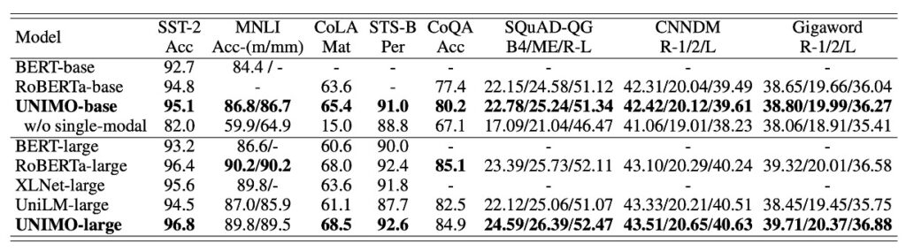

# [20.12] UNIMO

## 錯綜的線索

[**UNIMO: Towards Unified-Modal Understanding and Generation via Cross-Modal Contrastive Learning**](https://arxiv.org/abs/2012.15409)

---

:::info
以下內容由 ChatGPT-4 彙整，並經過人工校對編輯與補充說明。
:::

---

是不是很久沒有上國文課了？錯綜是什麼？還記不記得？

好像有種畫風不對的感覺，但沒關係，總之我們先複習一下。

### 錯綜

1. **交錯語次（語序變換）**

   - 調整原句的語序，使之產生新的語義或感受。
   - 原文：「陟罰臧否」→ 錯綜：「陟臧罰否」

2. **抽換詞面（詞的變換）**

   - 使用近義詞替換，為文句帶來變化與新鮮感。
   - 原文：「南山烈烈，飄風發發」 → 修改：「南山律律，飄風弗弗」

3. **伸縮文身（字數變換）**

   - 故意更改句子的長度，營造節奏感。
   - 原文：「於山見終南嵩華之高，於水見黃河之大且深」 → 修改：「於山見高，於水見大且深」

4. **變化句式（句式變換）**
   - 改變語氣或句型，例如：由肯定變成否定，由陳述變成疑問等。
   - 原文：「徐公何能及君也？」 → 修改：「徐公能及君也嗎？」

「錯綜」注重改變原有的語言結構和語序，注重語言的變動性和結構變化。

回到主題。

這篇論文，也就是 UNIMO 的主打貢獻，就是他們在訓練多模態的模型中，使用了「抽換詞面」的修辭技巧，藉此產出更大量的正對資料和負對資料。

你說只用了抽換詞面，其他修辭技巧都沒有使用嗎？

沒錯，所以看到這邊，你也可以對這篇論文提出未來的開發方向了。

## 定義問題

在探討先前在預訓練研究領域的工作時，作者區分出單模態和多模態預訓練兩大總類。這些方法大多著重於各自的領域，無論是單一的視覺或語言模型，或是涵蓋了多模態任務的模型，都有各自的局限性：

1. **單模態學習之挑戰**

   現行的學習模型與研究經常專注於單一的模態（文本或圖像），這種專注降低了其在多模態場景（結合文本與圖像）的效能。這種做法阻礙了不同模態（如視覺和語言）資訊的綜合利用。

2. **多模態預訓練資料的局限性**

   雖然多模態預訓練方法（例如：ViLBERT、VisualBERT 和 UNITER）的存在已被確認，但這些方法過分依賴於有限的圖像-文字對應資料，並在單一模態場景中表現不穩定。這些方法在單一模態任務的泛用性方面存在限制。

3. **多模態資料語義空間對齊的難題**

   為不同類型的資料（例如：文本和圖像）建立一個統一的語義空間，以便在多模態學習中對其進行對齊和結合，一直是一項挑戰。這嚴重影響到模型在不同模態之間學到的表示形式的轉移性和普適性。

4. **跨模態表示學習的效率疑問**

   現有的跨模態預訓練策略主要是在有限的圖像-文字配對上，利用基本的圖像-文字匹配和遮罩語言模型策略學習跨模態表示。這樣的方法在學習全面的視覺和文字表示，以及泛化到單一模態任務方面存在不足。

5. **跨模態理解與生成的挑戰**

   在多模態情境中，擴增視覺和語言知識以增進理解和生成能力的方法呈現了顯著的挑戰。需要語言和視覺模型的協同工作以強化多模態情境下的資訊理解和生成。

## 解決問題

### UNIMO 模型設計

UNIMO 是一種跨模態預訓練方法，旨在捕捉並學習不同模態間在語意層面上的模態不變信息。模型的核心概念來源於人類如何通過多種感知方式來感知世界。

其主要的設計理念為：

1. **多模態學習**

   - UNIMO 從不同類型的資料（例如：圖像、文字、和圖像-文字對）中學習，目的是在語意層面上捕獲模態不變的訊息，從而實現對文字和視覺輸入的更穩固和通用的表示。

2. **採用 Transformer 架構**

   - UNIMO 採用多層自注意力 Transformer 結構來學習文字和視覺資料的統一語意表示。
   - 文字輸入首先通過 Byte Pair Encoding (BPE) 分割成子字序列，並利用自注意力機制學習情境化的標記表示。
   - 對於圖像輸入，使用 Faster R-CNN 檢測顯著影像區域並提取每個區域的視覺特徵。

3. **Cross-Modal Contrastive Learning (CMCL)**

   - CMCL 旨在將不同層次的文字和視覺表示對齊並統一到同一個語義空間。
   - 基本思路是使成對的圖像和文字的表示在表示空間中靠近，而不配對的表示則相對遠離。
   - 利用一系列文字重寫技術創建正圖像文字對 Ｘ+ 和負圖像文字對 X−，並透過影像和文字檢索從單模態資料中獲取相關影像 XI​ 和文字 XT​。
   - 將這些由相同的統一模態 Transformer 成對或單獨編碼，並提取圖像和文字的表示以計算對比損失。

4. **單模態和多模態聯合學習**
   - UNIMO 在大量圖像集、文字語料庫、和圖像-文字對上進行預訓練，通過屏蔽預測學習可泛化的視覺和文字表示，並將它們統一為相同的語意空間。
   - 聯合學習視覺知識、語言知識以及視覺和語言之間的跨模態知識，不僅提高了視覺和語言的理解和生成能力，而且使文本知識和視覺知識在學習過程中相互促進統一的語意空間。

### CMCL

CMCL (Cross-Modal Contrastive Learning) 的基本理念是在聯合的語義空間中縮小相似（正）樣本之間的距離，同時擴大不相似（負）樣本之間的距離，數學式如下：

在這個公式中：

- ( d(V, W) ) 通常是一個測量圖像 ( V ) 和文本 ( W ) 在語義空間中距離的函數。它的設計應該確保正樣本的距離較小，負樣本的距離較大。
- ( τ ) 是一個溫度參數，它控制 softmax 函數的銳利度。當 ( τ ) 較小時，模型對較大值的感光度較強；當 ( τ ) 較大時，模型對所有值的分布較平均。
- ( X[+, I, T] ) 是正樣本的集合，這裡 ( V+ ) 和 ( W+ ) 是相關或匹配的圖像和文本。
- ( X[-, +, I, T] ) 是負樣本的集合，這裡 ( V’ ) 和 ( W’ ) 是不相關或不匹配的圖像和文本。
- ( Ｅ V,W ) 表示期望，它是對所有可能的 ( V ) 和 ( W ) 的平均。

這個損失函數體現了一個基本的對比學習思想：模型應該被鼓勵將語意上相似或相關的圖像和文本（正樣本）映射到靠近的點，而將不相關的圖像和文本（負樣本）映射到更遠的點。

- 上式的分子：對於正樣本，模型試圖最大化它們之間的距離的指數。當 ( V+ ) 和 ( W+ ) 更接近時，這個值會增大。
- 上式的分母：對於負樣本，模型試圖最小化它們之間的距離的指數。當 ( V’ ) 和 ( W’ ) 更遠時，這個值會增大。

通過最大化這個比值，模型學到了一個在多模態語義空間中區分正樣本和負樣本的能力。

### 多粒度語義對齊

- **Text Rewriting**

  這個過程在增強圖像和文字之間語義對齊的多粒度上扮演著一個重要角色。將圖像的標題或描述在不同的層次（包括句子層級、短語層級和單字層級）進行重寫，這個過程旨在為模型提供一個豐富的學習環境，幫助它更加精確地對齊圖像和語言之間的語義。

  1. **句子層級的重寫**

     - 正樣本的生成： 使用反向翻譯技術。每個圖像的標題首先被翻譯成另一種語言，然後再翻譯回原語言。透過這種方法，模型可以為一張圖像獲得多個語義上相似但可能在語法和用詞上有些許不同的標題，作為正樣本。
     - 負樣本的生成： 使用基於 TF-IDF 相似性的檢索來尋找其他圖像的標題，這些標題與原始圖像的標題非常相似，但並不準確地描述原始圖像，因此可以作為硬負樣本。

  2. **短語層級和單字層級的重寫**

     - 首先，將圖像標題解析成一個場景圖（一種圖形表示，描繪圖像中物件、屬性和它們之間的關係）。接著，場景圖中的物件、屬性或關係節點會被隨機替換為相應詞彙表中的其他物件、屬性或關係，以達到在短語或單字層次上改變語義的效果。

  與以往方法中經常採用的隨機抽樣負樣本不同，文本重寫通過這些手段能夠生成大量的硬負樣本，這些樣本在語義上接近正樣本，但包含一些微妙的差異，從而使模型在學習過程中面對更多的挑戰。

  這些文本重寫的策略有助於模型學習圖像和文字之間不同層級的語義對齊，通過正樣本和負樣本的對比，模型學習將語義相似的影像和文本對齊，並區分語義不匹配的影像和文本。透過這種方式，Text Rewriting 不只是在句子層面上增強模型的語義理解，還在更細緻的語義層次上（例如：單詞和短語）深化了模型對於圖像和文字之間語義對齊的學習。

- **Image/Text Retrieval**

  主要目標是在跨模態學習過程中融入更多的單模態資訊，以提升模型在語義對齊方面的學習效果。

  1. **單模態資訊的擴增**

     每個圖像-文字對被進一步擴充，通過從單模態數據（只包含圖像或只包含文字的數據）檢索到的相關圖像和文本。

     - 圖像擴充：選擇那些與原始圖像具有高度視覺相似性的其他圖像，尤其是那些具有與原始圖像高度重疊對象的圖像。這些圖像將提供與原圖相關的視覺資訊。
     - 文本擴充：基於語義相似性，從文本數據中提取與原始字幕語義相關的句子，以提供更多的背景語言資訊。

  2. **編碼擴充的資訊**

     單模態的圖像和文本資訊在經過編碼後，將進一步被用於計算跨模態對比損失。

     - 單模態 Transformer 編碼：擴充的圖像和文本被個別經由一個統一模態的 Transformer 進行編碼。這可能意味著，模型學習將這些單模態數據映射到一個共享的語義空間中，以促進圖像和文字之間的關聯性。
     - 計算跨模態對比損失：在這個語義空間中，擴充的單模態資訊的表示將被提取出來，用於計算在前文提及的跨模態對比損失。

  3. **利用單模態資訊提升跨模態學習**

     這些擴充的圖像和文本提供了豐富的背景資訊，它們在跨模態學習中起著關鍵的角色，幫助模型理解和建立更強的視覺和語言之間的語義對齊。

     這個過程通過擴充原始的圖像-文字對，利用額外檢索到的單模態資訊，增強模型在跨模態學習過程中的語義理解和對齊能力，提高模型的學習效率和性能。

     :::tip
     提供關於圖像和文字的額外語義資訊，這將有助於模型更精確地識別和理解圖像和文本之間的語義關聯，從而提升模型在複雜的語義對齊任務上的表現。
     :::

### 實驗設計

在這個部分，作者詳細探討多模態預訓練模型 UNIMO 的實驗設計，其中包含了前期的預訓練、微調實驗設定。

1. **預訓練資料集與實現細節**

   - **預訓練資料集**

     - 文本語料庫：使用了 BookWiki 和 OpenWebText 作為主要的文本來源。
     - 圖像集合：包含 OpenImages 和 COCO unlabel 的子集，不包含文字描述的純圖像數據。
     - 圖像文字對：集成了 COCO、Visual Genome、Conceptual Captions 和 SBU Captions 四個多模態資料集。

   - **實現細節**
     - 模型規模：UNIMO 提供了兩種大小的模型 – UNIMO-base（12 層 Transformer）和 UNIMO-large（24 層 Transformer）。
     - 預訓練：模型分別從 RoBERTa-base 和 RoBERTa-large 初始化，並且至少進行了 500K 步驟的訓練。
     - 優化及硬體：使用了 Adam 優化器、float16 混合精度訓練，並在 Nvidia Telsa V100 32GB GPU 上進行了模型訓練。

2. **微調任務與實驗設置**

   - **單模態任務**

     - 生成任務：包含生成會話問答（CoQA）、問題生成（SQuAD 1.1）、抽象摘要（CNN/DailyMail）、句子壓縮（Gigaword）。
     - 理解任務：涵蓋情緒分類（SST-2）、自然語言推理（MNLI）、語言可接受性分析（CoLA）、語意相似性分析（STS-B）。

   - **多模態任務**

     - 包括視覺問答（VQA v2.0）、圖像標題（Microsoft COCO Captions）、視覺語言自然語言推理（SNLI-VE）、圖文檢索（Flickr30k）。

在 UNIMO 的訓練過程中，對視覺區域的特徵擷取選用了在 VisualGenome 資料集上預訓練的 Faster R-CNN，並對區域的類別偵測和選擇進行了明確的標準制定。此外，在 CMCL 的設定中，也經過了謹慎的正樣本與硬負樣本的建立與選擇。

## 討論

### 多模態任務表現

在多模態任務的表現方面，UNIMO 展示了穩定的競爭力，尤其與一些當前領先的模型相比，例如 ViLBERT、VLP、UNITER 和 Oscar 等。

值得注意的是，UNIMO-large 在一些重點測試項目中超越了先前領先的模型，尤其是在圖像檢索和文本檢索任務上，與 ERNIE-ViL-large 相比，其在 R@1 指標上分別提升了 1.34 和 1.3 點。這表明該模型在某些圖像文字檢索任務中的改進是可觀的。

同時，在圖像描述任務中，UNIMO 的 BLUE4 分數亦輕微超過了之前表現優秀的模型 Oscar。綜合而言，UNIMO 在多模態理解和生成任務上展現了其有效且平衡的模型架構性能，證明了其統一模態學習架構的實用性。

### 單模態任務表現

UNIMO 在單模態任務的表現上展現了穩健的適應性。與多個現有的預訓練語言模型（如 BERT、RoBERTa、XLNet 及 UniLM）比較時，UNIMO 在多數語言理解和生成任務上表現相對持平或略有優勢。透過與 UniLM（一個專門針對自然語言理解和生成設計的模型）的對比，UNIMO 在單模態場景中的效能得到了呈現，表明其在多模態和單模態任務上都具有可靠的競爭力。

這樣的表現部分歸因於 UNIMO 採用的統一模態學習架構的構建合理性。該架構巧妙地利用大規模單模態的影像和文字來進行跨模態學習，實現了多模態任務和單模態任務之間的平順轉換和學習。不過，儘管展現了某些優勢，這種統一模態學習架構在不同領域與任務的適應性和深度優化仍有待進一步探討和驗證。

### 誰的貢獻？

在融合文本和視覺資訊的多模態學習領域中，文本和視覺這兩種資料形式如何相互作用以及它們各自對學習過程的影響，一直是研究的熱點。

作者也特別探討了在 UNIMO 模型框架下，文本和視覺資料是如何互相加強：

- **文本的影響：為視覺增添語境**

  

  透過消融研究，當從 UNIMO 中去除文本學習過程（見表 3）時，我們觀察到模型在多模態理解和生成任務上的表現出現了明顯下滑。這不僅展現了文本語料庫中的知識對跨模態學習的強化作用，更凸顯出文本在建構模型語義理解和生成中的關鍵角色。文本知識，尤其是當涉及到提供更多的語境資訊來增強視覺語言任務時，呈現出其不可或缺的價值。

- **視覺的貢獻：豐富與強化語言表徵**

  

  反過來，視覺知識也對語言學習帶來了深遠的影響。當我們在預訓練數據集中移除圖像和圖像-文本對（見表 4）時，模型在大多數語言理解任務和所有語言生成任務上的表現明顯下降。這些發現強烈暗示，視覺資料不僅豐富了模型的語言表徵，更使其能在統一的語義空間中學習到更泛化的表徵，進而增強語言任務的性能。

  文本和視覺資訊在多模態學習中的相互作用及其互補性，開啟了一個新的研究視角，也揭示了未來的可能發展方向。從本研究的發現來看，它們在統一語義空間中形成了一種「合作共贏」的局面，透過各自的獨特貢獻強化了整體的學習效果。文本資料為視覺元素提供了語境與語義框架，而視覺資料則為語言表徵注入了生動的具象內容和更多的現實場景信息。

:::tip
這篇論文中，作者首先提出了要使用 CMCL 的方式來對齊多模態的語義空間。然後接著提出要考慮「多粒度語義對齊」，因此提出了重寫和資料擴充。但是，很可惜沒有與其對應的討論章節和消融研究，我們很好奇這個做法能夠帶來確切的貢獻數值是多少。
:::

## 結論

在先前的討論中，「多粒度語義對齊」無疑是一個關鍵的概念，尤其是在探討文本與視覺信息如何在不同語義層次上進行對齊和交互時。那麼，為何這樣一個看似至關重要的特性，卻在實驗部分缺乏專屬的分析和驗證呢？這是否意味著在 UNIMO 的應用實踐中，「多粒度語義對齊」的角色沒有被充分發揮或是其效果並非如我們預期的那樣顯著？

舉例來說，我們本可以通過消融研究的方式來觀察當模型不再進行細粒度的語義對齊時，其在各種跨模態任務上的表現會有多大的變化。這不僅可以驗證「多粒度語義對齊」在模型中的實際作用，也能對我們未來的研究提供更多的啟示和方向。例如：是不是在某些特定的任務或場景下，我們需要更加精細的語義對齊策略？又或者，在某些情況下，是不是模型能夠在不進行細粒度語義對齊的情況下，依然能夠達到一個可接受的表現呢？

這些潛在的問題和挑戰，都需要我們在未來的研究中進一步的探討和驗證。希望這個問題能夠喚起我們對於多模態學習中，尤其是「多粒度語義對齊」這概念更深入的思考與探究，從而推動這領域的進一步發展與創新。
