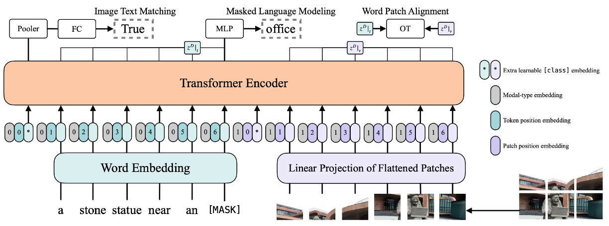

# [21.02] ViLT

## 你方唱罷我登場

[**ViLT: Vision-and-Language Transformer Without Convolution or Region Supervision**](https://arxiv.org/abs/2102.03334)

---

你可能會記得 Transformer 提出來的年代是 2017 年。

專攻影像的 Vision Transformer (ViT) 則是在 2020 年底才提出來，中間隔了三年多。

這次就不用等這麼久了，不用半年，ViT 就被用來抽換 VLP 的視覺架構了。

在過去幾年間的研究，主要都是專注於提升 VL 模型的視覺表示能力，來達到提高模型整體表現的結果。但大家始終不願意面的真相是：物件偵測的預訓練模型，真的很沉重！

而 ViLT 這篇論文的作者說，整件事情不應該是這樣的，我們應該要：

- **完全捨棄這種架構設計！**

## 定義問題

作者主要定義的問題及挑戰，大致上可以概括為以下幾點：

1. **複雜的視覺編碼過程**

   目前的視覺和語言預訓練（VLP）模型在處理視覺編碼時經常採用深層卷積網路或預訓練的物件偵測器。這一流程通常相當複雜和計算密集，特別是在需要處理大量圖像時，將對計算資源和運行時間帶來重大挑戰。

2. **重型的視覺編碼器的使用**

   現有的 VLP 模型通常依賴於重型的視覺編碼器來提取圖像的特徵，這對計算資源來說是一個重大的負擔。儘管在學術實驗中，區域特徵的提取過程通常可以通過預先緩存的方式來減輕這一負擔，但在實際應用中，特別是在需要處理現場即時查詢的情況下，這一方法並不可行。

3. **編碼效率與性能的平衡**

   在很多研究中，如何在保證模型性能的同時，提高編碼的效率並降低計算和儲存成本，始終是一個難以平衡的問題。而且，過去的大多數研究並未著重於探索能夠在視覺和語言任務上實現良好性能的同時，也提供更輕量級和快速編碼的方法和模型架構。

4. **傳統模型架構的局限性**

   傳統的 VLP 模型在視覺輸入處理上，通常使用深層、有卷積的編碼方法。這不僅增加了模型的複雜度和運行時間，也在一定程度上限制了模型的靈活性和適應性。

## 解決問題

### ViLT 設計理念

:::tip
這張圖可是經典分析圖，不要錯過了！
:::

作者基於兩個維度對視覺和語言模型進行了分類：

- 兩種模態（視覺和語言）是否具有均勻的表達水平（專用參數和/或計算）。
- 這兩種模式是否在深層網路中相互作用。

結合這兩點，作者得到了四個原型：

- **(a) 類型**：視覺語義編碼（VSE）模型，如：VSE++ 和 SCAN，具有分開的、不均等的視覺和語言編碼器，並且兩者之間的交互作用相對淺層，通常基於簡單的點積或淺層注意力層。
- **(b) 類型**：例如 CLIP，它對於兩種模態使用單獨但計算上相等的編碼器，並在相對淺層處進行交互作用。
- **(c) 類型**：深度交互的模型，例如一些最新的 VLP 模型，它們利用深度轉換器模型在深層次上建模兩種模態的交互作用，但對於視覺信息的編碼仍然依賴於計算密集型的卷積神經網路。
- **(d) 類型**：ViLT 模型，將大多數計算集中在模態交互建模上，並對原始像素的編碼層做得相對淺層，計算量輕，類似於處理文本的計算量。

這四種模型原型每一種都反映了不同的設計和計算的權衡：

- **(a) 類型**：可能在計算上較為輕量，但犧牲了模態間深層交互作用的能力。
- **(b) 類型**：將計算資源均等分配給了視覺和語言編碼，但依然保持較為淺層的交互。
- **(c) 類型**：在模態間的交互上投入了較多的計算資源，但在處理視覺輸入時可能過於依賴計算密集的卷積神經網路。
- **(d) 類型**：嘗試均衡分配計算資源，並且著重於深度交互。

每一種設計選擇都帶來不同的優勢和挑戰。例如：2b 類型的模型（如 CLIP）在某些零樣本學習的場景中表現卓越，但在其他需要深度模態交互的任務上可能效果有限。這些分類提供了一個視覺語言模型設計的框架，指明了不同設計選擇和方法在實際應用中可能的優缺點。當然，這也暗示著在實際應用中，可能需要根據具體的應用場景和需求來選擇和設計模型。

### ViLT 設計細節

ViLT 嘗試通過簡化視覺編碼流程，使用 Patch 投影策略，並從具有視覺特徵處理能力的 ViT 初始化，希望能在 VLP 任務上達到更高效且資源消耗更低的表現。整體模型架構強調在保持表現的同時，盡可能降低計算複雜度和資源需求，展示了一種輕量化的多模態學習策略。

1. **視覺編碼的方法**

   ViLT 與其他視覺語言預訓練（VLP）模型共享相似的文字編碼方式，通常借鑒 BERT 的分詞器與編碼技術，但在視覺編碼的部分有所區別。

   ViLT 的設計強調在視覺編碼上的簡單化，比較以下幾種策略：

   - **Region Feature**

   雖然傳統方法經常利用來自物體偵測器（例如 Faster R-CNN）的區域特徵，ViLT 不依賴這種方法，傾向更直接和簡單的方式。

   - **Grid Feature**

   網格特徵是另一種視覺特徵提取方法，通常使用卷積神經網路的輸出特徵網格作為視覺特徵，但 ViLT 也沒有主要使用這種特徵。

   - **Patch Projection**

   ViLT 採用了 ViT 引入的 Patch 投影編碼方法。這種方法直接將影像區塊進行線性投影，大大簡化了視覺編碼步驟，並用最小的計算和參數投入達到令人滿意的效果。這種方法只需 2.4M 參數，而且運行時間可忽略不計。

2. **模型架構**

   - ViLT 具有精簡的架構，並且在視覺編碼方面使用單流方法。
   - 雖然以往的許多 VLP 模型從 BERT 進行權重初始化，ViLT 選擇從 ViT 初始化交互變換器權重。這是基於 ViT 已經具有處理視覺特徵的能力的考慮，希望運用 ViT 的這一特點優化模型效果。
   - ViT 堆疊組成，包括多頭自注意力(MSA)層和 MLP 層，而 ViLT 在這個基礎上結合文字信息進行多模態的預訓練。
   - ViLT 使用 32×32 的 patch 投影，並在 ImageNet 上使用 ViT-B/32 的預訓練權重，經過微調後應用於多模態學習任務。

3. **編碼細節**

   - 輸入文字使用了詞編碼矩陣和位置編碼矩陣進行加總。
   - 輸入影像被切片成圖塊並展平，然後進行線性投影和位置編碼。
   - 文字和圖像編碼與模態類型編碼向量進行 concat 操作，連接成為組合序列，通過多個變換層疊代更新獲得最終的上下文序列。

### 預訓練策略

作者採用了多種預訓練策略，結合了圖像和文字的特性，以增強 VLP 模型的表現。

1. **影像文字匹配 (Image Text Matching, ITM)**

   - 隨機替換圖像：為了強化模型的鑑別能力，使用 0.5 的機率隨機替換對齊的圖像。換句話說，有一半的機會，圖像和其相對應的文字描述不會匹配。
   - ITM 頭：模型使用單一線性層來將池化後的特徵投影到二進位類別上，計算與真實匹配情況的相似度。最終目標是最小化這個匹配的負對數似然損失。

2. **單字 Patch 對齊 (WPA)**

   假設一個圖像，它展示了一個吃蘋果的男人，其中文字描述可能是 “A man is eating an apple”。在通常的影像-文字匹配（ITM）目標下，模型只需要關心整體圖像和整句話的關聯性，例如：整張圖像和整句話之間的相關性。

   然而，WPA 強調在更細微的層次上對齊視覺和語言信息。即將圖像中的特定區域（蘋果的部分）與文字描述中的相應單詞（”apple”）對齊。這對於模型在後續的任務中理解視覺和語言的對應關係是非常重要的。

   :::tip
   **IPOT (Inexact Proximal Transport)**

   IPOT 是一種用於最佳化轉移的方法。在本文的情境中，這指的是如何將圖像中的每一個小區域（Patch）最好地對應到描述文字中的特定單詞上。
   使用 IPOT 算法來尋找這兩個子集之間的最佳對應方式。即尋找一個轉移計劃，用以描述如何將圖像區域的特徵映射到對應的文字特徵，使得在轉移過程中，總體的 Wasserstein 距離最小。計算這兩個分佈之間的距離，這個距離反映了它們之間的不匹配程度。
   :::

3. **遮罩語言建模 (Masked Language Modeling, MLM)**

   - 隨機遮罩：受到 BERT 的啟發，作者選擇隨機遮蔽文本中的部分內容，並嘗試根據上下文預測被遮蔽的部分。實驗中有 0.15 的機率對文字進行隨機屏蔽。
   - MLM 頭：模型透過兩層的 MLP 來預測被遮蔽的標記，最終的目標是最小化該預測與真實標記之間的負對數似然損失。

4. **全字屏蔽 (Whole Word Masking)**

   - 這是一種專門遮蔽整個單詞的策略，而不僅僅是單詞中的某一部分或子字。例如：考慮單詞「giraffe」，在 BERT 的分詞中可能會被拆分為 [“gi”、“##raf”、“##fe”]。全字屏蔽會確保整個「giraffe」都被遮蔽，而不僅僅是其中的某一部分，這有助於模型更好地使用圖像信息進行預測。
   - 這個操作參考了：[**Pre-training with whole word masking for chinese bert**](https://arxiv.org/abs/1906.08101)。

5. **影像增強 (Image Augmentation)**

   影像增強已被證明可以提高視覺模型的泛化能力。作者選擇使用 RandAugment 進行增強，但排除了顏色反轉和剪切策略。顏色反轉不被使用，因為文字中也可能包含顏色信息；剪切不被使用，因為它可能刪除圖像中的重要小物件。

透過結合上述策略，作者希望提供一種更強大和全面的 VLP 預訓練方法，充分利用圖像和文字之間的相互作用。

## 討論

在本研究中，模型首先在多個資料集上進行預訓練，包括 MSCOCO、Visual Genome、SBU Captions 和 Google Conceptual Captions，旨在捕捉豐富的圖像和語言特徵。

在訓練過程中，ViLT 使用了 AdamW 優化器，並運用了學習率預熱和線性衰減策略來適應性地調整學習率。圖像輸入在維持原始縱橫比的前提下，通過調整大小並選擇相應的片段來進行處理，而文字輸入則使用 BERT 分詞器進行處理，並從頭開始學習與文本相關的參數。

在預訓練後，模型在各種視覺和語言的下游任務上進行評估，包括使用 VQAv2 和 NLVR2 進行分類任務，以及使用 MSCOCO 和 Flickr30K 進行檢索任務。在實施的實驗中，多次執行並分析模型的輸出，記錄了平均分數和標準差，以提供關於模型性能的全面視圖。

這整個過程運行在 64 個 NVIDIA V100 GPU 上，預訓練過程涵蓋了 100K 或 200K 步，而下游任務的訓練則持續 10 個時期，以期達到視覺和語言任務的效能最優化。

### 效果表現如何？

在 VQAv2 的情境下，ViLT-B/32 雖然微調並進行試驗，但未達到最佳的 VQA 分數，特別是與其他使用複雜視覺編碼器的 VLP 模型相比。提出的分析認為，這可能是由於在 VQA 任務中，問題往往與物件有關，而利用物件偵測器生成的分離物件表示可能簡化了 VQA 的訓練，也就是說，一個專注於物件級別分析的模型或許能夠在這一任務中獲得更高的準確度。

對於 NLVR2 的任務，ViLT-B/32 模型面對的挑戰包括處理來自兩個不同圖像的信息，並根據這些信息和自然語言問題進行二元分類。透過一個配對策略，模型將每一個圖像和問題組合成單一的輸入對，並對這些輸入對進行處理。在頭部，兩個來自不同圖像的池化表示被串聯起來，用以作出最終的二元預測。即便面對相當複雜的情境，ViLT-B/32 在兩個數據集上仍然展現了具有競爭力的性能，尤其考慮到它的優秀的推理速度，可以視為一個平衡效能和效率的模型。

:::tip
作者看到 VQA 的結果後，從文字上都能感覺到失望，因此在論文中也只有一小段簡短的論述。

我試著補上一些其他的說明：

當深入探討在 VQA 任務中模型的表現時，特定的觀察和戰略成為顯而易見的。在 VQA 任務中，系統通常被問到與圖像中物體的特性、關係或其他與物體相關的屬性有關的問題，例如：「這個物體的顏色是什麼？」 或 「圖片中有多少個特定物體？」。因此，瞭解圖像中的物體和其屬性自然成為解決此類任務的關鍵。

在這裡所提的情境下，利用物件偵測器生成的分離物件表示所指的是：模型不只是在一個整體的層面上理解圖像，而是能夠辨識和理解圖像中的單個物體，並且能夠對這些物體的特性（例如類型、大小、顏色等）做出精確的分析。

為什麼這是重要的呢？

考慮到 VQA 的典型問題，許多問題都需要模型能夠對圖像中的特定物體進行細緻的分析。例如：問題可能會問到：「球是什麼顏色的？」。為了回答這個問題，模型不僅需要辨識出圖像中的「球」這一物體，還需要理解並描述其顏色。如果模型可以透過物件偵測器來生成一個物體的分離表示，那麼它可以更精確地定位到該物體，並分析該物體的特性來給出正確的答案。

換句話說，當模型專注於物件級別分析時，它可以更精確地捕捉到與每個物體相關的信息，從而更精準地回答關於這些物體的問題，而不是僅僅基於整體圖像的理解來進行推測。這可能解釋了為什麼在一些情境下，專注於物件級別分析的模型在 VQA 任務上可能獲得更高的準確度，並且提供了一個路徑，透過強化物件級別的表示和理解來進一步優化模型在這一任務上的表現。
:::

### 誰是最主要的貢獻？

根據上面的表格，作者提出了三個主要的操作：

1. **更多的訓練步驟**

   模型進行更長的訓練步驟時，模型的表現不斷提高。這表明，在保持其他條件不變的情況下，增加訓練步驟或迭代次數確實對模型的學習過程有正面的影響。這可能是因為給予模型更多的機會學習和優化其參數，以更好地擬合訓練數據。

2. **全字遮蔽**

   遮蔽策略在提高模型性能方面似乎也起到了一定的作用。這種策略強制模型從上下文中學習詞彙的語義信息，可能增強了模型理解和生成語言的能力。

3. **影像增強：**

   影像增強在模型微調階段也對效能提升有所貢獻。影像增強可以通過應用各種圖像處理技術（例如旋轉、裁剪、縮放等）擴充數據集，有助於模型學習更穩健的視覺特徵並改善其泛化能力。

### 複雜度分析

對 VLP 模型的複雜度分析可以從幾個不同的角度進行，具體涉及到參數數量、浮點運算（FLOP）數量，以及推理延遲等。以下是一些關鍵點的詳細討論：

1. **參數數量**

   模型的參數數量通常與其複雜度和表達能力成正比。具有較多參數的模型理論上能夠學習到更多的模式和規律，但同時也更易於過擬合，且訓練和推理計算負擔較大。

2. **FLOPs（浮點運算）數量**

   FLOPs 數量常被用來估計模型執行一次前向傳播的計算成本。對於需要在有限資源下運行的應用場景（例如移動設備或邊緣設備），通常會著重關心 FLOPs 的數值。影像解析度和序列長度會影響 FLOPs 的數量，這說明了模型的計算複雜度與其接收的輸入資料的大小有關。

3. **推理延遲**

   推理延遲是衡量模型預測效率的一個重要指標，尤其是在要求實時反饋的應用中尤為重要。ViT 和 Transformer 的推理延遲在不同硬體（例如 Xeon E5-2650 CPU 和 NVIDIA P40 GPU）上有著顯著的差異，指出硬體選擇對於部署模型的效率也是一個關鍵因素。

4. **輸入解析度和長度**

   不同的 VLP 模型使用了不同的影像解析度，這可能是基於模型設計的不同目標和適應的應用場景。更高的解析度通常意味著更多的細節，但也帶來了更大的計算成本。

5. **輸入序列的處理**

   模型處理不同長度的輸入序列時，其效率和效果可能變化。對於長度低於 300 的輸入序列，Transformer 的運行時間變化極小，這說明了模型在某個範疇內的擴展性。

綜合以上分析，VLP 模型的複雜度是多方面的，不僅關聯到計算成本和資源使用，也涉及到模型的應用場景和效能。理解這些複雜度的來源和影響，對於模型的選擇和優化，以及它在實際應用中的部署，都有著重要的指導意義。

## 結論

這篇論文提出來的當下，是 ViT 剛提出來不久的時刻，很多事情和理論都還在摸索。

ViT 提出來之後，有非常多的討論和改善論文，對於該如何提高訓練效率，提高準確率等，相關的研究和理論爭辯，又維持了好長一段時間。

:::tip
這篇論文直接採用 ViT 架構來抽換這些已經較為成熟的物件偵測模型時，實在是一個充滿風險和機遇的冒險。在 VQA 的任務中，這一改變導致了技術指標的大幅後退，其表現就未能達到預期效果。
:::

然而，ViLT 也在某些應用場景中展現出的優越性能，以及 ViT 在推論速度上的驚人提升。對於實時應用來說，推論速度的提升極為關鍵，它可以大大提高模型在現實場景下的適用性，從而為未來更多應用的拓展鋪平道路。

ViLT 的提出不僅為當前的模型設計和預訓練提供了新的方向，而且也給未來的工作提出了一個非常明確的要求：更加專注於模型內部的模態交互，而非單一地追求模型規模的擴展或者網路結構的複雜化。這提供了一種嶄新的思路，指向模型發展的可能新方向：即在不增加過多計算負擔的前提下，通過更加精妙的設計來實現模型性能的提升。

這樣的模型指向了一個專注於模態交互、模型內部結構優化的發展方向。未來的研究不僅可以深入探索 ViLT 的潛能和局限性，更能從中找到靈感，發展出更多創新的模型和應用策略。
