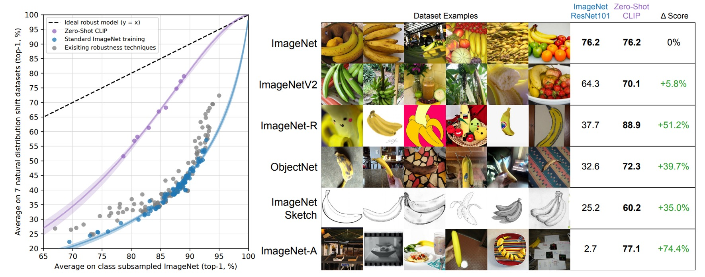

## 打碎次元的屏障

[**Learning Transferable Visual Models From Natural Language Supervision**](https://arxiv.org/abs/2103.00020)

---

試著描述以下這個圖：

<figure style={{"width": "60%"}}>

</figure>

- 有杯咖啡…呃，杯子底下有一本書…它們都放在桌子上？
- 這是早晨的咖啡店一個角落？
- 咖啡色的桌椅，還有咖啡色的咖啡？（~喂！認真點~）
- ……

事實上，這張圖是使用這一段描述生成的影像：

> _在一個寧靜的清晨，陽光透過窗簾的縫隙溫柔地灑在簡約木質的桌上。 桌上放著一杯剛剛沖好的咖啡，咖啡的香氣與陽光交織在空氣中，讓人感受到了新的一天的溫暖和希望。 杯子的影子在桌上拉出一道長長的倒影，與窗邊的綠植形成了美麗的畫面。 咖啡的表面輕輕盪著，似乎在訴說著早晨的寧靜和生活的美好。 在桌旁，一本敞開的書靜靜地躺著，等待著主人的翻閱。 在這個寧靜的早晨，咖啡、陽光、綠植和書籍共同建構了一個溫馨而寧靜的場景，它們似乎在訴說著生活的簡單和美麗。_

如果你也在試著描述這張圖，就應該可以很清楚地感覺到現在，此時此刻，在學術界及工程界所使用的 ImageNet 資料集，我們引以為傲的兩萬多個類別，上千萬張的圖像，有多麽地蒼白無力。

- 因為存在太多的方式，可以用來描述同一張圖像。

## 定義問題

反觀 ImageNet，一張圖片可能只有一組層級式的類別，或者有限的標籤來描述它的內容。然而，人類的語言和感知能力卻可以從無限多的角度來解釋和理解這張圖像。比如，透過色彩、形狀、情感和故事情節等，都能呈現出豐富多彩的描述。

這就是單模態學習和多模態學習的最大區別：前者通常只能從單一角度解析資訊，而後者能夠將不同類型的資訊融合在一起，提供更為豐富和多元的解釋。

在 ImageNet 的單標籤類別中，經常會忽略掉很多其他有意義的資訊，例如：物件之間的交互關係、情境背景、或是圖像所引起的感受等。

CLIP 的作者的目的就是試圖打破這些限制，通過糅合來自不同來源、不同類型的資訊，如文字、圖像等，來豐富模型的理解和表述能力，使其更接近人類的感知和理解水平。

所以，該怎麼做呢？

## 解決問題

### 模型架構

上圖就是 CLIP 所提出的預訓練架構。

假設我們有一組圖像-文字對，其中一對可能是一張狗的圖片和文字「一隻可愛的小狗」。

在一個訓練批次中，CLIP 會接收到多個這樣的對。圖像編碼器可能透過 ResNet 或 ViT 來處理圖像，獲取圖像特徵，而文本編碼器可能透過 Transformer 來處理文本，獲取文字特徵。

然後，模型會比較這些特徵，以確保正確配對的圖像和文字（例如：狗的圖像和「一隻可愛的小狗」的文字）之間的餘弦相似度最大，而錯誤配對的圖像和文字（ 例如：狗的圖像和「一個蘋果」的文字）之間的餘弦相似度最小。

然後呢？

然後就是堆上 4 億組圖像-文字對，開始訓練！

### 大規模資料集

作者一開始使用的資料集主要是 MS-COCO、Visual Genome 和 YFCC100M。

但很快就發現，這些資料集的規模對現代的要求來說太小了。例如：MS-COCO 和 Visual Genome 雖然是高品質的資料集，但只有大約 100,000 張訓練照片，與需要處理高達 35 億張 Instagram 照片的其他電腦視覺系統相比，簡直是杯水車薪。

而 YFCC100M 雖然擁有 1 億張照片，但許多圖片的標題和描述資訊品質非常低，如自動產生的檔案名稱或相機曝光設定的描述，這對於模型的訓練幫助不大。

既然原有資料集規模太小，品質又不高，那為何不自己創建一個呢？

然後作者們就做了創建一個新的大規模資料集，命名為 WIT（WebImageText）。這個資料集包括 4 億對圖像和文本，所有的資料都是從網路的公開資源中收集而來。

:::tip
這邊附上資料集下載位置：[**WIT : Wikipedia-based Image Text Dataset**](https://github.com/google-research-datasets/wit#wit--wikipedia-based-image-text-dataset)
:::

### 訓練細節

在模型訓練的細節方面，作者們選擇了一系列的 5 個 ResNet 和 3 個 Vision Transformer 模型進行訓練。

在 ResNet 系列中，他們訓練了一個 ResNet-50 和一個 ResNet-101，隨後又以 ResNet-50 為基礎，按照 EfficientNet 的風格進行模型縮放，創建了三個不同規模的模型，分別標識為 RN50x4、RN50x16 和 RN50x64。 這三個模型的計算量是 ResNet-50 的 4 倍、16 倍和 64 倍。

對於 ViT 模型，作者們訓練了 ViT-B/32、ViT-B/16 和 ViT-L/14 三種不同規模的模型。 每個模型都訓練了 32 個 epoch，使用的最佳化器是 Adam，並且應用了解耦權重衰減正則化和餘弦退火學習率策略，以確保訓練過程的穩定性和效率。

初始超參數的設定是透過在基線 ResNet-50 模型上結合網格搜尋、隨機搜尋和手動調整的方式進行的。 隨後，由於計算資源的限制，這些超參數被啟發式地調整以適應更大的模型。

為了確保訓練的穩定，可學習的溫度參數 τ 被初始化為 0.07，並透過剪裁措施防止 logits 的縮放超過 100。 為了加速訓練和節省記憶體，他們採用了非常大的小批量大小 32,768，同時應用了混合精度、梯度檢查點、半精度 Adam 統計和半精度隨機舍入文本編碼器權重等技術。

在硬體方面，訓練最大的 ResNet 模型 RN50x64 需要在 592 個 V100 GPU 上運行 18 天，而訓練最大的 Vision Transformer 模型則需要在 256 個 V100 GPU 上運行 12 天。 特別地，為了提升 ViT-L/14 模型的效能，他們在更高的 336 像素解析度上額外預訓練了一個 epoch，將此模型標識為 ViT-L/14@336px。

:::tip
那 592 個 V100 的這種規模簡直不可理諭，讓人非常羨慕。
:::

## 討論

### Zero-Shot？

CLIP 在某些範疇確實滿足了預期，但也顯露出一些需要改進的地方：

1. **特定資料集的優異表現**：

   在一些特定資料集上，例如：那些底層特徵表達相對明確的資料集，零樣本 CLIP 的性能可以匹敵於或甚至超越完全監督分類器。這突顯了在某些情況下，零樣本學習可能提供了一個高效的替代方案。

2. **性能匹配**：

   CLIP 與少樣本邏輯回歸分類器的對比，能突顯了 CLIP 的強大性能。例如：若在一個涵蓋多種動物的圖像分類任務中，零樣本 CLIP 能夠通過文字描述來辨識未見過的類別（例如：未在訓練數據中見過的「斑馬」），而少樣本分類器可能需要更多的訓練數據來達到相似的性能。

3. **零樣本轉換效率**：

   不同資料集的零樣本轉換效率差異反映了資料集的困難程度和多樣性。例如：在一個簡單的資料集中，零樣本轉換可能只需少量的樣本，而在一個複雜多變的資料集中，它可能需要更多的樣本來達到相同的性能。

4. **與完全監督分類器比較**：

   在許多情況下，完全監督分類器的表現超越了零樣本 CLIP，顯示在某些傳統的分類任務中，完全監督學習可能仍然是一個更穩定的選擇。

5. **效能預測的線性趨勢**：

   完全監督與零樣本表現之間的正相關性可能指示了有潛力進一步改善零樣本學習的性能。例如：通過增加完全監督的資料量或改進底層特徵的學習，可能會帶來零樣本學習性能的提升。

6. **縮放模式的探討**：

   CLIP 的零樣本效能的對數線性縮放趨勢可能受到多種因素的影響，例如：模型大小、訓練數據的多樣性等。通過進一步的分析，可能能夠找到影響這些趨勢的具體因素，並提供改善零樣本學習性能的方法。

### 表徵能力好嗎？

通過深入分析以下幾個方面，可以更明確地理解 CLIP 模型的優勢和可能的局限性：

1. **表徵品質的評估**：

   CLIP 模型能夠上擬合線性分類器，並在多個資料集上測試它的性能，有效地展示了其表徵學習的能力。然而，該模型是否真的能在未見過的資料集或極端情況下保持相同的性能，仍需進一步探索。

2. **線性分類器的效用**：

   通過使用線性分類器進行評估，模型在預訓練階段獲得的通用和泛化表徵得到了突顯。這提供了有用的反饋，但也暴露出可能的缺陷，例如：如果模型的表徵過於依賴某些特定的特徵，可能會影響其在不同任務上的適應性。

3. **模型的規模和效能**：

   CLIP 的不同模型規模，如 ResNet-50×64 和 CLIP ViT，表明了模型規模與表徵能力和計算效率之間的關聯。然而，大規模模型可能需要更多的計算資源，這可能會限制它在低資源設備上的應用。

4. **任務多樣性**：

   CLIP 在多個任務如地理定位、光學字元辨識（OCR）、臉部情感辨識和動作辨識等方面都有不錯的表現。例如：在 OCR 任務上，CLIP 能夠有效地辨識不同字型和颜色的文本。但是，是否有更專業的模型在特定任務上表現更佳，值得深究。

5. **更廣泛的資料集評估**：

   27 個不同資料集上的評估展示了 CLIP 在表徵通用性和計算效率方面的強大，但可能還存在數據偏差的問題，需要進一步驗證其在多元和不同分布的數據集上的表現。

6. **自我監督系統的表現**：

   與 SimCLRv2 等自我監督系統相比，CLIP 展現出了相對更好的表現。然而，自我監督學習的效率和效果是否能夠持續提高，尚需時間和多方面的測試來證實。

7. **與先進模型的比較**：

   與 Noisy Student EfficientNet-L2 等先進模型相比，CLIP 在多數資料集上展現出優勢，但在某些特定任務或數據集上可能仍存在不足。

### 能夠跨資料域嗎？

在探索深度學習模型的性能與穩健性時，跨資料域（cross-domain）的能力成為一個重要的衡量標準。理想的情況下，一個模型應該能夠在不同的資料集和分佈上維持良好的性能。然而，如上文所述，很多基於 ImageNet 訓練的模型在面對新的或未見過的資料分佈時，性能往往會大幅下降。

傳統的 ImageNet 模型（如 ResNet-101）在這些新資料集上的準確率遠低於在原始 ImageNet 驗證集上的準確率。這些模型的跨資料域性能存在很大的缺陷，並且容易受到資料分佈偏移的影響。

零樣本 CLIP 模型在這些新的資料集上的表現明顯優於傳統的 ImageNet 模型，並且有效地縮小了 ImageNet 準確率與分佈偏移下準確率之間的差距。根據分析，零樣本分類器在適應 ImageNet 分佈後展現了顯著的效能提升，準確率從原始的水平提升了 9.2%。 然而，一旦面臨分佈偏移的情境，其準確率的表現卻出現了輕微的下滑。

### 跟人類能比嗎？

為了了解 CLIP 模型與人類表現的差異，作者在特定的任務上進行了比較。他們選擇了 Oxford IIT Pets 資料集，要求 5 位參與者在不看到任何品種樣本的情況下，對 3669 張圖像中的每一張進行貓或狗品種的標籤分配。在另一次實驗中，參與者得到每個品種的一個或兩個圖像樣本作為參考。通過這種方式，作者意圖理解人類如何在給定一些樣本後改善他們的分類準確度。

結果顯示，在另一個資料集 STL-10 中，人類能夠達到高達 94% 的準確率，而在某些子集中準確率甚至能達到 97-100%，展示了人類在這些任務上的強大能力。當每個類別僅有一個樣本時，人類的平均表現能從 54% 提升到 76%，額外的樣本並沒有帶來太多的幫助，但它們對於那些令人困惑的圖像卻非常有幫助。這指出人類很擅長於辨識他們的不確定性，並能根據新的信息來調整他們的判斷。

然而，儘管 CLIP 模型在零樣本學習方面展現出潛力，並在自然分布偏移測試中表現不錯，但它與人類在少量樣本學習方面的表現仍存在顯著的差異。研究者指出，人類能夠有效地利用少量的樣本來改善他們的分類準確度，而 CLIP 模型在這方面的表現不足。尤其是在利用先驗知識方面，人類明顯優於 CLIP 模型。

### 模型有沒有偷看答案？

在對大規模網路資料集進行預訓練的過程中，一個不可忽視的問題是與下游評估資料集的無意重疊。這樣的重疊可能會導致模型在評估時表現異常良好，但這實際上並不反映其真正的泛化能力。

如同在研究中呈現的，有些資料集由於其獨特性或合成的特點，並未顯示出重疊的情況，例如：MNIST、CLEVR 和 GTSRB 等。然而，也有資料集顯示出明顯的重疊情況，特別是那些由公共資料集如 YFCC100M 構建的資料集，如 Country211，它的重疊率高達 21.5%。

分析揭示，即便如此，這種重疊對準確率的提高效果十分有限，因為在 Country211 的準確率僅提高了 0.2%。這可能是因為與下游任務有關的特定信息並未被重複項目的訓練文本所覆蓋。此外，在某些情況下，例如：在 Kinetics-700 資料集上，重疊項目實際上是無關緊要的黑色過渡幀，導致重疊子集的準確度下降了 20%。

重疊分析是一個微妙而複雜的問題，不僅需要考慮資料的重複程度，還需注意底層資料分布的變化和其他潛在的混淆因素。例如：在 CIFAR-100 資料集上，由於影像解析度很低，一些重礇的影像實際上是對小物件如鳥類或飛機的誤報，這可能會導致類別分布或重疊難度的變化，進而影響準確度的變動。

這些觀察與先前的大規模預訓練工作中的重疊分析結果一致。例如：Mahajan 等人（2018）和 Kolesnikov 等人（2019）的研究都指出了類似的重疊率和整體性能變化的微小性。重要的是，這些研究還比較了不同的重疊資料刪除策略，並發現作者選擇的方法與替代策略之間幾乎沒有差異。這再次強調了重複分析在瞭解和改善模型泛化性能中的重要性，以及在訓練前辨識和處理重疊的重要性。

作者在論文中指出，雖然探測器在代理訓練任務上表現出接近 100% 的準確率，且通過手動檢查和閾值調整達到非常高的精度，但由於無法輕易檢查 4 億個樣本的召回率，其完美程度仍有所限制。此外，底層資料分佈在重疊子集和乾淨子集間的變化也是一個可能影響分析的混雜因素。例如：Kinetics-700 資料集中的許多「重疊」實際上是黑色過渡幀，這導致了在重疊部分的準確度下降了 20%。

作者還提到，可能存在更為微妙的分佈變化，例如：在 CIFAR-100 資料集上，由於影像解析度非常低，許多重複影像可能是鳥類或飛機等小物體的誤報。準確度的變化可能由類別分佈或重複難度的變化所導致，但不幸的是，這些變化也可能掩蓋了過度擬合的影響。

### 有什麼限制？

CLIP 模型雖然展現了一些令人鼓舞的能力，但仍存在許多嚴重的限制：

1. 效能限制

   在一些監督訓練分割的資料集上，零樣本 CLIP 的表現能與基於 ResNet-50 特徵的線性分類器持平。然而，在大多數資料集上，其效能仍然遠遠低於現有的技術水準。即便通過擴展的方式有所改善，但要達到最先進的效能，CLIP 的計算量需要增加約 1000 倍，而現有的硬體條件使得這種擴展變得不切實際。

2. 任務學習與遷移能力

   CLIP 在某些特定任務上的表現仍然不佳，例如：在細粒度分類（如汽車型號、花卉種類和飛機變體）以及處理更抽象和系統化的任務（如計算圖像中的對象數量）上表現不足。

3. 泛化能力

   儘管 CLIP 在多種自然影像分佈上表現良好，但當面臨真正不符合分佈的數據時，其零樣本性能會大幅度下降。例如：CLIP 在 MNIST 手寫數字辨識上的準確率僅達 88%，而在原始像素上的邏輯回歸的基線效能卻優於零樣本 CLIP。這不僅突顯出 CLIP 在解決深度學習模型泛化脆弱的根本問題上幾乎無能為力，也顯示了僅依賴龐大多樣化的資料集進行訓練，試圖使所有資料都能有效地分佈，是一個天真的假設，正如 MNIST 所證明的那樣，這個假設很容易被違反。

4. 數據與計算效率

   CLIP 模型需要大量的資料和運算資源，其訓練過程對於現有硬體來說過於龐大，如需數百年才能完成全部訓練週期。雖然現有的自我監督和自我訓練方法已顯示出對於提高資料效率的潛力，結合這些方法可能會為 CLIP 的進一步發展提供方向。

5. 評估與最佳化

   - 本文的方法有幾個明顯的限制。 儘管專注於零樣本模型，但研究者還是反覆詢問完整驗證集的效能，以指導 CLIP 的開發。這些驗證集通常有數千個範例，這對於真正的零樣本場景來說是不切實際的。 半監督學習領域也提出了類似的擔憂（Oliver 等人，2018）。
   - 當從零樣本設定過渡到少樣本設定時，性能反直覺地下降，顯示 CLIP 在少樣本學習方面的最佳化仍需改進。

6. 社會偏見與道德考量

   CLIP 模型透過網路圖像與文字配對進行訓練，由於這些資料未經過濾和策劃，可能導致模型學習到社會偏見。

未來的研究需要探索如何結合 CLIP 強大的零樣本性能與高效的少樣本學習方法，以實現更為全面和可靠的視覺和語言理解模型。

### 來自資料的惡意

- **偏見（Bias）**

  在這篇文章中，作者深入探討了資料可能帶來的偏見和惡意，並藉由多方面的分析和例證，展現了這些問題可能對社會和個人造成的影響。透過探討不同來源的資料以及其潛在的偏見，作者呼籲讀者和相關的政策制定者更加關注和理解資料的重要性和可能潛藏的風險。

  首先，作者指出由於資料的收集和處理過程可能受到不同程度的主觀性影響，從而使得這些資料在一定程度上失去了客觀性。例如：資料可能因為收集者的主觀偏見而被歪曲，或是因為特定的資料處理方式而忽略了某些重要的信息。

  接著，作者通過一系列的例子，說明了這些資料偏見是如何在各種不同的情境下產生負面效應的。他提到了種族偏見、性別歧視和經濟不平等等問題，並解釋了這些問題是如何與資料的偏見相互影響，從而造成了更加嚴重的社會問題。

  作者也不忘提醒讀者，即使資料本身是無辜的，但如果處理不當，還是可能會帶來嚴重的後果。他強調，要想避免這些問題，就必須建立完善的資料治理機制，並且需要資料的使用者和政策制定者具有足夠的資料素養，以便能夠理解和應對資料可能帶來的風險。

  最後，他呼籲所有的資料相關人士和機構，應該對資料的處理和使用持更加負責任的態度，並努力創建一個公平、透明並且可持續的資料生態系統，以促進社會的公正和進步。

- **監視（Surveillance）**

  在這篇文章中，作者深入探討了日益通用化的電腦視覺模型在監視領域的應用與影響，尤其關注了模型在閉路電視攝影機影像分類和零樣本名人辨識方面的表現。 文章的目的在於，透過分析模型的效能和限制，為研究界提供有關這些模型未來潛在影響的更多認識，以協助制定圍繞此類系統的規範和檢查。

  作者首先測試了模型在監控攝影機（例如：閉路電視攝影機）捕獲的低解析度影像上的效能。 利用了 VIRAT 數據集和 Varadarajan & Odobez 提取的數據，作者在自建的粗粒度和細粒度分類上測試了 515 個由 12 個不同影片序列捕獲的監控圖像。 粗分類主要是辨識圖像的主要主題，例如：確定圖像是空的停車場、學校校園等，而細粒度分類則需模型在兩個選項中選擇，以確定是否可以辨識圖像中的較小特徵，例如：站在角落的人。 在粗分類的任務中，模型表現出了 91.8% 的 Top-1 精確率，然而，在細粒度檢測和「壓力測試」中，模型的表現顯著下降，準確率降至 51.1%，錯誤選擇「接近 」答案的機率為 40.7%。

  進一步地，作者也探討了零樣本名人辨識的效能。 透過使用 CelebA 資料集測試 CLIP 的零樣本效能，作者旨在僅使用預先訓練的公開資料來評估模型的身份檢測效能。 結果顯示，在「野外」8k 名人圖像的任務中，模型在 100 個可能的類別中具有 59.2% 的 Top-1 準確率。 但當類別規模增加到 1,000 個名人時，準確率下降至 43.3%。 雖然與 Google 的名人辨識等生產級模型相比，這種性能並不具有競爭力，但仍然顯示了在沒有任何額外特定於任務的數據集的情況下，基於零樣本辨識功能完成的分析的可行性和模型的相對強大性能。

  最終，作者指出，儘管 CLIP 在零樣本功能方面具有顯著優勢，使其對於數據相對較少的任務具有吸引力，但對於許多按需監視任務（例如：人臉辨識），存在大型數據集和高效能監督模型，因此，CLIP 對此類用途的相對吸引力較低。 同時，由於 CLIP 不適用於常見的監視相關任務，例如：物件偵測和語義分割，其在某些監視任務中的應用是有限的。 然而，由於 CLIP 減輕了對訓練資料的需求，它確實解鎖了某些可用性方面，使得在沒有專門定制的模型或資料集的情況下，能夠實現定制的利基監視用例，降低了構建此類應用程序的技能要求。

## 結論

本研究通過探討將自然語言處理（NLP）中的大規模預訓練成功轉移至電腦視覺領域（CV），展示了 CLIP 模型在多任務學習和零樣本轉移上的強大能力。

最後，整理一下這篇論文提到的的貢獻和未來展望：

1. 貢獻：

   - 多模態學習：CLIP 模型的創新之處在於其能夠同時處理圖像和文本信息，通過大規模預訓練和自然語言提示，使得模型能夠實現對多種不同任務的學習和適應。
   - 零樣本轉移學習：通過自然語言提示，CLIP 模型顯示了強大的零樣本轉移能力，即使在沒有特定任務訓練數據的情況下，也能實現良好的性能。
   - 可擴展性：在足夠的規模下，CLIP 模型的性能可以與特定任務的監督模型相媲美，證明了其訓練和運用的可擴展性。

2. 未來展望：

   - 解釋性不足：雖然 CLIP 模型能夠融合文本和圖像信息，並能通過自然語言描述生成某種解釋，但仍存在一定的解釋性局限。例如：模型可能在高級抽象層次上提供解釋，但缺乏低級或詳細的決策過程說明。此外，由於模型內部的多層神經網路結構的複雜性，以及可能存在的訓練數據偏見，其解釋可能不總是準確或可靠的。
   - 性能改進空間：儘管 CLIP 在多種任務上展現出了強大的性能，但仍存在改進空間，尤其是與特定任務的監督模型相比。

此外，作者也對可能出現的社會影響進行了深入探討，並感謝了所有參與此項目的人員和提供技術支持的軟體套件開發者。本研究不僅為跨領域的技術探索提供了有價值的見解，也為未來的多模態學習的進一步發展打開了新的可能。
