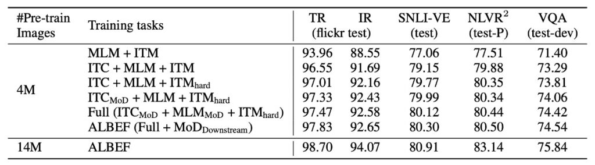

# [21.07] ALBEF

## 追尋純粹的路

[**Align before Fuse: Vision and Language Representation Learning with Momentum Distillation**](https://arxiv.org/abs/2107.07651)

---

想要做好 VQA，無可避免的，就得使用物件偵測器。

那些不想要用物件偵測器的前輩，走在前面的先賢烈士們，已經倒在了路上。

- [**ViLT**](../2102-vilt/index.md)
- [**MDETR**](../2104-mdetr/index.md)

一位是 ViLT 前輩，它把物件偵測器拆掉，改成 ViT，但最後在 VQA v2 資料集的驗證上卻沒有什麼斬獲；另一個 MDETR 前輩，它則是把物件偵測器從 Faster RCNN 換成 DETR，但最後也沒放上 VQA v2 資料集的表現結果。

另一方面，在這個時刻很流行的 CLIP 模型：

- [**CLIP**](../2103-clip/index.md)

這些方法透過對比損失進行預訓練，專注於獨立地學習圖像和文字的表示。但是，這類方法在更複雜的 V+L 任務上可能缺乏建模能力。

欸，我們也就是看看論文，怎麼又能看出這麼多的遺憾？

## 定義問題

其實不遺憾，就是要有前人留下來的懸念，後人才能有繼續發表論文的空間。

ALBEF 的作者根據前人的研究，總結出了幾個現階段的問題：

1. **模態空間的編碼問題**

   影像特徵和文字編碼即使都被轉換成了向量形式，通常還是存在於各自獨特的向量空間中。這意味著，這兩種空間有各自獨特的維度、範圍和特性，因此在這些獨立的空間中，它們的交互作用和關聯性是難以直接捕捉的。

2. **物件偵測器的限制**

   物件偵測器在進行預訓練時需要邊界框註釋，這不僅增加了註釋的成本，而且在推理時需要高解析度的影像（例如 600×1000），增加了計算成本和複雜性。

3. **資料雜訊問題**

   目前廣泛使用的圖像文字資料集主要來自網路，這些資料由於來源多樣，天生容易帶有雜訊。當預訓練模型使用這些資料集時，存在一個風險，即模型可能會對雜訊中的特定文本過度擬合，這會降低其在真實世界應用中的泛化性能。

   綜合上面的問題，作者提出了 ALBEF，其在檢索和推理任務上都取得 SoTA 的結果，而且他也不依賴物件偵測器，而是採用 ViT。

   有別於前輩的嘗試，這次沒有壞掉的其中一個原因是作者加入了「知識蒸餾」的這個技術。

## 知識蒸餾

在開始描述怎麼作者怎麼解決問題之前，我們先對「知識蒸餾」進行一個基本的介紹。

隨著深度學習模型在各種任務上取得了卓越的成果，模型的大小和複雜性也隨之增加。然而，巨大的模型需要大量的計算資源，這在實際應用中可能不太可行，特別是在邊緣設備或移動設備上。

知識蒸餾是深度學習中的一種技術，旨在從一個複雜（且通常很大）的模型（稱為「教師模型」）轉移知識到一個較簡單（且通常較小）的模型（稱為「學生模型」）。

### 基本原理

1. **軟目標（Soft label）**：在蒸餾過程中，教師模型的輸出（通常是某一層的激活函數的輸出或分類概率）被用作軟目標，以訓練學生模型。這些軟目標包含了教師模型的知識，並且比原始的「硬」標籤提供了更多的資訊。

2. **溫度（Temperature）**：為了使軟目標更為「柔和」，通常使用一個參數稱為「溫度」來調整概率輸出。較高的溫度會導致更柔和的概率分佈，這有助於學生模型學習。

### 實施步驟

1. **訓練教師模型**

   教師模型通常是一個大型的、有很多參數的深度學習模型，它在某項任務上經過充分訓練並達到了較好的性能。例如：在圖像分類的任務中，教師模型可能是一個深層的卷積神經網路，如 ResNet-152 或 VGG-19。

   :::tip
   **為什麼需要大模型？**

   大模型因其深度和廣度能捕捉到更多的特徵和模式，從而在訓練數據上達到較高的準確性。但這也意味著它們在推理時的計算成本高，並需要更多的存儲空間。
   :::

2. **生成 Soft label**

   一旦教師模型被訓練好，它就可以被用來獲得 soft label。這基本上意味著使用教師模型的預測作為目標，而不是使用原始的硬標籤。

   :::tip
   **Soft label 與 Hard label 的差異**

   硬標籤是絕對的、明確的分類標籤（如「狗」或「貓」）。而軟目標提供了每個可能的類別的概率。例如：對於一張圖片，硬標籤可能只告訴我們它是一只狗，但軟目標可能告訴我們這張圖片是狗的概率為 0.95，是貓的概率為 0.03，以及其他動物的概率。
   :::

   :::tip
   **為什麼使用軟目標？**

   軟目標可以提供更多的資訊和細節，使模型能更好地了解各類別之間的關係和不確定性。
   :::

3. **訓練學生模型**

   學生模型是一個較小的模型，其目的是模仿教師模型的行為。通過使用上一步產生的軟目標來訓練學生模型，它學習模仿教師模型的決策過程。

   在實際的蒸餾過程中，通常會結合軟目標和原始的硬標籤來訓練學生模型。這樣可以確保學生模型不僅僅模仿教師，還能考慮到原始數據的真實標籤。學生模型通常比教師模型要小和簡單得多，這使得它在推理時更快且更適合於資源受限的環境。

4. **擴展和變體**

   - **自蒸餾**

     在這種策略中，模型使用自己的預測作為軟目標重新進行訓練。這基本上是讓模型嘗試強化自己已經學到的知識。

     - **優點**：簡單且低成本：不需要另一個獨立的教師模型。有助於模型的收斂：通常可以加速模型的收斂和提高其準確性。
     - **缺點**：模型可能更容易過擬合，因為它持續地依賴自己的預測。

   - **多教師蒸餾**

     在這種策略中，多個教師模型的知識被蒸餾到一個學生模型中，學生模型嘗試組合並模仿所有教師模型的行為。

     - **優點：**
       - 豐富的知識來源：來自多個教師模型的知識可能使學生模型更健壯和準確。
       - 降低特定模型偏見：多個教師的組合可能會減少因單一模型的偏見或誤差引起的問題。
     - **缺點：**
       - 計算成本高：需要多個已經訓練好的教師模型。
       - 複雜度增加：決定如何組合和權衡不同教師模型的輸出可能會增加訓練過程的複雜性。

   - **在線蒸餾**

     教師模型和學生模型是同時訓練的。學生模型不斷地從教師模型中學習，同時兩者都在進行迭代和更新。

     - **優點**：
       - 實時更新：學生模型可以即時獲得教師模型的最新知識。
       - 較低的延遲：不需要等待一個模型訓練完成才能開始另一個模型的訓練。
     - **缺點**：
       - 需要仔細的同步：確保學生和教師模型的同步更新可能會有所挑戰。
       - 計算成本：同時訓練兩個模型可能會增加計算需求和成本。

## 解決問題

### ALBEF 模型設計

先撇開知識蒸餾的部分，其他的組件應該很好理解：

1. **影像編碼器**：使用 12 層的 Vision Transformer (ViT-B/16) 進行編碼，初始化使用 ImageNet-1k 預先訓練的權重。
2. **文字編碼器**：使用 6 層的 Transformer Encoder，並使用 BERTbase 模型的前 6 層進行初始化。
3. **多模態編碼器**：使用 6 層 Transformer Encoder，採用 BERTbase 模型的後 6 層初始化。

### 預訓練目標

1.  **影像-文字對比學習 (ITC)**

    這個目標主要是在融合前，學習更好的單模態表示，目標是學習一個相似度函數使得影像和文字的配對有更高的相似度得分。

    首先用兩個線性轉換 (gv) 和 (gw) 將 [CLS] 嵌入映射到標準化的低維度（256-d）表示。接著，參考 MoCo 的設計方式，作者採用兩個佇列來儲存從動量單模態編碼器中最近的 M 個影像-文字表示。然後，為每一個影像和文字計算 softmax 正規化的影像到文字和文字到影像的相似度。影像-文字對比損失是根據 (p) 和 (y) 之間的交叉熵 (H) 來定義的。

    :::tip
    舉個例子：

    假設我們正在訓練一個系統，讓它能夠根據一張影像判斷其相對應的描述。

    - **步驟 1：轉換嵌入**

      我們首先有一張影像，這張影像經過一個深度學習模型後，我們得到了一個 1000 維度的影像嵌入向量。我們將其標示為 [CLS]。但是，這個向量太大，所以我們使用線性轉換 (gv) 和 (gw) 將它縮小到 256 維度的向量。

    - **步驟 2：佇列的儲存**

      現在，我們不只處理這一張影像，還有許多其他的影像和文字。我們會將最近處理的 M 個影像和文字的嵌入保存在一個佇列中，這有點像最近播放的歌曲列表。

      在對比學習中，我們通常需要正面和負面的樣本來計算損失。正樣本是相似的影像和文字配對，而負樣本是不相似的配對。省略這個步驟的話，每次只能從當前的小批量(batch)數據中獲取負樣本。然而，這樣的負樣本可能不夠多或不夠有代表性，導致學習效果不佳。

    - **步驟 3：計算相似度**

      接著，為了判斷我們的影像與哪一段文字最相似，我們計算我們的影像嵌入與佇列中每段文字嵌入之間的相似度，並使用 softmax 正規化來得到每段文字的概率分佈。

      例如：假設我們的影像是一隻黃色的小鴨。在佇列中有三段文字描述：「一隻黃色的小鴨」，「一朵紅色的玫瑰」，和「一顆綠色的蘋果」。計算後，相似度可能是：[0.8, 0.1, 0.1]，這意味著模型認為這張影像有 80% 的概率是描述「一隻黃色的小鴨」。

    - **步驟 4：計算損失**

          現在，我們知道真實的描述是「一隻黃色的小鴨」，所以真實的概率分佈是 [1, 0, 0]。影像-文字對比損失就是計算模型的預測概率分佈 [0.8, 0.1, 0.1] 與真實概率分佈 [1, 0, 0] 之間的差異，這個差異用交叉熵 (H) 來計算。

      :::

2.  **遮罩語言建模 (MLM)**

    掩碼語言模型(MLM)是預訓練深度學習模型中的一種策略，專為加強模型的語言理解和跨模態學習能力而設計。MLM 的工作原理是隨機選擇和屏蔽某些輸入文本中的單詞（通常是 15% 的單詞），並嘗試使用上下文以及任何相關的輔助資訊（如圖像）來預測被屏蔽的單詞。

    這種方法不僅僅是在文字中做填空的遊戲。其背後的思路是強迫模型不僅要理解文本中的語境，還要瞭解圖像中的視覺內容和它與文本的關聯。當模型被訓練來優化這種預測任務時，它同時也學習了如何對文字和圖像進行更深入、更細緻的理解。

3.  **影像-文字配對 (ITM)**

    影像文字匹配（ITM）是一種策略，它主要用於評估模型如何對文字描述與圖像進行匹配。這項任務不僅僅是關於找到匹配的項目，還涉及到評估文本與圖像之間的深層語義關聯。

    為了執行此任務，模型在輸入中使用一個特殊的標記，名為 [CLS]。這個標記的目的是促使模型產生一個代表圖像和文本融合的表示形式。這種融合表示為模型提供了一個單一的視角，從中可以判斷圖像和文本是否匹配。

    為了提高模型的性能，在本篇論文中提議了一種策略：用零計算開銷（就是剛才提到的『佇列的儲存』的那個步驟，沒有多餘的計算，只是多花了一點儲存空間。）為 ITM 任務採樣困難的負樣本。這意味著，在沒有增加額外計算成本的情況下，選擇那些模型最有可能出錯的負樣本，也就是所謂的「硬」負樣本。這種方法使模型能夠更有效地從錯誤中學習，從而提高其分辨匹配和不匹配對的能力。

### 動量蒸餾（MoD, Momentum Distillation）

剛才雖然講了那麼多的預訓練策略，但有個問題還沒有解決：

- **雜訊。**

預訓練的圖像與文字配對大多來源於網路，這些配對往往包含了許多雜訊，且圖像與文字之間的關聯並不總是明確。在圖像-文字對比（ITC）學習中，被認為是負例（即與圖像不匹配的文字描述）的文字有時仍可能與該圖像有關。而在掩碼語言模型（MLM）中，即使有某些詞彙能更恰當地描述圖像，只要這些詞彙與原始的註解不同，它們都可能被誤認為是錯誤的。現有的 ITC 和 MLM 使用獨熱標籤會對所有被認為是負例的預測給予懲罰，不考慮這些預測是否其實是正確的。

:::tip
總之，雜訊會讓剛才提到的那些策略學歪！
:::

為了解決預訓練的圖像和文字配對的雜訊問題，作者提出了一種名為動量蒸餾的策略。這策略的核心思想是使用一個稱為動量模型的持續進化的「教師模型」來生成偽目標（pseudo-targets），藉此來訓練「基礎模型」。

這動量模型不是固定不變的，而是由單模態和多模態的 Encoder 的指數移動平均（exponential-moving-average, EMA）版本所組成，讓模型能夠適應和反映訓練數據中的最新趨勢。

舉例來說，假設我們有一張照片，圖中是一片金黃色的沙灘，波浪輕柔地拍打著岸邊，遠方有幾個玩耍的兒童。但這張圖片的文字描述是：「金黃的沙灘上，海浪輕撫著海岸，孩子們歡快地玩耍，而攤販則在旁邊賣著冰淇淋。」

在這種情況下，如果我們用傳統的方式學習，那麼只要預測的描述沒有提及「冰淇淋」這一詞，模型就可能受到懲罰，即使它很好地描述了沙灘、海浪和玩耍的孩子。

而這是不理想的，因為「冰淇淋」在圖片中只是一個次要的元素。

然而，使用動量蒸餾策略，當基礎模型被訓練時，它將參考動量模型（作為教師模型）所生成的偽目標。假設在多次迭代後，動量模型已經學到了「沙灘」和「海浪」是這張圖片的主要元素，而「冰淇淋」僅僅是次要的。因此，當生成偽目標時，它可能會更偏向於重視「沙灘」和「海浪」，而非「冰淇淋」。這樣，當基礎模型在學習時，它不會因為遺漏了「冰淇淋」這一詞而受到過多的懲罰。反而，它會被鼓勵去捕捉圖片的主要特徵，如「沙灘」和「海浪」。

這種策略確保模型更加關注於圖片的主要元素，而不是被那些次要或不太相關的詳細信息所干擾。

在策略的具體實施中，針對圖像-文字對比（ITC）任務，作者首先透過動量單模態編碼器產生的特徵來衡量圖像與文字的相似度。基於這個相似度，接著產生軟偽目標。在 ITC MoD 的損失計算中，不僅考量了傳統的 ITC 損失，還同時衡量了模型的預測與偽目標間的 KL 散度。

對於掩碼語言模型（MLM），除了原始的 MLM 損失外，模型的預測機率與偽目標之間的 KL 散度也被考慮在內。最終，這策略也被擴展應用於下游的任務，其中每一個任務的損失是原始任務損失和 KL 散度的一個加權組合。

### 資料集

- **網路資料集**：本研究採用了兩大網路資料集，分別是 Conceptual Captions 和 SBU Captions。
- **域內資料集**：另外，也使用了兩個域內資料集，COCO 和 Visual Genome。
- 在所有資料集中，總共收集到的唯一影像數量為 4.0M，而圖文對的數量則為 5.1M。
- 除此之外，為了驗證方法是否能適應更大範圍且含有較多雜訊的網路資料，還包括了概念 12M 資料集，這使得影像的總數增加到了 14.1M。

### 技術細節

- **模型結構**：該模型組成由 BERTbase（擁有 123.7M 參數）和 ViT-B/16（擁有 85.8M 參數）。
- **硬體配置**：訓練過程中，使用了 8 個 NVIDIA A100 GPU。
- **訓練細節**：採用批次大小為 512，進行了總共 30 個週期的預訓練。
- **優化器**：使用了權重衰減為 0.02 的 AdamW。
- **學習率策略**：學習率在前 1000 次迭代中從 0 預熱至 1e-4，然後按照餘弦時間表衰減至 1e-5。
- **影像處理**：預訓練期間，使用解析度為 256×256 的隨機影像裁切，且套用了 RandAugment。微調時，影像解析度提升至 384×384。
- **其他參數**：動量模型更新的動量參數為 0.995，圖文對比學習隊列大小設定為 65,536，且在第一個時期，蒸餾權重 α 從 0 線性增加到 0.4。

## 討論

### 知識蒸餾的貢獻有多少

既然本篇的主打就是知識蒸餾，那我們首先就來看這裡的相關數據。

從結果中可以觀察到以下幾點：

1. **影像文字對比學習的增益**：相較於基準的預訓練方法（MLM+ITM），加入影像文字對比學習（ITC）明顯提升了在各項下游任務的性能。
2. **對比 hard negative mining 的效果**：這個策略透過尋找更具資訊量的訓練樣本進一步增強了 ITM 的性能。
3. **動量蒸餾的貢獻**：當加入動量蒸餾後，不僅改進了 ITC 和 MLM 的學習效果，而且也提高了所有下游任務的表現。
4. **應對雜訊網路資料**：研究結果也指出，ALBEF 方法可以有效地處理含有較多雜訊的網路資料，進而提升預訓練模型的效能。

綜上所述，這篇研究成功地透過多種策略提升了模型在各種任務的效能，尤其在處理雜訊資料時，表現尤為出色。

### 和 CLIP 比一比

在零樣本影像文字檢索的測試中，ALBEF 表現出優越的性能，超越了其他頂尖的方法如 CLIP 和 ALIGN，即使它們是在更大的資料集上進行訓練的。值得注意的是，當 ALBEF 的訓練圖像數量從 4M 增至 14M 時，其性能顯著提升。這暗示了 ALBEF 若在更大規模的網路圖像-文字對資料集上進行訓練，性能可能還會進一步提高。

:::tip
作者隱含著意思是如果他們改成用像是 ALIGN 那個 1.2B 的規模資料，那還不直接突破天際？

其實我也超想開大火來蒸一蒸看結果，但受限於訓練資源做不了這個實驗，之後如果有機會我再把結果放到這裡來。
:::

### 各種 V+L 的結果

在其他 V+L 理解任務的比較中，上表展示了 ALBEF 的出色性能。僅使用 4M 預訓練影像，ALBEF 已達到頂尖效能。當使用 14M 預訓練影像時，其效能明顯超越其他方法，甚至優於那些利用物件標籤的 OSCAR 或進行對抗性資料增強 VALLA 方法。

- [**VILLA**](../2006-villa/index.md)
- [**Oscar**](../2004-oscar/index.md)

與 VILLA 相比，ALBEF 在多個測試集上都取得了顯著的絕對提升，例如在 VQA test-std 上提高了 2.37%，NLVR2 test-P 上提高了 3.84%，以及在 SNLI-VE 測試上提高了 1.88%。加之 ALBEF 不需要物件偵測器且只需使用較低解析度的影像，使其在推理速度上也大大快於大部分的現有方法，如在 NLVR2 上比 VILLA 快出超過 10 倍。

:::tip
這份比較表格中沒有提到 VinVL。

- [**VinVL**](../2101-vinvl/index.md)

在 VinVL 在 VQA 的水準是 76.52 / 76.6；在 NLVR2 的水準是 82.67 / 83.98。

就分數上來看，VinVL 都還是比較優秀的。

這邊作者沒有特別提出來論述一下，至少說個「我們在提升 10 倍推論速度的同時，還能維持相同等級的準確性！」，也是可以的。就這樣直接略過實在是有點可惜。
:::

### 可視化結果

在 RefCOCO+ 的結果中，ALBEF 表現明顯優於其他現有方法，尤其是在使用較弱的文本嵌入情況下。當中有兩種 ALBEF 的變體被用來進行可視化分析：

- **ALBEF_itc**：在影像編碼器的最後一層的自注意力圖上利用 Grad-CAM 進行視覺化，它是透過最大化影像和文字的相似度來獲取梯度。
- **ALBEF_itm**：在多模態編碼器的第三層（特別設計用於 GT 的層）的交叉注意力圖上運用 Grad-CAM 進行視覺化，其目的是透過最大化影像與文字的匹配分數來獲取梯度。

## 結論

「知識蒸餾」這項技術一個明顯的限制是：「學生模型」的表現受到「教師模型」的束縛。因為學生模型只能學到教師所提供的知識，且可能不完全吸納所有資訊。所以，知識蒸餾的關鍵往往歸結於尋找更優質的「教師模型」。雖然這是一個核心議題，但非我們此次討論的重點，所以不再深入探討。

顯然 ALBEF 的作者對「知識蒸餾」有深入的理解，因此在一開始便明確地指出：

- **知識蒸餾，就是為了拿來去除雜訊用的。**

背後的核心假設就是模型會把雜訊排開，只吸納正確的資訊。

這是個非常理想的假設，如果我們從去除雜訊的角度看，知識蒸餾雖然是一個強大的策略，但也伴隨著諸多挑戰。例如：定義什麼是雜訊、對原始模型的過度依賴、蒸餾過程的黑盒特性，以及過度優化的潛在危險等。

ALBEF 在多項視覺語言 (V+L) 任務中都展現出卓越的成果，不僅提供了高速且有效的推理，更突顯了其在此領域的巨大潛力。這也為未來的研究提供了新的方向，例如如何更好地利用知識蒸餾來提高模型的泛化性能，以及如何進一步縮小教師模型和學生模型之間的差距。
