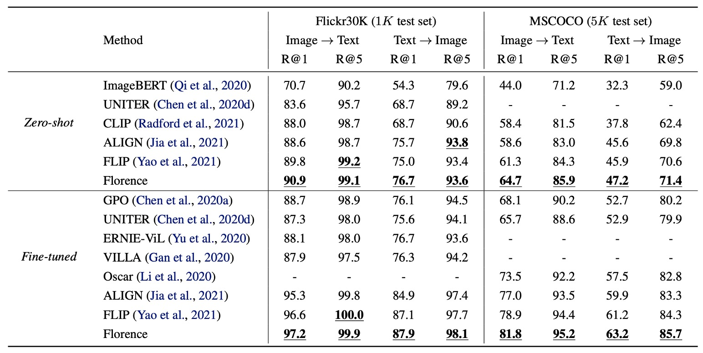

## 文藝復興

[**Florence: A New Foundation Model for Computer Vision**](https://arxiv.org/abs/2111.11432)

---

佛羅倫斯，文藝復興的發源地。

Microsoft 所發表的論文，取起名來也是霸氣十足，藝高人膽大。

基礎模型，原文為 Fundation Model，是一個在自然語言處理領域中崛起的概念。

在早些年，我們通常會說這個是「預訓練模型」，但隨著模型規模愈來愈大，大到不可理喻的時候，我們發現經過預訓練的模型可以做到非常多的事情，不再受限於幾個任務上。

人們覺得這樣的模型有點像是「基礎」，因為它可以為很多不同的任務提供基礎的特徵表示，因此就有了「基礎模型」這個名詞。

:::tip
如果你對 Foundation Model 的機會和風險有興趣，推薦你去讀這篇論文：

- [**[21.08] On the Opportunities and Risks of Foundation Models**](https://arxiv.org/abs/2108.07258)

全文 214 頁，其中 160 頁是正文，50 頁是參考文獻，非常精實。
:::

這篇論文既然都已經取了這麽宏大的名字，那我們就直接切入主題吧。

## 定義問題

自然語言領域已經有了標誌性的基礎模型，作者也想在電腦視覺領域建立一個類似的標竿，定義了電腦視覺中所謂「foundation model」的問題範疇，他們提出一個三維度的問題空間：

1. **空間維度(Space)**：從較粗略(例如場景分類)到較細緻(例如物體偵測)的視覺理解層次。
2. **時間維度(Time)**：從靜態圖片到包含時間序列的動態影片理解。
3. **模態維度(Modality)**：從單純的 RGB 影像資訊拓展到多模態(例如和文本描述、聲音、深度資訊整合)。

<figure style={{"width": "80%"}}>

</figure>

作者想要解的問題是：建立一個基礎模型和對應的適配器(adapters)，可輕量地從上游的多樣巨量資料中習得通用的表示方法，再最小化額外訓練或改動的情況下，能應用到上述三個維度中不同型態的視覺任務。

換句話說，他們想做出一個在「空間-時間-多模態」範圍中都能處理的模型，不論是場景分類、物體偵測、影片中行為辨識、圖像文字檢索、或是視覺與語言交織的任務。

## 解決問題

### 模型架構

這個架構圖很清楚，大概分成三個部分：

1. 準備一個巨大的訓練資料集。
2. 使用優化的對比學習方法訓練基礎模型。
3. 引入更多下游任務的適配器加入預訓練。

好的，我們又看完了一篇論文。（~欸不是！~）

### 訓練資料集

根據 ALIGN 的經驗，只要你的資料量夠大，就可以忽略垃圾資料的影響。

:::tip

如果你對 ALIGN 模型有興趣，可以參考這篇論文：

- [**[21.02] Scaling Up Visual and Vision-Language Representation Learning With Noisy Text Supervision**](https://arxiv.org/abs/2102.05918)
  :::

於是在開始之前，作者先設法取得一個巨大的影像-文本資料集(FLOD-900M)，這個資料集包含 9 億筆影像文字對，共約 9.7 百萬個獨特的 query，以及總計 75 億 toksens。

### 統一影像文本對比學習

首先要解決的是多模態的部分，還記得不久前的 CLIP 模型吧？

CLIP 的訓練想法是：

- 將影像和文字描述視為正樣本對(positive pair)
- 其他文字視為負樣本(negative examples)

這種方式的問題在於網路資料常出現「同一則文字描述對應多張影像」的狀況，如果使用 CLIP 方法默認「一圖一文」，則多張圖對應同一文字描述就難以應用。因此，作者引用了另外一個對比學習架構，叫做「統一影像文本對比學習」。

:::tip
關於 UniCL 的更多細節，可以參考這篇論文：

- [**[22.04] Unified Contrastive Learning in Image-Text-Label Space**](https://arxiv.org/pdf/2204.03610)
  :::

原文為 Unified Image-Text Contrastive Learning 簡稱 UniCL。

詳細做法是為每個文字描述建立哈希標籤(hash key)，同一個文字描述(不論對應多少張影像)被映射到同一個標籤 $y$。

如果在一個批次中有多張影像對應同一個文字描述，那麼這些影像和該文字描述就都是正樣本彼此。也就是說，這裡的對比學習不再是「一圖對一文」的限制，而是「一文對多圖」，所有對應同一文描述的影像都算正樣本；其他不相符的組合仍是負樣本。

從數學上來看，假設 $f_\theta$ 為影像編碼器，$f_\phi$ 為文字編碼器。

給定一張影像 $x$ 和對應的文字描述 $t$，我們先將 $f_\theta(x)$ 和 $f_\phi(t)$ 轉換成特徵向量。

- 正規化後的影像特徵為

  $$
  u = \frac{f_\theta(x)}{\|f_\theta(x)\|}
  $$

- 正規化後的文字特徵為

  $$
  v = \frac{f_\phi(t)}{\|f_\phi(t)\|}
  $$

接著定義一個可學習的溫度參數 $\tau$ (tau)，給定一個 mini-batch $B$，其中每筆資料都具有一個標籤 $y_i$，整個損失函數 $L$ 包含兩個方向的對比：

1. 影像到文字的對比損失 $L_{i2t}$
2. 文字到影像的對比損失 $L_{t2i}$

最後的損失為

$$
L = L_{i2t} + L_{t2i}
$$

透過這兩方向的對比，模型同時學習「影像找文字」和「文字找影像」的匹配關係。

此外，作者發現長篇幅且有意義的語言描述比單字描述對學習更有效。但因為有些資料只有很短的文字描述(如單詞)，他們會用一些模板如「A photo of the [WORD]」去延長該描述，以提供更多上下文特徵。但是後來發現這種用合成的 Prompt 對比較高階的檢索和視覺-語言任務稍有不良影響，所以作者在訓練過程分為兩個階段：

- 第一階段：使用所有資料(含補充描述的短文本)訓練 100 萬次。
- 第二階段：移除所有人造模板的 Augmented 文本，只用原始資料再訓練 18 萬次，使模型對自然文本描述更敏感。

最後還加上了一個高解析度微調(8 萬次)將影像輸入尺寸從 $224 \times 224$ 提升至 $384 \times 384$，跟其他大型預訓練方法類似，以提升模型表現。

### 雙塔架構

模型的結構採用「Two-Tower」設計：

- 文本編碼器：12 層 Transformer，結構類似 CLIP 的文字編碼器。
- 影像編碼器：採用 CoSwin Transformer 的階層式 Vision Transformer。

整個模型有 8.93 億參數，其中文字 Transformer 有 2.56 億，CoSwin-H 影像 Transformer 有 6.37 億參數。

:::tip
CoSwin 是基於 Swin Transformer 的變體，它用卷積嵌入來取代線性嵌入，使特徵提取更具層級性，有助於更精準的影像表示。
:::

### 下游任務適配器 - 物件級

<figure style={{"width": "80%"}}>

</figure>

接著要來解決細粒度的問題，分兩個部分，其一是物件級的問題。

由於影像級別的特徵可能不足以應付物件偵測、分割等需要精細定位的任務。為此，作者將預訓練好的 Florence 影像編碼器接上 Dynamic Head 的適配器或 Dynamic DETR，以從影像整體語意延伸到物件級別特徵學習。

如上圖，Dynamic Head 的核心概念是將特徵金字塔、空間維度、通道維度透過一組三重注意力機制串接起來。由於直接對整個 3D 特徵張量用一個多頭注意力的運算會非常昂貴，但透過分解成 level-wise、spatial-wise、channel-wise 三種注意力，並且順序疊堆，就能有效率地捕捉多維特徵關聯。

同時，作者也建立了一個巨大物件偵測前訓練資料集 **FLOD-9M**。

此資料集結合了 COCO、LVIS、OpenImages、Object365 等知名資料集，並對 ImageNet-22K 產生偽標註框擴充資料。整個資料集擁有約 896 萬張影像、25190 個物件類別、超過 3340 萬個標註方框。

:::tip
相關論文請參閱：

- [**[21.06] Dynamic Head: Unifying object detection heads with attentions**](https://ieeexplore.ieee.org/document/9577765)
- [**[21.10] Dynamic DETR: End-to-End Object Detection with Dynamic Attention**](https://ieeexplore.ieee.org/document/9709981)
  :::

### 下游任務適配器 - 細粒級

<figure style={{"width": "80%"}}>

</figure>

其二是細粒度的問題，在視覺問答、圖片描述等任務中，往往需要更細緻的特徵表達。

之前許多研究是先用物件偵測器從圖像中抽取物件級特徵，再將這些特徵丟入融合網路進行任務預測。不過最新的方法是直接「在不依賴明確標註的物件框」的情況下，直接從網格化特徵學習出細粒度資訊。

如上圖，作者使用 METER 來將 Florence 擴展到細粒度的表示。實現方法是用已經預訓練好的 Florence 影像編碼器 (CoSwin) 取代 METER 原本的影像編碼器，文字端使用預訓練的 Roberta 作為文字編碼器。此外，他們利用 Co-attention 的 Transformer 模組同時對影像特徵與文字特徵進行編碼，使兩種模態相互關聯，最後在下游任務中微調。

:::tip
METER 剛好我們有看過，可以參考這篇文章：

- [**[21.11] METER: 繽紛的儀表板**](../2111-meter/index.md)
  :::

### 下游任務適配器 - 影片

最後一個作者定義的維度是時間，也就是影片。

Transformers 的自注意力設計可輕易拓展至影片任務。

作者提出「Video CoSwin adapter」來將已經在影像領域訓練好的 CoSwin 延伸到影片領域。

為了適應影片特徵，他們將原先影像的 token 嵌入方式從 2D 卷積改為 3D 卷積，以處理空間和時間維度的特徵。原本 CoSwin 中使用 2D 卷積來產生 patch tokens，現在將這些 2D 卷積核拓展成 3D 卷積核，以能同時考慮時間序列。

若用數學來描述的話，假設原本的 2D 卷積核大小為 $K_{h} \times K_{w}$，現在為了影片，我們有了時間維度 $T$，新的 3D 卷積核為 $K_{t} \times K_{h} \times K_{w}$。

若 2D 權重為 $W_{2D}$，則 3D 權重 $W_{3D}$ 初始化時：

$$
W_{3D}(t,h,w) = \frac{W_{2D}(h,w)}{K_{t}} \quad \text{for } t=1,\dots,K_{t}.
$$

這樣確保平均值和變異數在拓展後不致於大幅改變。

在 Swin Transformer 結構中，patch merging 是一個縮減特徵維度的過程。對影片特徵，作者用 3D 卷積式的 patch merging，以便同時在空間和時間上合併特徵，使不同時間片段的特徵有更多交互。

Swin Transformer 透過將圖像分割成小窗口並對窗口內進行自注意力計算，然後在下一層中改變窗口位置以跨窗口交流特徵。對影片而言，作者將 2D 的 shifted windows 變成 3D shifted windows，也就是在時間上同樣做 shift。

為了初始化 3D 相對位置嵌入，作者把預訓練的 2D 位置嵌入沿著時間維度複製，確保每個時間片段起始的相對位置嵌入與 2D 版本相同。

$$
E_{3D}(t,h,w) = E_{2D}(h,w), \quad \forall t
$$

這代表在初始時，不同時間片段使用相同的 2D 相對位置嵌入，再靠訓練讓模型學到時間維度的變化。

透過這些最小修改，多數層(如自注意力、FFN 層)都能直接繼承 2D 預訓練權重。最後，他們以動態的 window size 策略來減少顯存壓力，早期階段用小 window，後期階段用大 window。

:::tip
這一段如果不了解 Swin Transformer 還真的看不下去，如果你有遇到困難，可以參考我們之前的文章：

- [**[21.03] Swin Transformer: 舞會開始**](../../vision-transformers/2103-swin-transformer/index.md)
  :::

### 空間-時間-多模態

再回到剛開始的那張圖：

<figure style={{"width": "80%"}}>

</figure>

1. **空間維度(Space)**：場景分類和物體偵測的視覺理解。
2. **時間維度(Time)**：時間序列的動態影片理解。
3. **模態維度(Modality)**：文本描述與影像的映射整合。

作者提出的三維度的整合，都已經在上面過程中完成，嚴絲合縫。

## 討論

在實驗結果的部分有近十份圖表，我們挑幾個重點來看。

### 零樣本分類遷移

<figure style={{"width": "80%"}}>

</figure>

本實驗基於 Florence 模型，直接用於預測影像與文字是否在語義上相符。

Florence 在 12 個數據集中，於 9 個數據集超越最先進模型，其中 ImageNet-1K 零樣本分類的 Top-1 準確率達到 83.74%，Top-5 準確率達到 97.18%。

### 線性探針分類

<figure style={{"width": "80%"}}>

</figure>

實驗方法是將 Florence 的影像編碼器凍結，只調整附加的線性層，來評估特徵表示的泛化能力。

Florence 在 11 個分類基準數據集上進行線性探針分類，整體表現超越現有技術水準，但在 CIFAR10 和 CIFAR100 表現略差，因為這些數據集影像解析度較低。

### ImageNet-1K 微調

<figure style={{"width": "80%"}}>

</figure>

實驗方法是將類別名稱傳入文字編碼器，獲取特徵嵌入，使用 ImageNet 的類別模板進行描述擴展。

結果顯示，Florence 在 ImageNet-1K 微調評估中超越 BiT 和 ALIGN，雖然略遜於 SOTA，但其模型與數據規模皆為 Florence 的 3 倍。

### 圖文檢索結果

<figure style={{"width": "90%"}}>

</figure>

在 Flickr30k 和 MSCOCO 數據集上進行零樣本遷移和微調評估圖文檢索性能。

Florence 在零樣本檢索和微調檢索上均超越 SOTA 方法，並且微調檢索效率更高，只需 ALIGN 訓練週期的 6% 至 8%，其結果就優於所有現有方法。

### 物件偵測之零樣本遷移

物件偵測的數據集包括 COCO、Object365 和 Visual Genome，如上圖所示。

Florence 在這些數據集上均達到新的 SOTA，如下表：

<figure style={{"width": "70%"}}>

</figure>

另外，在 11 個跨域數據集上進行零樣本遷移，顯著提升效果：

<figure style={{"width": "90%"}}>

</figure>

雖然和有監督學習相比，零樣本遷移尚有性能差距，但對 5-shot 微調和部分全數據集微調任務表現優異（例如 Packages 數據集）。

### VQA 評估結果

<figure style={{"width": "80%"}}>

</figure>

- **模型設置**：
  - 影像編碼器替換為 Florence 的 CoSwin-H。
  - 移除文字嵌入層和模態專屬嵌入的權重衰減。
  - 使用 ITM 和 MLM 進行預訓練，訓練 43 個週期，影像輸入大小為 384。
- **下游任務**：
  - 視覺問答 (VQA)：基於影像內容回答問題（3,129 個可能答案）。
  - 模型使用二元交叉熵損失函數，進行 10 個週期的微調，學習率為 $8 \times 10^{-6}$。

在 VQA 數據集上，Florence 在 test-dev 和 test-std 上均達到新的 SOTA。與 SimVLM 相比（使用 18 億個影像文本對），Florence 僅用 900 萬對進行預訓練，數據效率顯著提升。

## 結論

雖然論文的方向是瞄準「基礎模型」的方向上去的，但就參數的量級（0.6B）來說，似乎還差了那麼一點。

作者認為儘管模型規模尚未達到某些現有數十億參數模型的大小，但就實驗結果來看，Florence 已經成功延展至多種任務，包括空間、時間及跨模態應用，並且表現出優異的遷移能力。

既然在「小規模」的測試已經取得初步的成果，想必接下來要做的事情就是平行展開到更大的模型上，讓我們拭目以待。
