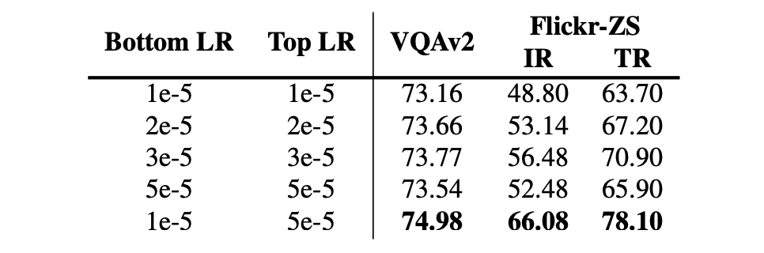

# [21.11] METER

## 繽紛的儀表板

[**An Empirical Study of Training End-to-End Vision-and-Language Transformers**](https://arxiv.org/abs/2111.02387)

---

這是一篇彙整式論文。

所以你可以預期在這裡會看到實驗，還有……更多的實驗。

當前主流的 VLP 架構主要有三個組件：

- 其一：視覺編碼器，也就是我們常講的 ViT。
- 其二：文字編碼器，最常見的是 BERT。
- 最後：共編碼器，這裡就是把視覺和文字整理起來的地方。

作者首先整理了過去研究中使用架構的總表，把這三個組件一一拆解，然後娓娓道來。

## 定義問題

說到底，就是視覺組件的問題：

1. **效率問題**

   在視覺和語言預訓練（VLP）中，大多數現有的模型依賴於預先訓練的目標檢測器（例如 Faster RCNN）來從影像中提取區域特徵。然而，這些目標檢測器在 VLP 過程中通常保持凍結狀態，限制了 VLP 模型的容量。此外，提取區域特徵的過程非常耗時，這可能會影響模型的效率和實用性。

2. **探索太少**

   雖然 Transformer 在自然語言處理和電腦視覺中顯示出有希望的性能，但完全基於 Transformer 的 VLP 模型，特別是使用視覺 Transformer（ViT）作為影像編碼器的模型，仍然未得到充分的探索。雖然有一些基於 ViT 的 VLP 模型，但它們在下游任務如視覺問答等方面的性能仍然落後於最先進的性能。

3. **優化器不一致**

   有些研究嘗試將卷積神經網路和文字的網格特徵直接輸入到 Transformer 中，但遇到了優化器不一致的問題，通常在 CNN 和 Transformer 中使用不同的優化器。最近的研究顯示，與 ViT 相比，CNN 在精度和計算成本（FLOPs）上的表現稍差。

看到作者提到「優化器不一致」的部分，讓我立刻意識到：這不就是在說 SimVLM 嗎？

- **傳送門：[SimVLM：簡單一點](../2108-simvlm/index.md)**

畢竟人家也是 SoTA 架構，肯定是要給予足夠的尊重，但這不妨礙研究者們對其吹毛求疵，品頭論足一番，這畢竟是人類進步的原動力。

## 解決問題

### METER 模型設計

作者有系統地研究如何訓練高效能的視覺和語言轉換器，並從多個維度剖析模型設計：視覺編碼器、文字編碼器、多模態融合模組、架構設計（僅編碼器與編碼器-解碼器）和預訓練目標。

1. **Vision Encoder 挑選**

   本文主要探討了視覺變換器（ViTs）在視覺編碼器中的應用，特別是在處理 patch feature 方面。在 ViT 的機制中，影像首先被分割成多個 patch，然後這些 patch 被輸入到 Transformer 模型中進行處理。

   近期 ViT 已經成為一個熱門的研究主題，並且已經被應用在視覺和語言預訓練（VLP）領域中。然而，當與基於區域特徵的先進模型（例如：VinVL）相比時，所有這些基於 ViT 的模型的性能都顯得較差。

   另外，目前缺乏對不同預訓練 ViT 的系統性研究，以確定哪些 ViT 最適合 VLP 應用。為了解決這個問題，作者比較了多種不同的 ViT 模型，包括下列：

   - **ViT (2020.10)：**
     - [An Image is Worth 16×16 Words: Transformers for Image Recognition at Scale](https://arxiv.org/abs/2010.11929)
   - **DeiT (2020.12)：**
     - [Training data-efficient image transformers & distillation through attention](https://arxiv.org/abs/2012.12877)
   - **CLIP-ViT (2021.02)：**
     - [Learning Transferable Visual Models From Natural Language Supervision](https://arxiv.org/abs/2103.00020)
   - **Swin Transformer (2021.03)：**
     - [Hierarchical Vision Transformer using Shifted Windows](https://arxiv.org/abs/2103.14030)
   - **CaiT (2021.03)：**
     - [Going deeper with Image Transformers](https://arxiv.org/abs/2103.17239)
   - **VOLO (2021.06)：**
     - [Vision Outlooker for Visual Recognition](https://arxiv.org/abs/2106.13112)
   - **BEiT (2021.06)：**
     - [BERT Pre-Training of Image Transformers](https://arxiv.org/abs/2106.08254v2)

2. **Text Encoder 挑選**

   在 BERT 和 RoBERTa 之後，VLP 模型首先將輸入句子分割成子詞序列。此步驟是在進行文本和視覺信息融合之前的文本處理階段。在分割子詞序列後，會在句子的開頭和末尾插入兩個特殊標記以產生輸入文本序列。這些特殊標記有助於定義句子的界限。

   作者的目標是在將特徵發送到融合模組之前首先使用文字編碼器。他們探索了使用不同的語言模型，如 BERT、RoBERTa、ELECTRA、ALBERT 和 DeBERTa 進行文本編碼。除了使用不同的語言模型外，作者還嘗試使用一個簡單的字嵌入查找層，該層由 BERT 嵌入層初始化。

   我們同樣把作者所選用的架構放上來：

   - **BERT (2018.10)**：
     - [Pre-training of Deep Bidirectional Transformers for Language Understanding](https://arxiv.org/abs/1810.04805)
   - **RoBERTa (2019.07)**：
     - [A Robustly Optimized BERT Pretraining Approach](https://arxiv.org/abs/1907.11692)
   - **ALBERT (2019.09)**：
     - [A Lite BERT for Self-supervised Learning of Language Representations](https://arxiv.org/abs/1909.11942)
   - **ELECTRA (2020.03)**：
     - [Pre-training Text Encoders as Discriminators Rather Than Generators](https://arxiv.org/abs/2003.10555)
   - **DeBERTa (2020.06)**：
     - [Decoding-enhanced BERT with Disentangled Attention](https://arxiv.org/abs/2006.03654)

3. **Multimodal 架構**

   

   由於端對端的 VLP 模型變得越來越流行，作者在新環境中重新評估了這兩種融合模組的影響。這可能是為了了解在新的模型架構或設置中哪種融合策略更有效。

   - **合併注意力模組**

     在此模組中，文字和視覺特徵被簡單地連接在一起，然後一起輸入到單一的 Transformer 模組中。這種方法允許在同一個 Transformer 模組中同時處理文本和視覺信息。

   - **共同注意力模組**

     共同注意力模組將文字和視覺特徵獨立地輸入到不同的 Transformer 模組中。這個模組使用交叉注意力技術來實現跨模式的互動，即在視覺和文本特徵之間實現互動。

     對於基於區域的 VLP 模型，這兩種融合模組可以達到相似的表現。這表明，不同的融合策略可能對結果的影響不大。而合併注意力模組在參數效率上更高，因為它使用相同的參數集來處理兩種模式的特徵。這可能使得合併注意力模組在計算資源有限的情況下更為吸引人。

### Encoder-Only vs. Encoder-Decoder

作者比較了兩種不同的模型架構：僅「編碼器」架構和「編碼器-解碼器」架構，並探討了它們在視覺語言預訓練（VLP）模型中的應用：

- **僅編碼器架構**

  在這種架構中，跨模態表示（例如視覺和文本特徵的結合）直接輸入到輸出層以產生最終輸出。VisualBERT 是採用僅編碼器架構的 VLP 模型的一個例子。

- **編碼器-解碼器架構**

  最近有一些模型，如：VL-T5 和 SimVLM，提倡使用編碼器-解碼器架構。在這種架構中，跨模態表示首先輸入到解碼器，然後再輸入到輸出層。解碼器在此過程中同時關注編碼器的表示和先前產生的標記，以自回歸的方式產生輸出。

  作者通過上圖的例子（執行 MLM 建模任務）展示了這兩種架構之間的差異。具體來看，編碼器-解碼器模型在執行像視覺問答（VQA）這樣的分類任務時，將文字輸入到編碼器，將分類標記輸入到解碼器，然後解碼器相應地產生輸出結果。

### 預訓練策略

作者挑出了在視覺語言預訓練（VLP）模型中的三種主要預訓練任務，包括：掩蔽語言建模（MLM）、圖像文字匹配（ITM）和掩蔽影像建模（MIM）：

1. **掩蔽語言建模（MLM）**

   初始於純語言預訓練，後於 VLP 中延伸應用，目的是在給定圖像標題對時，隨機屏蔽一些輸入標記，並訓練模型以重建這些屏蔽的標記。

2. **圖像-文字匹配（ITM）**

   模型需要識別哪些圖像和標題相互匹配，通常作為二元分類問題。模型學習全域跨模態表示，並利用分類器預測是否匹配。

3. **掩蔽影像建模（MIM）**

   這是一種在視覺預訓練模型中應用的技術，其靈感主要來自於掩蔽語言建模（MLM）。在 MIM 中，模型的目的是在某些視覺特徵被屏蔽或隱藏的情況下，嘗試重建或預測這些被屏蔽的視覺特徵。作者提出了一些改善方法，例如：Masked Patch Classification with In-batch Negatives 和 Masked Patch Classification with Discrete Code。

這裡沒有提到剛剛獲得成功 PrefixLM，我認為主要的原因可能是：是在本篇論文中，作者認為 PrefixLM 並不是主流的方法，而且 SimVLM 的成功主要原因可能是他們的資料集規模龐大，因此沒有特別拿出 PrefixLM 進行討論。

:::tip
**掩蔽影像建模（MIM）**

掩蔽影像建模（Masked Image Modeling, MIM）是一種在視覺預訓練模型中應用的技術，其靈感主要來自於掩蔽語言建模（MLM）。在 MIM 中，模型的目的是在某些視覺特徵被屏蔽或隱藏的情況下，嘗試重建或預測這些被屏蔽的視覺特徵。

例如：LXMERT 和 UNITER 等模型在某些輸入區域被屏蔽的情況下，訓練模型來回歸原始區域特徵。這通常是通過最小化均方誤差損失來實現的。儘管 MIM 在某些模型中顯示出潛力，但最近的一些先進模型（例如 ALBEF 和 VinVL）在 VLP 期間並未應用 MIM，表明可能對 MIM 在 VLP 模型中的真正效用存在疑慮。

既然有疑慮，於是作者提出了一些改善：

1.  **Masked Patch Classification with In-batch Negatives**

    這個方法是受到了 MLM 的啟發，它用一種特殊的方式來重建被遮蔽的圖像部分（或稱為 Patch）。 在訓練過程中，模型的任務是從所有可能的 Patch 中找出被遮蔽的原始 Patch。為了做到這一點，它創建了一個臨時的「詞彙表」，由當前批次中的所有 Patch 組成。 這樣模型就能嘗試從這個臨時「詞彙表」中找到被遮擋 Patch 的最佳匹配。

2.  **Masked Patch Classification with Discrete Code**

    這個方法的靈感來自於 BEiT，它的目的是透過訓練模型來重新創建被遮蓋掉的圖像部分（Patch）。首先，它用一個叫做 VQ-VAE 的模型，將圖像轉換成一組特定的標籤，這些標籤是離散的，這意味著它們是明確且分開的。 然後模型的任務是嘗試預測這些被遮蓋掉的圖像部分原來對應的標籤，而不是直接預測被遮蓋掉的圖像部分本身。

:::

### 資料集

模型在四個常用資料集上預先訓練，包括 COCO、Conceptual Captions、SBU Captions 和 Visual Genome，依循著先前的研究，組合訓練資料共包含約 4M 張圖片。'

### 技術細節

- 除非另有說明，隱藏層大小設定為 768， Head 設定為 12。
- 視覺分支和語言分支之間沒有解碼器，也沒有參數共享。
- 除特殊情況外，模型僅使用 MLM 和 ITM 進行預訓練。
- 使用 AdamW 預先訓練模型 100,000 步，底層和頂層的學習率分別設定為 1e-5 和 5e-5。
- 預熱比率為 10%，學習率在總訓練步數的 10% 後線性衰減到 0。
- 根據所採用的視覺轉換器，使用 center-crop 將每個影像的大小調整為 224×224 或 384×384。

## 討論

### 模組分開評估

因為預訓練過程非常耗時，為了提高效率，研究首先透過比較不同的文字和視覺編碼器而不進行視覺語言預訓練（VLP）來進行：

- 使用特定的預訓練視覺和文字編碼器來初始化模型的底層，而頂層則進行隨機初始化。
- 預設選擇的編碼器為 CLIP-ViT-224/32 和 RoBERTa，其中 ViT-N/M 中的 N 和 M 分別代表影像解析度和區塊大小。

1. **Text Encoder 評比**

   

   不同文字編碼器的模型表現並沒有顯著差異。 RoBERTa 似乎在此設定中實現了最強勁的性能。 此外，從 Emb-only 結果可以看出，有必要有一個預先訓練的編碼器，否則下游任務表現將會下降。

2. **Vision Encoder 評比**

   

   CLIP-ViT-224/16 和 Swin Transformer 在此設定下均可達到不錯的效能。 值得注意的是，Swin Transformer 在沒有任何 VLP 的測試開發集上可以達到 72.38 的 VQA 分數，這在預訓練後已經可以與一些 VLP 模型相媲美。

### V+L 綜合評估

兩者搭配，成為 VLP 架構之後，BERT 和 RoBERTa 之間的差異似乎縮小了，但在底部有一個預先訓練的文本編碼器仍然很重要（Embed-only 與 RoBERTa）。 對於視覺編碼器，CLIP-ViT-224/16 和 Swin Transformer 都可以達到相當不錯的性能。 特別是，CLIP-ViT-224/16 在 test-dev/test-std 集合上分別可以達到 77.19/77.20 的 VQA 分數，優於先前最先進的基於區域的 VinVL 模型。

:::tip
**來自論文作者的友情提示**

作者有提供一個有趣的技巧，用來提升模型表現。

相較於使用預訓練模型初始化的參數，對於隨機初始化的參數使用更大的學習率是更好的。如果對模型的所有部分使用相同的學習率，會使得模型效能下降。這可能是因為預訓練的參數已經包含了一些視覺和語言方面的知識，而過於積極的微調可能會損失這些有價值的資訊。
:::

### 融合技巧和 Decoder 的貢獻探討

作者設計了合併注意力模型和共同注意力模型並比較了它們的表現。

實驗結果表示：共同注意力模型的表現優於合併注意力模型，這暗示著保持兩種模式具有不同參數集是重要的。

不過，這個結果與先前基於區域的 VLP 模型的研究結果有所矛盾，作者認為這可能是因為：

1. 基於區域的 VLP 模型的研究結果不一定能直接應用於基於 ViT 的 VLP 模型。
2. 大部分的基於區域的 VLP 模型只使用預先訓練的視覺編碼器，而不包含預先訓練的文字編碼器，這使得像共同注意模型這樣的對稱架構在這些情況下可能不太適用。

另一方面，在實驗 Encoder 對比 Encoder-Decoder 架構的部分，實驗根據文獻採用了 T5 風格的語言建模目標，屏蔽了 15% 的輸入文字標記，使用哨兵標記替換了連續的文字範圍，並訓練解碼器來重建被屏蔽的標記。對於圖像文字匹配任務，向解碼器提供了特殊的類別標記以生成二進位輸出。

結果顯示，僅編碼器模型在兩個判別任務上的表現優於編碼器-解碼器模型，這與文獻的發現一致。但值得注意的是，編碼器-解碼器架構更為靈活，能夠執行如影像字幕等任務，這對僅應用編碼器的模型來說可能較為困難。

:::tip
我們看到這裡有個問題，為什麼 SimVLM 比起 T5 有著更優秀的性能，為什麼在評比 Decoder 的時候，不採用 SimVLM 的風格？而是要選用 T5 的風格？

作者沒有解釋，但推測可能的原因是作者認為 SimVLM 使用大規模資料集的關係，所以它在這邊沒有相同的比較基礎，所以就選了 T5 來作為參考。
:::

### 擴大資料集規模

作者通過使用更多的圖像和更大的視覺主幹來進行模型的預訓練，來驗證這個框架的可擴展性。具體的預訓練資料包括 COCO、CC、CC12M、SBU 和 VG 這五個資料集，它們總共提供了大約 1400 萬張圖像和 2000 萬張圖像標題對，為模型的預訓練提供了豐富的資料。

在視覺主幹的選擇上，採用了 CoSwin-Huge 作為視覺主幹，它有能力處理大量的視覺資料。
文字主幹方面，選擇了 RoBERTa-base 來進行文字的處理，這個選擇保證了文字資訊能夠被有效地編碼。
通過擴展後的設定，模型在 VQAv2 上表現出最先進的性能，超越了之前使用了 18 億張圖像訓練的 SimVLM，這個結果證明了 METER 框架具有很好的可擴展性，可以通過增加資料和調整模型結構來達到更好的效果。

# 結論

整體的實驗設計的某些方面似乎顯得稍微不足，並且缺乏足夠的控制變數以確保結果的可靠性。例如：在一開始提出了眾多的文本主幹（6 個）和圖像主幹（9 個）時，雖然這些架構的提出背後都有其優化的重點，但在作者組合兩個主幹成為 V+L 的模型 時，卻統一採用了相同的邏輯，而沒有針對不同的架構進行最優調整。 這種「一刀切」的方法可能未能充分發揮每種架構的獨特優勢，同時也可能掩蓋了某些潛在問題的發現。

1. RoBERTa 有別於 BERT 採用了新的動態 MASK 機制，但在本論文中卻都一致地使用 MLM 策略？Vision Encoder 的部分也同樣沒有看到什麼細緻的操作，就只是拿個效果比較好的架構，然後把它湊成 V+L 的模型？

2. SimVLM 所採用的 PrefixLM 如果用在作者所提出來的架構上，效果會如何呢？當不同的文字和圖像主幹結合時，是否該搭配不同的參數設定和優化技巧，以確保各種架構的最佳表現？以及嘗試了多種多模態融合策略，以驗證模型的泛化能力和穩定性？

儘管有上述這些較為可惜的地方，我非常認同該研究在多模態學習領域所做的努力和貢獻。透過探索不同的文字和圖像主幹組合，為讀者提供了一個全新的視角來理解多模態學習的可能性和挑戰。而且，透過大量的實驗和比較，也為未來的研究提供了寶貴的參考和啟示。
