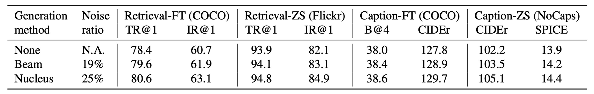
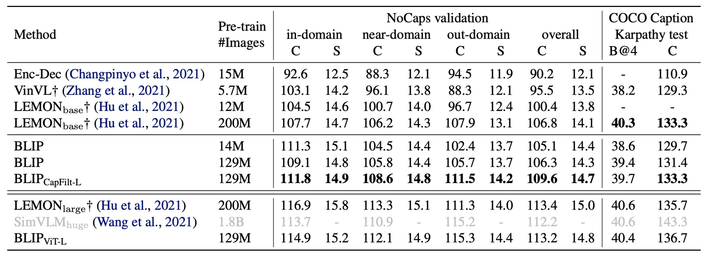

# [22.01] BLIP

## 合成文本技術

[**BLIP: Bootstrapping Language-Image Pre-training for Unified Vision-Language Understanding and Generation**](https://arxiv.org/abs/2201.12086)

---

多模態的模型在這個時候已經站穩在人們的視野內。

攤開 ImageNet 的排行榜，上面大概都已經被多模態的架構所占滿。

## 定義問題

作者回顧了近幾年的研究文獻，發現近期的多模態模型大多有幾個缺點：

1. **訓練資料品質不佳：**

   除了 CLIP 之外，比較有名的論文就是 ALIGN，也就是基於非常龐大的嘈雜資料集所訓練的多模態模型。雖然許多研究都指出使用這種訓練方式同樣可以得到不錯的結果。但作者認為這只是因為沒有一個合適的處理方式，所得到妥協的結果。

2. **架構決定命運：**

   多模態的架構的選擇通常就兩種：其一是使用基於編碼器的模型，其二是使用基於編碼器-解碼器的模型。

   基於編碼器的模型不容易轉移到文字生成任務，像是圖像字幕的任務之類的；如果是採用編碼器-解碼器的模型，則是在文字檢索的任務上表現不佳。

難道就沒有一舉兩得的方法嗎？

## 解決問題

### 模型架構

根據上圖，我們從左到右來看：

首先作者採用 ViT 架構做為視覺輸入的編碼器，並在輸出的序列中加入一個特殊的 token `[CLS]` 來表示整個影像的特徵。

接著為了訓練一個具有「理解」與「生成」能力的統一模型，作者提出了一個多模態編解碼混合模型 (Multimodal Mixture of Encoder-Decoder, MED)。

這個模型具有三個功能：

1. **文字編碼器**：上圖中，從左邊數來第二個。

   文字編碼器與 BERT 相同，文字輸入的開頭會附加一個 `[CLS]` 標籤來總結句子。

   - [**[18.10] BERT: 十二層編碼器**](../../transformers//1810-bert/index.md)

2. **基於影像的文字編碼器**：上圖中，從左邊數來第三個。

   透過在每個 Transformer 區塊的自注意力(SA)層與前饋網路(FFN)之間插入一層額外的交叉注意力(CA)層來注入視覺訊息。

   文字末尾會附加一個 `[Encode]` 標籤，其輸出嵌入作為影像與文字的多模態表示。

   :::tip
   透過不同的特殊 Token 來標記不同的序列，讓模型在訓練時能夠知道當前的任務是什麼。
   :::

   :::tip
   這其實就是 Transformer Decoder 的架構，但這裡的輸入是文字，而 Cross-Attention 的對象是來自於影像輸出的特徵。
   :::

3. **基於影像的文字解碼器**：

   將基於影像的文字編碼器中的雙向自注意力層替換為因果自注意力層（Causal Self-Attention）。

   解碼過程使用 `[Decode]` 標籤來表示序列的開始，並用結束標籤來表示序列結束。

   :::tip
   這裡也是 Transformer Decoder 的架構，但為了要做生成任務，所以把 Self-Attention 替換成了 Causal Self-Attention。
   :::

### 預訓練目標

架構完成了，現在要來定義預訓練的目標。

在預訓練過程中，BLIP 要共同優化三個目標，包含兩個理解任務的目標與一個生成任務的目標。

1. **影像-文字對比損失 (ITC)**：

   這個目標是讓正確配對的影像與文字在特徵空間中具有相似的表示，而錯誤配對的影像與文字之間的特徵應該相差較大。透過這種方式，模型能夠學會將相關的影像與文字匹配起來，並區分出不相關的配對。

   ITC 使用單模態編碼器來分別處理影像和文字，並引入動量編碼器生成特徵。為了提升效果，ITC 還會考慮負樣本中可能存在的正樣本，使用軟標籤來進行訓練，使得模型能更準確地學習到影像和文字之間的對應關係。

2. **影像-文字匹配損失 (ITM)**：

   為了強化模型的鑑別能力，使用 0.5 的機率隨機替換對齊的圖像。換句話說，有一半的機會，圖像和其相對應的文字描述不會匹配。模型使用單一線性層來將池化後的特徵投影到二進位類別上，計算與真實匹配情況的相似度。最終目標是最小化這個匹配的負對數似然損失。

3. **語言模型損失 (LM)**：

   啟用基於影像的文字解碼器，目的是生成影像的文本描述。此損失透過優化交叉熵損失來訓練模型，以自迴歸的方式最大化文本生成的機率。相比於已被廣泛使用的掩蔽語言模型(MLM)損失，LM 損失使模型能夠更具生成能力，能夠將視覺信息轉化為連貫的文字描述。作者在計算損失時應用了 0.1 的標籤平滑技術。

---

為了提升多任務學習中的訓練效率：

- **作者讓文字編碼器與解碼器共享除自注意力 (SA) 層外的所有參數。**

這是因為編碼與解碼任務的主要差異集中在自注意力層上，編碼器採用雙向自注意力，構建當前輸入的整體表示；而解碼器則使用因果自注意力，根據上下文來預測下一個 token。

另一方面，嵌入層、交叉注意力層以及前饋網路在編碼和解碼過程中的功能相似，因此共享這些層不僅能提升訓練效率，還能在多任務學習中實現參數的充分利用。

### CapFilt

剛才也提到了，作者一開始就認為使用嘈雜的資料集來訓練模型對模型的表現是有損害的。

為了提升文本資料的質量，作者提出了「Captioning and Filtering (CapFilt)」方法。

如上流程圖所示，CapFilt 包含兩個模組：

1. **生成影像描述的「captioner」**：captioner 是基於影像的文本解碼器，透過語言模型目標進行微調，根據輸入的網路影像生成合成的描述文本 (Ts)。

2. **過濾雜訊影像-文本配對的「filter」**：filter 則是基於影像的文本編碼器，透過 ITC 和 ITM 目標進行微調，學習判斷文本是否與影像匹配。

filter 會移除原始網路文本 (Tw) 和合成文本 (Ts) 中的雜訊文本，這些文本如果經 ITM 預測為不匹配即視為雜訊。

最終，作者將過濾後的影像-文本配對與人工標註的配對結合，形成新的資料集來預訓練模型。

### 模型訓練配置

作者使用 PyTorch 實現模型，並在兩台 16-GPU 節點上進行預訓練。

- 影像 Transformer 從在 ImageNet 上預訓練的 ViT 初始化
- 文字 Transformer 則從 BERTbase 初始化。

作者探索了兩種 ViT 的變體：ViT-B/16 和 ViT-L/16，除非特別說明，本文中的「BLIP」結果均使用 ViT-B。模型預訓練了 20 個 epoch，批次大小為 2880（ViT-B）和 2400（ViT-L）。

優化器採用 AdamW，權重衰減設置為 0.05，學習率經過熱身階段分別提升至 3e-4（ViT-B）和 2e-4（ViT-L），並以 0.85 的速率線性衰減。預訓練期間隨機裁剪影像至 224×224 的解析度，微調時則將影像解析度提高到 384×384。

作者使用兩個人工標註的資料集（COCO 和 Visual Genome）以及三個網路資料集（Conceptual Captions、Conceptual 12M、SBU captions），總共包含 1400 萬張影像，來訓練模型。

## 討論

### CapFilt 的效果

這個模組是這篇論文的主要貢獻之一，因此必須立刻檢查一下它的效果。

作者比較了不同資料集上預訓練的模型，來展示 CapFilt 在下游任務中的效果，包括圖像-文本檢索與圖像描述，分別在微調與零樣本設置下進行評估。

當僅對擁有 1400 萬影像的資料集應用 captioner 或 filter 時，都能觀察到性能提升。當兩者結合應用時，效果相輔相成，相較於使用原始的雜訊網路文本，提升更加顯著。

此外，當使用更大的資料集和更大的視覺骨幹網絡時，CapFilt 可以進一步提升性能，證明了其在資料集規模和模型規模上的擴展性。

同時，通過使用更大的 captioner 和 filter 與 ViT-L 結合，基礎模型的性能也能得到改善。

在下圖中，作者展示了一些影像與其對應的生成文本範例，質性上展示了 captioner 在生成新文本描述上的效果，以及 filter 在去除原始網路文本和合成文本中的雜訊能力：

綠色文字表示被 filter 接受的文本；紅色文字表示被 filter 拒絕的文本。

### CapFilt 合成文本多樣性

在 CapFilt 中，作者使用 **nucleus sampling** 來生成合成的描述文本。

- [**[19.04] The curious case of neural text degeneration**](https://arxiv.org/abs/1904.09751)

Nucleus sampling 是一種隨機解碼方法，其中每個 token 是從累積機率質量超過閾值 $p$ 的 token 集合中抽取的（實驗中設置 $p = 0.9$）。

在上表中，作者將其與 **beam search** 進行比較，後者是一種確定性的解碼方法，會生成機率最高的描述文本。儘管 nucleus sampling 產生的文本雜訊較高，但其性能明顯更好。作者推測原因在於 nucleus sampling 生成的文本更具多樣性和驚喜性，包含更多的新資訊，有助於模型學習。相比之下，beam search 傾向於生成常見、安全的描述，因而提供的額外知識較少。

### 與 SOTA 模型的比較

這裡作者針對不同的資料集與其他 SOTA 模型進行了比較，這邊我們僅挑出幾個資料集來看看。

- **圖像-文本檢索**

  

  作者在 COCO 和 Flickr30K 資料集上評估了 BLIP 的圖像到文本檢索(TR)與文本到圖像檢索(IR)能力。

  預訓練模型通過 ITC 和 ITM 損失進行微調。為了加快推理速度，首先基於圖像與文本的特徵相似性選出 k 個候選配對，然後根據兩者的 ITM 分數對候選進行重新排序。接著將 k 值設為 256（COCO）和 128（Flickr30K）。

  如上表所示，BLIP 相較於現有方法取得了顯著的性能提升。使用相同的 1400 萬張預訓練影像，BLIP 在 COCO 上相較於先前最好的模型 ALBEF 在平均 Recall@1 上提升了+2.7%。

- **圖像描述**

  

  作者在 NoCaps 和 COCO 兩個資料集上進行圖像描述任務的評估，並使用在 COCO 上微調的模型進行測試，採用 LM 損失。 根據過去的文獻，作者在每個描述開頭添加了提示詞 "a picture of"，這能帶來輕微的性能提升。

  如上表所示，BLIP 在使用 1400 萬張預訓練影像時，性能遠超使用相似數據量的其他方法。當使用 1.29 億張影像時，BLIP 的性能達到與 LEMON（使用 2 億張影像）相當的水平。

  :::tip
  上表中的 LEMON 依賴於計算量大的預訓練物體檢測器，並且使用更高解析度的輸入影像（800×1333），導致推理速度顯著慢於使用較低解析度影像（384×384）且不依賴檢測器的 BLIP。
  :::

- **視覺問答 VQA**

  

  視覺問答要求模型根據圖像和問題生成答案。這裡作者沒有將 VQA 表述為多答案分類任務。（過去的研究中，VQA 通常被表述為多答案分類任務）

  而是將其表述為答案生成任務，從而實現開放式 VQA。如上圖所示，在微調過程中，作者將預訓練模型重新排列，首先將圖像-問題編碼為多模態嵌入，然後輸入答案解碼器。

  VQA 模型使用 LM 損失進行微調，以真實答案作為目標進行訓練。結果如下表所示，使用 1400 萬張影像進行預訓練的 BLIP 在測試集上比 ALBEF 高出 +1.64%。使用 1.29 億張影像時，BLIP 的性能甚至優於 SimVLM。

  

  :::tip
  SimVLM 用了 13 倍的預訓練數據及更大的視覺骨幹網絡。
  :::

## 結論

作者在論文中提出的 CapFilt 方法有效地解決了網路影像-文本數據中的雜訊問題，並通過實驗證明，自動生成描述和過濾噪聲文本對模型性能有顯著提升。

此外，BLIP 在多個下游任務中的表現優異，涵蓋了圖像-文本檢索、圖像描述、視覺問答等領域，展示了其強大的多任務適應能力。不僅展現了在多樣化數據生成和雜訊處理方面的潛力，也為提升多模態模型的性能提供了新的思路，指引了未來多模態模型的發展方向。
