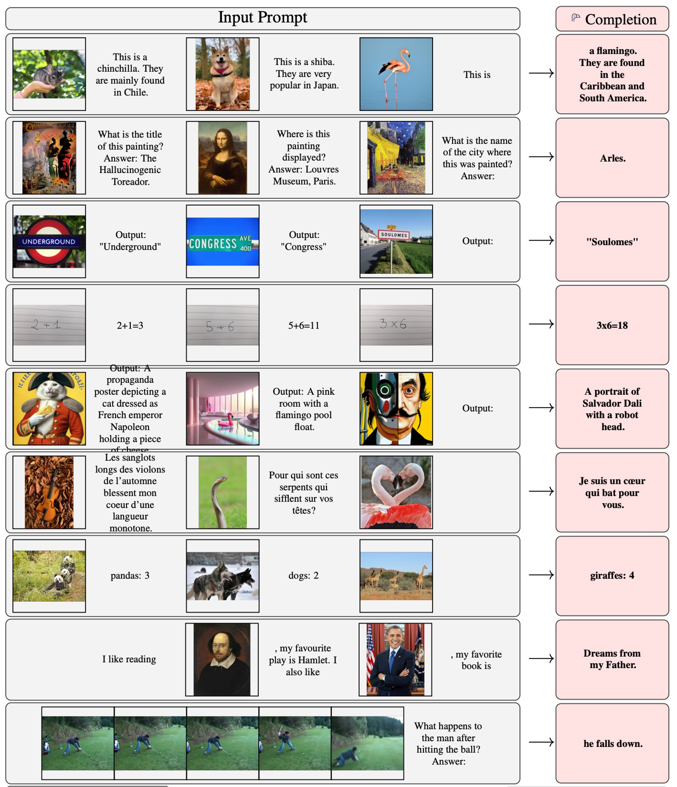
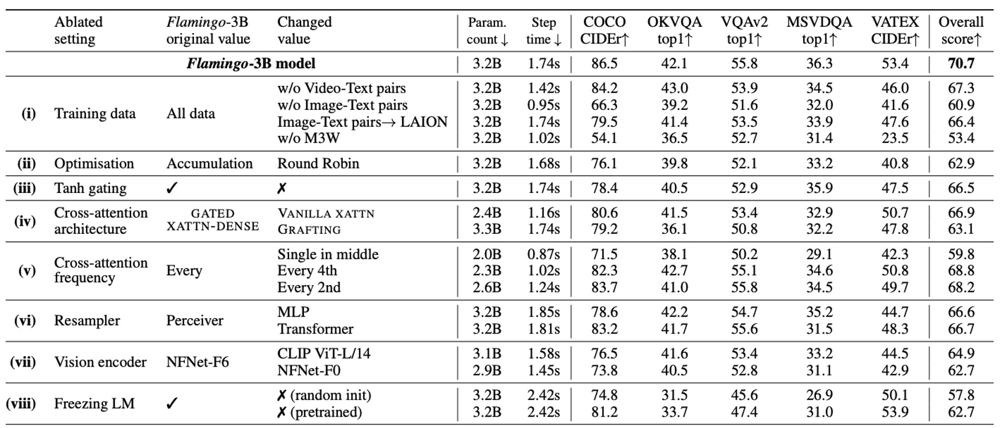

# [22.04] Flamingo

## 圖文並茂

[**Flamingo: a Visual Language Model for Few-Shot Learning**](https://arxiv.org/abs/2204.14198)

---

以前的論文流行硬湊標題，弄出個芝麻街的人物名稱，作為自己的模型名字。

現在都不演了，就直接找個喜歡的名詞就行了，如本文標題：紅鶴。

## 定義問題

近年來最有名的架構 CLIP，使用對比學習的方式，將圖像和文本嵌入空間對齊，得到了很好的效果。但是 CLIP 只能用來做圖文檢索，如果要用在開放式的任務，像是「圖像問答」或是「圖像描述生成」，就會有困難。

另一方面，GPT-3 已經在多個領域取得驚人的成績，但是 GPT-3 並不支持圖像輸入。

能不能找個方法，把這些預訓練的圖像模型和語言模型結合起來，並基於圖文交錯的輸入格式，來生成多模態的輸出呢？

## 解決問題

### 模型架構

<figure style={{"width": "90%"}}>

</figure>

上圖是 Flamingo 模型的架構示意圖，藍色的部分是預訓練模型，參數是凍結的；紫羅蘭色的部分是新加入的模塊，這些模塊要從頭開始訓練。

:::tip
這個架構給人的第一印象很像是之前我們在讀過的 Adapter 模型。

- [**[19.02] Adapter: 參數節省九成六**](../../llm-tuning/1902-adapter/index.md)
  :::

接著，我們跟著資料流的方向，來看看 Flamingo 模型的運作方式。

首先是準備輸入的圖片，這裡的範例中是一隻狗和一隻貓。這些圖片會經過一個視覺編碼器，得到一個視覺特徵向量。

視覺編碼器的部分，隨便找一個效果不錯的預訓練模型就行了，這裡作者選用預訓練的 Normalizer-Free ResNet（NFNet）。圖像經過視覺編碼器之後，得到特徵向量，輸入到感知重取樣器（Perceiver Resampler）。

在這裡，感知重取樣器的角色是降採樣和調整特徵維度，讓視覺特徵向量可以和語言模型的輸入格式對齊。經過調整後，視覺特徵轉換為固定長度為 64 的視覺標籤（visual tokens）。

:::tip
感知重取樣器的實作方式為跨注意力機制來算出指定數量的視覺標籤。
:::

---

另外一邊，也就是上圖的右手邊。

輸入的格式為交錯的圖像和文本序列，這裡的範例是：

- **\<image\> This is a very cute dog. \<image\> This is"**

把這一串圖文序列丟進語言模型，然後經過一個「交叉注意力層」，這裡作者對這個模塊做了一些改進，並取名為「GATED XATTN-DENSE」。

在這個過程中混合語言特徵和圖像特徵，最後輸出的結果為：

- **"a very cute cat."**

:::tip
整個架構非常簡單好懂，之後就是搜集足夠的資料，開始訓練模型了。
:::

### 交叉注意力層

<figure style={{"width": "90%"}}>

</figure>

剛才提到了「GATED XATTN-DENSE」，這裡我們仔細看一下這個模塊的設計。

你會發現這好像跟傳統的 Transformer decoder 架構沒什麼區別？

這裡新增的功能只有 `tanh gate` 的機制，作者有在旁邊附上實作程式碼，讓讀者可以更容易地理解這個機制。

簡單來說，tanh 在這裡用來調控「視覺特徵」要用多少權重疊加到「語言特徵」上，初始化為 0，表示不使用視覺特徵。如果在訓練過程中，模型自己發現視覺特徵對於生成文本有幫助，就會透過訓練來調整這個權重。

### 訓練數據集與策略

在訓練時，作者採用每圖像/影片注意力遮罩機制，使模型能在序列中逐一處理視覺輸入。訓練時最多使用 5 張圖像，但模型在評估中能處理最多 32 對圖像/影片和對應文本。

使用的訓練數據集包括：

- **M3W（MultiModal Massive-Web）數據集**：從約 4300 萬網頁中提取交錯的圖像與文本。
- **ALIGN 數據集**：18 億張圖像與其 alt 文本對。
- **LTIP（Long Text & Image Pairs）數據集**：312 萬張圖像及更高質量、長描述的文本對。
- **VTP（Video & Text Pairs）數據集**：2700 萬段短影片及其對應的文本描述。

目標函數最小化多數據集的加權負對數似然：

$$
\sum_{m=1}^{M} \lambda_m \cdot \mathbb{E}_{(x, y) \sim \mathcal{D}_m} \left[ -\sum_{\ell=1}^{L} \log p(y_\ell | y_{<\ell}, x_{\leq \ell}) \right],
$$

其中 $\mathcal{D}_m$ 是第 $m$ 個數據集，$\lambda_m$ 是其加權係數。

:::tip
其實就是 Cross Entropy Loss，只是同時考慮了多個數據集，因此每個數據集都有分配一個權重。
:::

## 討論

這篇論文一開始，作者就展示了大量的實驗成果，我們一起來感受一下。

### 結果展示

最一開始的那一頭紅鶴，就是這篇論文的吉祥物。

整體看來效果是很不錯的。

### 和其他模型的比較

<figure style={{"width": "90%"}}>

</figure>

Flamingo 僅使用 4 個任務範例，就可以在 16 個基準測試上，大幅超越了先前的零樣本與少樣本學習方法，展示出其在新任務上的實用性和高效性。而且隨著模型參數規模增大，少樣本學習性能顯著提升（類似於 GPT-3）。

雖然 Flamingo 訓練時僅限於每序列最多 5 張圖像，但在推論時可以從最多 32 張圖像或影片中受益，展現其靈活性。

### 微調模型

<figure style={{"width": "90%"}}>

</figure>

在擴展數據註解的情況下，通過短期微調（低學習率、解凍視覺編碼器進行高分辨率處理），Flamingo 在 5 個額外基準測試上設立新的最佳表現，包括 VQAv2、VATEX、VizWiz、MSRVTTQA 和 HatefulMemes。

在 6 個基準測試上，Flamingo 僅使用單一模型權重和 32 個任務特定範例，就超越了最佳微調方法（Fine-Tuned SotA）。

### 消融實驗

<figure style={{"width": "90%"}}>

</figure>

消融實驗在 Flamingo-3B 模型上進行，使用 DEV 基準測試的驗證子集（4-shot），評估各設計選擇的貢獻。

- **訓練數據組成的重要性**
  - 移除交錯的圖像-文本數據集 M3W，性能下降 17%。
  - 移除傳統圖像-文本配對數據集，性能下降 9.8%。
  - 移除影片-文本配對數據集，對所有影片任務性能造成負面影響。
- **梯度累積策略**
  - 梯度累積策略比 round-robin 更新策略效果更佳。
- **冷啟動 tanh 閘門的作用**
  - 移除 tanh 閘門機制，總體性能下降 4.2%，並導致訓練不穩定性。
- **條件架構的選擇**
  - 結果 GATED XATTN-DENSE 比原生交叉注意力性能更好。
- **計算/記憶體與性能的折衷**
  - 在每層插入 GATED XATTN-DENSE，性能最好但計算成本最高。
  - 在每 4 層插入，訓練速度提升 66%，性能僅下降 1.9%。
- **感知重取樣器的優勢**
  - 比較 Perceiver Resampler vs. MLP vs. Transformer。
  - 結果 Perceiver Resampler 在速度和性能上均優於其他方法。
- **視覺編碼器的選擇**
  - 比較 NFNet-F6 vs. CLIP ViT-L/14 vs. NFNet-F0。
  - 結果 NFNet-F6 的性能高於 CLIP ViT-L/14（+5.8%）和 NFNet-F0（+8.0%）。
- **凍結語言模型的必要性**
  - 從零訓練語言模型，性能下降 12.9%。
  - 微調語言模型，性能下降 8.0%，顯示出「災難性遺忘」。

## 結論

Flamingo 是一個通用型模型，適用於影像與影片任務，對特定任務的訓練數據需求極低，而且這個架構展現出靈活的互動能力，突破傳統視覺基準的限制。

作者結合了預訓練大型語言模型與強大的視覺模型，朝通用視覺理解邁出了重要一步，為之後的研究提供了相當的參考價值。

:::tip
模型幻覺、輸出冒犯語言、有讀內容、刻板印象和歧視等，這些 LLM 的通病，在這篇論文也不例外。

作者在最後的章節仍不忘提醒我們在使用時，須要注意避免這些問題。
:::
