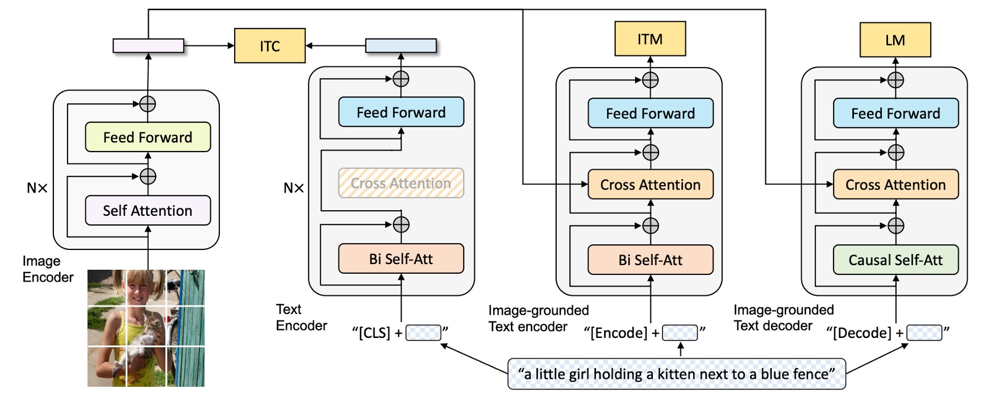
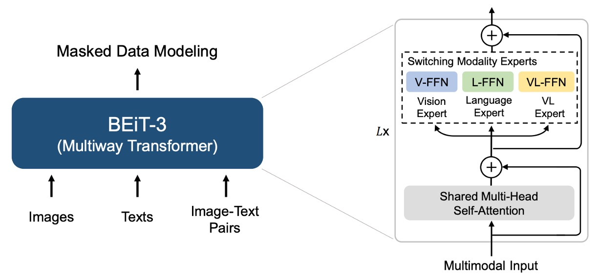

## 英雄所見略同

[**Image as a Foreign Language: BEiT Pretraining for All Vision and Vision-Language Tasks**](https://arxiv.org/abs/2208.10442)

---

大家都知道 BEiT 的經典標誌叫做「離散編碼」。

所以看到這篇論文，我們會下意識地期待 BEiT-3 會有什麼新的「離散編碼」技巧。

但實際上，BEiT-3 只是「應用」了「離散編碼」的方式在影像預訓練上，這篇論文主要想討論的主題是：**如何用一個統一的方式來處理文字、圖像與多模態的預訓練任務？**

不過緬懷一下過去的成功是人之常情，我們就不要太糾結了。

## 定義問題

把「圖像和文字一起預訓練」的想法，已經不是什麼新鮮事了。

之前常見的做法相信你也略有耳聞：一次使用好幾個預訓練任務，例如：圖文對齊（image-text matching）、圖文檢索（retrieval）、多種 mask 設計等等。

如果你不記得，我們先拿之前讀過的 BLIP 架構來看一下：

<figure style={{"width": "80%"}}>

</figure>

模型分為影像分支，文字分支等，中間透過多個任務來學習跨模態關係。這種方法雖然有效，但隨著模型和資料規模越來越大，整個訓練過程就會變得複雜、甚至難以維護或擴充。

既然影像可以變成 token，文字也可以變成 token，那為什麼我們不用一個統一的方式來處理呢？全部一起視為文字進行處理不就好了嗎？

之前的研究者肯定也想過了，但既然沒有做出什麼有效的架構，這其中顯然存在某些困難。

作者認為，我們應該用「多路徑架構」來解決這個問題。

## 解決問題

### 模型架構

<figure style={{"width": "80%"}}>

</figure>

多路徑架構，或是一個我們更常聽到的名字：混合專家系統（Mixture-of-Experts），是一種將多個專家模型組合在一起的方法。在 BEiT-3 提出之前已經有一篇將這個架構應用在多模態領域的論文：VLMo。

:::info
對 VLMo 有興趣的讀者可以閱讀：

- [**[21.11] VLMo: Unified Vision-Language Pre-Training with Mixture-of-Modality-Experts**](https://arxiv.org/abs/2111.02358)

      

      <figure style={{"width": "90%"}}>
      
      </figure>
      

在 VLMo 中，針對不同的模態有各自對應的預訓練任務，而 BEiT-3 中全部都統一採用「遮罩-預測」的方式來訓練模型。
:::

因此 BEiT-3 的架構直接參考 VLMo 的 Multiway Transformers。

每個 Multiway Transformer 模組包含一個共用的自注意力模組，以及一組前饋網路（即模態專家），用於不同的模態。根據輸入 token 的模態，使用對應的專家進行特徵計算。

在作者的實作中，每一層都包含一個視覺專家和一個語言專家；此外，最上面的三層配置了視覺-語言專家，用於融合編碼器（fusion encoders）。

使用一組模態專家能讓模型捕捉到更多針對特定模態的資訊。而共用的自注意力模組則學習不同模態間的對齊，並在多模態（如視覺-語言）任務中進行深度融合。

:::tip
**怎麼這一系列看起來像是 Switch Transformer 的 MoE？**

- [**[21.01] Switch Transformer**](../../transformers/2101-switch-transformer/index.md)

    

    <figure style={{"width": "70%"}}>
    
    </figure>
    

答對了！在 NLP 領域內，MoE 架構是 2021 年的學術熱點，而 CV 領域雖然慢了幾個月，但也很快地將這個想法應用到多模態的領域上。
:::

### 多模態適應

如上圖，作者展示了 BEiT-3 這個「共享 Multiway Transformer」架構，可以因應不同下游任務而「靈活切換」或「組合」成所需的模型形式。

- **(a) Vision Encoder (影像編碼器)**：用於各種只需要影像特徵表示的視覺任務，例如影像分類、物件偵測、實例分割，以及語義分割等。
- **(b) Language Encoder (語言編碼器)**：用於只需要文字特徵的語言任務，例如文本分類、序列標注，或結合其他模組的對話系統等。
- **(c) Fusion Encoder (融合編碼器)**：需要同時考量圖像和文本之間深度交互的任務，例如視覺問答（VQA）、視覺推理（NLVR2）、圖文推理等，需要「同時」看到圖像和文字並進行融合理解。
- **(d) Dual Encoder (雙編碼器)**：用於跨模態檢索（image-text retrieval）等需要「高效率匹配」的任務。例如從一大批候選圖像中，快速找出與特定文本最相關的那張圖像，或反過來，從一大批文本中找出與特定圖像最相關的那段文字。
- **(e) Sequence-to-Sequence Learning (影像到文字的序列生成)**：需要從影像輸入產生文字輸出的生成式任務，例如圖像描述或其他需要影像與文字轉換的應用。

不管是影像編碼、文字編碼，還是各種需要圖文融合、檢索或生成的複雜應用，都能在同一個架構之上進行配置，無須再切換成截然不同的模型。

### 預訓練任務

在 BEiT-3 的預訓練訓練過程中，模型會隨機遮罩部分文字 token 或圖像 patch，並訓練模型去恢復這些被遮罩的 token。透過這種方式來學習文字與圖像各自的表示，同時也能夠學習到圖文對應關係。

訓練時，文字資料是透過 SentencePiece tokenizer 進行分詞；圖像資料則使用 BEiT v2 的分詞器，將圖像切分成離散的視覺 token，作為重建的目標。作者隨機遮罩 15% 的單模態文字 token，並對圖文配對中的文字 token 遮罩 50%。對圖像而言，則以 BEiT 中的區塊遮罩策略，遮罩 40% 的圖像 patch。

作者透過實驗發現：只用「遮罩-預測」這個任務時，可以使用比對比式模型要小得多的預訓練批次大小。

:::tip
就是這裡用到 BEiT v2，所以這篇論文就叫做 BEiT-3 了。
:::

### 模型與訓練資料

BEiT-3 的參數量約為 19 億（1.9 B），其中，視覺專家佔 6.92 億、語言專家佔 6.92 億、視覺-語言專家佔 5200 萬，共用自注意力模組佔 3.17 億。在架構設定上參考了 ViT-giant。

整個模型包含 40 層的 Multiway Transformer。每層的隱層維度是 1408、中間層維度是 6144、注意力頭數則是 16。在每一層裡面，模型都各自有「視覺專家」與「語言專家」。此外，在最上面的三層 Multiway Transformer 中，還加入了「視覺-語言專家」，用於更深層次的跨模態融合。

BEiT-3 同時使用「單模態」與「多模態」的資料進行預訓練，單模態指只包含「純影像」或「純文字」的資料；多模態則指「圖像 + 文字」配對的資料。

多模態資料來源：總共有大約 1500 萬張圖像、2100 萬組圖文配對，資料集包括五個公開資料集：Conceptual 12M (CC12M)、Conceptual Captions (CC3M)、SBU Captions (SBU)、COCO、Visual Genome (VG)。

單模態資料則包含來自 ImageNet-21K 的 1400 萬張影像和 160GB 的文字語料，來源有英語維基百科、BookCorpus、OpenWebText3、CC-News、以及 Stories。

### 訓練策略

BEiT-3 預訓練共進行 100 萬步（steps）。每個訓練批次（batch）包含 6144 個樣本，其中包含：2048 張圖片、2048 篇文本，以及 2048 組圖文配對。

模型將影像切分成 14×14 的 patch，預訓練時採用 224×224 的解析度。圖像增強策略與 BEiT 一致，包含隨機縮放裁剪、水平翻轉，以及顏色抖動等。

文字資料的分詞器（tokenizer）採用 SentencePiece，詞彙大小是 64k。

其他超參數設定還包含以下：

- 使用 AdamW 優化器，超參數設定：$\beta_1=0.9, \beta_2=0.98, \epsilon=1e-6$。
- 學習率調度採用餘弦退火，最高學習率為 1e-3，在前 1 萬個步驟線性升到該最高學習率。
- 權重衰減設定為 0.05。
- 採用隨機深度技巧，比例為 0.1，用於減少過擬合並增強模型泛化能力。

:::tip
這個批次大小其實比許多需要做「對比學習」的模型要小得多，因為對比式模型往往需要非常大的 batch size 來進行有效的負樣本對比。
:::

## 討論

### 與其他模型的比較

<figure style={{"width": "90%"}}>

</figure>

作者在視覺-語言以及視覺任務的多個公開基準上，對 BEiT-3 進行了廣泛的評估。

BEiT-3 在多項任務上都取得了最先進（SoTA）的表現，全面超越過去其他模型，詳細彙整表格如下：

<figure style={{"width": "90%"}}>

</figure>

### 模組貢獻分析

論文中沒有提供消融實驗，我們無從從具體數據得知在這個架構中「哪個模組」才是最關鍵的角色，所以我們只好自己硬著頭皮來分析一下：

- **「龐大的資料量」是不是核心貢獻？**

  BEiT-3 透過大規模單模態與多模態資料進行預訓練，包括 14M 的 ImageNet-21K 影像、160GB 的文字資料，以及 15M 圖片/21M 圖文配對。

  大量資料確實是現今主流大模型取得高效能的一個關鍵；但論文本身「並非只強調資料量」，也沒有獨家私有資料。作者強調的並不是「多多益善」，而是「在同樣只用公開資料的前提下仍能超越先前需要私有資料的模型」。

  龐大資料提供了基礎，但並非唯一創新，論文真正的焦點還是「方法的統一性與有效性」。

---

- **專家模型的架構**

  BEiT-3 在每一層 Transformer 中，都包含 vision expert、language expert，以及在頂層加上的 vision-language expert；同時共享自注意力模組。

  這與常見的 Mixture-of-Experts (MoE) 不同，作者重點在於「多路徑但同時大部分參數共享」，並讓視覺與語言在同一套模型中做到最大程度的交互或獨立。Multiway 使得同一模型能一體多用：純視覺路徑、純文字路徑、跨模態路徑……在工程上確實帶來便利，也展現了跨任務遷移的優勢。

  但是這個「多路徑架構」的設計畢竟是來自於 VLMo 的創新，因此這個部分應該不算是 BEiT-3 的關鍵貢獻。

---

- **統一的訓練目標函數**

  作者改進以往多模態預訓練時「多任務並行」的複雜做法，轉而只用一個遮罩式預測（masked data modeling）來學到跨模態對齊。

  這個想法並非全新（BERT、BEiT 等都已採用類似 Mask-Then-Predict），但在多模態領域，很多先前模型都需要顯式的對比損失（contrastive loss）或圖文匹配（ITM）等多任務。BEiT-3 只要一個目標函數就能同時學到圖文對齊、跨模態融合；這讓大規模訓練時更「乾淨」，不需要為不同任務調整超參數或切換 batch。

  作者對「簡化預訓練任務」的堅持與成功驗證，是 BEiT-3 之所以能在多任務多模態上表現出色的重要原因，也是文章主張的核心之一。

---

- **基於 BEiT 的離散影像編碼**

  BEiT 系列使用離散視覺 token（類似 NLP 中的詞彙 token），讓影像也能直接進行「MLM」的遮罩與重建。

  這項技術本身源自早期的 BEiT v1, v2，並非 BEiT-3 這篇論文才提出的，但這次進一步證明了「圖像就像另一種語言」的可行性。透過離散化的圖像編碼，模型可用同一套 BERT-like 預訓練機制同時處理文字與圖像。

  對比以往需要 CNN 或 patch embedding 來做影像遮罩，這種「離散化圖像」的策略是 BEiT-3 一個不可或缺的底層基礎，但其創新性主要來自前作 BEiT。

---

雖然大規模資料與使用離散視覺 token 確實是支撐整體方法的基礎，但若要挑出最關鍵的貢獻，我們認為應該要歸給：「改良後的 Multiway Transformers 架構」，也就是使用「統一的遮罩式目標」來訓練模型。

作者在這裡不是單純使用「多資料」或「大參數」取勝，而是透過「簡化預訓練任務設計」與「靈活共享的多專家路徑」，成功在各種下游應用裡驗證了此方法的可行性與優勢。

## 結論

在這篇論文中，作者提出了通用的多模態基礎模型：BEiT-3。

透過將影像視為一種「外語」的概念，作者能將文字、影像，以及圖文配對都用同一種遮罩式「語言建模」方法進行訓練，並且使用 Multiway Transformers 架構，讓模型能夠在不同模態下進行靈活切換。

和現在大多數的多模態預訓練方法相比，BEiT-3 的訓練流程更簡潔，能夠更輕鬆地進行大規模擴充，是個非常吸引人的設計方式。
