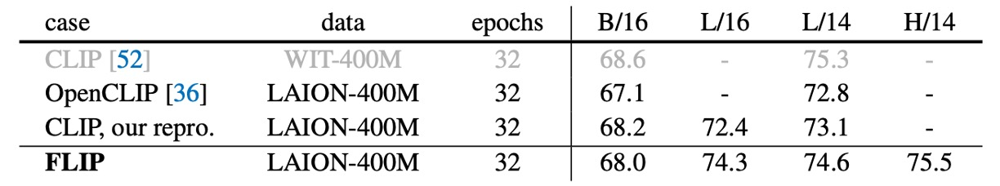
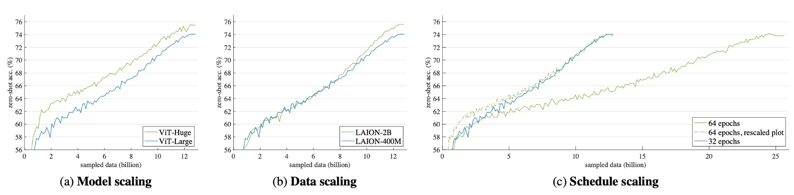

# [22.12] FLIP

## CLIP 貳之型

[**Scaling Language-Image Pre-training via Masking**](https://arxiv.org/pdf/2212.00794)

---

這篇是 Meta AI 提出的論文，主要想改一改 CLIP 的訓練方式，讓訓練過程更加高效。

## 定義問題

OpenAI 大約在 2021 年初左右，提出 CLIP 架構，之後在業界掀起一波對比學習的應用熱潮。

CLIP 簡單好用，但是不好 Train。

這裡的不好 Train，指的不是模型架構複雜，而是說訓練規模龐大。

在 CLIP 的原始論文中，他們自己建立了一個 WIP 資料集，其中涵蓋了 4 億組圖像文本對。訓練一個基本的模型，從開始到結束需要使用 592 個 V100 計算 18 天！

這樣的運算資源之於我們這種野生的工程師來說，彷若滄海之一粟，無法企及。

Meta AI 也認為這是個問題，所以他們提出了 FLIP，其意義為：Fast-CLIP。

## 解決問題

### 模型架構

<figure style={{"width": "70%"}}>

</figure>

FLIP 的架構和 CLIP 一樣，只是在訓練過程中，他們使用了一個新的方法，稱之為 Masking。

設計理念很簡單，就是既然訓練的過程中使用的 Image encoder 是 ViT 的結構，那我們就可以參考 MAE 的訓練方式，只需要用一部分的圖像就可以訓練出一個好的模型。

然後作者就這樣做了，發現效果可以和原始的 CLIP 持平，但訓練時間可以縮短 4 倍！

然後我們就開心愉快地看完這篇論文了！（~又來了！並沒有！~）

:::tip
沒看過前導論文的讀者，可以參考我們之前的閱讀筆記：

- [**[21.03] CLIP: 打碎次元的屏障**](../2103-clip/index.md)
- [**[21.11] MAE: 四分之一的線索**](../../vision-transformers/2111-mae/index.md)
  :::

### 遮罩方式

圖像遮罩的部分，作者採用了和 MAE 一樣的方式，將圖像分成不重疊的小塊，然後隨機遮罩大部分區塊。比例可以設定為 50% 或 75%。

因為遮罩的區域不會輸入到模型，所以可以在相同的記憶體需求下，使用 2 倍或 4 倍大的批次進行訓練，這是提速的一個重要原因。

在 CLIP 架構中有圖像輸入和文本輸入，但是這裡只遮罩圖像的部分，文本輸入的部分不進行遮罩。因為文本編碼器較小，對整體效能沒什麼影響，作者在消融實驗的部分會針對這個議題進行探討。

在推論的時候，可以直接使用完整的圖像，不需要調整編碼器。

### 損失函數

雖然這裡用了 MAE 的遮罩方式，但是沒有用 MAE 的重建損失。作者透過消融實驗判斷重建損失對於零樣本遷移的表現並不是必要的，取消解碼器及重建損失可以提升速度。

所以這裡從頭到尾只有對比損失，正樣本對是圖像和文本的對，負樣本對是同一批次內的其他樣本。圖像和文本編碼器的輸出經過線性層投射至相同維度的嵌入空間，兩者的餘弦相似度乘上一個可學習的溫度參數，並作為 InfoNCE loss 的輸入。

InfoNCE 的表示如下：

$$
L = -\frac{1}{N} \sum_{i=1}^{N} \log \frac{\exp(\text{sim}(v_i, t_i) / \tau)}{\sum_{j=1}^{N} \exp(\text{sim}(v_i, t_j) / \tau)}
$$

其中，$N$ 是批次大小，$v_i$ 和 $t_i$ 分別是第 $i$ 個圖像和其對應文本的嵌入向量，$\text{sim}(v_i, t_j)$ 表示 $v_i$ 和 $t_j$ 之間的餘弦相似度，$\tau$ 是可學習的溫度參數。

餘弦相似度的計算方式為：

$$
\text{sim}(v_i, t_j) = \frac{v_i^\top t_j}{\|v_i\| \|t_j\|}
$$

這個損失函數旨在最大化正樣本對之間的相似度，同時最小化與負樣本對的相似度。通過對整個批次的樣本進行計算，模型學習到如何將相關的圖像和文本嵌入到相近的向量空間中。

## 討論

到底做了什麼改進，可以提升 CLIP 的訓練速度呢？

這一章節我們主要看一下作者做了哪些工作。

### 消融實驗

1. **影像遮罩比率（Masking Ratio）**

   - 模型在 LAION-400M 上進行訓練，並在 ImageNet-1K 驗證集上評估零樣本準確率。
   - 表 (a) 研究影像遮罩比率對模型效能的影響，批次大小也相應調整以保持記憶體占用。
     - 遮罩 50% 的情況下，準確率比 CLIP 基線高出 1.2%。
     - 遮罩 75% 的準確率則與基線相當。
   - 訓練時間：遮罩 50% 和 75% 時，訓練時間分別縮短至原來的 0.50 倍和 0.33 倍。

2. **批次大小（Batch Size）**

   - 表 (b) 探討批次大小對準確率的影響。
     - 增加批次大小能穩定提升準確率，即使批次大小為 16k，遮罩 50% 的模型（68.5%）仍與不遮罩的模型準確率（68.6%）相近。
     - 遮罩可能引入正規化效果，減少過擬合的風險。
     - 當遮罩比率達 75% 且批次大小固定時，信息損失會造成性能下降。
   - 批次大小的擴展不會大幅增加記憶體需求，但實務上記憶體限制仍是瓶頸。

3. **文本遮罩（Text Masking）**

   - 表 (c) 顯示隨機遮罩 50% 文本時，準確率下降 2.2%。
     - 語言資料的信息密度高，因此不適合大比例遮罩。
     - 優先遮罩填充 token 可減少準確率下降（降幅減少至 0.4%）。
   - 文本遮罩帶來的速度提升有限，因為文本編碼器的計算量僅占總量的 4.4%。因此，在後續實驗中不再進行文本遮罩。

4. **推論階段的遮罩（Inference Unmasking）**

   - 表 (d) 顯示，即使在零樣本設置下，忽略遮罩和非遮罩之間的分佈差異，效果仍然良好。
     - 若在推論時使用遮罩，準確率會下降 7.3%。
     - 使用多重遮罩視角的集成（ensembling）方法可減少準確率下降，但仍不如直接使用完整圖像的推論。

5. **解遮罩微調（Unmasked Tuning）**

   - 表 (e) 顯示，在預訓練資料上以 0% 遮罩進行 0.32 個 epoch 的微調，可使遮罩 75% 的模型準確率提升 1.3%。
     - 解遮罩微調能有效縮小預訓練與推論之間的分佈差異。

6. **重建損失（Reconstruction Loss）**

   - 表 (f) 探討加入重建損失的影響。
     - 重建頭（reconstruction head）設計參考 MAE，使用小型解碼器重建圖像的正規化像素，並將重建損失與對比損失結合。
     - 實驗顯示，加入重建損失會小幅降低零樣本準確率及微調後的準確率。最後作者選擇捨棄重建損失，簡化系統並改善準確率。

### 與 CLIP 的比較

為了證明 FLIP 的有效性，作者將其與多種 CLIP 基線進行比較，展示 FLIP 作為 CLIP 的有力替代方案。比較對象包括：

- **原始 CLIP**：使用私有資料集 WIT-400M 訓練。
- **OpenCLIP**：在公開資料集 LAION-400M 上訓練，是原始 CLIP 的忠實重現。
- **作者 CLIP 重現版本**：同樣使用 LAION-400M 訓練，進一步幫助分析方法上的差異。

### ImageNet 零樣本遷移

<figure style={{"width": "80%"}}>

</figure>

上表比較了 ImageNet-1K 上的零樣本準確率。

- **作者 CLIP 重現版本**：準確率略高於同樣在 LAION-400M 訓練的 OpenCLIP。
- **FLIP 的表現**：使用最佳設置（批次大小 64k、遮罩比率 50%、解遮罩微調），ViT-L/14 模型達到 **74.6%** 的準確率，比 OpenCLIP 高 1.8%，比作者 CLIP 重現版本高 1.5%。
- 與原始 CLIP 相比，FLIP 仍有 0.7% 的差距，這主要可能由於不同預訓練資料集造成。

### 更多資料集上的零樣本分類

<figure style={{"width": "100%"}}>

</figure>

上表比較了多個資料集的零樣本分類結果。

使用 WIT 資料集的模型在某些任務上表現較好（如 Aircraft, Country211, SST2），而使用 LAION 資料集的模型則在 Birdsnap、SUN397 和 Cars 上更具優勢。在大多數任務上，FLIP 明顯優於 OpenCLIP 和作者 CLIP 重現版本（以綠色標示）。

### 零樣本檢索

<figure style={{"width": "100%"}}>

</figure>

上表在 Flickr30k 和 COCO 上比較圖像/文本檢索的表現。

FLIP 在所有指標上皆超越 CLIP，包括原始 CLIP。WIT 資料集在這些檢索任務上無明顯優勢。

### 模型擴展

借助 FLIP 加速訓練的能力，作者探索超越 CLIP 的最大設置，研究在三個維度上進行擴展：

1. **模型擴展（Model Scaling）**

   - 將圖像編碼器從 ViT-L 替換為 **ViT-H**，其參數量約為原來的 2 倍，文本編碼器也相應擴展。

2. **資料擴展（Data Scaling）**

   - 將預訓練資料從 **LAION-400M** 擴展至 **LAION-2B**。
   - 為分離資料量與訓練時間的影響，將總抽樣資料量固定為 **12.8B**（等於在 400M 資料上進行 32 個 epoch 或在 2B 資料上進行 6.4 個 epoch）。

3. **訓練排程擴展（Schedule Scaling）**
   - 將抽樣資料從 **12.8B** 增加至 **25.6B**（即在 400M 資料上進行 64 個 epoch）。
   - 在每次擴展實驗中，固定其他兩個軸的設置，以便觀察單一維度的效果。

實驗結果如下圖所示：

1. **模型擴展**（Fig. a）：從一開始就展現出穩定的準確率提升，儘管訓練後期的差距逐漸縮小。
2. **資料擴展**（Fig. b）：初期與基線表現相近，但隨著訓練進行，準確率逐漸提升。此設置無額外計算成本，因為總抽樣資料量被控制。
3. **訓練排程擴展**（Fig. c）：雖然訓練時間加倍，但準確率的提升有限甚至趨於平緩。虛線表示將訓練時間縮短 1/2 的對比曲線，說明延長訓練時間的邊際效益遞減。

### 遷移能力

上表詳述不同擴展策略對下游任務的影響：

- 模型擴展與資料擴展在所有指標上均優於基線，且在某些情況下有顯著提升。
- 即使不延長訓練時間，也能帶來顯著提升，說明大規模資料能提供更多信息。

上表倒數第二行顯示，模型與資料的聯合擴展在所有指標上均超越單一擴展：模型擴展提升 1.2%（74.3%→75.5%），資料擴展提升 1.5%（74.3%→75.8%），聯合擴展提升 3.3%（77.6%）。這表明更大的模型需要更多資料才能完全發揮潛力。

上表最後一行展示了模型、資料與訓練排程的全面擴展：零樣本 IN-1K 的準確率達 **78.8%**，超越 OpenCLIP 在相同公開資料上的最佳結果（78.0%）。

OpenCLIP 使用 32B 資料進行訓練，而 FLIP 只使用 25.6B 且速度快 2.5 倍，估計可節省「3,360 GPU 日」的訓練成本。這顯示出 FLIP 在大規模資料及模型上的高效能與顯著的成本優勢。

## 結論

通過一連串的消融實驗和對比分析，作者證明了 FLIP 的有效性。FLIP 在大規模資料集上訓練 CLIP 模型時，能夠顯著提升訓練速度，並在多個零樣本任務上取得更好的表現。

時間就是金錢，我們覺得應該沒有人會跟錢過不去？

你也想做一個 CLIP 嗎？這裡的 FLIP 顯然是個物超所值的選擇。
