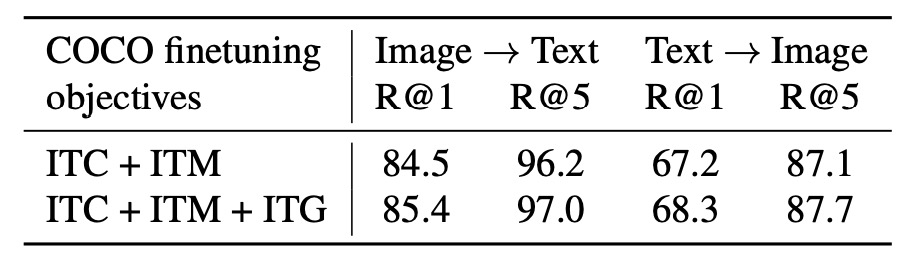

# [23.01] BLIP-2

## Q-Former 初登場

[**BLIP-2: Bootstrapping Language-Image Pre-training with Frozen Image Encoders and Large Language Models**](https://arxiv.org/abs/2301.12597)

---

這是以 BLIP 命名的第二代架構。

有別於第一代 BLIP 是多模態的工作項目，第二代 BLIP 則是專注使用少量的參數來帶動大型的預訓練模型走向我們想要的方向。

:::tip
如果沒看過 BLIP 的讀者，可以參考我們之前的文章：

- [**[22.01] BLIP: 合成文本技術**](../../multimodality/2201-blip/index.md)
  :::

## 定義問題

我們還是聚焦在 VLM 的領域上。

現階段的預訓練架構多採用大規模訓練的方式，除了需要耗費大量資源之外，應對千奇百怪的下游任務也不是每個任務都能遷移的很好。

如果我們可以直接利用訓練好的單模態 LLM，在凍結參數的前提下，進行多模態的特徵對齊，那我們就不必費這個大的力氣來重新訓練一個多模態的模型了，不是嗎！

基於這個思路，作者設計了一個輕量化的查詢式轉換器，稱為 Q-Former，作為橋樑來提取影像編碼器中的關鍵特徵，並將其轉換為語言模型可以理解的輸出。

有這種事？！讓我們來學習一下。

## 解決問題

### 模型架構

<figure style={{"width": "90%"}}>

</figure>

這個架構圖看起來有點複雜，我們依序來看看：

首先從最左邊開始，這裡輸入一張影像，經過一個預訓練的影像編碼器。這個編碼器的參數是凍結的，只負責抽取特徵，不參與訓練。

接著，右邊一整坨都是「Q-Former」模組，這是一個雙子架構，這個架構的輸入有兩個部分：

1. **可學習的查詢嵌入（Learned Query）**：這組參數隨機初始化，長度在論文中設為 32 個 token。
2. **對影像描述的文字輸入**：這跟常見的語言模型一樣，就是自然語言的描述。

上圖中的橘色，也就是 Self-Attention 的部分，直接使用預訓練的語言模型權重作為初始化參數。Q-Former 的部分經過 Self-Attention 的運算之後，會對影像編碼器輸出的特徵進行查詢，也就是說這裡的「Learned Query」，主要的工作就是對齊影像特徵與語言描述。

:::tip
也就是說，我們隨機產一組 token，先拿去對文字特徵查詢一下，再接著拿去對影像特徵查詢一下，這樣就得到了一個「混合」特徵。

最後把這個「混合」特徵拿去和文字特徵對齊一下，結束這回合。
:::

### 第一階段預訓練

<figure style={{"width": "80%"}}>

</figure>

上圖中的 Q 指的是 Query token，T 指的是 Text token，掩碼的部分會用深色標示。

在第一階段，Q-Former 與凍結的影像編碼器結合，進行基於影像-文本對的預訓練，主要優化以下三個目標函數：

1. **影像-文本匹配（Image-Text Matching, ITM）**

   這個是用來訓練「Learned Query」的目標函數，也就是上圖中的 Q 部分。

   注意力掩碼的設計如上圖所示，查詢與文本可互相觀看，並使用線性分類器進行二分類，匹配分數由所有查詢嵌入的分類結果平均計算。 訓練時會使用硬負樣本挖掘策略（hard negative mining）以生成更具挑戰性的負樣本。

2. **影像文本生成（Image-grounded Text Generation, ITG）**

   這是用來訓練 Text token 的目標函數，也就是上圖中的 T 部分。

   這裡使用多模態因果自注意力掩碼，Q 部分的 token 可以互相觀看，但 T 部分的文本 token 只可以看 Q 部分的查詢和 T 部分的「前序文本」。

   :::tip
   這裡以 `[DEC]` token 替代 `[CLS]` token，作為解碼任務的起始標誌。
   :::

3. **影像-文本對比學習（Image-Text Contrastive Learning, ITC）**

   截至剛才的兩個目標函數，一個訓練 Q 部分，一個訓練 T 部分。

   但這兩個部分所描述的是同一間是，所以我們必須把這兩個特徵也進行對齊，這個目標函數就是用來訓練這個對齊的部分。

   這裡的設計是比較正向影像-文本對與負向對的相似性，並調整查詢輸出 $ Z $ 與文本特徵 $ t $ 的對齊程度，其中 $ t $ 是 `[CLS]` token 的輸出嵌入。

   為了避免資訊洩漏，採用單模態自注意力掩碼，查詢與文本無法直接互相觀看。

### 第二階段預訓練

<figure style={{"width": "90%"}}>

</figure>

:::tip
第一階段做的事情是對齊影像特徵與語言描述，第二階段是「生成文字」的預訓練。
:::

如上圖所示，Q-Former 被接入一個凍結的大語言模型（LLM），以利用 LLM 的語言生成能力，在生成語言時，可以採用以下兩種不同的架構：

- **解碼器型**：搭配語言建模損失進行預訓練，要求 LLM 在視覺特徵的條件下生成文本。
- **編碼器-解碼器型**：使用前綴語言建模損失，將文本切分為前綴部分和後綴部分。前綴文本與視覺特徵一同作為輸入送至 LLM 編碼器，後綴文本作為 LLM 解碼器的生成目標。

:::tip
注意到這裡的 Image Encoder 是凍結的；LLM 也是凍結的，這裡的目的是利用 Q-Former 提取的視覺提示，來引導 LLM 生成文本。
:::

這裡的設計是將 Q-Former 的輸出查詢嵌入 $ Z $ 線性投影到與 LLM 文本嵌入相同的維度，並將投影後的查詢嵌入加到輸入文本嵌入的前面，作為視覺提示（soft visual prompts）。

由於 Q-Former 已被預訓練為萃取與語言相關的視覺特徵，它作為資訊瓶頸，有效濾除不相關的視覺資訊，減輕 LLM 的視覺-語言對齊負擔。

:::tip
我們之前讀過「Soft Prompts」的概念，感興趣的讀者，可以參考我們之前的文章：

- [**[21.04] Soft Prompts: 小弦切切如私語**](../../llm-tuning/2104-soft-prompts/index.md)
  :::

### 預訓練數據集

- 使用 BLIP 的預訓練數據集，共計 1.29 億張影像，包含以下來源：
  - COCO、Visual Genome、CC3M、CC12M、SBU，以及 LAION400M 數據集中篩選出的 1.15 億張影像。
- 利用 **CapFilt 方法** 生成網絡影像的合成描述：
  - 使用 BLIPlarge 生成 10 條影像描述。
  - 利用 CLIP ViT-L/14 模型計算影像-文本相似性，保留相似性排名前兩的描述作為訓練數據，每次預訓練隨機選擇一條描述。

:::tip
CapFilt 方法是 BLIP 論文中提出的一種方法，用來生成影像的描述，這裡不再贅述。
:::

### 預訓練設置

- **預訓練步數**：
  - 特徵學習階段：250,000 步。
  - 生成學習階段：80,000 步。
- **批量大小**：
  - 特徵學習：2320 (ViT-L) 或 1680 (ViT-g)。
  - 生成學習：1920 (OPT) 或 1520 (FlanT5)。
- **計算效率**：
  - 使用單台 16 × A100 (40G) 訓練：
    - 特徵學習階段（最大模型）：少於 6 天。
    - 生成學習階段（最大模型）：少於 3 天。
- **優化器與學習率**：
  - 優化器：AdamW（$ \beta_1=0.9 $，$ \beta_2=0.98 $，權重衰減 $0.05$）。
  - 學習率策略：餘弦衰減，峰值學習率 $1 \times 10^{-4}$，線性暖啟動 2000 步；第二階段的最小學習率為 $5 \times 10^{-5}$。
- **影像處理**：
  - 影像尺寸：$224 \times 224$。
  - 增強方式：隨機裁剪與水平翻轉。

## 討論

<figure style={{"width": "90%"}}>

</figure>

什麼都不說，先看看效果。

和先前最先進的模型相比，BLIP-2 實現了更高的效能，在 VLM 預訓練期間所需的可訓練參數數量大幅減少。

### Zero-shot VQA

<figure style={{"width": "90%"}}>

</figure>

作者首先測試 BLIP-2 的 Zero-shot 能力，上表是 BLIP-2 在不同的 VQA 任務上的表現，包括 VQAv2、GQA 和 OK-VQA。

評估方式：

- 使用 OPT 模型的提示為「`Question: {}` Answer:」
- 使用 FlanT5 模型的提示為「`Question: {}` Short answer:」
- 採用 beam search 生成答案，束寬為 5，並將長度懲罰設為 $-1$ 以鼓勵簡短答案。

在 VQAv2 和 GQA 上，BLIP-2 比 Flamingo80B 表現更佳，尤其在 VQAv2 上超越 8.7%，儘管參數量僅為 Flamingo80B 的 $1/54$。

在 OK-VQA 上，BLIP-2 次於 Flamingo80B，原因可能是 OK-VQA 更側重於開放世界知識，而 Flamingo80B 的 Chinchilla 語言模型 (70B) 比 BLIP-2 使用的 FlanT5XXL (11B) 擁有更多知識。

對於模型的 Zero-shot 能力，經過實驗測試，在第一階段的多模態預訓練的步驟非常關鍵。由於 Q-Former 在第一階段預訓練學習了文本相關的視覺特徵，減少 LLM 需要進行視覺語言對齊的負擔，如果移除這個步驟，那模型會出現災難性遺忘，性能隨訓練進行而大幅下降。（在 OPT 模型上有觀察到 15% 的性能下降）

### Finetune VQA

<figure style={{"width": "80%"}}>

</figure>

作者在具標註的 VQA 資料上進行微調，固定 LLM 的參數，僅微調 Q-Former 與影像編碼器的參數。

在這個任務中，BLIP-2 在開放式生成模型中達成視覺問答任務的最新水平，顯示出其在專注提取與問題相關視覺特徵的能力。

### 圖像描述生成

<figure style={{"width": "90%"}}>

</figure>

作者評估了 BLIP-2 在圖像描述生成任務上的性能，並與其他方法進行了比較。

針對圖像描述的任務，初始提示為「`a photo of`」，並使用語言建模損失進行訓練。在微調過程中，固定 LLM 的參數，僅更新 Q-Former 和影像編碼器的參數。

在 COCO 數據集上，BLIP-2 的性能達到最新水平，並在 NoCaps 驗證集上展現出對零樣本遷移的強泛化能力。

### 圖像文本檢索

<figure style={{"width": "90%"}}>

</figure>

作者在 COCO 和 Flickr30K 數據集上進行圖像-文本檢索任務的評估，並比較了不同損失對性能的影響。

BLIP-2 在零樣本圖像-文本檢索任務中實現最新水平，顯著優於現有方法。

最後作者探討了每個損失函數對結果的影響如下表：

ITC 和 ITM 損失直接學習圖像與文本的相似性，ITG 損失強化了查詢提取與文本相關的視覺特徵的能力，進一步提升視覺-語言的對齊效果。

<figure style={{"width": "80%"}}>

</figure>

### 文字圖像生成展示

<figure style={{"width": "90%"}}>

</figure>

作者展示各種零樣本圖像到文字功能的範例，包括視覺知識推理、視覺常識推理、視覺對話、個性化圖像到文字生成等。

:::tip
論文中的圖片實在太占空間，我們沒有截取整張圖片，有興趣的讀者可以參考原文。
:::

### 失敗案例

<figure style={{"width": "90%"}}>

</figure>

和過去的 LLM 一樣，模型對於之前沒看過的物品或概念，可能會出現一些奇怪的結果。此外，模型也容易將不正確的人物和概念進行不正確的關聯。這些都是未來需要改進的地方。

## 結論

Q-Former 的概念讓我們只需要用一點點參數，幾個 token 就可以引導大型的語言模型進行多模態的任務。

如果我們想要解決某個領域的問題，就可以用這種方式將大型預訓練模型的能力遷移到我們想要的方向。

:::tip
近年來，活體辨識（FAS）的研究領域，隨處可見 Q-Former 呢！
:::
