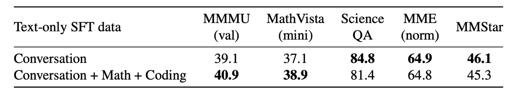

## 又叫做 BLIP-3

[**xGen-MM (BLIP-3): A Family of Open Large Multimodal Models**](https://arxiv.org/abs/2408.08872)

---

取一個論文名字也不是簡單的事情。

如果過去已經有個很成功的模型，那麼出個續集或許能夠吸引更多的關注；但是如果想要取得更大的成功，那或許該換個全新的名字。

所以作者這次表示，我全都要，把新的舊的一起放上論文標題吧！

## 定義問題

我們延續 BLIP-2 的討論。

:::tip
如果還沒看過 BLIP-2 的話，可以參考：

- [**[23.01] BLIP-2: Q-Former 初登場**](../../model-tuning/2301-blip2/index.md)
  :::

作者認為 Q-Former 架構和多樣化的訓練目標（ITM、ITC、ITG 損失）增加了大規模訓練的難度，並且 BLIP-2 僅支持單圖像輸入，無法處理最自然的多模態數據形式，例如語言和文字交錯輸入的數據格式。

那麼「交錯數據格式」在過去是怎麼被處理的呢？

這就得回過頭去看一下另外一篇很有名的論文：Flamingo。

:::tip
我們建議讀者可以先回去看看 Flamingo 的內容：

- [**[22.04] Flamingo: 圖文並茂**](../2204-flamingo/index.md)
  :::

在 Flamingo 的結構中，是透過一個交叉注意力模塊來整合圖像與文本的特徵，實現了文字和圖像交互輸入的過程，流程像是下圖這樣：

<figure style={{"width": "80%"}}>

<figurecaption>Flamingo 模型架構</figurecaption>
</figure>

---

但這篇論文的作者一方面覺得 Flamingo 的設計過於複雜，一方面又覺得 Flamingo 採用的「Perceiver Resampler」，概念上跟 Q-Former 類似，卻又更簡單！

所以這篇文章的目標是：

1. 用 Perceiver Resampler 來作為 Q-Former 的替代方案
2. 簡化 Flamingo 的跨注意力架構

最後，為了提高模型表現，作者還引入了大規模高品質數據集，以提升模型的訓練基礎。

作者希望通過改進數據、架構與訓練方法，縮小開源與私有 LMM 的差距，並通過開源資源促進研究與應用發展，使開源社群能更好地探索與發揮多模態模型的潛力。

## 解決問題

### 模型架構

<figure style={{"width": "80%"}}>

</figure>

如剛才講的，作者要把整個語言與圖像的交錯輸入結構全部整合到一個解碼器。上圖中，雪花表示這個部分是凍結參數，不參與訓練；燃燒的火焰則表示這個部分是可訓練的。

模型的主要模組為：

- **Vision Transformer (ViT)**：負責處理影像特徵。
- **Vision Token Sampler (Perceiver Resampler)**：用於壓縮影像嵌入（embeddings）。
- **預訓練大型語言模型（phi3-mini）**：作為多模態輸入的語言處理核心。

整個資料流程就是將影響特徵通過 ViT 處理後，再經過 Perceiver Resampler 壓縮，最後與語言特徵一起輸入到 phi3-mini 中。

### 訓練流程

模型架構很簡單，但訓練過程很繁瑣，分為四個階段：

- **第一階段：預訓練**

  這個階段的目標是預測下一個文本標記，基於多模態數據集的混合進行訓練。基礎模型預訓練於約 1000 億個多模態標記，影像解析度為 $384 \times 384$ 像素。

- **第二階段：監督式微調（SFT）**

  這個階段的目標是讓預訓練模型能更好地理解和遵循使用者的查詢。使用公開可用的指令式微調數據集（instruction-following datasets）進行微調，跟過去的研究一樣，採用任意解析度的影像標記採樣策略。

  :::tip
  這個部分讀者可以參考這幾篇文章：

  - [**[23.10] Improved baselines with visual instruction tuning**](https://arxiv.org/abs/2310.03744)
  - [**[24.05] What matters when building vision-language models?**](https://arxiv.org/abs/2405.02246)
  - [**[24.06] Cambrian-1: A Fully Open, Vision-Centric Exploration of Multimodal LLMs**](https://arxiv.org/abs/2406.16860)
    :::

- **交錯多影像監督式微調（Interleaved Multi-Image Supervised Fine-tuning）**

  在經指令微調的基礎模型上，進行第二階段微調，訓練模型處理多影像與單影像的交錯指令。同樣採用任意解析度的影像標記採樣策略，與先前的 SFT 階段一致。

- **後訓練（Post-training）**

  提升模型的有用性（helpfulness），同時減少幻覺（hallucination）和毒性（toxicity）。

  這個階段分為兩個子階段：

  - **第一階段：直接偏好優化（Direct Preference Optimization, DPO）**
    - 增強模型的有用性與視覺可信度（visual faithfulness）。
  - **第二階段：安全性微調（Safety Fine-tuning）**
    - 提高模型的安全性，減少潛在的有害行為。

### 預訓練訓練數據集

<figure style={{"width": "90%"}}>

</figure>

預訓練的數據集採用多模態數據集的混合，如上圖，並依照特定比例進行抽樣，內容包含：

- **多模態交錯數據集（Interleaved Dataset Mixture）**

  - MINT-1T： 規模 1 兆標記（trillion tokens）。
  - OBELICS： 由 HTML 文件組成，與 MINT-1T 在領域覆蓋和預處理方式上略有不同。

- **標註數據集（Caption Dataset Mixture）**

  - BLIP3-KALE： 大規模高品質標註數據集。
  - BLIP3-OCR-200M： 使用 OCR 引擎對 2 億高解析度圖像進行標註。

      

      <figure style={{"width": "50%"}}>
      
      </figure>
      

  - BLIP3-GROUNDING-50M： 對 5000 萬張圖像進行標註，添加對象位置資訊。

      

      <figure style={{"width": "50%"}}>
      
      </figure>
      

  - 其他公開數據集包括 Datacomp-1B、CC12M、CC3M、VG 和 SBU 等。

### 監督式微調數據集

這個階段的數據集主要包括：

- **指令式微調數據集（Instruction-Following Dataset）**
  - 來自不同領域的公開數據集，包括多模態對話、圖像標註、視覺問答、圖表/文檔理解以及科學與數學數據。
  - 加入純文本指令數據進行視覺指令微調，收集了 100 萬條公開指令數據，進行一次完整訓練（1 epoch）。
- **多影像指令微調數據集（Interleaved Multi-Image Instruction Dataset）**
  - 從單影像微調模型開始，加入多影像/交錯圖像-文本指令數據進行訓練。
  - 為防止模型在單影像能力上退化，將部分單影像數據混入多影像訓練數據中。

### 後訓練數據集

後訓練又分成兩個部分：

1. **直接偏好優化（Direct Preference Optimization, DPO）**

   使用 VLFeedback 數據集，包含 8 萬條多模態指令，篩選高分樣本生成偏好數據集（62,600 條）。訓練 1 個 epoch，使用低秩適應（LoRA）更新 LLM 背景權重的 2.5%。

   :::tip
   如果你對 LoRA 感興趣，可以參考我們之前讀過的文章：

   - [**[21.06] LoRA: 萬分之一的 LLM**](../../model-tuning/2106-lora/index.md)
     :::

2. **安全性微調（Safety Fine-tuning）**

   使用 VLGuard 數據集（包含 2000 條不安全影像和指令）。其類型包含隱私洩露、敏感話題（政治、性、暴力等）、欺騙與歧視等不安全例子。此外，為平衡安全性與有用性，隨機抽取 5000 條安全指令數據混入訓練集。

## 討論

### 預訓練模型表現

<figure style={{"width": "90%"}}>

</figure>

首先作者比較了 BLIP-3 與其他多模態模型在多個基準測試上的表現，在圖像描述（Captioning）和視覺問答（VQA）任務中，評估預訓練模型的少量樣本學習能力。

這裡主要比較零樣本（zero-shot）與少量樣本（4-shots 和 8-shots）的性能。

多模態情境學習的模型表現與同等規模的 LLMs 相當；在 OCR 的任務表現上，BLIP-3 在 TextCaps、TextVQA 和 VQA-v2 基準上顯著優於 MM1-3B，甚至超越更大型的模型（如 Idefics-9B 和 MM1-7B）。

實驗測試增加樣本數（shots）能進一步提升性能，顯示出模型適應上下文分佈的能力。

### 微調模型表現

<figure style={{"width": "90%"}}>

</figure>

作者在多模態（圖像-文本）基準測試上的全面評估，涵蓋以下能力：

- **一般視覺問答（VQA）**：評估模型回答圖像相關問題的能力。
- **視覺感知能力**：測試對影像理解和解析的能力。
- **領域知識測試**：在數學和科學相關領域的數據集表現。
- **OCR 能力**：處理文本豐富影像（如文件和圖表）的能力。
- **幻覺抑制**：減少生成不實內容的能力。

比較對象為小於 5B 的閉源模型和最先進（SOTA）開源模型。

:::tip
小於 5B 的閉源模型指的是：

- [**[24.03] MM1: Methods, Analysis & Insights from Multimodal LLM Pre-training**](https://arxiv.org/abs/2403.09611)

最新進的開源模型指的是：

- [**[23.12] Vila: On pre-training for visual language models**](https://arxiv.org/abs/2312.07533)
- [**[24.04] Phi-3 Technical Report: A Highly Capable Language Model Locally on Your Phone**](https://arxiv.org/abs/2404.14219)
  :::

實驗結果顯示 xGen-MM-instruct 在一般 VQA 和視覺感知基準測試中超越先前基線模型，表現卓越；而 xGen-MM-instruct-interleave 儘管微調於多影像數據，仍在單影像基準上保持良好表現，並獲得最高整體分數。

:::tip
`interleave` 是指微調數據的輸入格式為交錯的影像和文本，而不是單獨的影像或文本。
:::

### 預訓練數據規模

<figure style={{"width": "90%"}}>

</figure>

作者探討多模態訓練標記數量（2B 至 100B）對預訓練評估指標的影響，結果如上圖所示。

- **60B 標記**：在圖像文本描述和 OCR（Text-Caps、TextVQA）任務上顯著提升性能。
- **100B 標記**：對少量樣本評估指標（few-shot metrics）有溫和的額外增益，但效益減少。

實驗結果顯示，數據規模對性能提升有邊際效益遞減趨勢，60B 似乎是較佳的投入產出點。

### 任意解析度訓練策略

<figure style={{"width": "70%"}}>

</figure>

對於影像降採樣的策略選擇上，作者設計了三種不同的策略：

- **任意解析度（any-resolution）**：對每個影像區塊（patch）分別降採樣後輸入至 LLM，保留較多細節。
- **固定解析度（fixed-resolution）**：將所有影像調整至視覺編碼器的預設尺寸，保持原始寬高比。
- **固定採樣（anyres-fixed-sampling）**：將所有影像嵌入（embeddings）串接成一個序列，再進行統一降採樣。

實驗結果如上圖，任意解析度策略在高解析度文本豐富任務中表現最佳，顯著超越其他策略。

### 指令感知設計

<figure style={{"width": "70%"}}>

</figure>

作者為測試在圖像的降採樣過程中，加入文本指令標記是否能增強模型性能，進行了指令感知的視覺標記採樣實驗。

實驗結果如上圖，與基線模型相比，指令感知版本在基準測試中的性能差異不顯著。作者推測，感知器降採樣器的架構（僅有交叉注意力層）無法完全複製 Q-Former 的指令感知效果。

有鑒於性能差異較小，為簡化模型設計，作者最終保留原始的感知器降採樣器，並建議未來工作進一步探索指令感知 VL 連接器的改進潛力。

### 純文本數據多樣性

<figure style={{"width": "90%"}}>

</figure>

作者探討純文本數據的多樣性如何影響多模態模型的性能，特別是在多模態數學和程式碼相關基準上的表現。

實驗設計比較以下兩種純文本數據集：

- **多樣化數據**：涵蓋對話、數學、程式碼等多領域數據。
- **單一類型數據**：僅涵蓋一般對話數據。

實驗結果如上圖，增加數學與程式碼數據有助於提升相關基準（如 MathVista）的性能。對於一般 VQA 基準，影響較小。

作者分析，純文本數據的多樣性能增強特定領域的表現，而對非特定領域的任務影響有限。在多模態學習中，純文本數據仍是維持模型語言能力的重要因素。

## 結論

作者提出了一個全面性的框架 xGen-MM（BLIP-3），用於訓練一系列開源的大型多模態模型。其訓練模組基於精心設計的大規模數據集混合，展現多模態情境學習等新興能力，在多模態基準測試中取得了令人印象深刻的結果。

開源與閉源之間的競爭還是水深火熱，作者希望透過開源模型、經過整理的數據集，以及微調程式碼，為研究社群提供可訪問的多模態基礎模型與數據集，鼓勵研究人員進一步探索並推進 LMMs 的潛力與新興能力。

:::info
開源專案：[**salesforce/LAVIS**](https://github.com/salesforce/LAVIS/tree/xgen-mm)
:::
