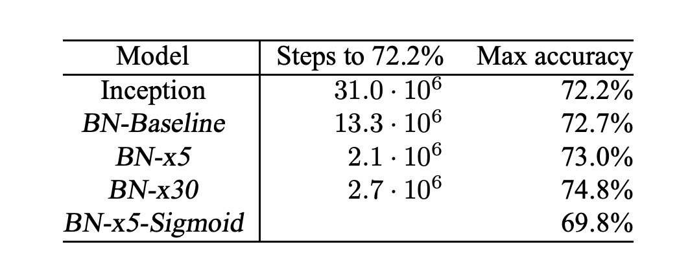

# [15.02] BatchNorm

## 批次標準化

[**Batch Normalization: Accelerating Deep Network Training by Reducing Internal Covariate Shift**](https://arxiv.org/abs/1502.03167)

---

深度學習已經在視覺、語音等多個領域取得了顯著的進展，而隨機梯度下降法（SGD）及其變體如動量（Momentum）和 Adagrad，被證明是訓練深度神經網絡非常有效的方法。這些優化算法調整網絡的參數以最小化損失，是通過在訓練過程中分步處理小批次數據來進行的。

在 SGD 的過程中，我們通常不會每次只使用一個訓練例子來更新參數，而是使用一小批數據（mini-batch）。這樣做的好處是：首先，小批次損失的梯度是對整個訓練集梯度的一個良好估計，而且隨著批次大小的增加，這種估計的質量會提高；其次，現代計算平台支持的並行計算能力使得處理整個批次的數據比多次處理單個數據更為高效。

然而，隨機梯度下降法需要精確調整諸如學習率之類的超參數，並且在訓練過程中，網絡變深時小的變化可能會被放大，導致所謂的**共變量位移（Covariate Shift）**。

:::tip
意思就是「當前的層」需要不斷適應「之前的層」參數變化所帶來的輸入分佈的改變。

舉個例子：

考慮一個帶有 sigmoid 激活函數的 $g(x) = \frac{1}{1+\exp(-x)}$ 層：

$$z = g(Wu + b)$$

其中 $u$ 是層的輸入，權重矩陣 $W$ 和偏置向量 $b$ 是待學習的參數。

當 $|x|$ 增加時，$g'(x)$ 趨向於零。這意味著除了 $x = Wu + b$ 中絕對值小的維度，梯度在流向 $u$ 時會消失，模型訓練會變慢。然而，由於 $x$ 受 $W$、$b$ 和下面所有層參數的影響，訓練期間參數的變化可能會使 $x$ 的多個維度進入非線性的飽和區，減慢收斂速度。
:::

## 定義問題

作者將內部共變量轉移定義為：

- **由於訓練過程中網絡參數的變化而導致的網絡激活分佈的變化**。

為了改進訓練，我們希望減少內部共變量轉移。通過固定層輸入 $x$ 的分佈，我們預期能加快訓練速度。

根據過去的研究，網絡訓練如果其輸入被白化，即經過線性變換以具有零均值和單位方差，且去相關，則收斂更快。由於每層輸入來自前一層的輸出，對每層輸入進行白化將是有利的。

然而，如果這些修改與優化步驟交替進行，則梯度下降步驟可能會嘗試以需要更新正規化的方式來更新參數，這減少了梯度步驟的效果。

例如，考慮一個輸入為 $u$ 的層，加上學習的偏置 $b$，並通過減去激活均值進行正規化：$\hat{x} = x - E[x]$，其中 $x = u + b$，$X = \{x_1...N\}$ 是 $x$ 的訓練集值，$E[x] = \frac{1}{N} \sum_{i=1}^N x_i$。如果梯度下降步驟忽略 $E[x]$ 對 $b$ 的依賴，則會更新 $b \leftarrow b + \Delta b$，其中 $\Delta b \propto -\frac{\partial \ell}{\partial \hat{x}}$。

那麼 $u + (b + \Delta b) - E[u + (b + \Delta b)] = u + b - E[u + b]$。因此，更新 $b$ 和隨後的正規化變化的組合導致層的輸出和損失都沒有變化。隨著訓練的繼續，$b$ 將無限增長，而損失保持不變。如果正規化不僅中心化還縮放激活，這個問題會變得更糟。

---

上述方法的問題在於梯度下降優化沒有考慮正規化的存在。

為了解決這個問題，作者希望確保，對於任何參數值，網絡總是生成具有所需分佈的激活。這樣可以使損失對模型參數的梯度考慮到正規化及其對模型參數 $\Theta$ 的依賴。

設 $x$ 為層輸入，視為向量，$X$ 為訓練數據集上的這些輸入集合。則正規化可以寫成變換：

$$
\hat{x} = \text{Norm}(x, \chi)
$$

這不僅依賴於給定的訓練樣本 $x$，還依賴於所有樣本 $\chi$。

對於反向傳播，我們需要計算

$$
\frac{\partial \text{Norm}(x, \chi)}{\partial x}
$$

和

$$
\frac{\partial \text{Norm}(x, \chi)}{\partial \chi}
$$

忽略後者會導致上述的爆炸。

在此框架下，因為需要計算協方差矩陣 $\text{Cov}[x] = E_{x \in X}[xx^T] - E[x]E[x]^T$ 及其逆平方根，以生成白化激活 $\text{Cov}[x]^{-1/2}(x - E[x])$，以及這些變換的導數以進行反向傳播。整個白化層輸入非常昂貴。這促使作者尋求一種替代方法，以可微的方式執行輸入正規化，且不需要在每次參數更新後分析整個訓練集。

:::tip
**白化 vs 標準化**

- **標準化 (Standardization)**

  標準化是數據處理中一種使數據的均值為 0、標準差為 1 的方法。這種方法通常被稱為 Z-score 正規化。其計算公式如下：

  $$
  z = \frac{(x - \mu)}{\sigma}
  $$

  其中 $x$ 是原始數據，$\mu$ 是數據的均值，而 $\sigma$ 是數據的標準差。標準化後的數據分佈將具有標準正態分佈的特性，這使得不同特徵（或不同維度）之間更容易比較和處理，尤其是在使用基於梯度的優化方法訓練模型時。

- **白化 (Whitening)**

  白化是一種更進階的數據預處理技術，目的是將輸入數據轉換成具有相同方差的新特徵，且新特徵之間彼此不相關（即特徵之間的共變異數矩陣為對角矩陣）。這不僅涉及將數據的均值歸零和方差標準化，還包括去除輸入特徵間的相關性。計算過程通常涉及以下步驟：

  1. 中心化數據（減去均值）。
  2. 計算數據的協方差矩陣。
  3. 對協方差矩陣進行特徵分解。
  4. 使用特徵值對數據進行縮放，並通過特徵向量旋轉數據，使得轉換後的特徵彼此獨立。

  白化的效果是產生一組彼此線性無關（獨立）的特徵，這在某些算法中非常有用，例如在主成分分析（PCA）和一些神經網絡模型中，可以幫助改善學習效率和結果的解釋性。

標準化主要用於將數據規範到一個共同的尺度上，廣泛適用於各種機器學習模型的訓練，特別是那些對數據尺度敏感的模型，如支持向量機（SVM）和神經網絡。而白化則進一步將特徵裝換為相互獨立，有助於去除數據中的多重共線性問題，其計算過程比標準化更為複雜，需要進行特徵分解和矩陣運算。

在實際應用中，標準化更為常見，因為它計算簡單且通常足以達到大多數模型訓練的需求。
:::

## 解決問題

由於對每層輸入進行完全白化操作的計算成本高且不完全可微分，作者做了兩個必要的簡化。

首先，我們不是對層輸入和輸出的特徵進行聯合白化，而是將每個標量特徵獨立正規化，使其具有零均值和單位方差。對於具有 $d$ 維輸入 $x = (x^{(1)}, \ldots, x^{(d)})$ 的一層，我們將每個維度正規化為：

$$
\hat{x}^{(k)} = \frac{x^{(k)} - \mathbb{E}[x^{(k)}]}{\sqrt{\mathrm{Var}[x^{(k)}]}}
$$

其中期望和方差是基於訓練數據集計算的。

需要注意的是，簡單地正規化層的每個輸入可能會改變層的表示能力。例如，對 Sigmoid 函數的輸入進行正規化會將其限制在非線性區間內。為了解決這個問題，作者在網路中插入的變換能夠表示恆等變換。為此，我們對每個激活值 $x^{(k)}$ 引入一對參數 $\gamma^{(k)}$ 和 $\beta^{(k)}$，用於縮放和平移正規化後的值：

$$
y^{(k)} = \gamma^{(k)} \hat{x}^{(k)} + \beta^{(k)}
$$

這些參數與原始模型參數一起學習，並恢復網路的表示能力。

事實上，通過設置 $\gamma^{(k)} = \sqrt{\mathrm{Var}[x^{(k)}]}$ 和 $\beta^{(k)} = \mathbb{E}[x^{(k)}]$，我們可以在最優情況下恢復原始激活值。

在基於整個訓練集的批量設定中，我們一般會使用整個訓練集來正規化激活值。然而，當使用隨機優化時，這是不切實際的。

因此，作者做了第二個簡化：在隨機梯度訓練中使用小批量，每個小批量會產生對每個激活值的均值和方差的估計。這樣，正規化所使用的統計量可以完全參與梯度反向傳播。需要注意的是，使用小批量的方式是對每個維度計算方差而非聯合協方差矩陣；在聯合情況下，會需要正則化，因為小批量的大小可能小於要白化的激活值數量，導致協方差矩陣奇異。

考慮一個大小為 $m$ 的小批量 $B$。由於正規化是對每個激活值獨立應用的，讓我們集中於一個特定的激活值 $x^{(k)}$ 並省略 $k$ 以簡化表示。我們有這個激活值在小批量中的 $m$ 個值，$B = \{x_1, \ldots, x_m\}$。

設正規化後的值為 $\hat{x}_1, \ldots, \hat{x}_m$，它們的線性變換為 $y_1, \ldots, y_m$。我們將該變換稱為 BatchNorm 變換 $BN_{\gamma, \beta}$，其過程如下。在算法中， $\epsilon$ 是一個為數值穩定性而添加到小批量方差中的常數。

在 $y = BN_{\gamma, \beta}(x)$ 的表示中，參數 $\gamma$ 和 $\beta$ 是需要學習的，但需要注意的是，BN 變換並不是獨立處理每個訓練樣本中的激活值。相反，$BN_{\gamma, \beta}(x)$ 既依賴於訓練樣本，也依賴於小批量中的其他樣本。縮放和平移後的值 $y$ 傳遞到其他網絡層。

BN 變換是一個可微分的變換，它將正規化的激活值引入網絡中。這確保了在模型訓練過程中，各層可以在顯示較少內部共變量轉移的輸入分佈上繼續學習，從而加速訓練。此外，應用於這些正規化激活值的學習仿射變換允許 BN 變換表示恆等變換並保持網絡容量。

### 提高學習率

在傳統的深度神經網絡中，過高的學習率可能導致梯度爆炸或消失，以及陷入不良的局部極小值。BatchNorm 有助於解決這些問題。通過在整個網絡中正規化激活值，它防止了參數的微小變化放大成激活值和梯度中的較大和次優變化，防止了訓練陷入非線性函數的飽和區域。

BatchNorm 還使訓練對參數規模更加穩健。通常，大學習率可能會增加層參數的規模，從而在反向傳播過程中放大梯度並導致模型爆炸。然而，有了 BatchNorm，通過一層的反向傳播不受其參數規模的影響。

對於一個標量 $a$，

$$
\mathrm{BN}(W\mathbf{u}) = \mathrm{BN}((aW)\mathbf{u})
$$

可以證明

$$
\frac{\partial \mathrm{BN}((aW)\mathbf{u})}{\partial \mathbf{u}} = \frac{\partial \mathrm{BN}(W\mathbf{u})}{\partial \mathbf{u}}
$$

$$
\frac{\partial \mathrm{BN}((aW)\mathbf{u})}{\partial (aW)} = \frac{1}{a} \cdot \frac{\partial \mathrm{BN}(W\mathbf{u})}{\partial W}
$$

比例不影響層的 Jacobi 矩陣，也不影響梯度傳播。

作者進一步推測，BatchNorm 可能使層的 Jacobi 矩陣的奇異值接近 1，這對訓練是有益的。

:::tip
考慮兩個具有正規化輸入的連續層，以及這些正規化向量之間的變換： $\hat{z} = F(\hat{x})$。

如果假設 $\hat{x}$ 和 $\hat{z}$ 是高斯分佈且不相關，並且 $F(\hat{x}) \approx J\hat{x}$ 是對給定模型參數的線性變換，則 $\hat{x}$ 和 $\hat{z}$ 都具有單位協方差，且

$$
I = \mathrm{Cov}[\hat{z}] = J\mathrm{Cov}[\hat{x}]J^T = JJ^T
$$

因此，$JJ^T = I$，所以 $J$ 的所有奇異值都等於 1，這在反向傳播過程中保持了梯度的大小。

實際上，變換不是線性的，正規化值也不保證是高斯分佈或獨立的，但作者仍然期望 BatchNorm 有助於改善梯度傳播，該算法對梯度傳播的具體影響仍需進一步研究。
:::

### 不需要 Dropout

在使用 BatchNorm 訓練時，一個訓練樣本是與小批量中的其他樣本一起被觀察的，訓練網絡不再對給定的訓練樣本產生確定性值。在作者的實驗中，發現這種效果對網絡的泛化有利。雖然 Dropout 通常用於減少過擬合，但有 BatchNorm 之後，Dropout 可以被移除。

## 討論

### 在 MNIST 實驗

為了驗證內部共變量轉移對訓練的影響以及 BatchNorm 抵禦它的能力，作者在 MNIST 數據集上預測數字類別的問題。

這裡使用了一個非常簡單的網絡，輸入為 28x28 的二進制圖像，並設有 3 個隱藏層，每層有 100 個激活值。每個隱藏層計算 $y = g(Wu + b)$，其中 $g$ 是 Sigmoid 非線性函數，權重 $W$ 初始化為小的隨機高斯值。

最後一個隱藏層後面是具有 10 個激活值（每個類別一個）的全連接層，並使用交叉熵損失。這裡將網絡訓練了 50000 步，每個小批量包含 60 個樣本。最後在網絡的每個隱藏層中添加了 BatchNorm，。

上圖顯示了隨著訓練進行，兩個網絡在保留測試數據上的正確預測比例，BatchNorm 網絡的測試準確率更高。在上圖(b,c)中，展示了每個網絡最後一個隱藏層中一個典型激活值的分佈如何演變。原始網絡中的分佈隨時間顯著變化，不論是均值還是方差，這使後續層的訓練變得複雜。相比之下，BatchNorm 網絡中的分佈在訓練過程中更加穩定，有助於訓練。

### 在 ImageNet 實驗

作者接著將 BatchNorm 應用到一個新的 Inception 網絡變體，並在 ImageNet 分類任務上進行了訓練。

實驗評估了幾個帶有 BatchNorm 的 Inception 修改版本。在所有情況下，BatchNorm 都應用於每個非線性函數的輸入，其餘架構不變。

僅僅將 BatchNorm 添加到網絡中並不能充分利用這個方法。為此，作者進一步改變了網絡及其訓練參數：

- **增加學習率**：在 BatchNorm 模型中，我們能夠通過更高的學習率實現訓練速度的提升，且沒有副作用。
- **移除 Dropout**：如前述，BatchNorm 達到了與 Dropout 相同的目標。從修改後的 BatchNorm Inception 中移除 Dropout 可以加速訓練，且不會增加過擬合。
- **減少 L2 權重正則化**：在 Inception 中，模型參數上的 L2 損失控制了過擬合，但在修改後的 BatchNorm Inception 中，這種損失的權重減少了 5 倍。
- **加速學習率衰減**：在訓練 Inception 時，學習率是指數衰減的。由於 BatchNorm 網絡訓練速度比 Inception 快，作者將學習率降低速度加快了 6 倍。
- **移除局部響應正規化**：雖然 Inception 和其他網絡受益於此，但使用 BatchNorm 後並不需要。
- **更徹底地打亂訓練樣本**：作者啟用了訓練數據在片段內的打亂，防止相同的樣本總是出現在同一個小批量中。這導致驗證準確率約提高 1%，這與將 BatchNorm 視為正則化器的觀點一致。
- **減少光度失真**：由於 BatchNorm 網絡訓練速度更快，並且每個訓練樣本觀察次數更少，我們讓訓練器專注於更多「真實」圖像，從而減少了對它們的扭曲。

作者共評估了以下網絡，所有網絡都在 LSVRC2012 訓練數據上訓練，並在驗證數據上進行測試：

- **Inception**：一開始所描述的架構，初始學習率為 0.0015。
- **BN-Baseline**：與 Inception 相同，但在每個非線性函數之前進行 BatchNorm。
- **BN-x5**：帶有 BatchNorm 的 Inception。初始學習率提高了 5 倍，達到 0.0075。同樣的學習率提高使原始 Inception 的模型參數達到機器極限。
- **BN-x30**：類似於 BN-x5，但初始學習率為 0.045（是 Inception 的 30 倍）。
- **BN-x5-Sigmoid**：類似於 BN-x5，但使用 Sigmoid 非線性函數 $g(t) = \frac{1}{1+\exp(-x)}$，而不是 ReLU。作者這邊也嘗試過用 Sigmoid 訓練原始 Inception，但模型準確率始終相當於隨機。

在上圖中展示了隨訓練步數變化的網絡驗證準確率。Inception 在 3100 萬訓練步後達到 72.2%的準確率。下表顯示了每個網絡達到相同 72.2%準確率所需的訓練步數，以及網絡達到的最高驗證準確率和達到它所需的步數。

僅使用 BatchNorm（BN-Baseline），在不到一半的訓練步數內達到了 Inception 的準確率。BN-x5 比 Inception 需要少 14 倍的步數來達到 72.2%的準確率。有趣的是，進一步提高學習率（BN-x30）使模型初期訓練速度稍慢，但允許它達到更高的最終準確率。在 600 萬步後達到 74.8%，即比 Inception 達到 72.2%所需的步數少 5 倍。

另外，作者還驗證了內部共變量轉移的減少使得帶有 BatchNorm 的深層網絡可以在「使用 Sigmoid 作為非線性函數時進行訓練」，BN-x5-Sigmoid 達到了 69.8%的準確率。

:::tip
大家都知道使用 Sigmoid 訓練網絡無比困難，在沒有 BatchNorm 的情況下，使用 Sigmoid 的 Inception 從未超過 1/1000 的準確率。
:::

## 結論

BatchNorm 主要通過對每個批次的數據進行標準化來解決內部協方差偏移問題。這種方法不僅穩定了學習過程，還允許使用更高的學習率，從而顯著加快了模型訓練的速度，能夠在訓練過程中起到正則化的作用，幫助減少過擬合現象。

然而，這種技術的效果高度依賴於批次的大小。對於較小的批次，標準化的穩定性會降低，有時還會引發數值穩定性問題，特別是當數據分佈靠近極端值時，之前也引發過 RepVGG 無法量化的問題：

- [**[22.12] QARepVGG: 讓 RepVGG 再次偉大**](../../reparameterization/2212-qarepvgg/index.md)

最後，在訓練與推理階段，BatchNorm 的行為存在差異，這是工程師常會踩到的坑。訓練時使用的是當前批次的統計數據，而在推理時則通常使用整個訓練數據集的全局統計數據，這種差異可能會導致模型在訓練時與推理時的表現不完全一致。

在實際應用中，我們在使用 BatchNorm 時需謹慎考量這些因素，讓模型能夠更好地適應不同的場景。
