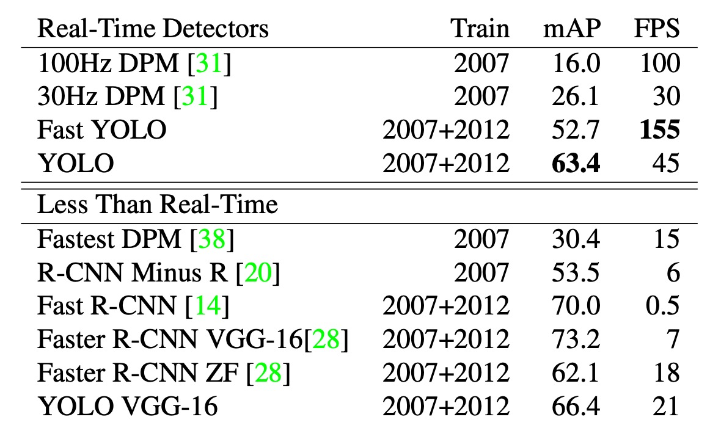

## 只要看一次

[**You Only Look Once: Unified, Real-Time Object Detection**](https://arxiv.org/abs/1506.02640)

---

在物件偵測系統中，通常將整個流程拆分為兩個主要步驟：區域提議（region proposal）和分類。

1. **區域提議**：

   這一步驟的目的是產生潛在的物體候選框。

   例如 R-CNN，會使用選擇性搜尋（Selective Search）來產生數千個候選區域。更先進的方法例如 Faster R-CNN，使用區域提議網路（RPN）來產生這些候選框，試圖透過端到端的方式優化這個過程。儘管這種方法效率更高，但仍需要在影像上多次運行神經網路。

2. **分類**：

   在區域提議之後，分類器將逐一處理每個候選框，確定其包含的物件類別。例如，在 R-CNN 中，卷積神經網路會對每個候選區域提取特徵，然後使用支持向量機進行分類。這種逐一處理的方式雖然在準確性上有一定的優勢，但由於每個候選區域都需要單獨處理，因此速度偏慢。

## 定義問題

上述流程的主要問題在於其處理速度。每個候選區域都需要單獨提取特徵並進行分類，這導致了巨大的計算開銷和時間消耗。這也正是本論文所要解決的核心問題：能否將這兩個步驟合併，讓系統只要看一次影像就能找出物體？

YOLO 透過將物件偵測問題重新定義為單一的迴歸問題，直接從輸入影像像素到邊界框座標和類別機率進行預測。這種方法的主要優點在於：

- **一次性處理**：YOLO 的神經網路在一次前向傳播中就能完成整個物體偵測過程，不再需要多次處理影像。這樣不僅大幅提高了偵測速度，也簡化了偵測流程。
- **全局推理**：由於 YOLO 在訓練和預測時都考慮了整個圖像，因此它能利用全局上下文信息，提高檢測精度。
- **即時效能**：YOLO 模型的設計使其在速度和精度之間達到了良好的平衡，能夠實現即時檢測。

YOLO 的設計在維持原有效能的同時，實現了更快的檢測速度，這使得它成為一種非常實用的物體偵測方法。

## 解決問題

### 模型架構

:::tip
這個看似被裁切的圖片，我們猜測是為了致敬 AlexNet。
:::

---

為了讓區域提議和分類系統合併，作者提出了以上的模型架構。

經過一個 Backbone 之後，取出最後一層的特徵圖，然後經過一個全連接層。

其實前面的 Backbone 用什麼模型都可以，作者在論文中提到他們使用了 Darknet-19，這是他們自己設計的一個網路架構，訴求是快速和準確。

全連接層的作用是統整特徵圖的資訊，接著將預測結果投影到預測頭上。

這個預測頭有經過作者的精心設計，你可以看到上圖中，預測頭的尺寸是 7x7x30，這裡的 7x7 是指將預測頭對應回原圖的尺寸中，切分成 7x7 的格子，如下圖所示：

---

每個格子都要做幾件事情：

1. 預測兩個邊界框，每個框對應了物件的位置，格式為 `(x, y, w, h)`，這裡的 `(x, y)` 是格子的中心，`w` 和 `h` 是物件的寬和高。
2. 預測物件的類別，這裡作者使用了 20 類物件，所以每個格子要預測 20 個類別。

於是論文中設定了幾個超參數：

1. `S`: 每個邊上有幾個格子，這裡是 7。
2. `B`: 每個格子要預測幾個邊界框，這裡是 2。
3. `C`: 類別的數量，這裡是 20。

### 損失函數

這樣預測結果肯定會有大量的重疊。

接著作者提出了一個損失函數，這個損失函數是由幾個部分組成的：

$$
λ_{coord} \sum_{i=0}^{S^2} \sum_{j=0}^{B} 1_{obj}^{ij} \left[ (x_i - \hat{x}_i)^2 + (y_i - \hat{y}_i)^2 \right]
$$

$$
+ λ_{coord} \sum_{i=0}^{S^2} \sum_{j=0}^{B} 1_{obj}^{ij} \left[ \left( \sqrt{w_i} - \sqrt{\hat{w}_i} \right)^2 + \left( \sqrt{h_i} - \sqrt{\hat{h}_i} \right)^2 \right]
$$

$$
+ \sum_{i=0}^{S^2} \sum_{j=0}^{B} 1_{obj}^{ij} \left( C_i - \hat{C}_i \right)^2
$$

$$
+ λ_{noobj} \sum_{i=0}^{S^2} \sum_{j=0}^{B} 1_{noobj}^{ij} \left( C_i - \hat{C}_i \right)^2
$$

$$
+ \sum_{i=0}^{S^2} 1_{obj}^{i} \sum_{c \in \text{classes}} \left( p_i(c) - \hat{p}_i(c) \right)^2
$$

---

這個損失函數由五個主要部分組成，每個部分對模型的預測有不同的貢獻：

1. **坐標損失（Coordinate Loss）**

   $$
   λ_{coord} \sum_{i=0}^{S^2} \sum_{j=0}^{B} 1_{obj}^{ij} \left[ (x_i - \hat{x}_i)^2 + (y_i - \hat{y}_i)^2 \right]
   $$

   這部分損失衡量預測邊界框中心點（$x$ 和 $y$）與真實值的差距。$λ_{coord}$ 是一個權重因子，用來調節坐標損失在整個損失函數中的影響。指示函數 $1_{obj}^{ij}$ 表示只有在單元格 $i$ 和邊界框 $j$ 包含物體時，這部分損失才會計算。

2. **尺寸損失（Size Loss）**

   $$
   λ_{coord} \sum_{i=0}^{S^2} \sum_{j=0}^{B} 1_{obj}^{ij} \left[ \left( \sqrt{w_i} - \sqrt{\hat{w}_i} \right)^2 + \left( \sqrt{h_i} - \sqrt{\hat{h}_i} \right)^2 \right]
   $$

   這部分損失衡量預測邊界框的寬度（$w$）和高度（$h$）的差距。使用平方根是為了減少大邊界框和小邊界框之間的損失差異，這樣可以使得大框和小框在損失上更加均衡。權重因子和指示函數與坐標損失相同。

   :::tip
   **這跟平方根有什麼關係？**

   假設我們有兩個邊界框的預測和真實值如下：

   1. 小邊界框：

      - 真實值：$w = 2$, $h = 2$
      - 預測值：$\hat{w} = 3$, $\hat{h} = 3$

   2. 大邊界框：
      - 真實值：$w = 200$, $h = 200$
      - 預測值：$\hat{w} = 300$, $\hat{h} = 300$

   不使用平方根的情況下，尺寸損失（僅考慮寬度）為：

   $$
   \text{小邊界框損失} = (w - \hat{w})^2 = (2 - 3)^2 = 1
   $$

   $$
   \text{大邊界框損失} = (w - \hat{w})^2 = (200 - 300)^2 = 10000
   $$

   可以看到，大邊界框的損失遠遠大於小邊界框的損失。

   使用平方根的情況下，尺寸損失（僅考慮寬度）為：

   $$
   \text{小邊界框損失} = (\sqrt{w} - \sqrt{\hat{w}})^2 = (\sqrt{2} - \sqrt{3})^2 \approx 0.1716
   $$

   $$
   \text{大邊界框損失} = (\sqrt{w} - \sqrt{\hat{w}})^2 = (\sqrt{200} - \sqrt{300})^2 \approx 1.832
   $$

   使用平方根後，兩者的損失差距大大縮小。這樣的設計是為了避免大邊界框對總損失的影響過大，從而使得損失函數對不同大小的邊界框更加公平。
   :::

3. **置信度損失（Confidence Loss）**

   $$
   \sum_{i=0}^{S^2} \sum_{j=0}^{B} 1_{obj}^{ij} \left( C_i - \hat{C}_i \right)^2
   $$

   這部分損失衡量預測的邊界框包含物體的置信度（$C$）與真實置信度的差距。只有在單元格 $i$ 和邊界框 $j$ 包含物體時，這部分損失才會計算。

4. **非物體置信度損失（No Object Confidence Loss）**

   $$
   λ_{noobj} \sum_{i=0}^{S^2} \sum_{j=0}^{B} 1_{noobj}^{ij} \left( C_i - \hat{C}_i \right)^2
   $$

   這部分損失衡量預測的邊界框不包含物體的置信度與真實置信度的差距。這裡使用了不同的權重因子 $λ_{noobj}$ 來減少這部分損失的影響，以避免過多懲罰預測非物體的邊界框。

5. **分類損失（Class Probability Loss）**
   $$
   \sum_{i=0}^{S^2} 1_{obj}^{i} \sum_{c \in \text{classes}} \left( p_i(c) - \hat{p}_i(c) \right)^2
   $$
   這部分損失衡量預測的分類概率 $p_i(c)$ 與真實分類概率的差距。只有在單元格 $i$ 包含物體時，這部分損失才會計算。

### 推論場景

由於每個格子都有兩個邊界框，所以每次我們都會得到 $S^2 \times B$ 個邊界框。在推論階段，這裡採用非極大值抑制（Non-Maximum Suppression）的方法，來過濾掉重疊的邊界框。

非極大值抑制（Non-Maximum Suppression, NMS）是一種後處理技術，用於過濾對象檢測算法（如 YOLO 或 SSD）中的多個重疊的候選框，以保留最具置信度的邊界框。

簡單來說，檢測步驟如下：

1. **輸入：** 一組邊界框及其對應的置信度得分。
2. **排序：** 根據置信度得分對邊界框進行排序。
3. **選擇：** 選擇置信度最高的邊界框，並將其作為最終保留的框。
4. **抑制：** 刪除與該框重疊程度（IOU，Intersection over Union）超過某個閾值的其他邊界框。
5. **重複：** 重複步驟 3 和步驟 4，直到所有的框都被處理。

舉個例子：假設有以下四個檢測框，它們的置信度得分和坐標如下：

| 邊界框 | 置信度 | (x1, y1) | (x2, y2)   |
| ------ | ------ | -------- | ---------- |
| A      | 0.9    | (10, 20) | (50, 60)   |
| B      | 0.75   | (12, 22) | (48, 58)   |
| C      | 0.6    | (15, 25) | (55, 65)   |
| D      | 0.5    | (60, 70) | (100, 110) |

#### 步驟 1：排序

根據置信度得分對邊界框進行排序：

1. A (0.9)
2. B (0.75)
3. C (0.6)
4. D (0.5)

#### 步驟 2 和 3：選擇和抑制

- **選擇**：置信度最高的邊界框 A，將其作為最終保留的框。

- **抑制**：與 A 重疊的框：
  - 計算 A 與 B 的 IOU。如果 IOU > 閾值（如 0.5），則刪除 B。
  - 計算 A 與 C 的 IOU。如果 IOU > 閾值，則刪除 C。
  - 計算 A 與 D 的 IOU。由於 D 與 A 沒有重疊（IOU = 0），不刪除 D。

假設 A 與 B 的 IOU 為 0.7，A 與 C 的 IOU 為 0.6，這些值均超過閾值 0.5，所以刪除 B 和 C。

#### 重複步驟 3 和步驟 4

剩餘的邊界框為 A 和 D：

- **選擇**：置信度次高的邊界框 D，將其作為最終保留的框。
- **抑制**：由於沒有其他框剩餘，跳過這一步。

通過非極大值抑制，我們從初始的四個邊界框中保留了兩個，即 A 和 D，從而有效消除了重疊的檢測框，僅保留置信度最高且重疊最小的邊界框。透過這種方式，可以提高檢測結果的準確性和可靠性。

## 討論

### 推論速度

在物體檢測領域，加速檢測流程是許多研究的重點，上表示在 PASCAL VOC 2007 上的速度和精度的比較。

YOLO 相比 DPM 的 GPU 實作更具優勢，能在 30Hz 或 100Hz 下運行。Fast YOLO 在 PASCAL 上是最快的物體檢測方法，達到 52.7%的 mAP，比之前的即時檢測準確率高出一倍多。

YOLO 進一步提升至 63.4%的 mAP，仍能保持即時效能。雖然使用 VGG-16 訓練的 YOLO 模型更準確，但速度較慢，因此本文重點在於更快的模型。

相比之下，DPM 的即時效能下降兩倍，R-CNN 和 Fast R-CNN 仍未達到即時要求，而 Faster R-CNN 雖然準確性高，但速度比 YOLO 慢 6 倍。

### 和其他方法的比較

為了進一步檢查 YOLO 與最先進檢測器之間的差異，作者在 VOC 2007 數據集上進行了詳細分類分析，該數據集的檢測結果是公開的。

在測試過程中，他們查看了每個類別的前 N 個預測，並將每個預測分類如下：

- **正確（Correct）**：正確的類別且 IOU > 0.5
- **定位錯誤（Localization）**：正確的類別但 IOU 在 0.1 到 0.5 之間
- **相似（Similar）**：類別相似且 IOU > 0.1
- **其他（Other）**：類別錯誤但 IOU > 0.1
- **背景（Background）**：對任何物體的 IOU < 0.1

上圖顯示了所有 20 個類別中每種錯誤類型的平均分佈。

- **作者發現 YOLO 在正確定位物體方面存在困難。**

YOLO 的錯誤中，定位錯誤的比例超過了所有其他錯誤類型的總和。相比之下，Fast R-CNN 的定位錯誤明顯更少，但背景錯誤更多。實驗結果表明，13.6%的 Fast R-CNN 頂級檢測是不包含任何物體的誤報，其背景檢測的誤報率幾乎是 YOLO 的三倍。

雖然 YOLO 在快速檢測方面具有優勢，但在精確定位物體方面存在挑戰。而 Fast R-CNN 在定位上表現更好，但容易將背景誤判為物體。這顯示了兩者在準確性和錯誤類型上的不同特性，突出了各自的優缺點。

### 模型限制

YOLO 對邊界框預測施加了很強的空間約束，因為每個網格單元只能預測兩個框並且只能有一個類別。這種空間限制限制了模型可以預測的附近物體的數量。

作者指出，模型在處理成群出現的小物體（例如鳥群）時會遇到困難。由於模型從資料中學習預測邊界框，因此它很難推廣到新的或不尋常的縱橫比或配置的物件。

此外，YOLO 使用相對粗糙的特徵來預測邊界框，因為其架構中包含多次輸入影像的下取樣。這意味著，模型在處理邊界框時的細節可能不足，尤其是對小物體的預測。

作者也提到，在訓練接近偵測效能的損失函數時，YOLO 的損失函數對小邊界框和大邊界框的錯誤處理相同。大邊界框中的小錯誤通常影響不大，但小邊界框中的小錯誤對 IOU 的影響要大得多，最終導致模型難以精確地定位物體。

## 結論

YOLO 是一種創新的目標偵測方法，透過將偵測問題視為單一的迴歸問題，直接從影像像素預測邊界框和類別機率，實現了端到端最佳化。

這個統一模型不僅大幅提升了偵測速度，使基礎 YOLO 模型能以每秒 45 幀的速度即時處理影像，且在準確性上也表現出色。

儘管在精確定位小物體方面存在一些挑戰，YOLO 依然在多種檢測任務中表現出強大的泛化能力，為未來的即時偵測技術發展奠定了堅實基礎。
