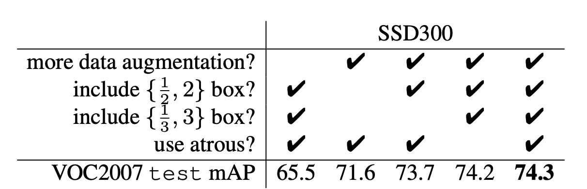
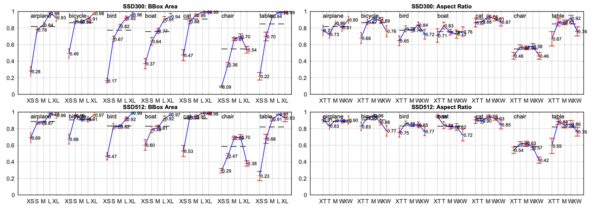

# [15.12] SSD

## 省時省力省池化

[**SSD: Single Shot MultiBox Detector**](https://arxiv.org/abs/1512.02325)

---

Faster RCNN 依然是業界的標竿。

最常看到的標準作業流程大概是這樣：

1. 邊界框提議（Bounding Box Proposal）：使用 RPN 產生候選框。
2. 對每個框重新取樣特徵（ROI Pooling）
3. 送進分類器進行分類

## 定義問題

這些方法很準，但是計算量還是太大，特別對於一些嵌入是系統來說，即使用最快的檢測器 Faster RCNN，也大概只能達到 7 FPS。

作者認為效率瓶頸在於對每個候選框都要進行特徵提取和分類，或許......

我們可以省略這個步驟。

## 解決問題

### 模型架構

為了解決這個問題，作者提出了 SSD 架構，上圖是 SSD 和 YOLO-v1 的比較圖。

可以看到在 SSD 的設計中，完全捨棄了區域提議的步驟，改成直接從每個特徵圖的像素進行預測。

這個圖看起來可能比較抽象，我們分解一下：

1. 首先使用 VGG 作為 Backbone，取出最 1/8 尺度特徵圖，尺寸是 $38 \times 38$。

   這裡直接讓每個像素都預測「檢測框」，搭配不同的長寬比，共預測 4 個檢測框。

   所以在這一層會預測 $38 \times 38 \times 4$ 共 $5776$ 個檢測框。

   :::tip
   在上圖中，你會看到輸出尺寸為 $38 \times 38 \times 4 \times (\text{Classes}+4)$，這裡的 $\text{Classes}+4$ 表示每個檢測框預測的是「物體類別」(可能有 21 類或更多)和「邊界框」（Cx, Cy, W, H）。
   :::

---

2. 接著對特徵圖做降採樣，得到 $19 \times 19$ 的特徵圖。

   這裡跟上面不一樣，而是要預測 6 個檢測框，所以這一層會預測 $19 \times 19 \times 6$ 共 $2166$ 個檢測框。

---

3. 接著再做一次降採樣，得到 $10 \times 10$ 的特徵圖。

   這裡預測 6 個檢測框，所以這一層會預測 $10 \times 10 \times 6$ 共 $600$ 個檢測框。

---

4. 接著在做一次降採樣，得到 $5 \times 5$ 的特徵圖。

   這裡預測 6 個檢測框，所以這一層會預測 $5 \times 5 \times 6$ 共 $150$ 個檢測框。

---

5. 接著再做一次降採樣，得到 $3 \times 3$ 的特徵圖。

   這裡預測 4 個檢測框，所以這一層會預測 $3 \times 3 \times 4$ 共 $36$ 個檢測框。

---

6. 最後再做一次降採樣，得到 $1 \times 1$ 的特徵圖。

   這裡預測 4 個檢測框，所以這一層會預測 $1 \times 1 \times 4$ 共 $4$ 個檢測框。

---

全部加起來：$5776 + 2166 + 600 + 150 + 36 + 4 = 8732$ 個檢測框。

:::tip
這不是我們在湊字數啊，因為看到論文中出現 $8732$ 這個數字，我們也好奇這是怎麼來的，所以就順手算了一輪。

在之後的研究中通常只會用到 1/8、1/16、1/32 這三層特徵圖，像 SSD 這樣一路用到 1/256 的特徵圖是比較少見的。
:::

### 正負樣本匹配策略

在訓練期間，我們需要確定每個真實標記框對應的預測。

每個真實標記框需要從多個預測框中進行選擇，這些預測框會在不同位置、不同長寬比和不同尺度上排列。也就是說，預測框具有各種變化，以便涵蓋圖像中各種形狀和大小的物體。

在這裡，作者通過計算 **Jaccard 重疊度**（即交集與並集的比值，通常稱為 IoU, Intersection over Union）來決定哪些預測框與真實標記框匹配。

對於每個真實標記框，首先找到 IoU 最高的預測框，這樣能確保每個真實標記框至少有一個匹配的預測框。這一步是為了確保網路可以學習到如何正確地預測邊界框，因為每個真實標記框都有一個預測框與其匹配。

與過去的研究方法不同，SSD 在第一步匹配完成後，還會將所有 IoU 大於 0.5 的預測框與相應的真實標記框匹配。這種匹配策略的優點是它簡化了學習問題，允許網路對多個重疊的預測框進行預測，而不是強制網路只針對 IoU 最高的一個框進行預測。

這樣，當存在多個合適的預測框時，網路能夠更靈活地進行學習，提高預測的準確性。

### 訓練目標

SSD 的訓練目標基於 MultiBox 的目標函數，但進一步擴展為能處理多個物體類別。

- [**[13.12] Scalable Object Detection using Deep Neural Networks**](https://arxiv.org/abs/1312.2249)

具體來說，設 $x_{pij} = \{1, 0\}$ 為一個指示變數，表示第 $i$ 個預測框是否匹配第 $j$ 個屬於類別 $p$ 的真實標記框。在 SSD 的匹配策略中，每個真實框可以匹配多個預測框，因此 $\sum_i x_{pij} \geq 1$。

SSD 的總損失函數由**定位損失**（localization loss, $L_{loc}$）和**置信損失**（confidence loss, $L_{conf}$）的加權和組成：

$$
L(x, c, l, g) = \frac{1}{N}(L_{conf}(x, c) + \alpha L_{loc}(x, l, g))
$$

其中，$N$ 是匹配的預測框數量，若 $N=0$ 則損失設為 0。參數 $\alpha$ 通過交叉驗證設為 1。

- **定位損失（Localization Loss）**

  定位損失用 **Smooth L1 損失**來衡量預測的邊界框（$l$）與真實標記框（$g$）之間的差異。與 Faster R-CNN 類似，對預測框的中心點 $(cx, cy)$ 以及寬度 $(w)$ 和高度 $(h)$ 進行回歸，公式如下：

  $$
  L_{loc}(x, l, g) = \sum_{i \in Pos} \sum_{m \in \{cx, cy, w, h\}} x_{ij}^k \cdot smoothL1(l^m_i - \hat{g}^m_j)
  $$

  其中，真實標記框的偏移量 $\hat{g}$ 計算如下：

  $$
  \hat{g}^{cx}_j = \frac{g^{cx}_j - d^{cx}_i}{d^w_i}, \quad \hat{g}^{cy}_j = \frac{g^{cy}_j - d^{cy}_i}{d^h_i}
  $$

  $$
  \hat{g}^w_j = \log \frac{g^w_j}{d^w_i}, \quad \hat{g}^h_j = \log \frac{g^h_j}{d^h_i}
  $$

  :::tip
  這裡每一項都除以對應的預測框寬度 $d^w_i$ 和高度 $d^h_i$ 的原因，主要是為了夠將不同大小的物體回歸到相對尺度，避免大物體和小物體之間回歸差異過大。讓回歸問題更具穩定性和可學習性。
  :::

- **置信損失（Confidence Loss）**

  置信損失是基於 **softmax 損失**，用來度量預測的類別分數與真實類別之間的差異：

  $$
  L_{conf}(x, c) = - \sum_{i \in Pos} x_{ij}^p \log(\hat{c}^p_i) - \sum_{i \in Neg} \log(\hat{c}^0_i)
  $$

  其中，$\hat{c}^p_i$ 表示類別 $p$ 的預測機率，計算公式為：

  $$
  \hat{c}^p_i = \frac{\exp(c^p_i)}{\sum_p \exp(c^p_i)}
  $$

### 預測框的尺度與長寬比選擇

SSD 中的預測框尺度和長寬比是精心設計的，假設我們使用 $m$ 個特徵圖來進行預測，則每層特徵圖的預測框尺度 $sk$ 的計算公式為：

$$
s_k = s_{\text{min}} + \frac{s_{\text{max}} - s_{\text{min}}}{m - 1}(k - 1), \quad k \in [1, m]
$$

其中$s_{\text{min}} = 0.2$，$s_{\text{max}} = 0.9$。這表示最低層特徵圖的預測框尺度為 0.2，最高層為 0.9，中間層的尺度按比例等距排列。

預測框設置了不同的長寬比，記作$a_r \in \{1, 2, 3, \frac{1}{2}, \frac{1}{3}\}$。

每個預測框的寬度與高度分別為：

$$
w^a_k = s_k \sqrt{a_r}, \quad h^a_k = \frac{s_k}{\sqrt{a_r}}
$$

此外，對於長寬比為 1 的預測框，還增加了一個額外的預測框，其尺度為：

$$
s'_k = \sqrt{s_k s_{k+1}}
$$

因此，每個特徵圖位置總共產生 6 個預測框。

預測框的中心位置設置為：

$$
\left( \frac{i+0.5}{|f_k|}, \frac{j+0.5}{|f_k|} \right)
$$

其中，$|f_k|$ 是第 $k$ 層特徵圖的大小，$i, j \in [0, |f_k|)$。

通過結合不同位置、不同尺度和長寬比的預測框預測，SSD 能夠覆蓋各種大小和形狀的物體。例如，在下圖中，狗的真實框與 4×4 特徵圖上的預測框匹配，但與 8×8 特徵圖上的預測框沒有匹配，因為後者的預測框尺度與狗的大小不符，因此這些預測框在訓練中被視為負樣本。

## 討論

作者對於模型設計的部分，進行了大量的分析，我們接著來看看他們的實驗結果。

### 數據增強

數據增強的部分，請看上表的第一個 Column 和最後一個 Column。

SSD 採用了與 YOLO 類似的更廣泛的採樣策略。這種數據增強策略使得 SSD 的性能（mAP）提升了 8.8%。其他方法可能難以充分利用這種策略，因為這些方法的特徵池化步驟（例如 ROI 池化）在設計上對物體的平移較為穩健，不易受到物體位移的影響。

### 多樣的預測框形狀

預測框的形狀設計對性能有顯著影響。

預設情況下，SSD 每個位置使用 6 個不同尺度和長寬比的預測框（1/3、1/2、1、2、3）。

- 當移除長寬比為 1/3 和 3 的預測框時，性能下降了**0.6%**。
- 當移除長寬比為 1/2 和 2 的預測框時，性能再下降**2.1%**。

這表明，使用多樣化的預測框形狀有助於網路更容易預測邊界框，從而提升準確性。

### 空洞卷積

SSD 採用了 **Atrous 卷積** 來提高速度。這種卷積使得網路在不增加計算量的情況下擴展了感受野。使用 Atrous 卷積的子採樣 VGG16 版本比全 VGG16 版本速度快了 **20%**，而性能幾乎保持不變。

這表明，通過在較高層使用空洞卷積，可以在不犧牲準確性的前提下顯著提高速度。

### 類別分析

作者對不同類別（如動物、車輛、家具）進行了詳細分析，並研究了假陽性（false positives）在不同類別中的分布情況。

上層圖展示了隨著檢測數量增加，正確檢測與假陽性之間的比例變化。SSD 在高重疊度（0.5 IoU）下的召回率較低，但在弱標準（0.1 IoU）下召回率提升顯著。

下層圖展示了在不同類別中的假陽性類型，包括由於定位不準確（Loc）、與相似類別混淆（Sim）、與其他類別混淆（Oth）以及背景（BG）誤檢。

這些圖表展示了 SSD 模型在不同物體尺度、長寬比和分類中的敏感性。

### 物件尺寸分析

作者也探討了物體邊界框面積和長寬比對模型性能的影響。

不同物體類別在不同尺寸的邊界框上的表現有所不同，SSD 對中小型物體的檢測表現稍差，對大物體的檢測效果較好。長寬比的不同對各類物體的檢測性能也有所影響，長寬比過大的物體或過小的物體會影響準確性。這也顯示了在設計預測框時需要考慮長寬比的多樣性。

### COCO 數據集上的表現

COCO 數據集中的物體通常比 PASCAL VOC 數據集中的物體要小，因此 SSD 在 COCO 上訓練時，選擇了更小的預測框來適應這些小物體。

- 預測框的最小尺度（ $s_{\text{min}}$ ）從 0.2 縮小到 0.15，對於 conv4_3 層的默認框尺度更小，為 0.07（在 300×300 圖像中相當於 21 像素）。
- 對於 SSD512 模型，進一步調整預測框的最小尺度（ $s_{\text{min}}$ ）到 0.1，並在 conv4_3 層上設定為 0.04。
- SSD300 和 SSD512 模型的訓練數據來自 trainval35k 數據集。
- 模型的訓練過程分為三個階段：首先使用學習率 $10^{-3}$ 進行 16 萬次迭代，接著用 $10^{-4}$ 進行 4 萬次迭代，最後用 $10^{-5}$ 再進行 4 萬次迭代。

---

SSD300 在 COCO 上的 **mAP@0.5** 和 **mAP@[0.5:0.95]** 都優於 Fast R-CNN。SSD300 的 mAP@0.75 與 ION 和 Faster R-CNN 相當，但在 mAP@0.5 上略遜於 Faster R-CNN。

當圖像大小增大到 512×512 時，**SSD512** 在 **mAP@0.5** 和 **mAP@[0.5:0.95]**上 均超過了 Faster R-CNN。SSD512 在 mAP@0.75 上表現突出，比 Faster R-CNN 高出 **5.3%**，但在 mAP@0.5 上的提升較小，僅為 **1.2%**。

**SSD512** 對大物體的平均精度（AP）和平均召回率（AR）有較大提升，AP 提升了**4.8%**，AR 提升了**4.6%**。這表明 SSD512 能夠更好地處理大物體。但 SSD512 在小物體上的提升較為有限，AP 僅提升了**1.3%**，AR 提升了**2.0%**。這表明 SSD 在處理小物體時效果相對較弱。

### 可視化結果

## 結論

SSD 最大的優勢在於不需要生成候選區域，直接從網路中提取特徵進行物體偵測。這能夠在保證準確率的前提下顯著提高速度。SSD-300 能夠以每秒 59 幀的速度進行推論，這比同時期的 YOLO-v1 還要更快更準。

另外，SSD 使用來自多個特徵圖的輸出進行多尺度物體偵測。這樣的設計可以讓模型對不同大小和形狀的物體進行有效檢測。

SSD 作為一種高效的物體檢測方法，值得我們深入研讀。
