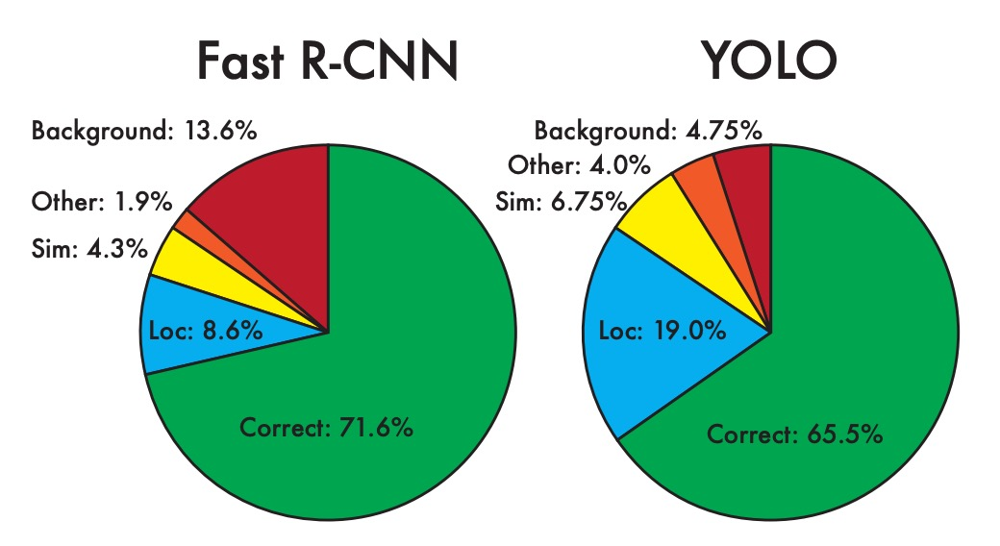
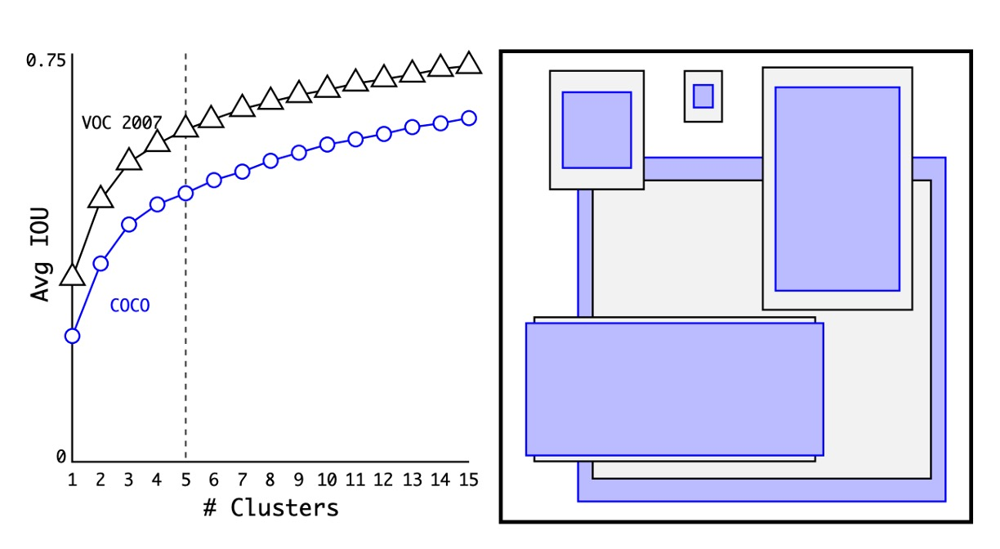
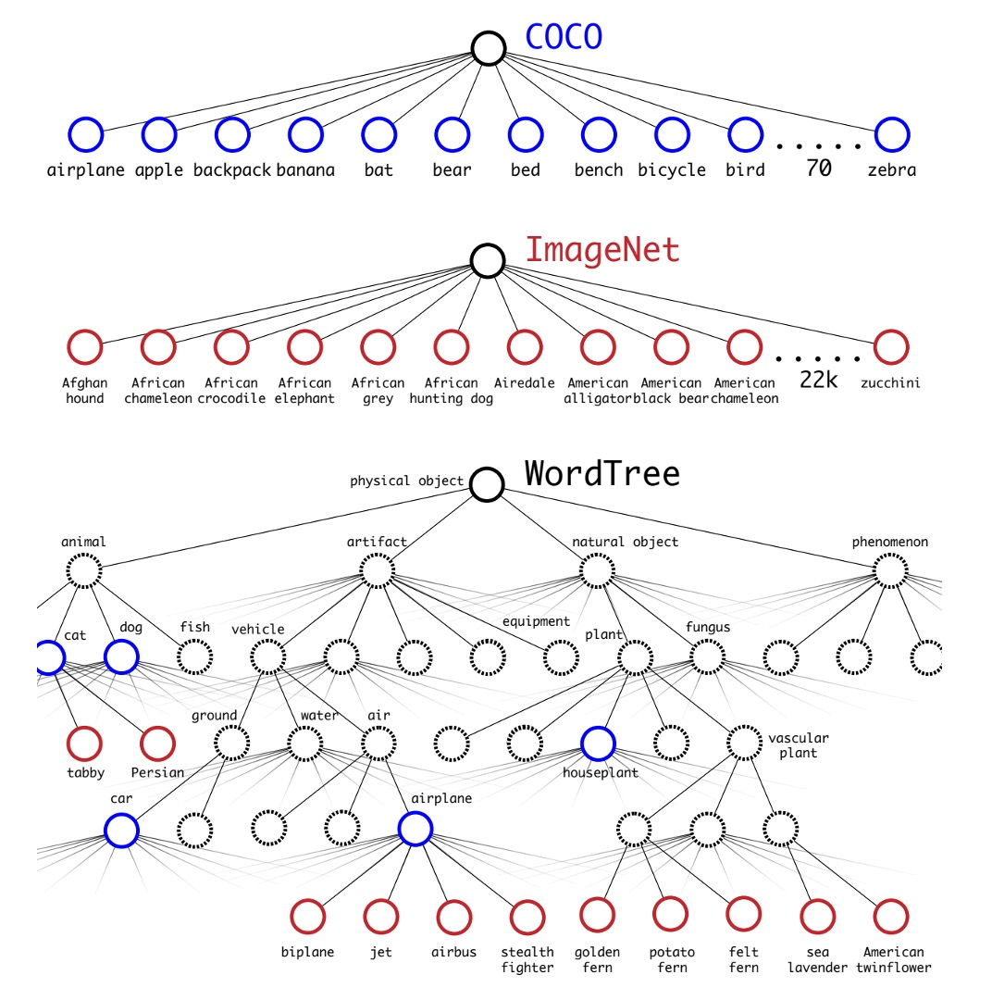

# [16.12] YOLO-V2

## 擴展大量類別

[**YOLO9000: Better, Faster, Stronger**](https://arxiv.org/abs/1612.08242)

---

:::info
以下內容由 ChatGPT-4 彙整，並經過人工校對編輯與補充說明。
:::

---

## 定義問題

回顧 YOLO v1，在最後的分析章節中，作者指出 YOLO v1 存在大量定位錯誤，還有低召回率的問題。

為了解決這個問題，引入錨點的概念看起來勢在必行。

除此之外，近期也有許多更好的訓練方式被提出來，在這裡作者也把這些方法一起納入考量。

## 解決問題

### 錨框選擇

首先是錨框的選擇，之前的方法是使用一組固定比例的錨框，例如 1:1, 1:2, 2:1 等等，但作者認為既然要用在特定的資料集上，那不妨直接在資料集上找到最佳的錨框。

這裡採用的方法就是把所有訓練資料的寬高比例都算出來，然後用 K-means 聚類的方式找到最佳的錨框。

如上圖，作者分別在 COCO 與 VOC 資料集上找到了 N 個錨框，並且經過實驗，發現使用 5 個錨框可以達到最佳的權衡。

### 預測框設計

在 Faster R-CNN 的論文中，使用 RPN 進行區域提議，模型最後會預測一個偏移量，這個偏移量會被用來修正預測框。

在上一版的 YOLO 中，作者使用了 7x7 的網格，每個網格預測 2 個框，這其實是一個不受限制的預測空間，這樣的設計相比於 Faster R-CNN 來說，模型負擔更大。因此這裡作者也引入了偏移量的概念，透過更多的先驗知識，降低模型的負擔。

修改後的設計如上圖，模型預測的數值從原本的 $x, y, w, h$ 改為 $t_x, t_y, t_w, t_h$，每個部分的處理方式如下：

1. $t_x$ 與 $t_y$ 代表網格中心的偏移量，預測結果經過一層 sigmoid 函數，使得預測結果介於 0 與 1 之間，也就是說預測中心不會超出網格的範圍。上圖中的 $c_x$ 與 $c_y$ 代表網格的左上角座標。

2. $t_w$ 與 $t_h$ 代表預測框的寬高，預測結果會先經過 exp 函數，使得預測結果為正數，然後再乘上錨框的寬高。

在這一步驟中，作者特意將網路的輸入從原本的 448x448 改為 416x416，這樣可以讓網格的大小變為 13x13，這樣的設計可以讓網格的中心點落在網格的交叉點上，可以讓網格的中心點更準確。經過這樣的設計，作者發現模型的準確率略為下降，但是召回率大幅提升，從原本的 81% 提升到 88%。

### 多尺度訓練

除了調整預測框的設計，作者也引入了多尺度訓練的概念。

在模型的訓練過程中，作者會每隔 10 個 batch 就隨機選擇一個尺度，以 32 的倍數提取，例如 320x320, 352x352, 384x384 等，最小的尺度為 320x320，最大的尺度為 608x608。

這種方式可以讓模型在不同尺度下都有很好的表現，並且可以提升模型的泛化能力。

### Darknet-19

為了得到更快的推論速度，作者不使用其他現成的骨幹網路，而是自己設計了一個網路，稱為 Darknet-19，模型架構設計如上表。

和 VGG 類似，作者使用了 3x3 的卷積核，在每個池化層之後加倍通道數，使用了批標準化，並且在最後加入了全連接層。這個模型先在 ImageNet 上進行了訓練，top1 準確度達到 76.5%，top5 準確度達到 93.3%。訓練過程中使用標準的圖像增強技術，例如隨機翻轉、隨機裁剪等。

最後把這個模型轉移到目標檢測的任務上，抽換原本的分類頭，改為目標檢測頭後進行微調，這樣就完成了整個模型的設計。

### 分類頭設計

為了拓展物件偵測的類別數量，作者引入了 WordTree 的概念。

作者通過將分類和檢測數據集聯合訓練來提升物體檢測和分類的能力。該方法利用帶有檢測標籤的圖像學習檢測特定信息，如邊界框坐標和物體存在性，並利用只有類別標籤的圖像擴展可檢測的物體類別。

這種方法面臨的挑戰之一是如何合併兩個數據集的標籤，因為檢測數據集通常只有一般標籤（如「狗」或「船」），而分類數據集則有更詳細的標籤（如各種狗的品種）。傳統的分類方法使用 softmax 層來計算所有可能類別的最終概率分佈，假設類別之間是互斥的，這在合併數據集時會引起問題。因此，作者提出使用 WordNet 構建一個層次樹模型 WordTree，以解決這一問題。

WordTree 模型利用 WordNet 的層次結構，將概念按層次組織起來，從而能夠進行更細緻的分類。這種模型在每個節點預測條件概率，並通過乘積計算特定節點的絕對概率。例如：要知道一張圖片是否是諾福克梗，只需沿著從根節點到該節點的路徑，乘上每個節點的條件概率。

作者將這種層次結構應用於分類和檢測任務，訓練了一個名為 YOLO9000 的模型。這個模型使用 COCO 檢測數據集和 ImageNet 分類數據集進行聯合訓練，能夠在實時檢測 9000 多個物體類別的同時，保持較高的準確率。實驗結果表明，YOLO9000 在 ImageNet 檢測任務中，即使對於從未見過檢測數據的類別，也能取得良好的性能。

## 討論

### 在 PASCAL VOC 上的實驗

如上表，作者在 PASCAL VOC 2007 上進行了實驗，結果顯示 YOLOv2 在速度和準確性之間取得了良好的平衡。

- 在 288 × 288 的解析度下，YOLOv2 的速度超過 90 FPS，mAP 幾乎與 Fast R-CNN 一樣好。這使得它非常適合較小的 GPU、高幀率視訊或多視訊串流。
- 在 416 × 416 的解析度下，YOLOv2 的 mAP 達到 76.8%，速度為 67 FPS，這無疑是當時最先進的偵測器之一。

### 從 V1 到 V2

上表展示了作者如何透過不同的設計來改進 YOLO 的性能。

從增加 BatchNorm 開始，作者逐步引入了更多的設計，包括更深的網絡、更多的錨框、更多的訓練數據等。這些改進使得 YOLOv2 在速度和準確性之間取得了更好的平衡。

這裡可以注意到 anchor boxes 的引入在作者的實驗中會降低 mAP，因此後來這裡改成使用聚類的方式找到最佳的 anchor boxes。

## 結論

YOLOv2 引入錨點技術，增強了對小型物體的偵測能力，並且使用 batchnorm 來降低對特定數據集的過度擬合，從而提高了模型的泛化能力。同時，模型能夠進行端到端的訓練和預測，這使得整個訓練過程更為簡化和高效。另一方面，這個模型也存在一些缺點，例如在處理形狀不規則的物體的定位上可能不如其他方法如 Faster R-CNN 那麼精確。

儘管準確度略低，但沒關係，至少它很快！

僅憑這點就足以讓它成為當時最受歡迎的物體檢測模型。
