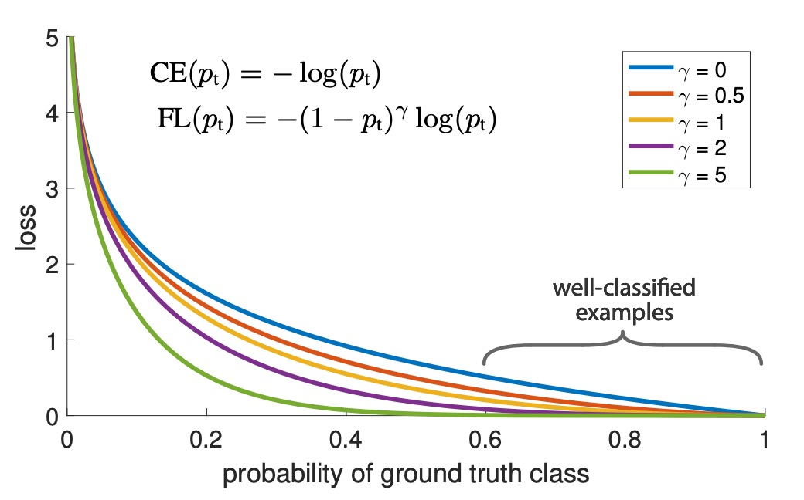

# [17.08] RetinaNet

## Focal Loss 才是本體

[**Focal Loss for Dense Object Detection**](https://arxiv.org/abs/1708.02002)

---

在此之前，經典的 R-CNN 方法已經佔據了物件偵測的主流地位。雖然速度慢，但是它的準確率很高。後續的研究大多為了挑戰其速度慢的問題，提出了一系列的改進方法，如 SSD 和 YOLO 等。

可是這些新的方法推論速度快是快了，但不準啊！

有沒有方法可以讓速度快的同時，又能準呢？

## 定義問題

為什麼不準？

本篇論文的作者認為問題的根本原因是因為在訓練過程中，**正負樣本的不平衡**。

在單階段的物件偵測方法中，模型會產出大量的檢測框，但是其中大部分都是背景，這就導致了正負樣本的數量產生懸殊的差距，使模型在訓練中難以找到有效的梯度。由於負樣本的分類大多較為簡單，不會貢獻有用的學習訊號。

這個議題也不是第一次出現，已經有研究者提出了 Hard Negative Mining 的方法，意思是特別找到一些難以分類（在分類過程中容易被誤分類為正樣本的負樣本）的負樣本來訓練模型，這些樣本被稱為「硬負樣本」。

而這篇論文的作者不這麽做，他認為這樣的方法效率不高，並且會增加訓練的複雜度。更好的方法或許是把正負樣本平衡的概念，直接融入到損失函數中。

為此，他們提出了一種新的損失函數，稱為：**Focal Loss**。

## 解決問題

### Focal Loss

交叉熵損失（Cross Entropy Loss, CE Loss）是二元分類問題中常用的一種損失函數。

其定義如下：

$$
CE(p, y) =
\begin{cases}
- \log(p) & \text{如果 } y = 1 \\
- \log(1 - p) & \text{否則}
\end{cases}
$$

其中，$y \in \{ \pm 1\}$ 表示真實的類別標籤，$p \in [0, 1]$ 則是模型對於 $y = 1$ 的預測概率。

為了簡化表示，我們定義 $p_t$ 如下：

$$
p_t =
\begin{cases}
p & \text{如果 } y = 1 \\
1 - p & \text{否則}
\end{cases}
$$

因此，交叉熵損失可以重新表示為：

$$
CE(p, y) = CE(p_t) = - \log(p_t)
$$

交叉熵損失的一個顯著特性是，即使是容易分類的樣本（即 $p_t \approx 0.5$），也會產生難以忽視的損失值。這在處理大量容易分類的樣本時，可能會使得這些小的損失值累加，從而掩蓋了稀有類別樣本的重要性。

為了解決類別不平衡的問題，一種常見的方法是引入一個權重因子 $\alpha \in [0, 1]$，對類別 $1$ 和類別 $-1$ 分別賦予 $\alpha$ 和 $1 - \alpha$ 的權重。在實踐中，$\alpha$ 可以根據類別的逆頻率設置，或者通過交叉驗證進行調整。類似於 $p_t$ 的定義，我們定義 $\alpha_t$，並將 $\alpha$ 平衡的交叉熵損失寫為：

$$
CE(p_t) = - \alpha_t \log(p_t)
$$

這種損失函數是交叉熵損失的一個簡單擴展，在這里，作者將其作為 Focal Loss 的實現基線。

---

儘管 $\alpha$ 可以平衡正負樣本的重要性，但它無法區分容易和困難的樣本。

因此，作者提出重塑損失函數，對容易分類的樣本進行「降權重」，以便集中訓練在困難的負樣本上。

具體操作是交叉熵損失中加入一個調制因子 $(1 - p_t)^\gamma$，其中 $\gamma \geq 0$ 是可調的參數。

因此，作者將 Focal Loss 定義為：

$$
FL(p_t) = - (1 - p_t)^\gamma \log(p_t)
$$

當一個樣本被錯誤分類且 $p_t$ 很小時，調制因子接近 1，損失基本不受影響。

而當 $p_t \to 1$ 時，調制因子趨向於 0，使得對於分類正確的樣本損失降低。

:::tip
分數愈高表示模型愈有信心，表示該樣本對模型來說是容易分類的。
:::

參數 $\gamma$ 用來平滑調整了簡單樣本的降權速度。當 $\gamma = 0$ 時，Focal Loss 等價於交叉熵損失；隨著 $\gamma$ 增大，調制因子的效果也隨之增強（我們的實驗發現 $\gamma = 2$ 的效果最好）。

實際上，作者使用的是一種 $\alpha$ 平衡的 Focal Loss 變體：

$$
FL(p_t) = - \alpha_t (1 - p_t)^\gamma \log(p_t)
$$

作者在實驗中採用這種形式，因為它比非 $\alpha$ 平衡的形式稍微提高了準確性。

分類分數 $p_t$ 和對應的損失關係，可以通過下圖直觀理解：

在圖中 $\gamma = 0$ 代表一般的交叉熵損失，而 $\gamma = 2$ 則是作者實驗中的最佳取值。分類分數 $p_t$ 對應到的 0.6 ~ 1.0 區域的是容易分類的簡單樣本，經過 Focal Loss 的調整後，損失值被有效降低。

### 模型架構

為了不會讓 Focal Loss 的效果被模型複雜度掩蓋。作者設計了一個非常簡單的模型架構，稱為 **RetinaNet**。

RetinaNet 是一種單階段的物件偵測模型，它的主要設計內容為：

- 使用一個簡單的 Backbone，例如 ResNet50。
- 搭配一個簡單的 Neck，例如 Feature Pyramid Network（FPN）。
- 取出後三層的多尺度的特徵圖，用 9 組 Anchor 把特徵圖轉換成檢測框。

  - Anchor 的長寬比例為 1:2, 1:1, 2:1。在每個層級上，作者在原有的三種寬高比錨框基礎上，新增了三種不同尺寸的錨框，這些尺寸分別是原始三種寬高比錨框的 $2^{0}$、$2^{1/3}$ 和 $2^{2/3}$ 倍。將這些尺寸兩兩搭配一下，可以得到九種不同的錨框比例。

    - **1:2 寬高比：**

      - 1:2 $\times 1 = 1:2$
      - 1:2 $\times 1.26 = 1.26:2.52$
      - 1:2 $\times 1.59 = 1.59:3.18$

    - **1:1 寬高比：**

      - 1:1 $\times 1 = 1:1$
      - 1:1 $\times 1.26 = 1.26:1.26$
      - 1:1 $\times 1.59 = 1.59:1.59$

    - **2:1 寬高比：**

      - 2:1 $\times 1 = 2:1$
      - 2:1 $\times 1.26 = 2.52:1.26$
      - 2:1 $\times 1.59 = 3.18:1.59$

  - 每個錨點都分配一個長度為 $K$ 的分類向量和一個長度為 $4$ 的檢測框座標向量。
  - 使用 RPN 的分類規則，但調整正樣本的閾值為 $0.5$ 以上，負樣本的閾值為 $0.4$ 以下。
  - 每個錨點只給一個預測框。

- 物件檢測的部分又再分成兩個子網路，一個負責預測類別，一個負責預測檢測框，兩者都是由全卷積網路的架構組成。

### 訓練參數設定

1. 在推論階段，RetinaNet 會產生大量的檢測框，這些檢測框會被分類網路分類，選出 1000 個分數最高的檢測框，然後進行非極大值抑制（NMS），閾值為 0.5，作為最後的檢測結果。
2. 作者發現設定 Focal Loss 的 $\gamma = 2$ 效果最好，而 $\alpha$ 的設定則是根據類別的逆頻率設置，且與 $\gamma$ 連動，在這個設定中，作者發現 $\alpha = 0.25$ 效果最好。
3. RetinaNet 使用 ResNet-50-FPN、ResNet-101-FPN 和 ResNeXt-101-FPN 等作為骨幹網路。
4. RetinaNet 使用 SGD 作為優化器，學習率為 0.01，在 60k 和 80k 次迭代時分別減少為原來的 1/10。動量為 0.9，權重衰減為 0.0001。
5. 在分類問題上使用 Focus Loss，而在回歸問題上使用 Smooth L1 Loss，訓練時兩個損失加總計算。

## 討論

### 在 COCO 數據集上的實驗結果

RetinaNet 與近期的二階方法相比，超過了表現最好的 Faster R-CNN 模型（基於 Inception-ResNet-v2-TDM ），取得了 2.3 點的差距。

將 ResNeXt-32x8d-101-FPN 作為 RetinaNet 的骨幹網路，進一步將結果提高了 1.7 AP，在 COCO 資料集上的 AP 超過了 40。

與現有的一階方法相比，RetinaNet 與最接近的競爭對手 DSSD 相比，取得了明顯的 5.9 點 AP 差距（39.1 vs. 33.2），且速度更快，如下圖所示：

### 消融實驗

這裡作者根據 RetinaNet 中的幾個關鍵元素來進行消融實驗，結果顯示：

1. **Balanced Cross Entropy**

   如上表 (a)，作者首次改進嘗試是使用前面文章中描述的 $\alpha$ 平衡交叉熵損失，上表顯示了不同 $\alpha$ 值的結果。設置 $\alpha = 0.75$ 可以提高 0.9 個 AP 點。

2. **Focal Loss**

   如上表 (b)，顯示了 Focal Loss 的結果。Focal Loss 引入了一個新的超參數 $\gamma$，它控制調制項的強度。當 $\gamma = 0$ 時，損失等同於交叉熵損失。隨著 $\gamma$ 的增加，損失的形狀變化，使得低損失的「容易」樣本被進一步降權。隨著 $\gamma$ 的增加，FL 相對於 CE 顯示出很大的增益。當 $\gamma = 2$ 時，FL 比 $\alpha$ 平衡的 CE 損失提高了 2.9 個 AP 點。

   為了公平比較，作者為每個 $\gamma$ 找到了最佳的 $\alpha$。從圖表中可以觀察到，隨著 $\gamma$ 的增加，選擇的 $\alpha$ 值較低（由於容易的負樣本被降權，對正樣本的強調減少）。

3. **高密度的二階系統可能不必要**

   如上表 (c)，作者使用 ResNet-50，並且把 FPN 中每個空間位置和每個金字塔層級所使用的尺度和寬高比錨框數量進行了掃描。考慮了從每個位置一個方形錨框到每個位置 12 個錨框的情況，這些錨框跨越 4 個子八度尺度（$2^{k/4}$，對於 $k \leq 3$）和 3 個寬高比（0.5, 1, 2）。

   僅使用一個方形錨框就可以達到意外的好 AP（30.3）。當每個位置使用 3 個尺度和 3 個寬高比時，AP 可以提高近 4 點（達到 34.0）。

   作者在這項工作中的所有其他實驗都使用了這一設置。

   最後，作者注意到，錨框數量超過 6-9 個後並未顯示進一步的增益。因此，雖然二階系統可以分類圖像中的任意框，但就密度飽和的性能而言，更高密度的二階系統可能不會帶來優勢。

4. **在線困難樣本挖掘（OHEM）**

   如上表 (d)，過去的文獻中，提出通過構建包含高損失樣本的小批量來改進二階檢測器的訓練。在 OHEM 中，每個樣本按其損失進行評分，然後應用非最大抑制（NMS），並使用高損失樣本構建小批量。NMS 閾值和批量大小是可調參數。與 Focal Loss 類似，OHEM 更強調錯誤分類的樣本，但與 FL 不同，OHEM 完全捨棄了容易樣本。

   作者在實驗中 OHEM 的最佳設置（無 1:3 比例，批量大小 128，NMS 為 0.5）達到 32.8 AP，差距為 3.2 AP，顯示 FL 比 OHEM 更有效。此外，作者也嘗試了其他參數設置和 OHEM 變體，但未能取得更好的結果。

   :::tip
   作者也在早期實驗中，嘗試在 $p_t$ 上使用 hinge 損失，其在 $p_t$ 超過某個值時將損失設為 0。

   然而結果不穩定，未能獲得有意義的結果。
   :::

5. **更大的 Backbone**

   如上表 (e)，更大的骨幹網路可以帶來更高的準確性，但也會導致推理速度變慢。同樣，輸入圖像的尺度（由較短的一邊定義）也有類似的影響。上表中展示了這兩個因素的影響。如果要再更快的推論速度，可能需要進一步優化網路架構，這已經超出本文的論述範圍，作者留給未來的工作。

## 結論

RetinaNet 通過引入 Focal Loss，有效解決了類別不平衡問題，使得模型能夠集中學習困難的負樣本，顯著提高了檢測精度。實驗結果顯示，RetinaNet 在 COCO 數據集上超越了多種現有的一階和二階檢測方法，展示了其在實際應用中的潛力。

在後續研究中，YOLO-v3 的作者也將 Focus Loss 引入到了 YOLO 系列中，但未能得到如 RetinaNet 那樣的顯著提升。這意味著 Focal Loss 的效果可能除了受到正負樣本不平衡的影響外，還受到模型架構的影響。

物件檢測的研究還有很多工作要做，我們拭目以待。
