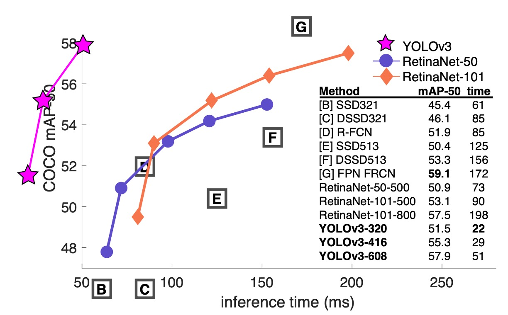
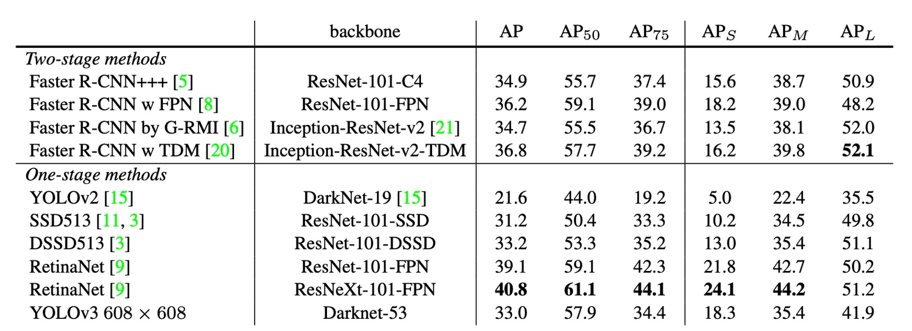

## 引入多尺度檢測

[**YOLOv3: An Incremental Improvement**](https://arxiv.org/abs/1804.02767)

---

第三代的 YOLO 其實不是論文，就作者本人表示：這只是一份技術報告。

## 定義問題

近期在目標檢測領域有許多新的研究進展。

作者想著是時候將這些新的想法整合到 YOLO 中，並且進行一些改進。

其中，Bounding Box 預測的部分沒有更改，直接沿用 YOLOv2 的設計，這邊我們就不再贅述。

- [**[16.12] YOLOv2: 擴展大量類別**](../1612-yolov2/index.md)

## 解決問題

作者做了一系列的改進。

### 更新 Backbone

作者將 Darknet-19 的網路架構改為 Darknet-53。這裡同樣使用連續的 3x3 和 1x1 的卷積層，並且新增一些殘差連接。這是一個更深的網路，並且在 ImageNet 上進行了訓練，因為這個網路有 53 個卷積層，所以作者稱之為 Darknet-53。

下表為 Darknet-53 的在 ImageNet 上的表現，可以看到 top-1 準確率和 ResNet-101 持平，約為 77.1%，但是推論速度提升 50%。

### 類別預測

這裡不用 softmax 來預測類別，而是使用 logistic regression 來預測每個類別的機率。

意思就是讓模型不需要在類別上做出硬性的決定，而是允許模型在多個類別上都有機會，透過這種方式讓模型更容易拓展到未知的類別。

### 多尺度檢測

參考 FPN 和 RetinaNet 的概念，作者在 YOLOv3 中引入了多尺度檢測。

錨點的部分仍然使用 K-means 聚類的方式找到最佳的錨點，不一樣的地方是使用三個不同尺度的特徵圖，分別是 1/32, 1/16, 1/8。在每個尺度上都預測三個不同大小的框，所以整個算起來有： 4 個邊界框偏移、1 個物件信心分數、80 個類別機率。

其預測張量尺寸為 $N \times N \times [3 \times (4 + 1 + 80)]$。

## 討論

### 在 COCO 上的表現

作者首先承認由於不想花費大量時間重新訓練其他架構的模型，於是從 RetinaNet 論文中「借來」了一份圖片和一份表格資料。然後把 YOLOv3 的結果放在這份表格上，可以看到 YOLOv3 在速度和準確率上都有不錯的表現。

從上表中可以看到，YOLOv3 在 $AP_{50}$ 上的表現很優秀，遠高於 SSD 架構，這表明物體的檢測上有很好的表現。但隨著 IOU 的閾值增加，YOLOv3 的表現逐漸下降，這表明 YOLOv3 難以產生高精度的邊界框。

在過去 YOLO 架構對於小物體的檢測表現不佳，但是 YOLOv3 在這方面產生反轉。通過新的多尺度檢測，YOLOv3 在小物體的檢測上有了很大的提升，但是在中大尺度物體的檢測上表現下降。

### 做了卻沒效果的嘗試

作者在訓練過程中嘗試了一些方法，但是效果不明顯，在文章中作者也一併提出。

1. 錨框中心點 x, y 偏移預測：作者嘗試改成使用線性啟動函數，但是效果不明顯。
2. 線性 x, y 預測，而不是 logistic：作者嘗試使用線性啟動函數取代 logistic，但是性能下降。
3. 使用 Focal Loss：作者嘗試使用 Focal Loss 來解決類別不平衡的問題，但是性能下降 2 個百分點，作者表示自己也不知道原因。
4. 雙 IOU 閾值：作者嘗試使用使用 Faster R-CNN 的方式，將物件以 IOU 大於 0.7 視為正樣本，小於 0.3 視為負樣本，忽略中間的部分，但是效果不好。

## 結論

根據過去的研究結果，人類很難用肉眼區分 IOU 0.3 和 0.5 的檢測框，所以作者認為既然人類都難以區分，那模型在這些驗證資料集上追求更高的分數，似乎也沒有太大的意義。

YOLO v3 的性能在作者看來已經足夠應對現實中大部分的問題，我們應該專注於提升模型的安全性，讓這些高性能的模型用在正確的地方，減少對世界的危害才是更重要的事情。

:::tip
這篇研究報告確實寫得非常率性，如果你好奇作者原始說法，可以去看看原文。
:::
