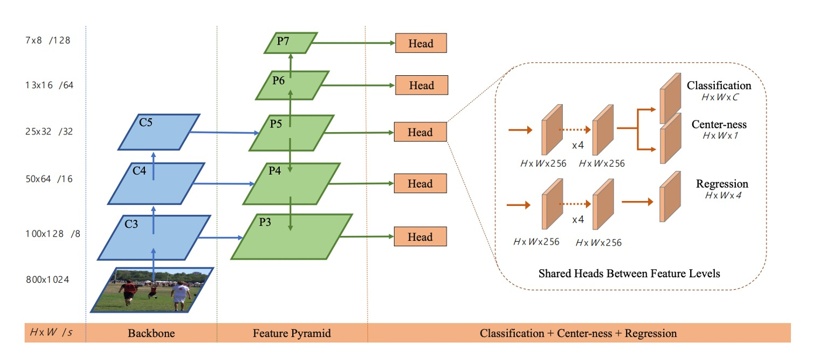
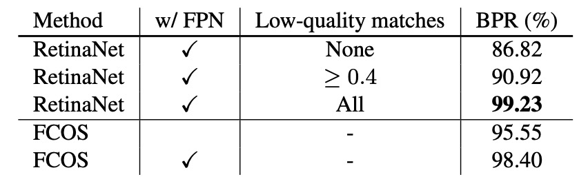

## 沒有錨點的世界

[**FCOS: Fully Convolutional One-Stage Object Detection**](https://arxiv.org/abs/1904.01355)

---

這篇論文有七千多個引用。

經典論文，我們一定得來看一看。

## 定義問題

物件偵測的主流方法，長期以來被 **anchor-based** 所壟斷。

從 Faster R-CNN、SSD 到 YOLOv2/v3，大家都圍繞著錨點設計：先鋪設一大堆候選框，再判斷誰是正樣本、誰是負樣本。

這種設計雖然實用，但也帶來不少隱憂：

1. **超參數繁多**：錨點的大小、比例、數量，以及 IoU 門檻，都需要手工調整。稍有變動，mAP 就可能差個 4% 以上。
2. **泛化性差**：錨點的形狀是固定的，遇到尺度差異大或特殊形狀的物件時，表現會明顯下滑，更別說換任務還得重新設計。
3. **正負樣本失衡**：為了保證召回率，往往需要在整張圖上鋪設成千上萬的錨點，其中絕大多數都是負樣本，訓練因此極度不平衡。
4. **計算繁瑣**：從 IoU 計算到匹配規則，錨點引入了額外的計算與複雜度。

雖然 anchor-free 也不是新鮮事，但每個方法的缺陷都非常明顯。

舉例來說，YOLOv1 嘗試直接從物件中心預測邊界框，但是只依靠中心點，導致召回率不足；CornetNet 用角點來拼湊物件，但是後處理過於複雜；DenseBox 則是採用逐像素回歸的機制，但是難以處理框重疊的問題，幾乎只能勉強用在文字或人臉偵測等特殊領域。

還有更多的例子，不勝枚舉。

Anchor-free 的架構在整體表現上就是矮人一截，在物件偵測這個已經被 anchor-based 主宰的領域中，根本沒有立足之地。

**難道物件偵測是否真的離不開 anchor？**

本篇論文的作者希望能夠打破這個僵局，他希望模型能像語意分割一樣，讓每個像素都參與預測，既不需要 anchor，也不需要額外的匹配規則。

所謂的物件偵測，應該要回到 **全卷積 per-pixel 預測** 的簡潔範式。

## 解決問題

FCOS 的核心觀點，是將物件偵測徹底改寫為 **per-pixel prediction** 的問題。與其鋪設大量 anchor，讓它們作為「候選人」去比對真值框，FCOS 乾脆直接把每個像素位置視為一個訓練樣本。

假設我們在 backbone 的第 $i$ 層得到特徵圖 $F_i \in \mathbb{R}^{H \times W \times C}$，stride 為 $s$。

輸入影像的 ground-truth 邊界框記為

$$
B_i = (x^{(i)}_0, y^{(i)}_0, x^{(i)}_1, y^{(i)}_1, c^{(i)}) \in \mathbb{R}^4 \times \{1,2,\dots,C\},
$$

其中 $(x^{(i)}_0, y^{(i)}_0)$ 與 $(x^{(i)}_1, y^{(i)}_1)$ 分別是左上角與右下角座標，$c^{(i)}$ 為類別標籤。

對於特徵圖上的一個位置 $(x,y)$，我們可以將它映射回輸入影像座標：

$$
(\lfloor \tfrac{s}{2} \rfloor + xs, \; \lfloor \tfrac{s}{2} \rfloor + ys).
$$

這個位置如果落在某個真值框 $B_i$ 內，我們就把它視為正樣本，並指定其分類標籤 $c^* = c^{(i)}$；反之則為背景 $c^*=0$。

除了分類之外，每個位置還需要回歸一個四維向量：

$$
t^* = (l^*, t^*, r^*, b^*),
$$

分別表示該位置到框的左、上、右、下邊界的距離，如下圖：

<figure style={{ "width": "70%"}}>

</figure>

$$
l^* = x - x^{(i)}_0, \quad
t^* = y - y^{(i)}_0, \quad
r^* = x^{(i)}_1 - x, \quad
b^* = y^{(i)}_1 - y
$$

如果某個位置同時落在多個框中，則取面積最小的框作為回歸目標，以減少重疊的歧義。

這樣一來，**每個像素就能直接輸出「這裡是什麼」與「框到哪裡」**，不再需要 anchors 來參考。

在網路輸出設計上，最後一層會同時輸出分類分支 $p \in \mathbb{R}^C$ 與回歸分支 $t = (l,t,r,b)$。

由於回歸值必須是正數，作者在輸出端使用 $\exp(x)$ 將任意實數映射到 $(0,\infty)$。

這樣的設計不僅簡化了結構，還讓輸出變數的數量比 anchor-based detector 少了九倍。

整體的 loss 定義為：

$$
L(\{p_{x,y}\}, \{t_{x,y}\}) =
\frac{1}{N_{\text{pos}}} \sum_{x,y} L_{\text{cls}}(p_{x,y}, c^*_{x,y}) \; + \;
\frac{\lambda}{N_{\text{pos}}} \sum_{x,y} \mathbf{1}_{\{c^*_{x,y}>0\}} \, L_{\text{reg}}(t_{x,y}, t^*_{x,y})
$$

其中 $L_{\text{cls}}$ 採用 **Focal Loss** 以平衡正負樣本，$L_{\text{reg}}$ 則是 **IoU loss**，$N_{\text{pos}}$ 是正樣本數量，$\lambda=1$。

推論時，對於每個位置 $(x,y)$，我們得到其分類分數 $p_{x,y}$ 與回歸結果 $t_{x,y}$，只要 $p_{x,y} > 0.05$ 就會被視為候選框，並透過反向轉換復原為實際座標。

到這裡，我們已經可以理解 FCOS 最核心的思想：把 anchor 拿掉，讓每個像素直接負責預測。

然而，這樣的設計馬上遇到兩個挑戰：

1. 特徵圖 stride 過大可能導致小物件被忽略，召回率下降；
2. 重疊框會造成歧義，到底某個像素該回歸哪個框？

作者的解法是 **FPN 多層級預測**，如下圖所示：

<figure style={{ "width": "90%"}}>

</figure>

作者利用 ${P3, P4, P5, P6, P7}$ 五個層級，stride 分別為 8、16、32、64、128。

不同尺寸的物件會被分配到不同的層級進行回歸，並且透過設定每層的最大回歸範圍（例如 $P3$ 處理 $\leq64$ 的物件，$P4$ 處理 $[64,128]$ 的物件），大幅減輕了重疊歧義。

即使如此，還有最後一個問題需要處理：遠離中心的像素，往往會產生低品質的框。

為此，作者引入了一個輕量的 **center-ness 分支**，用來衡量一個位置距離中心的偏離程度。

對於位置 $(x,y)$，其對應的目標定義為：

$$
\text{centerness}^* = \sqrt{\frac{\min(l^*, r^*)}{\max(l^*, r^*)} \times \frac{\min(t^*, b^*)}{\max(t^*, b^*)}}
$$

這個值介於 $[0,1]$ 之間，越靠近物件中心越接近 1。

訓練時使用 BCE loss，推論時則將其與分類分數相乘，用來抑制低品質的框，並在 NMS 前就過濾掉大量「邊角預測」。

最終，FCOS 以最簡單的 per-pixel 設計，搭配 FPN 的多層級分配與 center-ness 的品質控制，不僅徹底擺脫 anchor，也展現了能與主流 anchor-based 方法比肩，甚至超越的性能。

## 討論

作者在 **MS COCO** 基準上驗證 FCOS，遵循通用做法，訓練使用 **trainval35k（115K）**，驗證在 **minival（5K）** 做消融，主結果提交 **test-dev（20K）**。

除非特別說明，Backbone 為 **ResNet-50**，優化器與超參數沿用 **RetinaNet** 設定：SGD、90K iterations、batch size 16、初始學習率 0.01，於 60K 與 80K iteration 各降 10 倍，weight decay 0.0001、momentum 0.9，輸入影像短邊 800、長邊不超過 1333。

推論同樣沿用 RetinaNet 的後處理與超參數，候選位置門檻為 $p_{x,y}>0.05$；若專為 FCOS 微調，表現仍可進一步提升。

在進一步分析前，我們先看一下 **Best Possible Recall（BPR）** 的精確定義，便於閱讀表格：

$$
\text{BPR} \;=\; \frac{\#\{\text{在訓練中被指派到至少一個樣本的 GT 框}\}}{\#\{\text{所有 GT 框}\}} .
$$

### 多層級 FPN 與可召回上限

<figure style={{ "width": "70%"}}>

</figure>

首先，作者考慮到 FCN 型偵測器 stride 較大、可能導致召回不足，因此以單層 **P4（stride 16）** 檢驗：僅此一層時，FCOS 仍可達 **BPR = 95.55%**，顯著高於官方 Detectron 版 **RetinaNet**（低品質配對 IoU≥0.4）之 **90.92%**。

接著，引入 **FPN（P3–P7）** 後，FCOS 的 BPR 進一步到 **98.40%**，已逼近以各式低品質配對堆高召回的 anchor-based 上限。

鑑於實際偵測器在 COCO 的最終召回遠低於 90%，這不到 1% 的 BPR 差距不構成瓶頸；事實上，隨後的主結果中 FCOS 的 **AR** 亦優於對手。

### 重疊造成的歧義樣本

<figure style={{ "width": "70%"}}>

</figure>

當多個 GT 框在空間上重疊，per-pixel 指派可能出現「同一位置該回歸哪個框」的歧義。

若只用 **P4**，minival 的歧義樣本佔所有正樣本 **23.16%**；引入 **FPN** 後，由於不同尺寸物件被分派到不同層級，歧義大幅降到 **7.14%**。更進一步排除「同類別重疊」（這種重疊不影響分類正確性），跨類別的歧義比率由 **17.84%** 降至 **3.75%**。

推論時實際由「歧義位置」產生的偵測框僅 **2.3%**，若僅計跨類別更降至 **1.5%**。

因此，透過 **多層級指派 + 面積最小規則**，歧義對最終性能的影響可忽略。

### Center-ness 的必要性與效果

<figure style={{ "width": "70%"}}>

</figure>

即便有了 FPN，遠離物件中心的像素仍容易產生低品質框。

為此，FCOS 在分類分支旁加入一個單層 **center-ness** 分支，預測位置到中心的歸一化偏離：

$$
\text{centerness}^* \;=\; \sqrt{\frac{\min(l^*,r^*)}{\max(l^*,r^*)}\cdot\frac{\min(t^*,b^*)}{\max(t^*,b^*)}}
$$

訓練時以 **BCE** 監督；推論時用 $\text{score}=\text{cls}\times\text{centerness}$ 來抑制邊角預測，NMS 前即過濾掉大量低品質候選。

消融實驗結果顯示如上表，**AP 從 33.5% 躍升到 37.1%**；若僅用「由回歸結果推算的 center-ness」而不設獨立分支，則無法帶來相同提升，證明獨立分支是必要的。

### 與 Anchor-based 的公平對比

<figure style={{ "width": "90%"}}>

</figure>

為排除實作差異，作者將 FCOS 調整到與 **RetinaNet** 幾乎一致的設定：移除 **GroupNorm**（改以梯度裁剪保穩定）、以 **C5** 而非 **P5** 生成 **P6/P7**。

即便如此，FCOS 依然 **36.3% vs 35.9% AP** 略勝 RetinaNet。在此對比中，學習率、NMS 門檻等超參數完全沿用 RetinaNet（對 anchor-free 未特調），顯示架構本身的簡潔與指派策略才是關鍵。作者也指出，若允許對 FCOS 量身調參，還有上升空間。

### 與當代 SOTA 的整體比較

<figure style={{ "width": "90%"}}>

</figure>

實驗結果顯示：在 **ResNet-101-FPN** 下，FCOS 較 RetinaNet **+2.4 AP**；以 **ResNeXt-101-64×4d-FPN** 為 Backbone，FCOS 達 **AP 43.2%**，明顯超越同為 anchor-free 的 **CornerNet**，且系統更簡潔（CornerNet 需學習角點成對與嵌入聚合）。

結合上表中的幾項 **幾乎零成本** 改進後，單模型、單尺度測試可達 **AP 44.7%**。這是 **首次** 在無花招的前提下，anchor-free 以顯著幅度超越 anchor-based 的結果。

## 結論

FCOS 把物件偵測拉回 **per-pixel** 的樸素範式：不需要 proposals、也不需要 anchors。每個位置同時學會「它是什麼」與「框到哪裡」，並以 **FPN** 的多層級分配化解尺寸與重疊的歧義，最後用一個近乎零成本的 **center-ness** 來校正品質。

FCOS 的影響主要體現在三個層面。

其一，**任務對齊與樣本指派** 的觀念被徹底放大：從 ATSS 的統計式指派，到 PAA／OTA／SimOTA 的動態或全域最佳化分配，再到 TOOD 的分類-定位一致性，都在沿著「像素（或位置）= 樣本」的思路前進。

其二，**品質感知的分類頭** 演化出多條支線：center-ness 被更普遍的「IoU/品質感知分類」所吸收（如 QFL/Varifocal 等），而框回歸也從純連續值走向**分佈式回歸**（如 DFL），本質上都是在用更平滑的方式把定位品質注入分類分數。

其三，**Transformer 系列**（DETR、Deformable-DETR、DINO、RT-DETR 等）以集合匹配重塑了偵測流程，拿掉 NMS 與 anchors，建立了另一條強力路線；但在**實時與邊緣部署**的場景，FCOS 這類卷積式、頭部輕量的設計仍然是穩健、易調的基線，也啟發了近年的 anchor-free YOLO 家族（如 v8/10/11）的任務對齊與品質建模細節。

總之，FCOS 的貢獻並不限於「拿掉 anchors」這件事，而是把偵測問題重新表述為：**讓每個位置自主承擔決策，並用正確的指派與正確的評分，讓好框自然顯現**。

至此之後，錨點的設計架構退場，而留下來的是更清晰的問題定義和更通用的設計語言。
