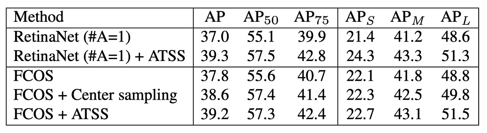
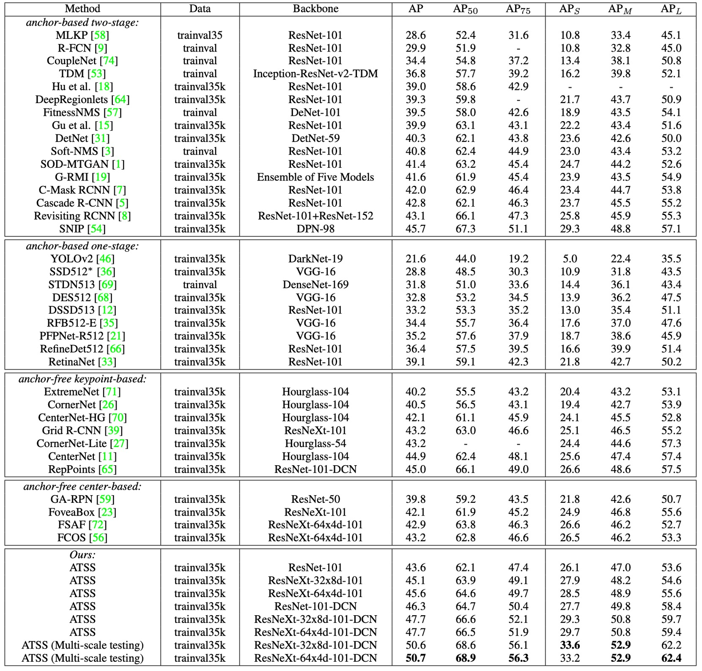

## 錨點之死

[**Bridging the Gap Between Anchor-based and Anchor-free Detection via Adaptive Training Sample Selection**](https://arxiv.org/abs/1912.02424)

---

在過去幾年，物件偵測的發展形成了兩大派系：**Anchor-based** 與 **Anchor-free**。

**Anchor-based 方法**

- **二階段偵測器**（如 Faster R-CNN）透過 **RPN 提議區域 + R-CNN 精修**，憑藉多次迭代回歸，長期在精度上領先。
- **一階段偵測器**（如 SSD、RetinaNet）則把 anchors 鋪設在多層特徵圖上，直接分類與回歸，效率極高，並逐步追平二階段的性能。

**Anchor-free 方法**

- **Keypoint-based**：將偵測問題轉化為關鍵點定位，例如 CornerNet 用「左上角 + 右下角」決定框，ExtremeNet 直接找四個極值點與中心點。
- **Center-based**：以物件中心或區域作為正樣本，再回歸至邊界，例如 YOLO、FCOS、FoveaBox。

## 定義問題

這兩大流派看似分歧，但本質上都是在回答同一個問題：

> **哪些位置應該被視為「正樣本」？哪些則是「負樣本」？**

以 **RetinaNet (anchor-based)** 與 **FCOS (anchor-free, center-based)** 為例，差異主要體現在三點：

1. **採樣單元**：RetinaNet 每個位置放多個 anchors；FCOS 每個位置只放一個點。
2. **樣本定義**：RetinaNet 用 IoU 門檻區分正負；FCOS 則用空間與尺度規則。
3. **回歸起點**：RetinaNet 從 anchor box 出發；FCOS 從單一點往外推算。

然而，作者經過嚴謹對齊實驗後發現：

> **真正決定性能差距的，不是「box 還是 point」，而是「正負樣本如何被定義」。**

如果這兩種方法在訓練時使用相同的樣本選擇策略，最終結果其實沒有明顯差異！也就是說，anchor-based 與 anchor-free 的鴻溝，並非結構之爭，而是指派之爭：**樣本分配策略才是關鍵！**

於是，物件偵測的舞台中央只剩下幾個問題等待回答：

- 為何還要仰賴人工設定的 IoU 門檻或手工規則來劃分正負？
- 能否讓模型依據每個目標自身的統計特性，自動選出該留下的樣本？

等等，這時你忍不住問了一句：「那錨點呢？」

噢，它已經死了。

作為歷史的見證，我們把它裱起來放在博物館裡吧。

## 解決問題

作者選擇了兩個代表性方法來對比：**RetinaNet**（anchor-based）與 **FCOS**（anchor-free, center-based）。表面上，它們的結構差異很多，但若要公平比較，必須先把「不必要的干擾」逐一排除。

### 移除不公平的因素

為了聚焦於核心差異，作者先讓 RetinaNet 每個位置僅鋪設 **一個方形 anchor**（稱為 RetinaNet #A=1），使其形式上盡量接近 FCOS。

即便如此，兩者在 COCO 上的表現仍存在明顯差距：RetinaNet (#A=1) 只有 **32.5% AP**，FCOS 卻有 **37.1% AP**。

這時，作者注意到 FCOS 引入了許多「泛用改進」：

- GroupNorm 正規化
- GIoU loss
- centerness 分支
- 對回歸目標做 stride normalization
- 每層金字塔增加可學 scalar

這些技巧並非 anchor-free 獨有，也完全可以套用在 RetinaNet 上。

<figure style={{ "width": "60%"}}>

</figure>

當作者把這些改善補上後，RetinaNet (#A=1) 的表現升到 **37.0% AP**，幾乎追平 FCOS 的 **37.8% AP**。

這個對齊過程說明：**結構外觀的差異（anchor box vs. point）並不是關鍵。**

### 鎖定真正的差異

在消除了所有「外掛優勢」之後，剩下的只剩兩個差異：

1. **樣本定義**（classification）
2. **回歸起點**（regression）

首先來看**樣本定義**的部分。

<figure style={{ "width": "90%"}}>

<figurecaption>藍色格子是正樣本區域，灰色格子是負樣本區域。</figurecaption>
</figure>

---

- RetinaNet 透過 **IoU 門檻**挑選正負樣本：IoU > $θ_p$ 的 anchors 當作正樣本，IoU < $θ_n$ 的 anchors 當作負樣本，中間區域則忽略。
- FCOS 則採用 **空間 + 尺度條件**：框內的點先當作候選，再依層級設定的 scale range 過濾，最終留下的才是正樣本。

實驗結果顯示：

- 當 RetinaNet (#A=1) 改用 FCOS 的「空間 + 尺度」規則後，AP 從 **37.0% → 37.8%**。
- 相反地，當 FCOS 改用 IoU 門檻，AP 從 **37.8% → 36.9%**。

這證明了：**正負樣本定義才是 anchor-based 與 anchor-free 之間的本質差異。**

---

接著是**回歸起點** 的部分。

<figure style={{ "width": "90%"}}>

</figure>

- RetinaNet：從 anchor box 預測 offset。
- FCOS：從一個點往外預測四個距離。

然而，當兩者使用相同的樣本分配策略時，這個差異完全不重要：

- RetinaNet (#A=1) vs. FCOS 在相同條件下表現幾乎沒有差異。

因此，作者得出結論：

- **回歸起點（box 或 point）不是關鍵；真正影響性能的，是正負樣本如何被定義。**

### Adaptive Training Sample Selection

在介紹 ATSS 之前，我們先定義一些符號：

- $\mathcal{G}$：影像中的所有 ground-truth (GT) 目標框集合。
- $\mathcal{A}$：所有 anchors 的集合，$L$ 為 FPN 的層數，每一層的 anchors 記為 $\mathcal{A}_i$。
- $k$：唯一的超參數，表示在每一層中，挑選**距離 GT 中心最近的 $k$ 個 anchors** 作為候選。
- $C_g$：對於某個 GT $g$，蒐集到的候選 anchors（共 $k \times L$ 個）。
- $D_g$：候選與該 GT 的 IoU 分布集合。
- $m_g$、$v_g$：IoU 分布 $D_g$ 的平均值與標準差。
- $t_g$：ATSS 為 GT $g$ 設定的自適應 IoU 門檻，定義為
  $$
  t_g = m_g + v_g
  $$

---

為了解決剛才提到的問題，ATSS 提出了一個新的想法：

> **讓每個 ground-truth 物件自己決定正負樣本的分界線**，而不是依賴人工設定。

具體流程如下：

1. **挑候選**：對每個 GT $g$，在每一層取 $k$ 個最近中心的 anchors，組成候選集合 $C_g$。
2. **計算統計量**：對候選計算 IoU 分布 $D_g$，並得到 $m_g$ 與 $v_g$。
3. **自適應門檻**：設定 $t_g = m_g + v_g$。
4. **篩選正樣本**：凡 IoU ≥ $t_g$ 且中心落在框內的 anchors，加入正樣本集合 $\mathcal{P}_g$。若一個 anchor 被多個 GT 選中，指派給 IoU 較高的 GT。
5. 其餘 anchors 全部歸為負樣本 $\mathcal{N}$。

---

這樣設計可以帶來很多好處：

- **以中心距離挑候選**：無論是 anchor-based 還是 anchor-free，中心越近的候選品質通常越好。
- **用 $m_g+v_g$ 當門檻**：

  - $m_g$ 高 → 代表候選整體品質佳 → 門檻應高。
  - $m_g$ 低 → 代表候選普遍差 → 門檻應低，以免 GT 被忽略。
  - $v_g$ 高 → 表示只有某層特別適合 → 提高門檻，只留該層樣本。
  - $v_g$ 低 → 表示多層皆可 → 門檻較低，允許更多層參與。

- **保持公平性**：統計上，每個 GT 大約會有 $0.2 \times kL$ 個正樣本，與物件大小、長寬比、位置無關，避免了「大物件正樣本多，小物件正樣本少」的不公平問題。
- **幾乎無超參數**：唯一的 $k$ 在實驗中證明相當穩健，範圍在 $7 \sim 17$ 都表現良好，因此 ATSS 幾乎可以被視為「無參數」的方法。

---

為了驗證 ATSS 在 **anchor-based 偵測器**上的效果，作者將傳統的樣本指派方式，替換為 ATSS。

實驗採用 **RetinaNet（#A=1）** 作為基準。

結果顯示所有評估指標都帶來提升，如下表：

<figure style={{ "width": "70%"}}>

</figure>

作者認為這些提升來自於每個 GT 都能依照自己的統計特徵，自適應地選出合適的正樣本。

由於 ATSS **只改變了正負樣本的定義**，完全沒有額外的計算成本，因此可以視為「**零代價的性能提升**」。

接著，作者把 ATSS 應用到 **anchor-free 偵測器** FCOS，並衍生出兩種版本：

1. **Lite 版本（Center Sampling）**

   - 原本的 FCOS：框內所有點都算候選，容易引入大量低品質正樣本。
   - ATSS Lite：每層只挑 $k=9$ 個最接近中心的候選，作為候選正樣本。
   - 此方法已被整合進 FCOS 官方程式碼，稱為 **center sampling**。
   - 實驗結果：AP **37.8 → 38.6**（如上表所示）。
   - 缺點：仍保留 scale range 這個超參數，未完全消除。

2. **Full 版本（ATSS 完整版）**

   - 將 FCOS 的點，暫時視為邊長 $8S$ 的方形 anchor（$S$ 為該層 stride），再用 ATSS 的方式進行正負樣本指派。
   - 在回歸時，仍與原版 FCOS 相同：從點出發回歸四個邊界距離。
   - 實驗結果如上表所示：
     | AP | $AP_{50}$ | $AP_{75}$ | $AP_S$ | $AP_M$ | $AP_L$ |
     | ---- | ---- | ---- | ---- | ---- | ---- |
     | +1.4 | +1.7 | +1.7 | +0.6 | +1.3 | +2.7 |

結果顯示雖然 **Lite 與 Full** 在空間維度的候選相同，但在 **尺度維度**的處理方式不同。Full 版透過自適應門檻選樣本，整體效果大幅優於 Lite 版。因此，作者認為與其依賴固定的 scale range，不如讓 ATSS 自動決定樣本分配方式，能帶來更穩定且全面的提升。

## 討論

為了驗證 ATSS 的最終效果，作者在 **MS COCO test-dev** 上與其他主流偵測器進行比較。

實驗設定如下：

- 採用 **multi-scale training**（隨機將影像短邊縮放至 $640 \sim 800$ 之間）。
- 訓練總步數加倍至 **180K**，並在 **120K / 160K** 時降低學習率。
- 其他設定與前述實驗一致。

### 與現有方法的比較

<figure style={{ "width": "90%"}}>

</figure>

- **ResNet-101** 為 backbone 時，ATSS 的 AP 達到 **43.6%**，超越所有相同 backbone 的偵測器：
  - Cascade R-CNN：42.8%
  - C-Mask R-CNN：42.0%
  - RetinaNet：39.1%
  - RefineDet：36.4%
- 換用更大的 backbone：
  - ResNeXt-32x8d-101 → **45.1%**
  - ResNeXt-64x4d-101 → **45.6%**
- 與 **SNIP (45.7%)** 幾乎持平（僅差 0.1%），而 SNIP 還使用了更複雜的 multi-scale 訓練/測試策略。
- 加入 **DCN（Deformable Convolutional Networks）** 之後：
  - ResNet-101 → **46.3%**
  - ResNeXt-32x8d-101 → **47.7%**
  - ResNeXt-64x4d-101 → **47.7%**

在單模型、單尺度測試下已達到 **47.7% AP**，全面超越同時期所有方法。進一步加入 multi-scale 測試，最終突破 **50.7% AP**。

ATSS 本質上只是改變「正負樣本定義」，卻能與 backbone 無關地普遍增益，並與 DCN、多尺度策略互補。

### Anchor 數量的討論

<figure style={{ "width": "70%"}}>

</figure>

上述實驗大多基於 **RetinaNet (#A=1)**，但傳統 RetinaNet 原本每個位置會鋪設 **9 個 anchors（3 scales × 3 aspect ratios）**。

- 在傳統 IoU-based 指派下：

  - RetinaNet (#A=9) → **36.3% AP**
  - 加入通用改進（如 GroupNorm、GIoU loss 等） → **38.4% AP**
  - 相比之下，RetinaNet (#A=1) 僅有 **37.0% AP**。
  - **結論**：在傳統策略下，多鋪設 anchors 確實能提升性能。

- 但使用 **ATSS** 後：

  - RetinaNet (#A=9) → **+0.8% AP**（提升幅度有限）
  - 結果與 RetinaNet (#A=1) 幾乎一致。
  - 即便將 anchor 的 scales 或 aspect ratios 從 3 減到 1，性能也幾乎不變。

在 ATSS 下，無論每個位置鋪設多少 anchors，都能選出一樣高品質的正樣本。換句話說，**多 anchor 設計在 ATSS 下失去原本的優勢**，甚至可以視為多餘操作，這值得未來研究進一步探討其角色。

## 結論

ATSS 的最大貢獻，在於把物件偵測的核心問題重新聚焦到：**正負樣本的定義**。透過簡單的統計規則，讓每個 GT 自動決定樣本分界，不再依賴 IoU 門檻或 scale range。

同時，ATSS 消弭了 anchor-based 與 anchor-free 之間無數年的爭吵，也在不增加推論成本的情況下，帶來穩定而全面的性能提升。

這個觀點開啟了後續大量工作：

- **PAA、OTA/SimOTA**：把樣本指派做成學習化或全局最優化。
- **TOOD / TAL**：強調分類與定位的任務對齊。
- **VFL、GFLv2**：在分類分數裡顯式注入品質資訊。

時至今日（2025 年），實務中更多模型已走向 **全局化（OTA）** 與 **任務對齊（TAL）** 的設計；而在 DETR、DINO 這種 Transformer 的架構裡，樣本指派的形態又被改寫為匈牙利匹配，但本質都一樣：

> **該怎麼做，才能讓模型學在對的樣本上？**

我們認識問題，然後解決問題。

ATSS 絕對是值得一讀的經典作品。
