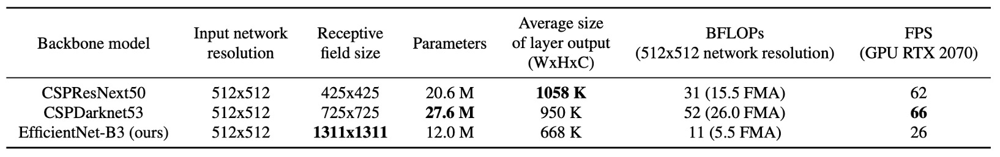
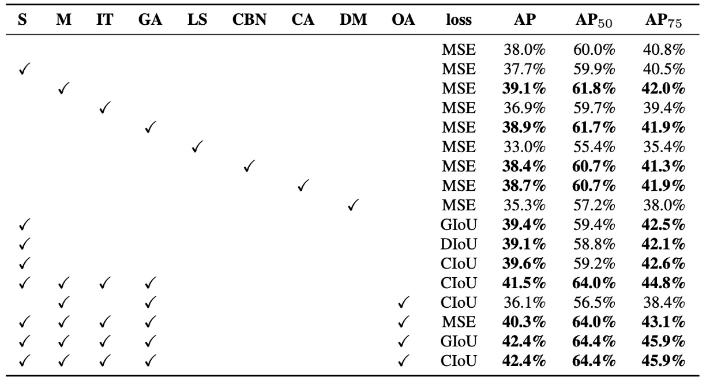
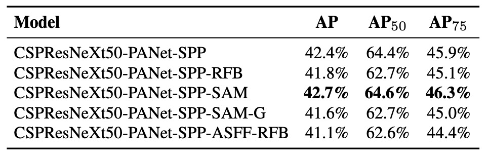
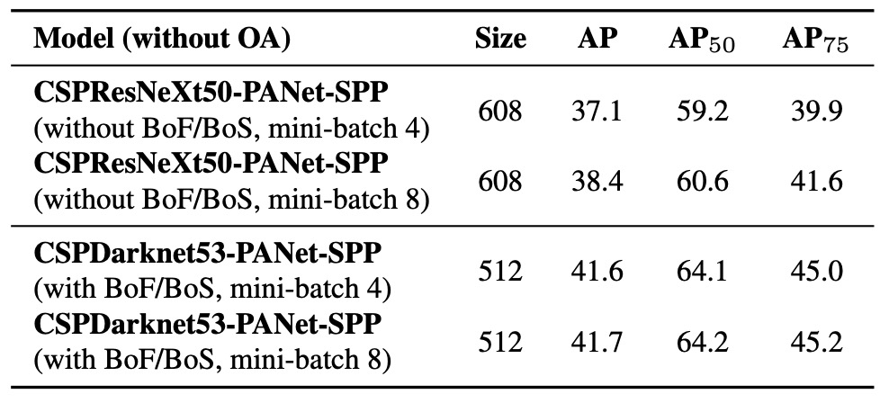

## 模型設計顧問

[**YOLOv4: Optimal Speed and Accuracy of Object Detection**](https://arxiv.org/abs/2004.10934)

---

這篇論文走的是工業風，讀起來像是一份針對「物件偵測」模型的使用說明書。

我們就從整體設計開始，來學習一下該如何做好一個物件偵測模型。

:::tip
YOLO 模型的原始作者只做到 v3，而後都是其他流派的繼承者，因此後續的編號之間不一定存在關聯，發表年份也沒有嚴格先後順序。

YOLOv4 是來自臺灣的開發團隊。
:::

## 模型的架構觀

<figure style={{ "width": "90%"}}>

</figure>

一個物件偵測器，通常包含四個主要模組：`Input`、`Backbone`、`Neck`、`Head`。

每一段都各司其職，彼此銜接又能自由組合，就像堆積木一樣。

- **Input**

  除了單純的圖像輸入之外，還可能加入各種強化訊號，像是多尺度影像金字塔、資料增強、圖像裁切（patching）或改變解析度，目的是從輸入端就強化模型對目標的識別能力。

- **Backbone**

  主要的特徵提取模組，多數來自影像分類的經典架構，如 VGG、ResNet、DenseNet，也有為偵測任務量身打造的 CSPDarknet、DetNet 等變形版本。目標是將輸入影像轉換為具備語意與視覺資訊的深層特徵圖。

- **Neck**

  試圖整合來自不同層級的特徵圖，平衡淺層的定位資訊與深層的語意特徵。從 FPN 到 PAN，再到 BiFPN、NAS-FPN，每一代設計都力求資訊流的更佳融合與傳遞效率。

- **Head**

  最終進行分類與框選的模組，區分為密集預測（如 YOLO、SSD）與稀疏預測（如 R-CNN 系列）兩大類，也正是效能與精度的主要戰場。

## 兩個設計路線

物件偵測架構在發展過程中，逐漸分化為兩種主流策略：雙階段與單階段。

- **雙階段架構**（Two-stage），如 Faster R-CNN、Libra R-CNN 等，先產生候選區域（Region Proposals），再進行分類與邊界框回歸。這種方法具備較高的精度與較強的區域建模能力，適合需要精確偵測的任務。後續也出現如 RepPoints 的 anchor-free 版本，以緩解錨點設計的限制。
- **單階段架構**（One-stage），如 YOLO、SSD、RetinaNet，則直接對整張圖進行密集預測，不經候選區域產生，換取更高的效率與更快的推論速度。這類方法隨著 anchor-free 設計（如 CenterNet、FCOS、CornerNet）的出現，也開始挑戰過往雙階段架構的精度優勢。

這兩條路線的分歧，其實體現了「速度」與「精度」之間的權衡，而 YOLOv4 的設計就是試圖在這條光譜上取得最佳平衡點。

## 特徵融合的 Neck

隨著 Backbone 的深度與廣度提升，如何有效整合多層次特徵成為後續預測的關鍵。

這就是 Neck 模組的設計初衷，也就是為了讓語意資訊與定位資訊互補融合，為 Head 提供兼具語意與空間細節的輸入。一些常見的方式像是：

- **FPN**（Feature Pyramid Network）開創 top-down 融合結構，逐層上採樣並融合高層語意訊號。
- **PAN**（Path Aggregation Network）則補上 bottom-up 路徑，增強淺層資訊的反饋能力。
- **BiFPN / NAS-FPN** 進一步追求效率與效能的極致，以可學習權重的雙向融合與 NAS 尋找最優配置。
- **ASPP / RFB / SAM** 這類模組則透過空間金字塔、感受野設計或注意力機制來強化特徵表徵能力。

這些設計背後的核心問題是：如何在不過度犧牲速度的前提下，提升多尺度理解與特徵表達能力。

## 為偵測而生的 Backbone

在模型設計邁向模組化、可替換的同時，也有研究者回頭從骨幹網路本身出發，重新設計專屬於物件偵測任務的特徵提取器。

- **DetNet** 與 **DetNAS** 開始將分類導向的主幹改為偵測導向，注重保持高解析度與偵測感知能力。
- **SpineNet** 強調資料流動的多樣性與特徵組合的靈活性，結合 NAS 尋找最佳網路配置。
- **HitDetector** 則直接從任務需求出發，規劃從輸入到預測的整體設計，使各模組協同發揮效益。

這個方向的發展，意味著任務需求從影像分類轉向定位與框選，光是套用分類架構已無法滿足偵測的複雜性，因此從骨幹重新設計可能是更高效的解決方案。

## 訓練優化技巧

在物件偵測的訓練過程中，有一類技巧被統稱為「Bag of Freebies」。

意思指的是那些「**只會增加訓練成本，而不會影響推論效能的技術**」。換句話說，它們的存在目的是在不影響推論速度的前提下，提高模型的準確度與泛化能力。

這類技巧可以分成三大類型：資料增強、標籤處理，以及損失函數的優化。

### 資料增強

物件偵測模型的泛化能力，很大程度取決於輸入資料的多樣性。為了讓模型能夠適應不同環境下的影像輸入，資料增強成為最常見且有效的策略。

- **像素層級變化**：包括亮度、對比、飽和度、色相與雜訊等光度失真，以及隨機縮放、裁切、翻轉、旋轉等幾何變換，這些方法保留了原始像素資訊，僅僅改變了其排列與視覺呈現。
- **遮蔽式增強**：為了模擬遮擋場景，像是 Random Erase、CutOut、Hide-and-Seek 與 GridMask 等方法會隨機遮蔽影像區域，讓模型學習在遮擋情境下也能辨識目標。
- **特徵遮蔽法**：類似概念也可應用在特徵圖上，例如 DropOut、DropConnect 與 DropBlock 等方法，以增強模型對中間表徵的容錯與穩定性。
- **混合多張影像**：MixUp 與 CutMix 等策略，將兩張影像進行融合或拼接，並對標籤進行加權調整或面積比例分配，進一步提升模型對複雜場景的理解能力。
- **風格轉換**：Style Transfer GAN 也被用來產生不同風格的影像版本，以降低 CNN 對特定材質與紋理的過度依賴。

### 標籤平滑與知識蒸餾

除了輸入影像的處理，對標籤的操作也是免費優化的一環。

在分類任務中，標籤通常以 one-hot 的方式呈現，這種「硬標籤」雖然清晰，但缺乏語意層級的模糊彈性。為此，Label Smoothing 被提出來將原始標籤轉為「軟標籤」，讓模型不會過度自信於某一類別，提高其在未知資料上的穩定性。

進一步的作法是引入知識蒸餾，由一個性能較高的 Teacher 模型提供更細緻的輸出分布，透過 Label Refinement Network 引導學生模型學習類別之間的相對關係。

### 損失函數的優化

最後，針對物件偵測任務中極為關鍵的邊界框回歸問題，傳統做法是使用 MSE 或 L1/L2 Loss 直接對座標值（如中心點或對角線）進行回歸。然而這類做法會忽略整體框的幾何結構，也容易受物件尺度變化所影響。

因此，IoU Loss 成為近年主流選擇，將預測框與真實框的重疊區域作為損失函數的核心，具備尺度不變性與語意一致性的優勢。

其後又出現多種改進版本：

- **GIoU (Generalized IoU)**：納入最小包圍框，解決 IoU 在完全不重疊時無梯度的問題。
- **DIoU (Distance IoU)**：加入中心點距離，強化定位精度。
- **CIoU (Complete IoU)**：同時考慮重疊率、中心距離與長寬比，綜合性最佳，也具有更快的收斂速度。

這些回歸損失的改良，不僅提升了收斂穩定性，也讓模型在定位精度上邁向更高水準，成為高性能偵測器不可或缺的一環。

## 精巧模組設計

與 Bag of Freebies 相對，另一類提升準確率的策略被稱為 **Bag of Specials**。

這類方法通常會略微增加推論成本，但**所帶來的準確率提升遠大於其額外計算開銷**，是物件偵測中極具 CP 值的技巧。

這些技巧可以分為四個面向：**感受野擴張、注意力機制、特徵整合模組、非極大值抑制（NMS）後處理**，再加上一個常被忽略但極具影響力的面向：**激活函數設計**。

### 擴張感受野

為了讓模型更早感知上下文訊息並提升空間理解力，許多模組被設計來擴張感受野：

- **SPP（Spatial Pyramid Pooling）** 模組源自傳統的 SPM 概念，原先在圖像分類中用來建立不同尺度的區塊表示。YOLOv3 將其整合至卷積網路中，改為多尺度的 MaxPooling 後串接（例如 k = 1, 5, 9, 13），不改變空間維度卻能大幅擴張感受野。在 YOLOv3-608 上僅增加 0.5% 計算量，卻能提升 AP50 2.7%。
- **ASPP（Atrous Spatial Pyramid Pooling）** 使用多個不同膨脹率的 3×3 膨脹卷積，以等價於多尺度感受野的方式進行空間感知。
- **RFB（Receptive Field Block）** 更進一步使用多組不同膨脹率的卷積並行計算，獲得更綿密且廣域的空間覆蓋效果。在 SSD 架構上只增加 7% 推論時間，卻帶來 5.7% 的 AP50 提升。

### 注意力機制

注意力模組能幫助模型動態調整重要訊號的強度，是近年廣泛應用於各項視覺任務的核心技術：

- **SE（Squeeze-and-Excitation）** 模組專注於通道層級的重新加權，能夠幫助模型更集中在有判別性的特徵維度上，但在 GPU 上的推論開銷相對較高。
- **SAM（Spatial Attention Module）** 則是在空間層級引入注意力，針對輸入特徵圖進行空間加權，成本極低且幾乎不影響 GPU 上的推論速度。

### 跨尺度整合

傳統使用 skip connection 或 hypercolumn 將淺層與深層特徵拼接。隨著 FPN 為代表的多尺度融合架構興起，更多高效的融合模組被提出：

- **SFAM**：基於 SE 模組進行通道注意力強化。
- **ASFF（Adaptive Spatial Feature Fusion）**：透過 point-wise softmax 決定不同尺度的特徵融合權重。
- **BiFPN**：提出 multi-input weighted residual connection，實現尺度層級的學習式融合，在準確度與效率間取得良好平衡。

### 激活函數的演進

一個好的啟用函數能讓梯度更穩定傳遞，又不造成額外負擔：

- **ReLU** 解決了早期 sigmoid/tanh 的梯度消失問題。
- **LReLU / PReLU** 解決了負區間無梯度的問題。
- **ReLU6 / hard-Swish** 則是為量化網路量身打造。
- **SELU** 支援自我正規化（self-normalization）。
- **Swish / Mish** 為平滑且可導的函數，能提升深層網路的收斂性與精度。

這些啟用函數雖屬微觀設計，但往往能在大型網路中累積顯著的效能優勢。

### NMS 後處理

非極大值抑制（NMS）用來篩除重複預測框，是物件偵測的最後一道程序：

- **傳統 NMS** 依據 IoU 和置信度排序保留最佳框，但無法處理遮擋物件時的信心退化問題。
- **Soft-NMS** 嘗試以懲罰分數的方式減少「過於強硬」的篩除。
- **DIoU-NMS** 則引入中心距離資訊，使篩選更具幾何直覺。

然而，隨著 anchor-free 架構的興起，有些架構（如 FCOS）已將 NMS 移除，直接藉由設計 loss 或後處理條件約束來完成預測選擇。

## 解決問題

我們終於可以來看 YOLOv4 本人了。

有了上面各種方法的介紹，可以知道作者就是想找出一個又快又好的架構。

### 架構選擇

在設計 Backbone 時，作者從「分類模型 ≠ 偵測模型」的核心觀念出發，重新評估各種架構在不同任務下的效能表現。

他們發現儘管 **CSPResNeXt50** 在 ImageNet 上表現優異，但在 MS COCO 偵測任務中，**CSPDarknet53** 的表現更勝一籌。這是因為偵測任務相較分類任務，需求更加嚴苛：

- **更高輸入解析度**：為了可以辨識小型目標。
- **更深的層數與更大的感受野**：可以涵蓋更廣泛的上下文關係。
- **更多參數容量**：可以同時應對多目標、多尺度的場景需求。

以感受野為例，CSPResNeXt50 僅有 16 層 3×3 卷積，感受野為 425×425；CSPDarknet53 則有 29 層，感受野達 725×725，搭配較大的參數量（27.6M），更能應對複雜的偵測場景。

因此，YOLOv4 選擇以 **CSPDarknet53** 作為骨幹，並在其上加入 **SPP 模組** 增強感受野，再透過 **PANet** 進行多層特徵聚合，最終連接至 **YOLOv3 Head** 完成預測。

這個架構的核心配置為：

- **Backbone**：CSPDarknet53
- **Neck**：SPP + PANet
- **Head**：YOLOv3（anchor-based）

### 訓練策略選擇

YOLOv4 的訓練策略建構在兩個經典概念之上：

- **Bag of Freebies (BoF)**：只增加訓練成本，不增加推論負擔
- **Bag of Specials (BoS)**：略增推論成本，顯著提升準確率

在訓練架構上，YOLOv4 拋棄了不易收斂的 activation（如 PReLU, SELU）與針對量化設計的 ReLU6，改用效果平衡的 **Mish activation**；正規化方面則放棄需多卡訓練的 SyncBN，轉而設計更適合單卡訓練的 **Cross mini-Batch Normalization (CmBN)**。

<figure style={{ "width": "80%"}}>

</figure>

在深度學習中，Batch Normalization（BN）是極為關鍵的穩定訓練手段。

但這個技巧有一個隱性假設：每個 mini-batch 都足夠大，才能取得代表性的均值與變異數統計量。然而，當模型規模增大、顯存受限或僅能使用單張 GPU 時，mini-batch size 常常偏小，導致 BN 的效果急劇下降，甚至產生不穩定收斂問題。

過往為了解決這個問題，有人提出 SyncBN（Cross-GPU BN），讓多張 GPU 之間共享統計資訊，提升統計穩定性。但這需要多卡硬體資源，不適合單卡訓練場景。

CmBN 則引入「跨 mini-batch」統計聚合機制：

假設我們訓練時設計了某種資料增強方式，如 Mosaic，一次性將 4 張圖組成一張訓練影像。CmBN 會將這組由不同來源圖像構成的 batch，看成一個「擴展樣本集合」。並在 BN 計算時針對這些子樣本分開統計，再進行合併平均。

也就是說，一個 batch 中包含多個 mini-batch 的統計線索，讓 BN 不再受限於單一子樣本的資料偏態。這種策略類似於對小 batch size 作資料層面的「聚合修正」，在不需要同步多卡的前提下，改善 BN 的泛化穩定性

此外，DropBlock 被選為主要的正則化方法，搭配 CutMix、MixUp、Label Smoothing 等增強策略，構成訓練中最具代表性的免費提升工具包。

### 額外增強設計

YOLOv4 對於訓練過程還進行了三項關鍵優化：

1.  **Mosaic 資料增強**：

    將四張影像混合為一，擴增場景多樣性，並讓 BatchNorm 同步處理更多圖像資訊，提升小 Batch 下的穩定性。

    

    <figure style={{ "width": "80%"}}>
    
    </figure>
    

2.  **SAT（Self-Adversarial Training）**：

    訓練初期模型對自身圖像進行對抗性修改，再學習辨識這些偽裝後的圖像，增強對遮蔽與偽裝攻擊的穩健性。

3.  **模組改良**：

    - SAM 改為 point-wise 注意力，提升對細節資訊的關注力。

        

        <figure style={{ "width": "60%"}}>
        
        </figure>
        

    - PANet 的 shortcut 改為 concat，強化特徵融合完整性。

        

        <figure style={{ "width": "60%"}}>
        
        </figure>
        

這些設計，從增強資料表現力、擴展模型辨識邊界，到重塑訓練穩定性，構成一整套適應單卡訓練與推論環境的完整優化策略。

### 組件總覽與技術選型

整合上述設計，YOLOv4 最終的模組選擇如下：

**架構組成：**

- **Backbone**：CSPDarknet53
- **Neck**：SPP、PAN
- **Head**：YOLOv3 Head

**訓練技巧（BoF for Backbone & Detector）：**

- CutMix / Mosaic 資料增強
- DropBlock 正則化
- Label smoothing
- CIoU Loss
- CmBN
- SAT
- Grid sensitivity 消除策略
- 多 Anchor 對應單一 ground truth
- Cosine annealing scheduler
- 隨機訓練解析度
- 最佳化參數組合（使用基因演算法）

**推論技巧（BoS for Backbone & Detector）：**

- Mish activation
- CSP 模組
- Multi-input weighted residual connections
- SPP 模組
- 改良版 SAM
- PAN path aggregation
- DIoU-NMS 後處理策略

### 實驗配置

為了驗證各種訓練策略對模型性能的實際影響，作者在兩個標準資料集上進行了大規模實驗，分別針對分類與偵測任務進行訓練與評估。

在 **ImageNet（ILSVRC 2012 val）** 影像分類實驗中，採用以下預設訓練設定：

- **訓練步數**：8,000,000 steps
- **Batch size / mini-batch size**：128 / 32
- **學習率排程策略**：Polynomial decay，初始學習率為 0.1
- **warm-up 步數**：1,000
- **Momentum / Weight decay**：0.9 / 0.005

對於 **Bag of Freebies (BoF)** 的設定中，作者驗證了以下策略：

- MixUp
- CutMix
- Mosaic
- 模糊處理（Blurring）
- 標籤平滑正則化（Label Smoothing）

在 **MS COCO（test-dev 2017）** 物件偵測實驗中，作者採用以下預設訓練設定：

- **訓練步數**：500,500 steps
- **學習率排程策略**：Step decay

  - 初始學習率：0.01
  - 於第 400,000 與 450,000 步時，各乘上 0.1

- **Momentum / Weight decay**：0.9 / 0.0005
- **Batch size / mini-batch size**：64 / 8 或 4（依模型與記憶體容量調整）

除部分使用基因演算法搜尋最佳超參數的實驗外，其他所有實驗均使用相同預設設定。

在超參數搜尋實驗中，作者使用 YOLOv3-SPP 架構與 GIoU loss，在 min-val 5k 子集上進行 300 個 epoch 的搜尋。最終採用的最佳組合如下：

- **學習率**：0.00261
- **Momentum**：0.949
- **IoU 分配門檻**：0.213
- **損失正規化係數**：0.07

所有實驗均在 **單張 GPU 上進行**，並未使用如 syncBN 等多卡優化技術。

## 討論

### 分類器訓練中不同特徵的影響

<figure style={{ "width": "80%"}}>

</figure>

作者首先探討在分類器訓練過程中，不同訓練策略對最終準確率的影響，特別聚焦於幾個常見的訓練強化技巧：**標籤平滑（Class label smoothing）**、各類資料增強方法（如 **模糊處理、MixUp、CutMix、Mosaic**），以及不同類型的激活函數（**Leaky ReLU、Swish、Mish**）對模型學習的實質影響。

實驗結果如上表，在分類器訓練過程中，以下特徵明顯提升了模型準確率：

- **CutMix 資料增強**
- **Mosaic 資料增強**
- **Class label smoothing 標籤平滑正則化**
- **Mish 激活函數**

因此，在 YOLOv4 的分類器訓練策略中，作者最終選擇的 **BoF-backbone（Bag of Freebies for classifier）** 包含以下項目：

- **CutMix**
- **Mosaic**
- **Class label smoothing**

同時，根據實驗結果，**Mish activation** 被納入作為補充性的激活函數選項，與上述策略協同使用，進一步提升分類準確率表現。

### 偵測器訓練中不同特徵的影響

<figure style={{ "width": "80%"}}>

</figure>

作者進一步評估不同訓練策略對偵測器準確率的影響，特別是針對 **Bag of Freebies for detector（BoF-detector）** 所進行的系統性實驗，如上表所示。

YOLOv4 大幅擴充了 BoF 的選項清單，專注於那些**能在不犧牲推論速度（FPS）的前提下提升準確率**的訓練技術。

以下經過驗證的 BoF-detector 項目：

- **S: Grid Sensitivity Elimination**

  在 YOLOv3 中，目標座標由 $b_x = σ(t_x) + c_x$ 所定義，其中 $c_x$ 為整數。當 $t_x$ 值極大或極小時，才能使 $b_x$ 接近格點邊緣（$c_x$ 或 $c_x+1$），這造成某些邊緣目標難以被檢出。

  為此，作者將 sigmoid 結果乘上一個大於 1 的因子，有效解除格點對偵測可行性的限制。

- **M: Mosaic 資料增強**
  將四張影像拼接為訓練輸入，使模型同時學習不同場景與比例下的目標，強化泛化能力。

- **IT: IoU Threshold**
  為每個 ground truth 配對多個 anchor，條件為 IoU(anchor, truth) > threshold，以增加樣本使用率。

- **GA: Genetic Algorithms**
  於訓練初期（前 10% 時間）使用基因演算法搜尋最適超參數，提升收斂穩定度與模型表現。

- **LS: Class Label Smoothing**
  對分類任務套用 label smoothing，降低模型過度自信，提升對類別間模糊界線的辨識力。

- **CBN: Cross mini-Batch Normalization (CmBN)**
  在整個 batch 間彙總統計值，而非僅限於單一 mini-batch，提升小 batch 訓練的穩定性。

- **CA: Cosine Annealing Scheduler**
  採用餘弦函數動態調整學習率，達到更平滑的學習曲線與收斂效果。

- **DM: Dynamic mini-batch Size**
  在小解析度訓練階段，動態增加 mini-batch size，配合隨機輸入尺寸的訓練設計。

- **OA: Optimized Anchors**
  根據輸入解析度（如 512×512）最佳化 anchor 位置與尺寸，提高 anchor 分配效率。

- **BBox Regression Loss**
  比較多種邊界框損失函數，包括 GIoU、CIoU、DIoU 與傳統 MSE，驗證其在不同場景下的回歸品質。

---

此外，作者也針對 **Bag of Specials for detector** 的設計進行驗證，如下表所示：

<figure style={{ "width": "80%"}}>

</figure>

實驗項目包含：

- **PAN**：參數聚合與特徵流通性提升
- **RFB**：多尺度膨脹卷積以擴展感受野
- **SAM**：空間注意力機制
- **Gaussian YOLO (G)**：預測框不再為單點估計，而是高斯分布
- **ASFF**：跨尺度注意力式融合策略

根據實驗結果，當模型同時採用 **SPP、PAN、SAM** 時，能取得最佳整體性能表現。

### 不同 Backbone 的影響

<figure style={{ "width": "80%"}}>

</figure>

作者探討不同 Backbone 對偵測器準確率的影響，如上表所示。

實驗結果顯示：**分類器表現最好的模型，並不代表在物件偵測任務中同樣優秀**。

首先，即使在分類任務中，採用各種訓練技巧後的 **CSPResNeXt50** 模型其準確率普遍高於 **CSPDarknet53**，但一旦將這些模型用作偵測器的骨幹，整體偵測表現卻反而以 CSPDarknet53 為優。

具體來說，**CSPResNeXt50** 搭配 BoF 與 Mish activation 可進一步提升分類準確率，但當使用這組預訓練權重初始化偵測器後，偵測精度反而下降。相對地，**CSPDarknet53** 同樣搭配 BoF 與 Mish 進行分類訓練，不僅提升了分類器本身的準確率，後續作為偵測器骨幹使用時，**偵測表現也隨之提升**。

這項發現說明了**分類任務與偵測任務在特徵學習需求上具有本質差異**。

CSPDarknet53 所具備的結構特性與感受野設計，更適合作為物件偵測任務的特徵提取器。

### 不同 mini-batch size 的影響

<figure style={{ "width": "80%"}}>

</figure>

最後，作者分析在不同 mini-batch size 設定下訓練所產生的影響，對應結果如上表所示。

從結果中可以明確觀察到：**在導入 BoF 與 BoS 訓練策略之後，mini-batch size 幾乎不再影響偵測器的最終性能表現**。

這項發現具有重要實務意義。

過去為了提升訓練穩定性與模型效能，往往需依賴大量 GPU 記憶體來支援較大的 batch size。但本研究顯示，在 YOLOv4 中結合了如 Mosaic、CmBN、DropBlock、Label smoothing、SPP、PAN 等訓練與架構優化策略後，**即便在小型 mini-batch 下仍能維持穩定且優異的學習效果**。

### Benchmark

<figure style={{ "width": "90%"}}>

</figure>

YOLOv4 的最終成果與其他最先進的物件偵測器相比，如上圖所示，位於速度與準確率之間的 Pareto 最佳曲線上，展現出在效率與精度之間取得最優平衡點的能力。

相較於目前主流的快速模型與高精度模型，YOLOv4 **同時優於兩者**，在保持高推論速度的同時，也達成了媲美甚至超越先前高準確率模型的性能指標。

考慮到不同研究方法在推論時間測試上使用的 GPU 架構可能有所不同，作者分別在常見的三大 GPU 架構上測試 YOLOv4 的效能，包括：

- **Maxwell 架構**：GTX Titan X（Maxwell）、Tesla M40
- **Pascal 架構**：Titan X（Pascal）、Titan Xp、GTX 1080 Ti、Tesla P100
- **Volta 架構**：Titan Volta、Tesla V100

這些實驗結果進一步驗證了 YOLOv4 的可擴展性與普遍適用性。

無論在老舊架構還是最新硬體上，YOLOv4 都能保持良好的運算效率與穩定表現，充分體現其設計中對硬體親和力的重視。

## 結論

YOLOv4 在 MS COCO 的 AP50 評估指標上**超越了所有現有主流模型**，並在推論速度（FPS）上保持領先。更重要的是，YOLOv4 可以在僅具備 8\~16GB VRAM 的一般消費級 GPU 上完成訓練與部署，大幅降低技術門檻，具備廣泛應用的可行性。

每個想做物件偵測的開發者，都可以來翻一翻這篇論文，絕對值回票價。
