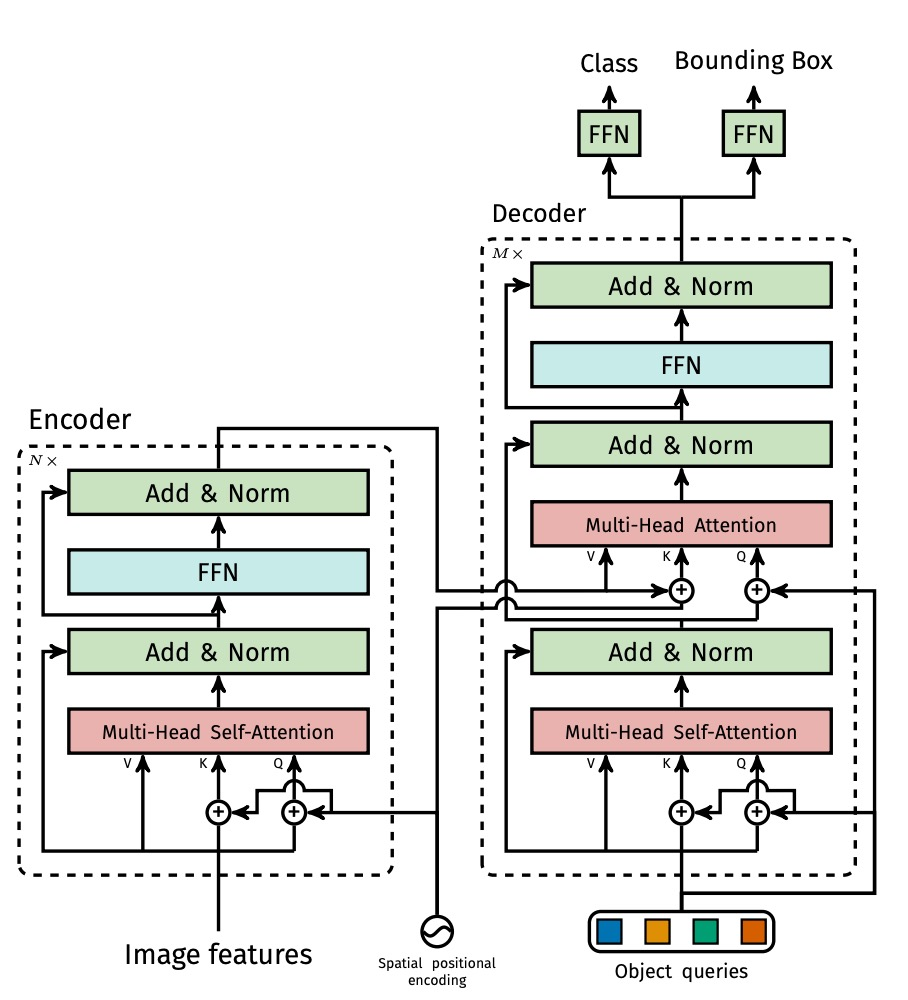
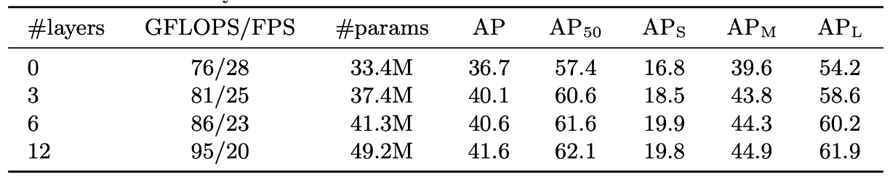

## 跨領域的奠基者

[**End-to-End Object Detection with Transformers**](https://arxiv.org/abs/2005.12872)

---

物件偵測一直都是電腦視覺領域的核心任務。

## 定義問題

在物件偵測的領域中，Anchor-base 的方法是近年來相當流行的偵測技術。像是 Faster R-CNN、SSD 或 YOLO 這類架構，會事先在影像上撒下一組預定義的邊界框，再針對每個錨點進行類別分類與框回歸。

這樣的設計雖然有效，卻也引入了不少問題：

- 錨點的尺寸與比例需依據資料集特性手動設計，泛用性有限。
- 每個位置對應多組錨點，導致大量重複預測，需要依賴 NMS 來過濾。
- 框與真實標註的對齊過程繁瑣，訓練流程高度耦合。

覺得不好用？

那我們不用錨點行不行？

也不是不行，Anchor-free 的架構也為此而生。

但是實務上的場景中，人們除了準確，還是要準確！使用者通常可以忍受慢一點（反正也就差幾秒）；系統可以複雜一點（反正是工程師在忙）。

**但是模型不準確，我就要投訴你！**

Anchor-free 的架構普遍來說精度不佳，在物件偵測的基準上無法帶來亮眼的表現。

話又說回來，在此時此刻的同一個時間線中，隔壁棚（NLP）的已經如火如荼的推進著最新的 Transformer 架構，並且取得很多顯著的進步成果。

本論文的作者覺得：

> **我們為什麼不捨棄這些繁複的機制，大家一起來 Transformer 一下呢？**

## 解決問題

整體架構如論文如上圖所示，由三個部分組成：

1. **CNN backbone**：從輸入圖像擷取特徵圖。
2. **Transformer encoder-decoder**：建模圖像整體上下文與物件間關係。
3. **Prediction Head（FFN）**：輸出 box 與 class。

### 模型架構

首先看 Backbone 的部分。

Backbone 輸入圖像 $x_{img} \in \mathbb{R}^{3 \times H_0 \times W_0}$ 經由 CNN backbone 輸出 $f \in \mathbb{R}^{C \times H \times W}$（如 ResNet50，通常 $C=2048$，$H=W=H_0/32$）。

透過 $1\times1$ 卷積將 channel 降至 $d$ 維（如 $d=256$），得到特徵圖 $z_0 \in \mathbb{R}^{d \times H \times W}$，接著 flatten 成序列長度 $HW$ 的向量送進 Transformer encoder。

<figure style={{ "width": "60%"}}>

</figure>

Transformer Encoder 就是常見的標準結構，每層包含 MHSA + FFN。此外，由於 transformer 的 token 之間沒有明確的位置關係，因此這裡作者在輸入階段加上固定的 positional encoding（如 sine/cosine 編碼）。

接著是 Transformer Decoder 的部分，輸出採用同步輸出 $N$ 個物件，要注意這裡不是採用自回歸的機制，因為每個物件之間不存在強依賴關係，因此可以直接平行輸出。

每個輸出位置對應一組 learnable 的 **object query**（$\in \mathbb{R}^{d}$），讓多層 decoder 透過 self-attention 與 encoder-decoder attention，讓 object query 彼此間互相溝通，也與圖像特徵對齊，藉此讓模型具備跨物件全局推理能力（例如同時考量物件的相對關係與整體分布）。

最後是預測頭的部分，每個 decoder 輸出的 $N$ 結點都接一個 3 層的前饋網路，輸出：

- 類別（softmax over K+1，其中 +1 是 "no object" 類別）。
- 邊界框座標（normalized 的中心點、長寬）。

這裡預測的是一組「固定長度的候選框集合」，非傳統 dense grid 或 anchor 框，因此可用集合損失來訓練。

### 損失設計

過去物件偵測的訓練流程，幾乎都繞不開「預測框要對齊哪個 ground truth？」這個問題。

像是 Faster R-CNN 使用 IoU > 0.5 的 proposal 才算 positive，YOLO 系列會先找出 anchor 框中最接近的對象，這些都算是「啟發式規則（heuristic assignment）」，目的就是：把預測結果對齊真實標註，才有辦法訓練分類與回歸。

而 DETR 則乾脆把這件事視為一個最佳化問題：直接用 **Hungarian Algorithm** 做最佳配對，強制每個預測對應唯一的 ground truth，避免重複預測、重疊框、還有繁瑣的後處理規則。

- **Step 1：最佳匹配（Bipartite Matching）**

  :::tip
  匈牙利算法的介紹可以獨立寫一篇文章，我們就不再贅述。如果對這個算法不熟的讀者可以參考以下連結：

  - [**Hungarian algorithm**](https://en.wikipedia.org/wiki/Hungarian_algorithm)
    :::

  假設：

  - $y = \{ y_1, y_2, \dots, y_M \}$ 是 ground truth 物件集合。其中每個 $y_i = (c_i, b_i)$，含類別與 bounding box。
  - $\hat{y} = \{ \hat{y}_1, \hat{y}_2, \dots, \hat{y}_N \}$ 是 decoder 輸出的預測集合，其中 $N \gg M$，且 $\hat{y}_j = (\hat{p}_j, \hat{b}_j)$

  為了做集合比對，作者把 $y$ 補上 $N - M$ 個 "no object"（記作 $\varnothing$），讓兩組集合一樣長，然後設計一個**匹配成本函數 $L_{\text{match}}$**，計算預測與真值之間的誤差：

  $$
  \hat{\sigma} = \arg\min_{\sigma \in S_N} \sum_{i=1}^N L_{\text{match}}(y_i, \hat{y}_{\sigma(i)})
  $$

  這裡的 $\sigma$ 是 $N$ 個預測的排列組合，目的就是在找最好的「一對一」對齊方式。

- **Step 2：定義匹配成本**

  每一對 $y_i = (c_i, b_i)$ 和預測 $\hat{y}_j = (\hat{p}_j(c), \hat{b}_j)$ 的成本由兩部分構成：

  - 分類誤差（classification cost）：預測類別 $\hat{p}_j(c_i)$ 越小，成本越大
  - 邊界框誤差（box cost）：預測框 $\hat{b}_j$ 與真實框 $b_i$ 差距越大，成本越大

  但要注意：**只有當 $c_i \ne \varnothing$ 時才需要這兩項損失**，也就是對應到有物件的情況。

  綜合起來：

  $$
  L_{\text{match}}(y_i, \hat{y}_j) = -1_{\{c_i \ne \varnothing\}} \cdot \hat{p}_j(c_i) + 1_{\{c_i \ne \varnothing\}} \cdot L_{\text{box}}(b_i, \hat{b}_j)
  $$

  這邊沒有使用 log 機率，因為作者希望這個匹配成本與 box loss 的尺度一致，這樣在做最佳化時不會某一方壓過另一方。

- **Step 3：計算最終損失（Hungarian Loss）**

  完成匹配後，就可以計算 loss 了：

  $$
  L_{\text{Hungarian}}(y, \hat{y}) = \sum_{i=1}^{N} \left[ -\log \hat{p}_{\hat{\sigma}(i)}(c_i) + 1_{\{c_i \ne \varnothing\}} L_{\text{box}}(b_i, \hat{b}_{\hat{\sigma}(i)}) \right]
  $$

  - 第一項是分類 loss：對應物件的類別機率越低，loss 越大
  - 第二項是 box loss（見下節）
  - 若 $c_i = \varnothing$，表示這是個背景，作者會將分類 loss 乘上 0.1 做 down-weight，避免背景樣本太多壓過有物件的訊號（類似 Faster R-CNN 的 subsampling）。

- **Step 4：Box Loss 設計（$L_{\text{box}}$）**

  DETR 並不像 YOLO/Faster R-CNN 預測相對偏移量，而是**直接預測 bounding box 的絕對座標（normalized）**。這種設計簡單，但會導致一個問題：

  > **由於 $\ell_1$ loss 衡量的是絕對距離，相對誤差相同時，小框所承受的損失將顯著高於大框。**

  為了解決這個問題，作者結合了兩種損失函數：

  - $\ell_1$ loss：直接計算座標差距，對於位置精度有幫助
  - **Generalized IoU（GIoU）loss**：量化框之間的重疊程度，且具有尺度不變性

  合併公式如下：

  $$
  L_{\text{box}}(b_i, \hat{b}_j) = \lambda_{\text{IoU}} \cdot L_{\text{GIoU}}(b_i, \hat{b}_j) + \lambda_{\ell_1} \cdot \| b_i - \hat{b}_j \|_1
  $$

  - $\lambda_{\text{IoU}}$ 與 $\lambda_{\ell_1}$ 為權重超參數，需調參。
  - 所有 loss 都會除以 batch 內物件總數作 normalization。

  ***

  :::tip
  GIoU 的細節請參考一下文獻：

  - [**[19.02] Generalized Intersection over Union: A Metric and A Loss for Bounding Box Regression**](https://arxiv.org/abs/1902.09630)
    :::

最後，總結一下這套損失設計的幾個重點：

- **一對一匹配**：只預測一次，不重複、不疊框，完全免後處理
- **背景處理簡潔**：用 $\varnothing$ 類別處理背景，無需 dense negative sampling
- **GIoU + $\ell_1$** 的組合：同時平衡位置與重疊度的學習

這也是為什麼 DETR 雖然在架構上看似簡單，但在訓練流程中能夠真正實現 end-to-end 物件偵測的核心關鍵。

### 資料集

本研究在 COCO 2017 資料集上進行實驗，涵蓋物件偵測與全景分割兩項任務。資料集共包含 118,000 張訓練影像與 5,000 張驗證影像，每張影像皆標註有邊界框與全景分割資訊。

影像中平均包含 7 個物件實例，最大可達 63 個，物件尺寸變化大，小物件與大物件並存，是極具挑戰性的設定。

模型表現以 Average Precision（AP）為主指標，預設計算方式為邊界框 AP。在與 Faster R-CNN 比較時，作者取用訓練最後一個 epoch 的驗證結果；若為消融實驗，則報告最後 10 個 epoch 的中位數。

### 技術細節

模型訓練採用 AdamW 優化器，Transformer 的初始學習率為 1e‑4，backbone 則為 1e‑5，權重衰減設為 1e‑4。

Transformer 的權重經 Xavier 初始化，backbone 採用 ImageNet 預訓的 ResNet 模型，並凍結 BatchNorm 層。

作者評估了多種 backbone 組合，包括標準的 ResNet‑50（DETR）與 ResNet‑101（DETR‑R101），以及在最後一層加入 dilation、放大特徵解析度的 DC5 變體（DETR‑DC5 與 DETR‑DC5‑R101）。DC5 設計能提升小物件偵測表現，但 encoder 中的自注意力計算量亦相對提升 16 倍，整體 FLOPs 約增加 2 倍。

訓練時使用多尺度增強策略，將影像最短邊縮放至 480–800 像素之間，最長邊不超過 1333 像素。為了增強模型的全域關聯學習能力，訓練時額外採用隨機裁剪增強（以 0.5 機率裁切隨機區塊再縮放回原尺度），實驗顯示可額外提升約 1 AP。

此外，推論階段也引入一項簡單但有效的策略：對於預測為「no object」的插槽，若第二高分的類別具合理信心，即以其取代原本預測，能進一步帶來約 2 AP 的提升。整體訓練使用 dropout 0.1，其他超參數細節可參考論文附錄 A.4。

## 討論

### 這次行嗎？

<figure style={{ "width": "80%"}}>

</figure>

小物件整個壞掉（$AP_S$：27.2 → 23.7），但整體看起來似乎還行。

---

如果我們仔細比對 DETR 與 Faster R-CNN 的訓練條件與模型表現，可以觀察到幾個關鍵點：

1. **訓練策略的根本差異**

   DETR 採用 Transformer 架構，自然地搭配 AdamW 或 Adagrad 等適用於稀疏更新的優化器，同時依賴較長的訓練排程與 dropout 穩定學習。

   而傳統的 Faster R-CNN 通常使用 SGD 搭配較保守的資料增強策略。在設計上，兩者的方向截然不同。

2. **為公平比較所做的調整**

   為了讓 Faster R-CNN 能在對等條件下競爭，作者對其進行了幾項強化，包括：

   - 在 box loss 中加入 generalized IoU；
   - 套用與 DETR 相同的隨機裁切資料增強；
   - 將訓練週期延長至 9×（109 個 epoch）。

   這些調整整體帶來約 1–2 AP 的提升，使其能與 DETR 模型有實質對照的基準線。

3. **模型設計與參數量對齊**

   DETR 採用 6 層 encoder + 6 層 decoder、寬度 256、8-heads 的設定，總參數數量與 Faster R-CNN + FPN 持平，約 41.3M，其中 ResNet-50 占 23.5M，Transformer 占 17.8M。這樣的設計確保了兩者在「模型容量」上有公平的比較基礎。

4. **實驗結果與關鍵觀察**

- **總體表現**：DETR 在 COCO val 集合上達到 42 AP，與調整後的 Faster R-CNN 不相上下。
- **大物件表現（$AP_L$）**：DETR 明顯優勢（+7.8），這也是其總體表現能追上的主因。
- **小物件表現（$AP_S$）**：DETR 明顯落後（-5.5），成為主要瓶頸。
- **解析度強化版本（DETR-DC5）**：儘管總體 AP 更高，但在小物件偵測上仍未能超越 Faster R-CNN。
- **不同 backbone 的影響**：若使用 ResNet-101 作為 backbone，兩種模型的趨勢仍大致一致，顯示這種比較具備跨架構的一致性。

整體來看，DETR 在長訓練與高解析設定下，的確能在參數數量相近的條件下與 Faster R-CNN 一較高下。

但其對小物件的辨識仍受限於全圖注意力的解析度瓶頸，這也為後續架構（如 Deformable DETR）留下了優化空間。

### 模型組件分析

作者詳細地探討了 DETR 架構中各個組件的重要性：

1. **編碼器層數的影響**

   

   <figure style={{ "width": "90%"}}>
   
   </figure>
   

   若將 encoder 拿掉，模型將失去影像層級的 global self-attention，整體 AP 下滑 3.9 點，對大物件（APL）影響最劇烈，損失達 6.0 AP。

   這暗示 encoder 的角色並非只是過濾特徵，而是負責以全局語意切分場景中可能的物件。作者進一步視覺化了最後一層 encoder 的注意力權重圖如下，可見 encoder 已有能力初步區隔實例，這對 decoder 後續的辨識與定位有關鍵幫助。

   

   <figure style={{ "width": "90%"}}>
   
   </figure>
   

2. **解碼器層數與 NMS 的關係**

   

   <figure style={{ "width": "60%"}}>
   
   </figure>
   

   DETR 解碼器具備逐層輔助 supervision 設計，每一層都被訓練為可獨立產生物件預測。實驗顯示，AP 隨著層數遞增而穩定上升，第一層與最後一層之間相差可達 +8.2（AP）/+9.5（$AP_{50}$）。

   然而，初始幾層因為缺乏上下文交互，會出現重複預測的情況。若在第一層之後施加傳統的 NMS，可以明顯改善這種重複預測。但隨著層數加深，模型已能自行抑制重複物件，NMS 的效益逐漸消失，甚至在最終層還可能錯刪 true positive 而損失 AP。

   從注意力視覺化來看，decoder 的 attention 相對局部，常聚焦在物件的 extremities（如頭部、腳部）。這與 encoder 先行做出全局實例分離的觀察一致，表示 decoder 更像是在具體輪廓上細化分類與定位。

   

   <figure style={{ "width": "90%"}}>
   
   </figure>
   

3. **FFN 在 Transformer 中的角色**

   每層 Transformer block 中的前饋網路（FFN）可視為 channel-wise 的 1×1 卷積。若將其整體移除，只保留 attention 機制，transformer 區塊的參數量從 17.8M 減至 4.8M，整體模型從 41.3M 降到 28.7M。

   然而，這樣會導致 AP 下滑 2.3 點，顯示 FFN 雖然結構簡單，卻對模型學習語意分離與特徵轉換仍有實質貢獻。

4. **位置編碼的設計與替代實驗**

   

   <figure style={{ "width": "90%"}}>
   
   </figure>
   

   DETR 採用兩種位置編碼機制：

   - 空間位置編碼（spatial positional encoding）：輸入影像的位置信息。
   - 輸出位置編碼（output positional encoding）：object query 的嵌入向量。

   輸出編碼為必要條件，無法移除；空間編碼則進行了數種替代試驗：

   - 完全移除空間位置編碼：AP 下降 7.8，模型仍能達到 32+，顯示其具備一定容錯性。
   - 採用正弦位置編碼（sinusoidal）或學習型編碼並注入 attention 層：與 baseline 相比，AP 僅微幅下降 1.3 ～ 1.4。
   - 只在 encoder 中省略空間編碼：AP 損失僅 1.3，顯示 positional encoding 的關鍵性主要發揮在 decoder 中。

   這些結果顯示，儘管 transformer 天生與序列結構相容，但在圖像任務中，明確的空間提示對物件位置與邊界的學習仍然不可或缺。

5. **損失函數的貢獻拆解**

   

   <figure style={{ "width": "90%"}}>
   
   </figure>
   

   DETR 的訓練損失由三部分構成：

   - 類別分類損失（classification loss）
   - 邊界框距離損失（L1 loss）
   - 廣義 IoU 損失（GIoU loss）

   分類損失為必要條件，無法關閉。作者進一步測試「關閉 L1」、「關閉 GIoU」的情況。結果顯示：

   - 單用 GIoU 仍可達合理精度，反映其對框定位貢獻較大；
   - 單用 L1 效果明顯下降；

   綜合兩者的設計仍是最穩定配置。

   這也驗證了 DETR 損失設計的一個核心理念：與其設計複雜的後處理流程，不如在 cost 計算與 loss 回傳階段就納入空間與語意雙重衡量。

### 模型行為分析

在上圖中，作者視覺化了 COCO 2017 驗證集上所有影像的預測結果，隨機取樣其中 20 個 object query slot，統計它們所預測的所有框的位置與尺寸分布。

每個預測框以其中心座標在 [0, 1] × [0, 1] 的空間中表示，並依框形狀進行色彩編碼：綠色代表小框、紅色代表大型橫向框、藍色代表大型直向框。

結果顯示，每個 slot 並非毫無區別地分工，而是自然發展出數種偏好模式：

- 有些 slot 專注於畫面特定區域（如左上角、中央），
- 有些則傾向預測特定尺度或形狀的框，
- 幾乎所有 slot 都具備一個「預測整張影像大小框」的模式，這類大框常見於 COCO 資料集中具主體性的物件（如大車輛、建築物等）。

這種空間與尺度上的分工並非透過明確監督給定，而是透過 set matching loss 中的學習動力自然產生，代表 DETR 在內部已學會某種「**基於 query 分工的隱性結構化預測策略**」。

它不靠 anchor 或 region proposal，就能讓每個 query slot 分別「關注」特定的場景區域或物件尺度，這是 set-based 方法一個獨特的行為。

### 對未見過物件數量的泛化能力

<figure style={{ "width": "70%"}}>

</figure>

COCO 中大多數圖像的同類物件數量相對有限，例如訓練集中從未出現過超過 13 隻長頸鹿同時出現的情境。為了測試 DETR 是否對這類極端條件能保持泛化能力，作者建構了一張合成圖像，放置了 24 隻長頸鹿。

結果顯示，DETR 成功辨識出了所有 24 隻實例，這是一個明確的 out-of-distribution 測試案例，顯示：

- DETR 的 object query 並未針對特定類別硬編碼；
- 模型整體運作方式並不是「將類別與插槽綁定」，而是以圖像為整體依據進行 query-to-object 的自由分配。

這也呼應先前的設計哲學：object query 作為集合預測中的空白插槽，其學習行為完全由 loss 匹配與 attention 導引而來，並非從一開始就具備語意分工。即便如此，模型最終仍能自發學出有效且可擴展的物件分離能力。

## 結論

沒有任何技術是完美的。

DETR 在小物件偵測上的確存在明顯瓶頸，這點從實驗數據與可視化分析中皆可確認。即便經過長時間訓練與解析度提升，其在 $AP_S$ 指標上仍落後於傳統方法。與已發展多年、工程優化成熟的 Faster R-CNN 相比，DETR 在部分場景下僅能達到相當水準，這也提醒我們，它目前尚非在所有任務中的萬用解法。

但 DETR 的價值不是在於「表現超越」，而在於它所開啟的思路與架構可能性。

這是第一個真正意義上將 Transformer 架構應用於物件偵測的工作，並且用集合預測與匈牙利匹配取代了 anchor、proposal、NMS 等傳統偵測流程中長久以來的工程依賴。這種極度簡化的端到端設計，將原本繁瑣的流程壓縮為一個純粹的序列輸入與集合輸出轉換，其概念上的清晰與實作上的整潔，使其具備高度的可延展性與理論吸引力。

基於這個架構的後續論文至少可以找出一百篇，這絕對是值得多讀幾次的經典論文。
