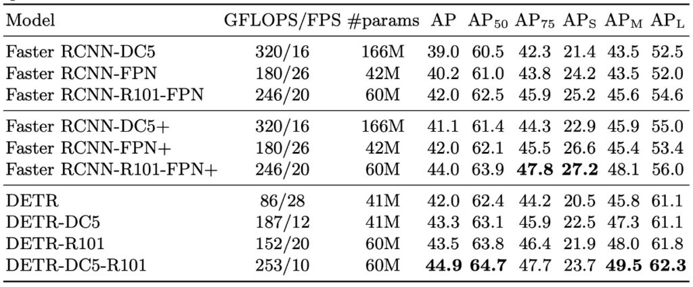

# [20.05] DETR

## 跨領域的奠基者

[**End-to-End Object Detection with Transformers**](https://arxiv.org/abs/2005.12872)

---

物件偵測一直都是電腦視覺領域的核心任務。

一些基於錨點的方法，如 Faster R-CNN、SSD 和 YOLOv2，使用預定義的邊界框（即錨點）來預測物件的位置。這些錨點的尺寸和長寬比是手動選定的，並且期望能覆蓋可能出現的所有物件形狀。基於錨點的方法有其固有的優勢，特別是在物件的多尺度和多形狀偵測上。這些方法對於多尺度物件和不同的長寬比都具有很好的泛化能力。

然而，選擇合適的錨點大小和比例通常需要一些先驗知識和手動調整，這可能不適合所有的應用或資料集。此外，在每個位置上使用多個錨點可能會導致大量的多餘預測，尤其是對於那些沒有物件的背景區域，這需要額外的非極大值抑制（NMS）步驟來清理。

在同一個時間線中，隔壁棚（NLP）的已經如火如荼的推進著最新的 Transformer 架構，並且取得很多顯著的進步成果，種種因素，讓本論文的作者決定：

- **那不然，我們也一起來 Transformer 一下吧！**

## 定義問題

作者在文章中定義問題了一些現階段的問題：

### Anchor-base 好複雜

在物件偵測的領域中，Anchor-base 的方法是近年來相當流行的偵測技術。

這類方法使用預設的錨點來預測邊界框和類別。這些錨點通常是在不同的大小和比例下，在整個圖像上均勻放置的預定義邊界框。

但是，使用錨點的方式也帶來了一些挑戰：

1. **重複預測問題**

   由於有大量的錨點覆蓋在圖像上，一個真實物件可能會被多個錨點所識別，導致該物件被預測多次。這意味著系統可能會產生多個相似或重疊的邊界框來代表同一個物件。

2. **後處理複雜性**

   為了解決上述的重複預測問題，需要引入一些後處理技術。非極大值抑制（NMS）是一種常用的方法，它可以移除重疊的邊界框，只保留該物件的最佳預測。這需要額外的計算和參數調整，增加了模型的複雜性。

3. **錨點設計與匹配**

   設計錨點的大小和比例會直接影響模型的性能。不適當的錨點設計可能導致偵測不精確。此外，當有新的預測產生時，需要將這些預測與最接近的錨點匹配，這是一個額外的計算步驟。

覺得不好就不要用，我們不用錨點行不行？

### Anchor-free 不能打

人們除了準確，還是要準確。

實務上的場景中，使用者通常可以忍受慢一點（反正也就差幾秒）；系統可以複雜一點（反正是工程師在忙）。

- **但是模型不準確，我就要投訴你！**

在物件偵測的發展中，直接預測一直是一個吸引人的概念。不同於使用錨點的策略，直接預測旨在直接從圖像像素預測物件的邊界框和類別標籤，而無需其他的中間代理或輔助結構。

儘管直接預測的概念在理論上很有吸引力，但在實際應用中，過去的嘗試往往在性能上受到限制。這意味著這些方法可能在一些常見的物件偵測基準上表現不佳，特別是與當前的領先方法相比。

所以就算直接預測的方法具有其理論上的優勢，簡化的模型結構和少量的手工先驗，但其在實際應用中的性能和競爭力還有待提高。這也是為什麼研究者持續尋找改進這些策略的方法，希望能夠真正地實現端到端的物件偵測。

## 解決問題

### DETR 模型設計

1. **Backbone**

   主幹是用來從輸入圖片中提取特徵的部分。它通常使用卷積神經網路（CNN）結構。當圖片輸入這一層時，它會產生一組特徵圖。這些特徵圖捕捉了圖像的各種細節和語境信息，但是已經失去了原始圖片的解析度。

2. **Transformer Encoder**

   Transformer Encoder 接收主幹的輸出特徵圖。為了讓 Transformer 能夠了解每一個特徵的相對位置，我們需要添加位置編碼。這是因為與 CNN 不同，Transformer 本身是不敏感於輸入的順序的。位置編碼提供了一種方式來輸入位置信息，這樣 Transformer 可以考慮到特徵之間的相對位置。

   假設輸入的特徵圖是 3 x 224 x 224，輸出的特徵圖是 512 x 7 x 7，這裡的操作就是把輸出圖視為 7 x 7 共 49 個輸入 Token，每個 Token 有 512 的特徵值。在論文中，作者使用了 ResNet 作為 Backbone，在最後的輸出特徵是 2048 維，這裡就必須先用 $1 \times 1$ 的卷積把維度降為 $D$，這裡的 $D$ 就是最後送進 Transformer 的維度。

3. **Transformer Decoder**

   Decoder 的輸入是稱為「物件查詢」的固定向量，這些查詢表示對檢測物件的一般期望。通過解碼器的多個層，這些查詢將關注 Encoder 的輸出，試圖找出與特定物件相對應的特徵。

   這裡就簡單了，在 Decoder 輸入的時候，把所有要查詢的物件，作為一個 Token 來輸入。假設你有 100 個物件，那輸入的序列長度就是 100，特徵的部分就給定一組固定特定的內容，讓模型可以區分出不同物件就可以了。

   另外，需要注意的是這裡不是用 For-loop 去跑每個查詢物件，而是一次一起跑完所有查詢，因為不同物件之間沒有依賴關係，不需要進行迴圈迭代。

4. **FFN**

   Decoder 的每個輸出都會進入 FFN。這個網路的目的是將解碼器的輸出轉換成具體的預測，這裡的預測內容為：[物件中心座標（x, y）、高度（H）、寬度（W）]，然後個數則是固定為 N，這裡的 N 通常會遠大於影像中實際的目標數量。如果沒有找到物件，它還可以輸出一個特殊的「無物件」類別。

   整體的實作架構流程圖，如下：

   

   :::tip
   這裡我好奇論文中的 Spatial positional encoding 和一般的 Transformer 有什麼不一樣，所以特別去找了論文的實作來看，原來就是基於 row 和 col 給定一組可以學習的參數。

   
   :::

### 損失函數設計

1. 集合預測損失

   這是用於強制預測框和真實框之間的唯一匹配損失。

   - **匹配損失 (L_match)**

     DETR 推斷出一組固定大小的 N 個預測。這裡的 N 是設定為明顯大於圖片中物件的典型數量。損失在預測物件和真實物件之間產生最佳二分匹配。假設在一張圖片中有 5 個真實物件，但模型預測了 8 個物件。即使有多餘的預測，我們需要將這 5 個真實物件與這 8 個預測物件進行最佳匹配。

   - **匈牙利演算法（Hungarian Algorithm）**

     使用匈牙利演算法找到最佳匹配，匹配成本考慮了預測的類別以及預測框和真實框之間的相似性。

     匈牙利演算法用於解決二部圖最大匹配或最小匹配問題，通常應用於分配問題。假設我們有 n 個任務和 n 個工人，且每個任務只能由一個工人完成。每個工人完成每個任務都有相應的成本，目標是找到一種分配方式，使得所有工人完成所有任務的總成本最小。

     另外一個設定，是將「無物件」類別的對數機率項的權重降低 10 倍，這避免了過多的背景或非物件區域干擾訓練。

2. 邊界框損失 (Bounding Box Loss)

   在物件檢測中，模型須要預測物件的位置和範圍，這常常表示為一個「邊界框」。邊界框通常由四個座標（例如：左上和右下的 x、y 座標）或一個中心點和寬高來描述。邊界框損失是一種量測預測的邊界框與實際邊界框之間差異的方法。

   - **邊界框損失（L_box）**

     DETR (DEtection TRansformer) 是近年來受到關注的物件檢測方法，它與許多傳統方法不同。而一些傳統方法是基於對候選框（也稱為錨框或提案）的預測，然後再進一步調整獲得最終的預測邊界框，但 DETR 直接預測出物件的邊界框。

     這種方法的一個問題是：對於不同大小的物件，即使它們的預測相對位置偏差相同，使用常見的損失如 L1 loss 計算時，它們的損失值可能會有很大的差異。

     :::tip
     假設我們的模型預測一個很小的物件和一個很大的物件，兩者都偏離了真實位置 10 像素。對於小物件來說，這 10 像素的偏差可能意味著很大的差異（例如：它可能佔該物件總大小的 50%），但對於大物件而言，這可能只是一個微小的偏差。如果只使用 L1 loss，這兩種情況的損失可能會有很大的不同。
     :::

   - **有問題就要修正**

     為了克服上述問題，DETR 結合了 `L1 loss`與「廣義 IoU Loss」（Generalized Intersection over Union loss）。廣義 IoU 損失試圖解決物件大小對損失的影響，它考慮了預測的邊界框和實際邊界框之間的重疊情況，並嘗試最大化它們的交集。通過組合這兩種損失，模型在不同大小的物件上都有相似的損失尺度，這有助於模型更均勻地學習不同大小物件的邊界框。

### 資料集

- **使用的資料集**：本研究使用了 COCO 2017 的檢測和全景分割資料集進行實驗。
- **資料集規模**：資料集包含 118,000 張的訓練影像和 5,000 張的驗證影像。
- **資料註釋**：每張影像都被註釋有邊界框和全景分割的資訊。
- **影像詳情**：平均每張影像中有 7 個物件實例。在訓練集中，單一影像中最多有 63 個實例，這些實例的大小從小到大都有。
- **評估指標**：使用了平均精度 (Average Precision, AP) 作為評估指標。預設情況下，AP 是基於邊界框(bbox)的。為了與 Faster R-CNN 進行比較，論文報告了最後一個訓練時期的驗證 AP。

### 技術細節

- **訓練優化器**：使用 AdamW 來訓練 DETR 模型。
- **學習率設定**：
  - Transformer 的初始學習率為 1e-4
  - 主幹網路的學習率為 1e-5
  - 權重衰減為 1e-4。
- **權重初始化**：所有的 Transformer 權重使用 Xavier init 進行初始化。主幹網路使用在 ImageNet 上預訓練的 ResNet 模型，並凍結了 BatchNorm 層。
- **模型結構**：研究報告了兩種不同主幹網路的結果：ResNet50 和 ResNet-101，分別被命名為 DETR 和 DETR-R101。還有一個修改版的模型，名為 DETR-DC5 和 DETR-DC5-R101，此修改主要是為了提高小物件的檢測性能，但計算成本也相對增加。
- **影像前處理**：使用尺度增強調整影像大小，確保最短邊在 480 到 800 像素之間，而最長邊最多為 1333 像素。為了強化模型學習，他們在訓練期間使用隨機裁剪增強，這提高了大約 1 AP 的效能。
- **其他細節**：使用了預設的 dropout 為 0.1 進行訓練。推理時，有些預測為空，為了優化 AP，使用置信度來覆蓋這些空物件的預測，這增加了 2 AP。

## 討論

### 這次行嗎？

小物件整個壞掉（AP 27.2 -> AP 23.7），但其他部分看起來可以！

我們仔細檢視 DETR 和 Faster R-CNN 的比較時，可以觀察到以下主要點：

1. **訓練方式的差異**

   - DETR 使用了 Transformer 結構，通常與 Adam 或 Adagrad 優化器一起使用。另外，為了讓模型學習到更深入的表示，它往往採用了較長的訓練計劃和 dropout。
   - Faster R-CNN 則主要使用 SGD 進行訓練，且在資料增強方面相對較少。

2. **嘗試使 Faster R-CNN 基線更強**

   - 為了使 Faster R-CNN 與 DETR 更為一致，研究者在其損失中加入了廣義 IoU，並應用了相同的隨機裁切影像增強以及長期訓練方法。
   - 這些調整使 Faster R-CNN 在 COCO 檢測任務上提高了 1-2 AP。

3. **模型結果比較**

   - 對於 Faster R-CNN，作者展示了使用 3x 計劃訓練的模型結果，以及加入增強功能並使用 9x 計劃訓練的模型結果。
   - 對於 DETR，作者考慮了具有相同參數量的模型，這意味著 DETR 和 Faster R-CNN 具有類似的模型複雜性。

4. **性能比較**
   - 從結果可以看到，DETR 能夠在參數數量相同的情況下與 Faster R-CNN 競爭，達到了 COCO val 子集上的 42 AP。
   - DETR 在提高其總體性能時，主要是通過提高 APL（大物體的檢測性能）達到的。然而，它在 APS（小物體的檢測性能）方面仍然較為落後。
   - DETR-DC5，儘管具有較高的總體 AP，但在小物體檢測上仍然明顯落後於 Faster R-CNN。
   - 使用 ResNet-101 作為主幹的 Faster R-CNN 和 DETR 在性能上都表現出相似的趨勢。

### 模型組件分析

作者詳細地探討了 DETR 架構中各個組件的重要性：

1. **編碼器層數**

   - 編碼器層數增加會對全域影像級自注意力帶來影響。
   - 無編碼器層會導致整體 AP 下降 3.9 點，對大物件的影響尤其明顯，達 6.0 點。
   - 編碼器是解開物件的重要組件，提供了全域場景推理。
   - 編碼器能夠分離實例，這對解碼器的物件提取和定位可能是有益的。

2. **解碼器層數**

   - 解碼器層數增加有助於改善 AP 和 AP50。
   - 由於基於集合的損失，DETR 設計時不需要 NMS。
   - 但在第一個解碼層後運行 NMS 可以提高性能。
   - 隨著層數增加，NMS 的改進作用會減弱。
   - 解碼器的注意力是局部的，主要關注物體的四肢，如頭部或腿部。

3. **FFN 的重要性**

   - FFN 可視為 1 × 1 卷積層。
   - 完全移除 FFN 會造成性能下降 2.3 AP，表明 FFN 對於獲得良好的結果是非常重要的。

4. **位置編碼的重要性**

   - 模型中有空間位置編碼和輸出位置編碼兩種。
   - 完全刪除空間位置編碼導致性能損失 7.8 AP。
   - 使用正弦編碼或學習編碼只會導致 AP 輕微下降 1.3 AP。
   - 這表明位置編碼對模型性能也有重要影響。

5. **Loss 的重要性**
   - Classification Loss 是必不可少的。
   - GIoU Loss 佔有模型性能的大部分，沒有它會損失 0.7 AP。
   - 單獨使用 L1 Loss 會導致結果變差。

### 全景分割的應用

全景分割最近在電腦視覺界中受到了廣泛關注。在這篇論文中，這個章節不是主力討論的重點，作者僅作為延伸應用做個簡單的說明。但我們如果從未來的角度看回去，這個章節後續應用非常重要，簡直就是一篇新的論文了，所以我們仔細看過。

- **實驗設置**

  DETR 在 COCO 資料集上進行了全景分割的實驗。這個資料集除了有 80 個事物類別，還包括 53 個事物類別。訓練 DETR 時，模型須預測 COCO 上事物和事物類別周圍的邊界框。其中，邊界框的預測在訓練中是必要的，因為用於訓練的匈牙利匹配算法依賴於框之間的距離計算。

- **新增的遮罩頭**

  

  除了基本的 DETR 架構，還新增了一個遮罩頭，這個頭為每個預測框預測一個二進位遮罩。這個遮罩頭將每個物件的 Transformer 解碼器的輸出作為輸入，並計算這些編碼的多頭注意力分數編碼器的輸出，從而為每個物件產生注意力熱圖。為了得到最終的預測並增加解析度，還使用了類似於 FPN 的架構。

  在訓練過程中，DETR 首先被訓練以預測邊界框，然後遮罩頭被訓練 25 個週期。這可以一步到位，或者先訓練 DETR 再訓練遮罩頭，實驗結果顯示這兩種方法的效果相似。為了得到最終的全景分割，模型在每個像素的遮罩分數上使用 argmax，然後將相應的類別分配給結果遮罩。這種方法確保了最終的遮罩之間沒有重疊。

- **結果展示**

  

  DETR 在全景分割上展示了其強大的性能。特別是它在事物類別上展現了出色的性能，這可能是因為編碼器的全局推理能力。即使在事物類別的掩模預測中存在一定的性能差距，DETR 仍然獲得了有競爭力的 PQ 值。在 COCO 測試集上，DETR 達到了 46 PQ 的分數。

  

## 結論

沒有任何技術是完美的。

DETR 面臨的主要挑戰是小物體的檢測，在這方面，它的性能還有很大的提升空間。

另外，與已經經過多年改進的 Faster R-CNN 比較，DETR 在某些情境下的結果僅僅達到相當的水平，這也意味著它可能不總是最佳的選擇。

但這不影響這篇論文的地位與重要性，DETR 不只是一種新的技術，更是一種新的思維方式。它將先進的 Transformer 結構與二分匹配損失相結合，為我們帶來了一種全新的、直接的集合預測方法。

DETR 的簡潔和直觀是它的一大賣點。在許多目標檢測方法中，我們都需要進行繁複的標記和特定的預設錨點選擇，而 DETR 擺脫了這些限制，使得整個過程更為簡單。其次，它的應用範疇十分廣泛。除了目標檢測，它還能夠輕鬆地擴展到全景分割，且在這方面也取得了相當可觀的結果。但最令人印象深刻的是，當處理大型物體時，它的自注意力機制能夠有效捕捉圖像中的全局資訊，使其在這方面的性能超越了其他傳統方法。
